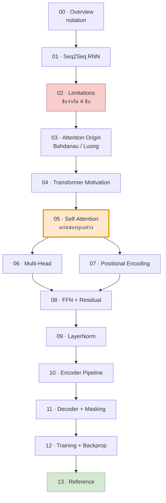
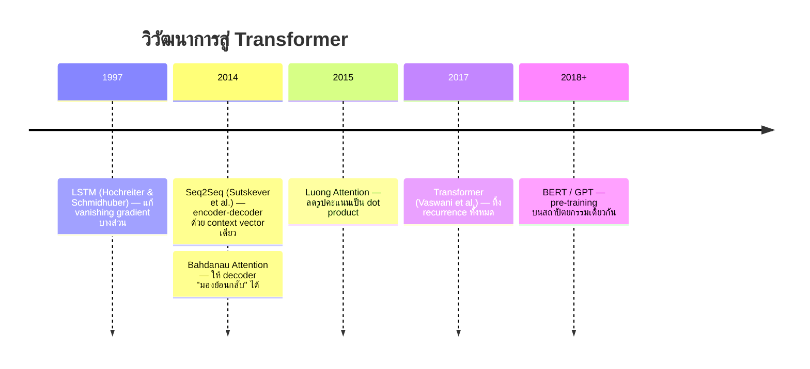
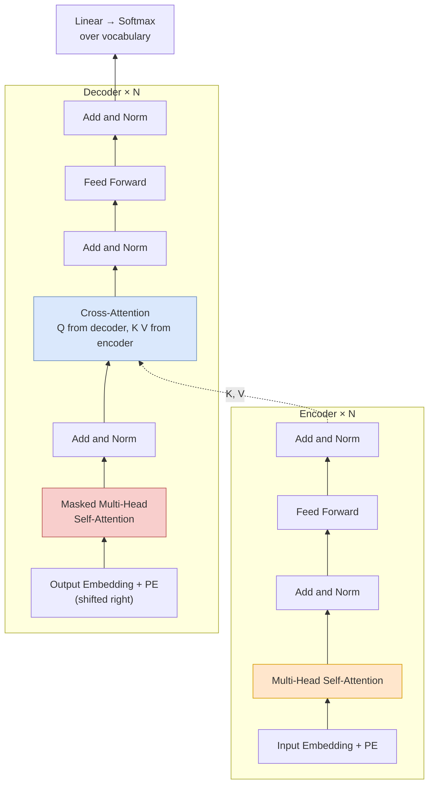

# 00 — ภาพรวมและข้อตกลงสัญลักษณ์

> เอกสารชุดนี้อธิบาย **Transformer ในเชิงคณิตศาสตร์** โดยเริ่มจากที่มาของ seq2seq แบบดั้งเดิม
> ไล่ผ่านข้อจำกัดของมัน แล้วแสดงว่าแต่ละส่วนของ Transformer เกิดขึ้นมาเพื่อแก้ข้อจำกัดข้อไหน

---

## 1. เอกสารชุดนี้คืออะไร / อ่านอย่างไร

เป้าหมายคือทำให้คุณ **อ่านสมการของ Transformer ได้ทุกตัว และรู้ว่าทำไมมันต้องหน้าตาแบบนั้น**

หลักการเขียนของเอกสารชุดนี้:

| หลักการ | รายละเอียด |
|---|---|
| ระบุผลลัพธ์ + สัญชาตญาณ | ไม่ลงพิสูจน์เต็มรูปแบบ แต่บอกว่าผลลัพธ์คืออะไรและ *ทำไมมันสมเหตุสมผล* |
| เดินตัวเลขจริงทุกไฟล์ | ทุกไฟล์มีส่วน "เดินตัวเลข" ที่คำนวณด้วยเลขเล็ก ๆ ให้เห็นภาพ |
| โค้ดคู่สมการ | ทุกสมการหลักมี NumPy / PyTorch snippet กำกับ |
| ศัพท์เทคนิคคงภาษาอังกฤษ | เช่น *attention*, *residual*, *softmax* ไม่แปลเป็นไทย |

### ลำดับการอ่านที่แนะนำ



ถ้าเวลาน้อย: อ่าน **02 → 05 → 10** ก็ได้แก่นแล้ว

---

## 2. แผนที่การเดินทาง: RNN → Attention → Transformer

### 2.1 เส้นเวลาของงานวิจัย



### 2.2 คำถามหลักที่แต่ละยุคพยายามตอบ

| ยุค | คำถาม | คำตอบ | ปัญหาที่เหลือ |
|---|---|---|---|
| RNN/LSTM | จะจำลำดับยาว ๆ ได้อย่างไร | gating + cell state | ยังลืมเมื่อยาวมาก |
| Seq2Seq | จะแปลงลำดับ→ลำดับที่ยาวไม่เท่ากันได้อย่างไร | บีบเป็น context vector | คอขวด 1 เวกเตอร์ |
| Attention | จะเลี่ยงคอขวดได้อย่างไร | ให้ decoder ถ่วงน้ำหนัก encoder ทุกตำแหน่ง | recurrence ยังอยู่ → ขนานไม่ได้ |
| Transformer | ยังต้องมี recurrence ไหม | ไม่ต้อง — ใช้ attention ล้วน | $O(n^2)$ memory, ไม่มีข้อมูลลำดับในตัว |

---

## 3. ข้อตกลงสัญลักษณ์ (Notation Convention)

> **สำคัญ:** ทุกไฟล์ในชุดนี้ใช้สัญลักษณ์ชุดเดียวกัน ถ้าเจอสัญลักษณ์ที่ไม่คุ้น ให้กลับมาดูหน้านี้

### 3.1 เวกเตอร์ เมทริกซ์ เทนเซอร์

| รูปแบบ | ความหมาย | ตัวอย่าง |
|---|---|---|
| $a$ (ตัวเล็กเอียง) | scalar | $\alpha\_{ij}$, $d\_k$ |
| $\mathbf{x}$ (ตัวเล็กหนา) | vector — โดยตกลงว่าเป็น **row vector** | $\mathbf{x}\_i \in \mathbb{R}^{d}$ |
| $X$ (ตัวใหญ่) | matrix | $X \in \mathbb{R}^{n \times d}$ |
| $X^\top$ | transpose | |
| $X \odot Y$ | element-wise product (Hadamard) | ใช้ใน LSTM gates |
| $[X; Y]$ | concatenation ตามแกน feature | ใช้ใน multi-head |

### 3.2 ดัชนี (Indices)

| ดัชนี | ใช้กับ | ช่วงค่า |
|---|---|---|
| $i$ | ตำแหน่งของ **query** (แถวใน output) | $1 \dots n$ |
| $j$ | ตำแหน่งของ **key/value** (คอลัมน์ใน attention matrix) | $1 \dots n$ หรือ $1 \dots m$ |
| $t$ | เวลา / ขั้นการถอดรหัส | $1 \dots m$ |
| $l$ | เลเยอร์ | $1 \dots N$ |
| $h$ | หัวของ attention | $1 \dots H$ |

### 3.3 มิติมาตรฐาน

| สัญลักษณ์ | ความหมาย | ค่าใน Transformer-base |
|---|---|---|
| $n$ | ความยาว sequence ฝั่ง source | ขึ้นกับข้อมูล |
| $m$ | ความยาว sequence ฝั่ง target | ขึ้นกับข้อมูล |
| $d\_{\text{model}}$ | มิติของ residual stream (ท่อหลัก) | 512 |
| $H$ | จำนวน attention heads | 8 |
| $d\_k$ | มิติของ query/key ต่อหัว | 64 |
| $d\_v$ | มิติของ value ต่อหัว | 64 |
| $d\_{\text{ff}}$ | มิติชั้นในของ FFN | 2048 |
| $N$ | จำนวนเลเยอร์ (ต่อฝั่ง) | 6 |
| $V$ | ขนาด vocabulary | ~37,000 |

> ความสัมพันธ์ที่ต้องจำ: $d\_k = d\_v = d\_{\text{model}} / H$ (ดูเหตุผลในไฟล์ 06)

### 3.4 แถวคือโทเคน: ทำไมใช้ $X \in \mathbb{R}^{n \times d}$

เอกสารนี้เขียนข้อมูลเป็น **row-major** คือ

$$
X = \begin{bmatrix} \mathbf{x}\_1 \\\ \mathbf{x}\_2 \\\ \vdots \\\ \mathbf{x}\_n \end{bmatrix} \in \mathbb{R}^{n \times d}
$$

แถวที่ $i$ คือ embedding ของโทเคนที่ $i$

**เหตุผล:** ตรงกับ layout ของ PyTorch/NumPy จริง (`x.shape == (batch, seq_len, d_model)`) ทำให้สมการกับโค้ดหน้าตาเหมือนกัน — เช่น การฉาย (projection) เขียนเป็น $XW$ ไม่ใช่ $WX$

```python
import torch
x = torch.randn(2, 5, 512)   # (batch=2, n=5, d_model=512)
W = torch.randn(512, 64)     # d_model -> d_k
q = x @ W                    # (2, 5, 64)  ← ตรงกับสมการ Q = XW^Q
```

---

## 4. ความรู้พื้นฐานที่ต้องมี

| หัวข้อ | ต้องรู้แค่ไหน | ใช้ที่ไหน |
|---|---|---|
| Matrix multiplication | รู้ว่ามิติต้องตรงกัน และผลลัพธ์มีมิติอะไร | ทุกไฟล์ |
| Dot product | รู้ว่ามันวัด "ความคล้าย" ของสองเวกเตอร์ | ไฟล์ 05 |
| Softmax | รู้ว่ามันแปลงเลขใด ๆ เป็นการแจกแจงความน่าจะเป็น | ไฟล์ 03, 05, 12 |
| Chain rule | $\frac{\partial L}{\partial x} = \frac{\partial L}{\partial y}\frac{\partial y}{\partial x}$ | ไฟล์ 02, 12 |
| Mean / Variance | นิยามพื้นฐาน | ไฟล์ 05, 09 |
| Gradient descent | รู้ว่าเราปรับพารามิเตอร์ตามทิศตรงข้าม gradient | ไฟล์ 12 |

### Softmax — ทบทวนเร็ว

$$
\text{softmax}(\mathbf{z})\_i = \frac{e^{z\_i}}{\sum\_{j} e^{z\_j}}
$$

คุณสมบัติที่จะใช้บ่อย:
- ผลลัพธ์ทุกตัว ${>} 0$ และรวมกันได้ 1
- **ไม่แปรตามการบวกค่าคงที่:** $\text{softmax}(\mathbf{z} + c) = \text{softmax}(\mathbf{z})$ → ใช้ลบ max เพื่อความเสถียรเชิงตัวเลข
- **แปรตามการคูณสเกล:** คูณ $\mathbf{z}$ ด้วยเลขมาก ๆ ทำให้ผลลัพธ์เข้าใกล้ one-hot (นี่คือเหตุผลของ $\sqrt{d\_k}$ ในไฟล์ 05)

```python
import numpy as np
def softmax(z, axis=-1):
    z = z - z.max(axis=axis, keepdims=True)   # numerical stability
    e = np.exp(z)
    return e / e.sum(axis=axis, keepdims=True)

print(softmax(np.array([1.0, 2.0, 3.0])))       # [0.090 0.245 0.665]
print(softmax(np.array([1.0, 2.0, 3.0]) * 5))   # [0.000 0.007 0.993]  ← คมขึ้นมาก
```

---

## 5. สรุปสมการหลักทั้งชุดใน 1 หน้า

> ยังไม่ต้องเข้าใจตอนนี้ — นี่คือ "ปลายทาง" ที่เราจะไล่สร้างขึ้นมาทีละชิ้น

**Seq2Seq ดั้งเดิม (ไฟล์ 01)**

$$
\mathbf{h}\_t = \tanh(\mathbf{h}\_{t-1}W\_{hh} + \mathbf{x}\_t W\_{xh} + \mathbf{b}), \qquad \mathbf{c} = \mathbf{h}\_n
$$

**Bahdanau Attention (ไฟล์ 03)**

$$
e\_{tj} = \mathbf{v}^\top \tanh(\mathbf{s}\_{t-1}W\_s + \mathbf{h}\_j W\_h), \quad
\alpha\_{tj} = \frac{e^{e\_{tj}}}{\sum\_{j'} e^{e\_{tj'}}}, \quad
\mathbf{c}\_t = \sum\_j \alpha\_{tj}\mathbf{h}\_j
$$

**Scaled Dot-Product Attention (ไฟล์ 05)** ← แก่นกลาง

$$
\text{Attention}(Q,K,V) = \text{softmax}\\!\left(\frac{QK^\top}{\sqrt{d\_k}}\right)V
$$

**Multi-Head Attention (ไฟล์ 06)**

$$
\text{MultiHead}(X) = \left[\text{head}\_1; \dots; \text{head}\_H\right]W^O, \quad
\text{head}\_h = \text{Attention}(XW\_h^Q, XW\_h^K, XW\_h^V)
$$

**Positional Encoding (ไฟล์ 07)**

$$
PE\_{(pos,\\,2i)} = \sin\\!\left(\frac{pos}{10000^{2i/d\_{\text{model}}}}\right), \quad
PE\_{(pos,\\,2i+1)} = \cos\\!\left(\frac{pos}{10000^{2i/d\_{\text{model}}}}\right)
$$

**Feed-Forward + Residual (ไฟล์ 08)**

$$
\text{FFN}(\mathbf{x}) = \max(0,\ \mathbf{x}W\_1 + \mathbf{b}\_1)W\_2 + \mathbf{b}\_2, \qquad
\mathbf{y} = \mathbf{x} + \text{Sublayer}(\mathbf{x})
$$

**Layer Normalization (ไฟล์ 09)**

$$
\text{LN}(\mathbf{x}) = \boldsymbol{\gamma} \odot \frac{\mathbf{x} - \mu}{\sqrt{\sigma^2 + \epsilon}} + \boldsymbol{\beta}
$$

**Causal Mask (ไฟล์ 11)**

$$
M\_{ij} = \begin{cases} 0 & j \le i \\\ -\infty & j {>} i \end{cases}
\qquad
\text{softmax}\\!\left(\frac{QK^\top}{\sqrt{d\_k}} + M\right)V
$$

**Training Objective (ไฟล์ 12)**

$$
\mathcal{L} = -\frac{1}{m}\sum\_{t=1}^{m} \log p(y\_t^\* \mid y^\*\_{{<}t}, \mathbf{x})
$$

---

## 6. แผนผังสถาปัตยกรรมรวม



| บล็อก | อธิบายในไฟล์ |
|---|---|
| Input/Output Embedding | 10 §1 |
| Positional Encoding | 07 |
| Multi-Head Self-Attention | 05, 06 |
| Masked Self-Attention | 11 §2 |
| Cross-Attention | 11 §3 |
| Add & Norm | 08 §2, 09 |
| Feed Forward | 08 §1 |
| Linear → Softmax | 11 §5, 12 §1 |

---

## 7. ตารางไฟล์ทั้งหมด

| ไฟล์ | หัวข้อ |
|---|---|
| [00-overview.md](00-overview.md) | ภาพรวมและข้อตกลงสัญลักษณ์ *(หน้านี้)* |
| [01-seq2seq-rnn-basics.md](01-seq2seq-rnn-basics.md) | ที่มาของ seq2seq ดั้งเดิม (RNN/LSTM/GRU) |
| [02-seq2seq-limitations.md](02-seq2seq-limitations.md) | ข้อจำกัด 4 ข้อของ seq2seq |
| [03-attention-mechanism-origin.md](03-attention-mechanism-origin.md) | Attention ก่อนยุค Transformer |
| [04-transformer-motivation.md](04-transformer-motivation.md) | ทำไมต้องทิ้ง recurrence |
| [05-self-attention-math.md](05-self-attention-math.md) | Scaled Dot-Product Attention |
| [06-multi-head-attention.md](06-multi-head-attention.md) | Multi-Head Attention |
| [07-positional-encoding.md](07-positional-encoding.md) | Positional Encoding |
| [08-feedforward-and-residual.md](08-feedforward-and-residual.md) | FFN และ Residual Connection |
| [09-layernorm-math.md](09-layernorm-math.md) | Layer Normalization |
| [10-encoder-full-pipeline.md](10-encoder-full-pipeline.md) | Encoder เต็มรูปแบบ |
| [11-decoder-masked-attention.md](11-decoder-masked-attention.md) | Decoder และ Masking |
| [12-training-objective-backprop.md](12-training-objective-backprop.md) | การเทรนและ Backpropagation |
| [13-summary-notation-reference.md](13-summary-notation-reference.md) | สรุปและตารางอ้างอิง |

---

**ถัดไป:** [01 — ที่มาของ seq2seq ดั้งเดิม](01-seq2seq-rnn-basics.md)
