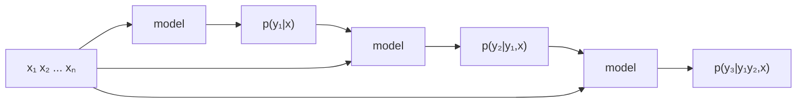
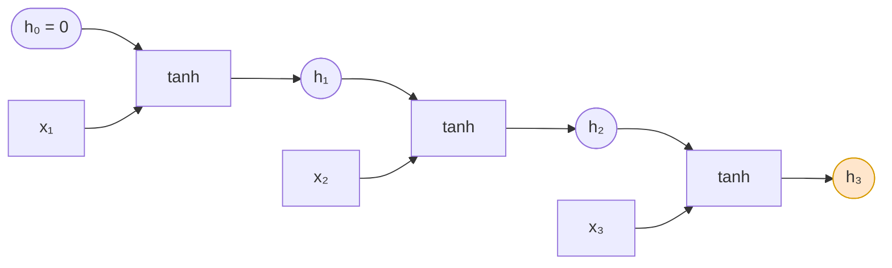
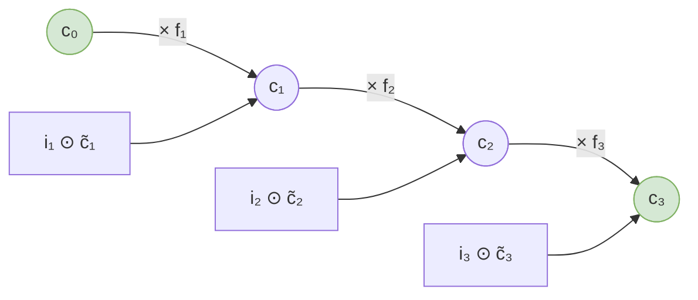
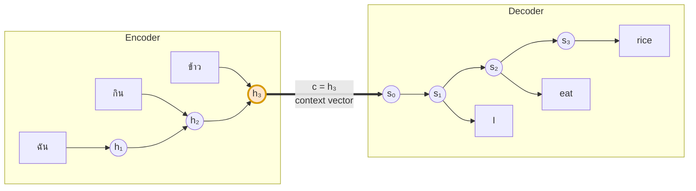
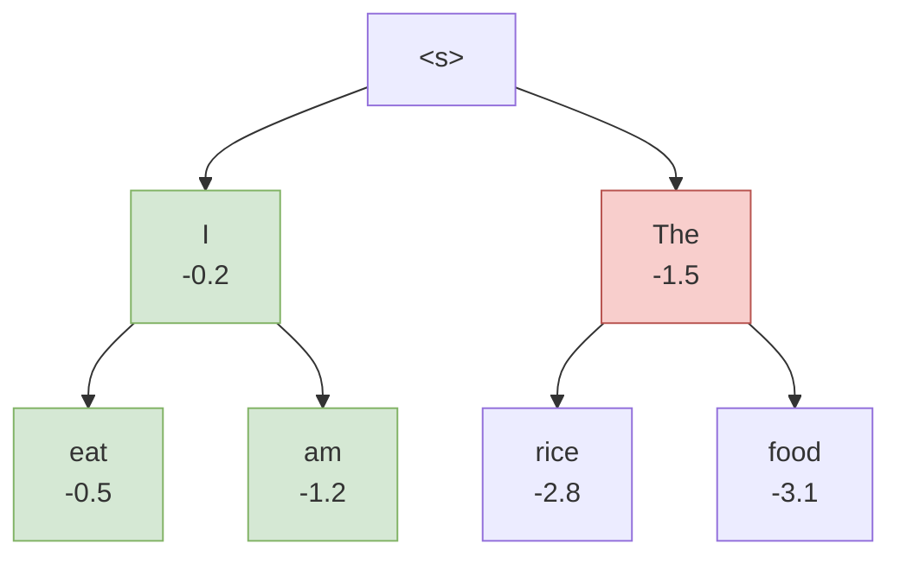

# 01 — ที่มาของ Seq2Seq แบบดั้งเดิม (RNN / LSTM / GRU)

> **ก่อนหน้า:** [00 — ภาพรวมและข้อตกลงสัญลักษณ์](00-overview.md)
> **ถัดไป:** [02 — ข้อจำกัดของ Seq2Seq](02-seq2seq-limitations.md)

---

## 1. ปัญหา: การแปลงลำดับเป็นลำดับ (Sequence Transduction)

### 1.1 นิยามเชิงความน่าจะเป็น

งานอย่างการแปลภาษา สรุปความ หรือถอดเสียงพูด มีรูปแบบเดียวกัน คือ

> ให้ input sequence $\mathbf{x} = (x_1, \dots, x_n)$ จงสร้าง output sequence $\mathbf{y} = (y_1, \dots, y_m)$

โดยที่ **$n \ne m$ ได้** และไม่มีการจับคู่ตำแหน่งต่อตำแหน่ง (ไม่เหมือน POS tagging)

สิ่งที่โมเดลต้องเรียนคือการแจกแจงความน่าจะเป็นแบบมีเงื่อนไข

$$
p(y_1, \dots, y_m \mid x_1, \dots, x_n)
$$

### 1.2 การแยกด้วย Chain Rule

การแจกแจงร่วมข้างบนมีขนาดใหญ่มหาศาล (ถ้า vocabulary $V$ ตัว และยาว $m$ → มี $V^m$ ความเป็นไปได้) จึงต้องแตกด้วย **chain rule ของความน่าจะเป็น**

$$
p(\mathbf{y} \mid \mathbf{x}) = \prod_{t=1}^{m} p(y_t \mid y_1, \dots, y_{t-1}, \mathbf{x}) = \prod_{t=1}^{m} p(y_t \mid y_{{<}t}, \mathbf{x})
$$

**สัญชาตญาณ:** แทนที่จะทายทั้งประโยคทีเดียว เราทายทีละคำ โดยแต่ละคำมองย้อนคำที่ทายไปแล้วบวกกับ input ทั้งหมด

นี่คือที่มาของคำว่า **autoregressive** — ผลลัพธ์ก่อนหน้ากลายเป็น input ของขั้นถัดไป



> **จุดสำคัญ:** การแตกแบบนี้ใช้กับ **ทุก** สถาปัตยกรรมในเอกสารชุดนี้ — RNN seq2seq, attention seq2seq และ Transformer decoder ต่างก็ประมาณค่าพจน์ $p(y_t \mid y_{{<}t}, \mathbf{x})$ เหมือนกัน ต่างกันแค่ *วิธีคำนวณ* เท่านั้น

---

## 2. RNN: หน่วยความจำแบบวนซ้ำ

### 2.1 สมการ Hidden State

RNN แก้ปัญหา "จะสรุปอดีตทั้งหมดเก็บไว้ยังไง" ด้วยการเก็บ **state** ตัวเดียวแล้วอัปเดตทุกก้าวเวลา

$$
\boxed{\ \mathbf{h}_t = \tanh\!\left(\mathbf{h}_{t-1}W_{hh} + \mathbf{x}_t W_{xh} + \mathbf{b}\right)\ }
$$

| สัญลักษณ์ | มิติ | ความหมาย |
|---|---|---|
| $\mathbf{x}_t$ | $\mathbb{R}^{1 \times d_x}$ | input embedding ที่เวลา $t$ |
| $\mathbf{h}_t$ | $\mathbb{R}^{1 \times d_h}$ | hidden state (ความจำ) |
| $W_{xh}$ | $\mathbb{R}^{d_x \times d_h}$ | น้ำหนักจาก input |
| $W_{hh}$ | $\mathbb{R}^{d_h \times d_h}$ | น้ำหนักจาก state ก่อนหน้า |
| $\mathbf{b}$ | $\mathbb{R}^{1 \times d_h}$ | bias |

**สัญชาตญาณ:** $\mathbf{h}_t$ คือ "สรุปของทุกอย่างที่เห็นมาตั้งแต่ $x_1$ ถึง $x_t$" บีบอัดลงใน $d_h$ ตัวเลข
ส่วน $\tanh$ ทำหน้าที่บีบค่าให้อยู่ในช่วง $(-1, 1)$ ป้องกัน state ระเบิด

### 2.2 ทำไมต้อง Share Weight ข้ามเวลา

สังเกตว่า $W_{hh}, W_{xh}, \mathbf{b}$ **ตัวเดียวกัน** ถูกใช้ทุกก้าวเวลา (parameter tying) เหตุผล:

1. **รับ input ยาวเท่าไรก็ได้** — ถ้าแต่ละ timestep มีน้ำหนักของตัวเอง โมเดลจะรับได้แค่ความยาวคงที่
2. **จำนวนพารามิเตอร์ไม่โตตามความยาว** — $O(d_h^2)$ ไม่ใช่ $O(n \cdot d_h^2)$
3. **generalize ข้ามตำแหน่ง** — กฎ "คำนามตามหลัง article" ควรใช้ได้ทั้งตำแหน่งที่ 2 และตำแหน่งที่ 20

### 2.3 การกาง (Unrolling) เป็นกราฟคำนวณ



RNN คือ **โครงข่ายลึกที่แชร์น้ำหนัก** — ประโยคยาว 50 คำ = โครงข่าย 50 ชั้น
ข้อสังเกตนี้จะกลายเป็นปัญหาใหญ่ในไฟล์ [02](02-seq2seq-limitations.md)

```python
import numpy as np

def rnn_forward(X, W_xh, W_hh, b):
    """X: (n, d_x) -> H: (n, d_h)"""
    n, _ = X.shape
    d_h = W_hh.shape[0]
    h = np.zeros((1, d_h))
    H = []
    for t in range(n):
        h = np.tanh(h @ W_hh + X[t:t+1] @ W_xh + b)   # ← สมการตรง ๆ
        H.append(h)
    return np.vstack(H)
```

```python
import torch.nn as nn
rnn = nn.RNN(input_size=d_x, hidden_size=d_h, batch_first=True)
H, h_n = rnn(X)     # H: (B, n, d_h)   h_n: (1, B, d_h)  ← h_n คือ context vector
```

---

## 3. LSTM: การแก้ปัญหาความจำระยะยาวรอบแรก

RNN ธรรมดามีปัญหาว่า $\mathbf{h}_t$ ถูกเขียนทับทั้งก้อนทุกก้าว → ข้อมูลเก่าจางหายเร็ว
LSTM แก้ด้วยการเพิ่ม **cell state** $\mathbf{c}_t$ ที่ถูกแก้ไขแบบ *บวก* ไม่ใช่ *เขียนทับ* และมี **gate** คุมว่าจะลืม/จำ/ปล่อยอะไร

### 3.1 สมการเกตทั้งสาม

$$
\begin{aligned}
\mathbf{f}_t &= \sigma(\mathbf{x}_t W_{xf} + \mathbf{h}_{t-1}W_{hf} + \mathbf{b}_f) && \text{forget gate — ลบอะไรจากความจำ} \\
\mathbf{i}_t &= \sigma(\mathbf{x}_t W_{xi} + \mathbf{h}_{t-1}W_{hi} + \mathbf{b}_i) && \text{input gate — รับอะไรเข้ามา} \\
\mathbf{o}_t &= \sigma(\mathbf{x}_t W_{xo} + \mathbf{h}_{t-1}W_{ho} + \mathbf{b}_o) && \text{output gate — เปิดเผยอะไรออกไป} \\
\tilde{\mathbf{c}}_t &= \tanh(\mathbf{x}_t W_{xc} + \mathbf{h}_{t-1}W_{hc} + \mathbf{b}_c) && \text{candidate — ข้อมูลใหม่ที่จะเติม} \\[4pt]
\mathbf{c}_t &= \mathbf{f}_t \odot \mathbf{c}_{t-1} + \mathbf{i}_t \odot \tilde{\mathbf{c}}_t && \text{อัปเดตความจำ} \\
\mathbf{h}_t &= \mathbf{o}_t \odot \tanh(\mathbf{c}_t) && \text{output}
\end{aligned}
$$

**ที่มาของแต่ละตัว:**

| เกต | ทำไมต้องมี | ช่วง activation |
|---|---|---|
| $\mathbf{f}_t$ | ต้องมีวิธี *ลืม* ข้อมูลที่ไม่เกี่ยว (เช่น จบประโยคแล้ว ลืมประธานเก่า) | $\sigma \in (0,1)$ = "เก็บไว้กี่ %" |
| $\mathbf{i}_t$ | ไม่ใช่ทุก input ที่ควรถูกจำ (เช่น คำ "the") | $\sigma \in (0,1)$ = "รับเข้ากี่ %" |
| $\mathbf{o}_t$ | ความจำภายในไม่ต้องเปิดเผยหมดทุกก้าว | $\sigma \in (0,1)$ |
| $\tilde{\mathbf{c}}_t$ | เนื้อหาใหม่จริง ๆ ต้องมีเครื่องหมายได้ทั้งบวกลบ | $\tanh \in (-1,1)$ |

> **ทำไม gate ใช้ $\sigma$ แต่ candidate ใช้ $\tanh$:** gate ทำหน้าที่เป็น "วาล์ว" ค่าต้องอยู่ $[0,1]$ ส่วน candidate เป็น "เนื้อข้อมูล" ต้องบวก/ลบได้

### 3.2 Cell State และเส้นทาง Gradient แบบ Additive

หัวใจอยู่ที่บรรทัดนี้:

$$
\mathbf{c}_t = \mathbf{f}_t \odot \mathbf{c}_{t-1} + \mathbf{i}_t \odot \tilde{\mathbf{c}}_t
$$

อนุพันธ์ตามเส้นทาง cell state คือ

$$
\frac{\partial \mathbf{c}_t}{\partial \mathbf{c}_{t-1}} = \mathbf{f}_t
$$

**สัญชาตญาณ:** ใน RNN ธรรมดา gradient ต้องผ่าน $W_{hh}$ และอนุพันธ์ของ $\tanh$ ทุกก้าว → หดตัวเสมอ
แต่ใน LSTM ถ้า forget gate เปิดเต็ม ($\mathbf{f}_t \approx 1$) gradient จะไหลย้อนได้ **แทบไม่ลดทอน** — เรียกว่า *constant error carousel*



> แต่ยังไม่พอ — ดูว่าทำไมใน [02 §2.4](02-seq2seq-limitations.md)

### 3.3 ตัวอย่างคำนวณเชิงตัวเลข 1 Timestep

กำหนดโมเดลจิ๋ว: $d_h = 2$, $\mathbf{c}_{t-1} = [0.5,\ -0.3]$

สมมติหลังผ่าน linear layer แล้วได้ (แสดงเฉพาะผลหลัง activation)

| ตัวแปร | ค่า | ตีความ |
|---|---|---|
| $\mathbf{f}_t$ | $[0.90,\ 0.10]$ | มิติ 1 เก็บไว้เกือบหมด, มิติ 2 ลืมเกือบหมด |
| $\mathbf{i}_t$ | $[0.20,\ 0.80]$ | มิติ 1 รับใหม่นิดเดียว, มิติ 2 รับเยอะ |
| $\tilde{\mathbf{c}}_t$ | $[0.60,\ -0.50]$ | เนื้อหาใหม่ |
| $\mathbf{o}_t$ | $[0.70,\ 0.30]$ | |

**ขั้นที่ 1 — อัปเดต cell state**

$$
\mathbf{c}_t = [0.90, 0.10] \odot [0.5, -0.3] + [0.20, 0.80] \odot [0.60, -0.50]
$$

$$
= [0.450,\ -0.030] + [0.120,\ -0.400] = [\mathbf{0.570},\ \mathbf{-0.430}]
$$

**ขั้นที่ 2 — คำนวณ hidden state**

$$
\tanh(\mathbf{c}_t) = [\tanh(0.570),\ \tanh(-0.430)] = [0.5154,\ -0.4053]
$$

$$
\mathbf{h}_t = [0.70, 0.30] \odot [0.5154, -0.4053] = [\mathbf{0.3608},\ \mathbf{-0.1216}]
$$

**อ่านผล:** มิติที่ 1 ความจำเดิม 0.5 ถูกรักษาไว้ (→0.45) แล้วเติมนิดหน่อย
มิติที่ 2 ความจำเดิม −0.3 ถูกลืมไปเกือบหมด (→−0.03) แล้วเขียนทับด้วยข้อมูลใหม่ — เห็นชัดว่า gate ทำงานแยกกันรายมิติ

```python
import numpy as np
f = np.array([0.90, 0.10]); i = np.array([0.20, 0.80])
c_prev = np.array([0.5, -0.3]); c_tilde = np.array([0.60, -0.50])
o = np.array([0.70, 0.30])

c = f * c_prev + i * c_tilde        # [ 0.57  -0.43 ]
h = o * np.tanh(c)                  # [ 0.3608 -0.1216 ]
print(c, h)
```

---

## 4. GRU: การลดรูปของ LSTM

LSTM มี 4 ชุดน้ำหนัก GRU ตั้งคำถามว่า "ต้องใช้ทั้ง 4 จริงหรือ" แล้วลดเหลือ 3 พร้อมยุบ $\mathbf{c}$ กับ $\mathbf{h}$ เข้าด้วยกัน

### 4.1 สมการ Update / Reset Gate

$$
\begin{aligned}
\mathbf{z}_t &= \sigma(\mathbf{x}_t W_{xz} + \mathbf{h}_{t-1}W_{hz} + \mathbf{b}_z) && \text{update gate} \\
\mathbf{r}_t &= \sigma(\mathbf{x}_t W_{xr} + \mathbf{h}_{t-1}W_{hr} + \mathbf{b}_r) && \text{reset gate} \\
\tilde{\mathbf{h}}_t &= \tanh(\mathbf{x}_t W_{xh} + (\mathbf{r}_t \odot \mathbf{h}_{t-1})W_{hh} + \mathbf{b}_h) \\[4pt]
\mathbf{h}_t &= (1 - \mathbf{z}_t) \odot \mathbf{h}_{t-1} + \mathbf{z}_t \odot \tilde{\mathbf{h}}_t
\end{aligned}
$$

**ความต่างเชิงแนวคิดจาก LSTM:**

- LSTM แยก "ลืม" ($\mathbf{f}$) กับ "รับเข้า" ($\mathbf{i}$) เป็นอิสระ
- GRU **ผูกทั้งสองเข้าด้วยกัน** ผ่าน $\mathbf{z}$ ตัวเดียว: จำเก่า $(1-\mathbf{z})$ + รับใหม่ $\mathbf{z}$ → รวมกันได้ 1 เสมอ (interpolation)
- GRU ไม่มี output gate — เปิดเผย state ทั้งหมดออกมา

### 4.2 เปรียบเทียบจำนวนพารามิเตอร์

| โมเดล | จำนวนชุด $(W_x, W_h, b)$ | พารามิเตอร์รวม |
|---|---|---|
| RNN | 1 | $d_x d_h + d_h^2 + d_h$ |
| GRU | 3 | $3(d_x d_h + d_h^2 + d_h)$ |
| LSTM | 4 | $4(d_x d_h + d_h^2 + d_h)$ |

ตัวอย่าง $d_x = d_h = 512$: RNN ≈ 0.53M, GRU ≈ 1.58M, LSTM ≈ 2.10M ต่อเลเยอร์

> **ในทางปฏิบัติ:** GRU เร็วกว่า ~25% และมักได้ผลใกล้เคียง LSTM — ไม่มีตัวไหนชนะเสมอ

---

## 5. สถาปัตยกรรม Encoder–Decoder (Sutskever et al., 2014)

ตอนนี้เรามีเครื่องมืออ่านลำดับแล้ว คำถามคือจะแปลง *ลำดับหนึ่ง* เป็น *อีกลำดับหนึ่ง* ที่ยาวไม่เท่ากันได้อย่างไร

**คำตอบปี 2014:** ใช้ RNN สองตัว — ตัวหนึ่ง *อ่าน* ตัวหนึ่ง *เขียน* เชื่อมกันด้วยเวกเตอร์เดียว



### 5.1 Encoder: บีบทั้งประโยคเป็น Context Vector

$$
\mathbf{h}_t = \text{RNN}_{\text{enc}}(\mathbf{h}_{t-1},\ \mathbf{x}_t), \qquad t = 1 \dots n
$$

$$
\boxed{\ \mathbf{c} = \mathbf{h}_n\ }
$$

**นี่คือจุดตายที่ไฟล์ 02 จะโจมตี:** ไม่ว่าประโยคจะยาว 5 คำหรือ 50 คำ ทุกอย่างถูกบีบลงใน $\mathbf{c} \in \mathbb{R}^{d_h}$ เท่าเดิม

> เคล็ดของ Sutskever: เขา **กลับลำดับ** input (feed $x_n, \dots, x_1$) เพราะทำให้คำต้น ๆ ของ source อยู่ใกล้คำต้น ๆ ของ target มากขึ้น → BLEU เพิ่มจาก 25.9 เป็น 30.6 ข้อเท็จจริงนี้เองเป็นหลักฐานว่าคอขวดมีจริง

### 5.2 Decoder

$$
\mathbf{s}_t = \text{RNN}_{\text{dec}}(\mathbf{s}_{t-1},\ [\mathbf{y}_{t-1};\ \mathbf{c}]), \qquad \mathbf{s}_0 = \mathbf{c}
$$

decoder รับ 3 อย่าง: state ก่อนหน้า, คำที่เพิ่งสร้าง, และ context vector

### 5.3 ชั้น Output: Softmax เหนือ Vocabulary

$$
\mathbf{z}_t = \mathbf{s}_t W_o + \mathbf{b}_o \in \mathbb{R}^{1 \times V}, \qquad
p(y_t \mid y_{{<}t}, \mathbf{x}) = \text{softmax}(\mathbf{z}_t)
$$

$W_o \in \mathbb{R}^{d_h \times V}$ มักเป็นเลเยอร์ที่ใหญ่ที่สุดในโมเดล (เช่น $512 \times 37000 \approx 19$M พารามิเตอร์)

### 5.4 การถอดรหัส: Greedy vs Beam Search

เราต้องการ $\hat{\mathbf{y}} = \arg\max_{\mathbf{y}} p(\mathbf{y} \mid \mathbf{x})$ แต่ค้นหาทุกความเป็นไปได้ ($V^m$ แบบ) เป็นไปไม่ได้

**Greedy** — เลือกตัวที่ดีที่สุดทีละก้าว

$$
\hat{y}_t = \arg\max_{y} p(y \mid \hat{y}_{{<}t}, \mathbf{x})
$$

เร็วแต่ผิดพลาดแล้วแก้ไม่ได้

**Beam Search** — เก็บผู้สมัคร $B$ อันดับแรกไว้ตลอด ให้คะแนนด้วย log-probability สะสม

$$
\text{score}(\mathbf{y}_{\le t}) = \sum_{t'=1}^{t} \log p(y_{t'} \mid y_{{<}t'}, \mathbf{x})
$$

> **ทำไมใช้ log:** ผลคูณของความน่าจะเป็นเล็ก ๆ จะ underflow ส่วน log เปลี่ยนคูณเป็นบวก เสถียรกว่ามาก

ปัญหา: score นี้เอนเอียงไปทางประโยค **สั้น** (บวก log ที่เป็นลบน้อยครั้งกว่า) จึงมักหารด้วยความยาว

$$
\text{score}_{\text{norm}} = \frac{1}{t^\alpha}\sum_{t'=1}^{t} \log p(y_{t'} \mid y_{{<}t'}, \mathbf{x}), \qquad \alpha \approx 0.6\text{–}1.0
$$


*Beam = 2: เก็บ 2 เส้นทางที่ดีที่สุดในแต่ละระดับ*

---

## 6. เดินสมการเต็ม: แปล "ฉัน กิน ข้าว" → "I eat rice"

ใช้โมเดลจิ๋ว $d_x = d_h = 2$, vocabulary ฝั่ง target = `{I, eat, rice, <eos>}` ($V=4$)

### Setup

$$
W_{xh} = \begin{bmatrix} 0.5 & -0.2 \\ 0.1 & 0.4 \end{bmatrix}, \quad
W_{hh} = \begin{bmatrix} 0.3 & 0.1 \\ -0.1 & 0.2 \end{bmatrix}, \quad \mathbf{b} = [0, 0]
$$

Embedding: `ฉัน` $= [1.0, 0.0]$, `กิน` $= [0.0, 1.0]$, `ข้าว` $= [0.5, 0.5]$

### ขั้นที่ 1 — Encoder forward

**$t=1$ (`ฉัน`):** $\mathbf{h}_0 = [0,0]$

$$
\mathbf{x}_1 W_{xh} = [1.0, 0.0]\begin{bmatrix} 0.5 & -0.2 \\ 0.1 & 0.4\end{bmatrix} = [0.500,\ -0.200]
$$

$$
\mathbf{h}_1 = \tanh([0,0] + [0.500, -0.200]) = [\mathbf{0.4621},\ \mathbf{-0.1974}]
$$

**$t=2$ (`กิน`):**

$$
\mathbf{x}_2 W_{xh} = [0.0, 1.0]\,W_{xh} = [0.100,\ 0.400]
$$

$$
\mathbf{h}_1 W_{hh} = [0.4621, -0.1974]\begin{bmatrix}0.3 & 0.1\\ -0.1 & 0.2\end{bmatrix} = [0.1584,\ 0.0067]
$$

$$
\mathbf{h}_2 = \tanh([0.100, 0.400] + [0.1584, 0.0067]) = \tanh([0.2584, 0.4067]) = [\mathbf{0.2528},\ \mathbf{0.3857}]
$$

**$t=3$ (`ข้าว`):**

$$
\mathbf{x}_3 W_{xh} = [0.5, 0.5]\,W_{xh} = [0.300,\ 0.100]
$$

$$
\mathbf{h}_2 W_{hh} = [0.2528, 0.3857]\,W_{hh} = [0.0373,\ 0.1024]
$$

$$
\mathbf{h}_3 = \tanh([0.3373, 0.2024]) = [\mathbf{0.3250},\ \mathbf{0.1997}]
$$

$$
\boxed{\ \mathbf{c} = \mathbf{h}_3 = [0.3250,\ 0.1997]\ }
$$

> **สังเกต:** ข้อมูลของประโยคทั้ง 3 คำ ถูกบีบเหลือ **2 ตัวเลข** — และถ้าประโยคยาว 30 คำ ก็ยังเหลือ 2 ตัวเลขเท่าเดิม นี่คือคอขวดที่ไฟล์ 02 จะพูดถึง

### ขั้นที่ 2 — Decoder ก้าวแรก

$\mathbf{s}_0 = \mathbf{c} = [0.3250, 0.1997]$ และ $\mathbf{y}_0 = \langle s \rangle$ embedding $= [0,0]$

สมมติ $W^{\text{dec}}_{hh} = W_{hh}$ และ input ของ decoder คือ $[\mathbf{y}_{t-1}] $ อย่างเดียวเพื่อความง่าย

$$
\mathbf{s}_1 = \tanh(\mathbf{s}_0 W_{hh} + \mathbf{0}) = \tanh([0.0775,\ 0.0724]) = [0.0774,\ 0.0723]
$$

**Output layer** ด้วย $W_o \in \mathbb{R}^{2\times 4}$

$$
W_o = \begin{bmatrix} 2.0 & 0.1 & -0.5 & -1.0 \\ 0.5 & 1.5 & 0.2 & -0.8 \end{bmatrix}
$$

$$
\mathbf{z}_1 = \mathbf{s}_1 W_o = [0.1909,\ 0.1162,\ -0.0242,\ -0.1352]
$$

$$
p_1 = \text{softmax}(\mathbf{z}_1) = [\mathbf{0.2893},\ 0.2685,\ 0.2333,\ 0.2088]
$$

| โทเคน | ความน่าจะเป็น |
|---|---|
| **I** | **0.2893** ← เลือกตัวนี้ (greedy) |
| eat | 0.2685 |
| rice | 0.2333 |
| \<eos\> | 0.2088 |

โมเดลที่ยังไม่ได้เทรนจะให้ค่าใกล้ ๆ กันแบบนี้ (ใกล้ uniform $=0.25$) หลังเทรนแล้วการแจกแจงจะคมขึ้นมาก

### โค้ดตรวจสอบทั้ง pipeline

```python
import numpy as np

W_xh = np.array([[0.5, -0.2], [0.1, 0.4]])
W_hh = np.array([[0.3,  0.1], [-0.1, 0.2]])
W_o  = np.array([[2.0, 0.1, -0.5, -1.0], [0.5, 1.5, 0.2, -0.8]])
X    = np.array([[1.0, 0.0], [0.0, 1.0], [0.5, 0.5]])   # ฉัน กิน ข้าว

# --- Encoder ---
h = np.zeros(2)
for t, x in enumerate(X):
    h = np.tanh(h @ W_hh + x @ W_xh)
    print(f"h_{t+1} = {np.round(h, 4)}")
c = h                                    # context vector
print("c =", np.round(c, 4))             # [0.325  0.1997]

# --- Decoder step 1 ---
s = np.tanh(c @ W_hh)
z = s @ W_o
p = np.exp(z - z.max()); p /= p.sum()
print("p_1 =", np.round(p, 4))           # [0.2893 0.2685 0.2333 0.2088]
```

---

## 7. สรุปไฟล์นี้

| สิ่งที่ได้ | สมการหลัก |
|---|---|
| การแตกปัญหา seq2seq | $p(\mathbf{y}\mid\mathbf{x}) = \prod_t p(y_t \mid y_{{<}t}, \mathbf{x})$ |
| RNN | $\mathbf{h}\_t = \tanh(\mathbf{h}\_{t-1}W\_{hh} + \mathbf{x}\_tW\_{xh} + \mathbf{b})$ |
| LSTM | $\mathbf{c}\_t = \mathbf{f}\_t \odot \mathbf{c}\_{t-1} + \mathbf{i}\_t \odot \tilde{\mathbf{c}}\_t$ |
| GRU | $\mathbf{h}\_t = (1-\mathbf{z}\_t)\odot\mathbf{h}\_{t-1} + \mathbf{z}\_t\odot\tilde{\mathbf{h}}\_t$ |
| Encoder–Decoder | $\mathbf{c} = \mathbf{h}\_n$, $\ \mathbf{s}\_t = f(\mathbf{s}\_{t-1}, \mathbf{y}\_{t-1}, \mathbf{c})$ |

**สิ่งที่ต้องจำไปไฟล์ถัดไป — จุดอ่อน 2 อย่างที่เห็นแล้วในไฟล์นี้:**

1. $\mathbf{c} = \mathbf{h}_n$ มีขนาดคงที่ ไม่ว่า input จะยาวเท่าไร
2. $\mathbf{h}_t$ ต้องรอ $\mathbf{h}_{t-1}$ เสมอ → คำนวณขนานไม่ได้

---

**ถัดไป:** [02 — ข้อจำกัดของ Seq2Seq](02-seq2seq-limitations.md)
