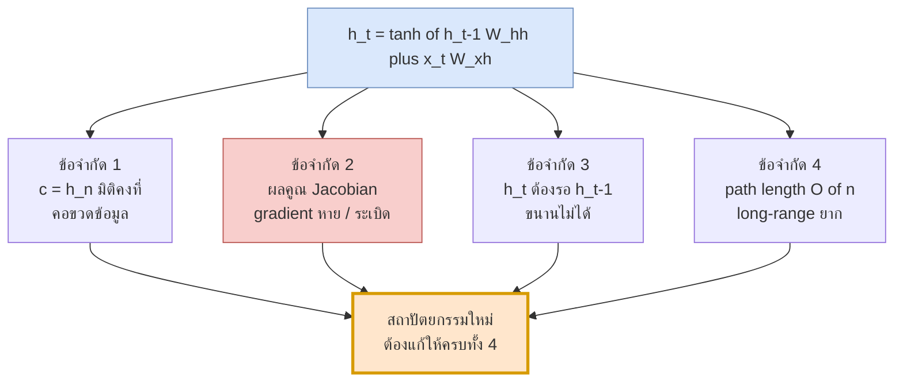
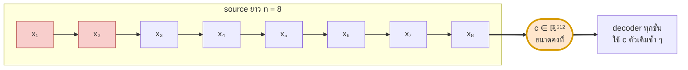
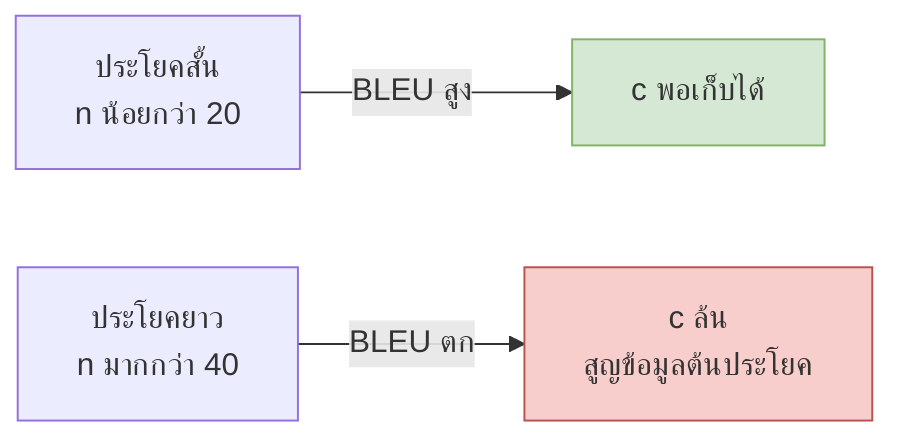
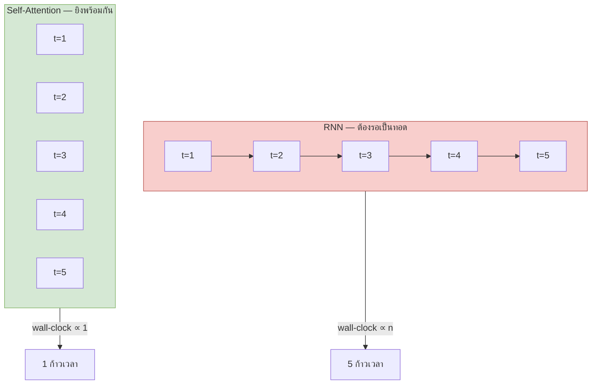
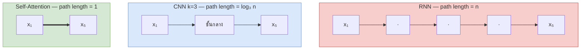
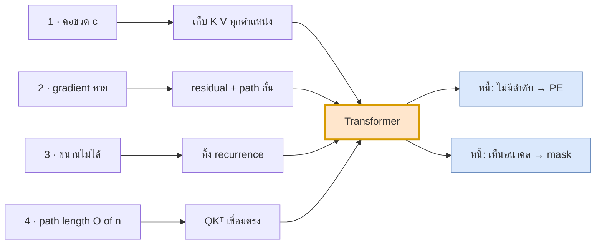

# 02 — ข้อจำกัดของ Seq2Seq (หัวใจของการเปลี่ยนผ่าน)

> **ก่อนหน้า:** [01 — ที่มาของ Seq2Seq แบบดั้งเดิม](01-seq2seq-rnn-basics.md)
> **ถัดไป:** [03 — Attention ก่อนยุค Transformer](03-attention-mechanism-origin.md)

---

ไฟล์ที่แล้วจบด้วยสมการที่ดูสวยงาม

$$
\mathbf{h}_t = \tanh(\mathbf{h}_{t-1}W_{hh} + \mathbf{x}_t W_{xh} + \mathbf{b}), \qquad \mathbf{c} = \mathbf{h}_n
$$

ไฟล์นี้จะแสดงว่าสมการสองบรรทัดนี้ซ่อน **ข้อจำกัด 4 ข้อ** ที่เป็นอิสระจากกัน และ Transformer ทั้งตัวคือคำตอบของทั้ง 4 ข้อพร้อมกัน



> **จุดสำคัญ:** ข้อจำกัด 2 กับ 4 คือ *เรื่องเดียวกันมองคนละมุม* — path ที่ยาวคือผลคูณ Jacobian ที่ยาว แต่แยกอธิบายเพราะวิธีวัดต่างกัน (ข้อ 2 วัดขนาด gradient, ข้อ 4 วัดจำนวนก้าว)

---

## 1. ข้อจำกัดที่ 1: คอขวดของ context vector

### 1.1 การนับข้อมูล: $n \times d$ มิติ ถูกบีบเหลือ $d$ มิติ

encoder ผลิต hidden state ออกมาทั้งหมด $n$ ตัว รวมเป็นเมทริกซ์

$$
H = \begin{bmatrix} \mathbf{h}_1 \\ \mathbf{h}_2 \\ \vdots \\ \mathbf{h}_n \end{bmatrix} \in \mathbb{R}^{n \times d_h}
$$

แต่ seq2seq ดั้งเดิม **ทิ้ง $n-1$ แถวแรกทั้งหมด** แล้วส่งต่อแค่แถวสุดท้าย

$$
\boxed{\ \mathbf{c} = \mathbf{h}_n \in \mathbb{R}^{1 \times d_h} \quad\text{(ทิ้งข้อมูล } (n-1) \times d_h \text{ ตัวเลข)}\ }
$$

| สัญลักษณ์ | มิติ | ความหมาย |
|---|---|---|
| $H$ | $\mathbb{R}^{n \times d_h}$ | hidden state ทุกตำแหน่งของ encoder |
| $\mathbf{c}$ | $\mathbb{R}^{1 \times d_h}$ | context vector ที่ decoder ได้รับจริง |
| $n$ | scalar | ความยาว source |
| $d_h$ | scalar | มิติ hidden (เช่น 512 หรือ 1000) |

**ตารางการนับ** (ใช้ $d_h = 512$)

| ความยาวประโยค $n$ | ตัวเลขที่ encoder ผลิต ($n \times d_h$) | ตัวเลขที่ decoder ได้ | อัตราบีบอัด |
|---|---|---|---|
| 5 | 2,560 | 512 | 5 : 1 |
| 20 | 10,240 | 512 | 20 : 1 |
| 50 | 25,600 | 512 | 50 : 1 |
| 100 | 51,200 | 512 | 100 : 1 |

> **สัญชาตญาณ:** ท่อส่งข้อมูลมีขนาดคงที่ แต่ปริมาณข้อมูลที่ต้องผ่านโตแบบเชิงเส้นตาม $n$ → อัตราบีบอัดโตแบบเชิงเส้นตาม $n$ ไม่ว่าคุณจะเพิ่ม $d_h$ เท่าไร ก็แค่เลื่อนจุดที่มันพังออกไป ไม่ได้แก้รูปแบบของปัญหา

จุดที่แสบกว่านั้น: $\mathbf{c} = \mathbf{h}_n$ **ไม่ใช่แค่มิติคงที่ แต่ยังเอนเอียงไปทางท้ายประโยค** เพราะ $\mathbf{h}_n$ ผ่าน $\tanh$ และ $W_{hh}$ มาแล้ว $n$ รอบนับจาก $\mathbf{x}_1$ แต่ผ่านมาแค่รอบเดียวนับจาก $\mathbf{x}_n$


*โทเคนต้นประโยค (สีแดง) ต้องเดินทางผ่าน 8 ก้าวกว่าจะถึง $\mathbf{c}$ — ระหว่างทางถูกเขียนทับหลายรอบ*

### 1.2 หลักฐานเชิงประจักษ์: BLEU ตกเมื่อประโยคยาวขึ้น

ถ้าคอขวดเป็นเรื่องจริง เราควรเห็นคุณภาพการแปล **ตกเมื่อประโยคยาวขึ้น** และนี่คือสิ่งที่งานวิจัยพบจริง

| หลักฐาน | สิ่งที่สังเกตได้ | ตีความ |
|---|---|---|
| Cho et al. (2014) — *On the Properties of NMT* | BLEU ของ RNN encoder–decoder ตกอย่างรวดเร็วเมื่อประโยคยาวเกิน ~20 คำ | ท่อขนาดคงที่เริ่มล้น |
| Sutskever et al. (2014) — กลับลำดับ input | BLEU 25.9 → 30.6 เพียงเพราะป้อน $x_n,\dots,x_1$ | ถ้าไม่มีคอขวด การสลับลำดับไม่ควรมีผล |
| Bahdanau et al. (2015) — Table 1 (WMT'14 En–Fr, ทุกประโยค) | RNNencdec-30 = 13.93, RNNsearch-30 = 21.50; RNNencdec-50 = 17.82, RNNsearch-50 = 26.75 | เติม attention เข้าไปอย่างเดียว BLEU กระโดด |

> **จุดสำคัญ:** ผลของ Sutskever คือหลักฐานที่ชี้ชัดที่สุด — การ **กลับลำดับ input** ไม่ได้เพิ่มข้อมูลอะไรเลย ไม่ได้เพิ่มพารามิเตอร์เลย มันแค่ย้ายให้คำต้นประโยคของ source อยู่ใกล้ $\mathbf{c}$ ขึ้น ถ้าโมเดล "จำได้จริง" ตัวเลขไม่ควรขยับ แต่มันขยับ 4.7 BLEU

รูปแบบที่เห็นซ้ำ ๆ ในทุกงานคือ



**ทางแก้ที่ไฟล์ 03 จะเสนอ:** ไม่ต้องบีบ — เก็บ $H$ ทั้งก้อนไว้ แล้วให้ decoder เลือกอ่านเองทีละขั้น

---

## 2. ข้อจำกัดที่ 2: Gradient หายและระเบิด

### 2.1 อนุพันธ์ย้อนเวลา (BPTT)

ไฟล์ 01 บอกไว้ว่า RNN คือ "โครงข่ายลึกที่แชร์น้ำหนัก" ตอนนี้เรามาดูว่าความลึกนั้นทำอะไรกับ gradient

loss $\mathcal{L}$ อยู่ที่ปลายทาง ($t = T$) แต่ข้อมูลที่เราอยากให้โมเดลเรียนอาจอยู่ที่ $t = 1$ chain rule บอกว่า

$$
\boxed{\ \frac{\partial \mathcal{L}}{\partial \mathbf{h}_1} = \frac{\partial \mathcal{L}}{\partial \mathbf{h}_T} \prod_{t=2}^{T} \frac{\partial \mathbf{h}_t}{\partial \mathbf{h}_{t-1}}\ }
$$

หาพจน์ในผลคูณ จาก $\mathbf{h}_t = \tanh(\mathbf{h}_{t-1}W_{hh} + \mathbf{x}_tW_{xh} + \mathbf{b})$ ได้

$$
\frac{\partial \mathbf{h}_t}{\partial \mathbf{h}_{t-1}} = W_{hh}\,\text{diag}\!\left(1 - \mathbf{h}_t^2\right) \;\equiv\; J_t
$$

| สัญลักษณ์ | มิติ | ความหมาย |
|---|---|---|
| $J_t$ | $\mathbb{R}^{d_h \times d_h}$ | Jacobian หนึ่งก้าวเวลา |
| $W_{hh}$ | $\mathbb{R}^{d_h \times d_h}$ | ส่วน "เชิงเส้น" ของก้าว |
| $\text{diag}(1-\mathbf{h}_t^2)$ | $\mathbb{R}^{d_h \times d_h}$ | อนุพันธ์ของ $\tanh$ (เพราะ $\tanh'(a) = 1-\tanh^2(a)$) |
| $\prod_{t} J_t$ | $\mathbb{R}^{d_h \times d_h}$ | Jacobian สะสมข้าม $T$ ก้าว |

**สัญชาตญาณ:** gradient ที่จะเดินทางจากปลายประโยคกลับไปต้นประโยค ต้องเดินผ่าน "ประตู" $T-1$ บาน และแต่ละบานคูณด้วยเมทริกซ์ตัวเดิม

### 2.2 ทำไมผลคูณของ Jacobian ทำให้ norm → 0 หรือ → ∞

ผลคูณของเมทริกซ์ตัวเดียวกัน $T$ ครั้งคือ **การยกกำลัง** และการยกกำลังมีพฤติกรรมแค่สามแบบเท่านั้น

$$
\left\|\prod_{t=2}^{T} J_t\right\| \;\approx\; \rho^{\,T-1}
\qquad
\rho \begin{cases}
\lt{} 1 & \Rightarrow \text{หายเป็นเลขชี้กำลัง (vanishing)} \\
= 1 & \Rightarrow \text{คงที่ (เส้นแบ่งบางมาก)} \\
\gt{} 1 & \Rightarrow \text{ระเบิดเป็นเลขชี้กำลัง (exploding)} \\
\end{cases}
$$

> **สัญชาตญาณ:** ไม่มี "โซนปลอดภัย" ที่กว้าง — เพราะเป็นการยกกำลัง ค่าจะวิ่งหนีออกจาก 1 อย่างรวดเร็ว การจะให้ gradient เดินทาง 50 ก้าวโดยขนาดไม่เปลี่ยน ต้องคุม $\rho$ ให้ใกล้ 1 มาก ๆ ซึ่งเป็นเงื่อนไขที่เปราะบางเกินกว่าจะเกิดขึ้นเองระหว่างเทรน

### 2.3 บทบาทของ spectral radius / largest singular value ของ $W_{hh}$

มีตัวเลขสองตัวที่ต้องแยกให้ออก

| ปริมาณ | นิยาม | บอกอะไร |
|---|---|---|
| **spectral radius** $\rho(W)$ | $\max_i |\lambda_i(W)|$ | อัตราการโต/หด **ในระยะยาว** ($T$ ใหญ่) |
| **largest singular value** $\sigma_{\max}(W)$ | $\|W\|_2$ | ขอบเขตบนของการขยาย **ในหนึ่งก้าว** |

ความสัมพันธ์คือ $\rho(W) \le \sigma_{\max}(W)$ เสมอ และผลลัพธ์ที่ต้องจำคือ

$$
\left\|W^T\right\|^{1/T} \xrightarrow[T\to\infty]{} \rho(W)
\qquad\text{(Gelfand's formula)}
$$

**เงื่อนไขที่ใช้ได้จริง:** ถ้า $\sigma_{\max}(W_{hh}) \lt{} 1$ แล้ว gradient **รับประกัน** ว่าหาย (เพราะ $|\tanh'| \le 1$ ยิ่งซ้ำเติม) — นี่คือเงื่อนไขเพียงพอสำหรับ vanishing ที่ Pascanu et al. (2013) พิสูจน์ไว้

#### เดินตัวเลข: จำลองการหด/ระเบิดของ gradient จริง

ใช้ $d_h = 2$ และสร้าง $W_{hh}$ แบบสมมาตรสองตัว ที่คุม eigenvalue ได้เป๊ะ ๆ

$$
W_a = \begin{bmatrix} 0.644 & 0.192 \\ 0.192 & 0.756 \end{bmatrix}, \qquad
W_b = \begin{bmatrix} 0.716 & 0.288 \\ 0.288 & 0.884 \end{bmatrix}
$$

| เมทริกซ์ | eigenvalues | singular values | $\rho$ |
|---|---|---|---|
| $W_a$ | $0.5,\ 0.9$ | $0.9,\ 0.5$ | **0.9** |
| $W_b$ | $0.5,\ 1.1$ | $1.1,\ 0.5$ | **1.1** |

(ทั้งคู่สมมาตร → singular values = $|$eigenvalues$|$ ทำให้ $\rho = \sigma_{\max}$ พอดี เลือกแบบนี้เพื่อให้เลขอ่านง่าย)

**กรณี A — ไม่คิด $\tanh$** (เทียบเท่า RNN ที่ทำงานใกล้จุด $\mathbf{h}=\mathbf{0}$ ซึ่ง $\tanh' = 1$ พอดี) วัด $\left\|\prod_{t=1}^{T} W^\top\right\|_2$

| $T$ | $\rho = 0.9$ | $\rho = 1.1$ | ทฤษฎี $0.9^T$ | ทฤษฎี $1.1^T$ |
|---|---|---|---|---|
| 1 | 9.0000e-01 | 1.1000e+00 | 9.0000e-01 | 1.1000e+00 |
| 5 | 5.9049e-01 | 1.6105e+00 | 5.9049e-01 | 1.6105e+00 |
| 10 | 3.4868e-01 | 2.5937e+00 | 3.4868e-01 | 2.5937e+00 |
| 20 | 1.2158e-01 | 6.7275e+00 | 1.2158e-01 | 6.7275e+00 |
| 30 | 4.2391e-02 | 1.7449e+01 | 4.2391e-02 | 1.7449e+01 |
| 50 | **5.1538e-03** | **1.1739e+02** | 5.1538e-03 | 1.1739e+02 |

**อ่านผล:** ต่างกันแค่ 0.9 กับ 1.1 (ห่างกัน 0.2) แต่ที่ $T=50$ ผลลัพธ์ห่างกัน $1.1739\text{e}{+}2 / 5.1538\text{e}{-}3 \approx 2.3\times 10^{4}$ เท่า — สัญญาณจากคำแรกของประโยคยาว 50 คำ เหลือ **0.5%** ของขนาดเดิม หรือไม่ก็โตเป็น **117 เท่า** ไม่มีทางสายกลาง

**กรณี B — คิด $\tanh$ ด้วย** ป้อน input คงที่ $\mathbf{x}_t = [1, 0]$ ทุกก้าว (ใช้ $W_{xh}$ ชุดเดียวกับไฟล์ 01) แล้ววัด $\left\|\prod_t \text{diag}(1-\mathbf{h}_t^2)\,W^\top\right\|_2$

| $T$ | $\rho = 0.9$ + tanh | $\rho = 1.1$ + tanh |
|---|---|---|
| 1 | 8.1737e-01 | 9.9632e-01 |
| 5 | 2.6192e-01 | 7.2951e-01 |
| 10 | 6.2053e-02 | 5.1794e-01 |
| 20 | 3.5951e-03 | 2.1550e-01 |
| 30 | 2.0949e-04 | 6.1353e-02 |
| 50 | **7.1185e-07** | **3.4059e-03** |

อัตราหดเฉลี่ยต่อก้าว (รากที่ 50 ของค่าที่ $T=50$): **0.7534** และ **0.8926**

> **จุดสำคัญ:** $\tanh$ ดึงอัตราลงทั้งสองกรณี — แม้ $\rho = 1.1$ ซึ่ง "ควรจะระเบิด" ก็กลับหดเหลือ 3.4059e-03 เพราะ state วิ่งไปอิ่มตัว ($\tanh' \to 0$) นี่คือเหตุผลที่ในทางปฏิบัติ **vanishing พบบ่อยกว่า exploding มาก** ส่วน exploding มักเกิดตอนต้นการเทรนที่ $\mathbf{h}$ ยังเล็ก (ยังไม่อิ่มตัว) → แก้ด้วย gradient clipping ได้ แต่ vanishing แก้ด้วยการ clip ไม่ได้

#### ทำไม $\tanh$ ซ้ำเติมเสมอ

$$
\tanh'(a) = 1 - \tanh^2(a) \in (0,\ 1] \qquad\text{และเท่ากับ } 1 \text{ เฉพาะที่ } a = 0
$$

| $a$ | $\tanh(a)$ | $\tanh'(a)$ |
|---|---|---|
| 0.00 | 0.0000 | **1.0000** ← ค่าสูงสุด |
| 0.25 | 0.2449 | 0.9400 |
| 0.50 | 0.4621 | 0.7864 |
| 1.00 | 0.7616 | 0.4200 |
| 1.50 | 0.9051 | 0.1807 |
| 2.00 | 0.9640 | 0.0707 |
| 3.00 | 0.9951 | **0.0099** ← อิ่มตัว |

**สัญชาตญาณ:** ตัวคูณนี้ **ไม่มีวันเกิน 1** ดังนั้นมันเป็นได้แค่ "ตัวหน่วง" ไม่มีวันเป็น "ตัวชดเชย" ผลคูณ $\prod_t \tanh'(a_t) \le 1$ เสมอ และถ้า state วิ่งไปโซนอิ่มตัวแม้แค่ไม่กี่ก้าว ($|a| \gt{} 2$) ผลคูณก็ตกฮวบทันที


```python
import numpy as np

W_a = np.array([[0.644, 0.192],[0.192, 0.756]])   # eigenvalues 0.9, 0.5
W_b = np.array([[0.716, 0.288],[0.288, 0.884]])   # eigenvalues 1.1, 0.5

def jac_norm(W, T_list, use_tanh=False,
             x=np.array([1.0, 0.0]),
             W_xh=np.array([[0.5, -0.2],[0.1, 0.4]])):
    P = np.eye(2); h = np.zeros(2); out = {}
    for t in range(1, max(T_list) + 1):
        if use_tanh:
            h = np.tanh(h @ W + x @ W_xh)
            J = np.diag(1 - h**2) @ W.T      # ← J_t = W diag(1 - h_t²)  (ทรานสโพส)
        else:
            J = W.T
        P = J @ P                            # ← สะสมผลคูณ ∏ ∂h_t/∂h_{t-1}
        if t in T_list:
            out[t] = np.linalg.norm(P, 2)
    return out

Ts = [1, 5, 10, 20, 30, 50]
print({t: f"{v:.4e}" for t, v in jac_norm(W_a, Ts).items()})
# {1:'9.0000e-01', 5:'5.9049e-01', 10:'3.4868e-01', 20:'1.2158e-01', 30:'4.2391e-02', 50:'5.1538e-03'}
print({t: f"{v:.4e}" for t, v in jac_norm(W_b, Ts).items()})
# {1:'1.1000e+00', 5:'1.6105e+00', 10:'2.5937e+00', 20:'6.7275e+00', 30:'1.7449e+01', 50:'1.1739e+02'}
print({t: f"{v:.4e}" for t, v in jac_norm(W_a, Ts, True).items()})
# {1:'8.1737e-01', 5:'2.6192e-01', 10:'6.2053e-02', 20:'3.5951e-03', 30:'2.0949e-04', 50:'7.1185e-07'}
print({t: f"{v:.4e}" for t, v in jac_norm(W_b, Ts, True).items()})
# {1:'9.9632e-01', 5:'7.2951e-01', 10:'5.1794e-01', 20:'2.1550e-01', 30:'6.1353e-02', 50:'3.4059e-03'}
```

### 2.4 ทำไม LSTM ช่วยได้แต่ไม่หมด

ไฟล์ 01 §3.2 บอกว่า LSTM เปิดทางลัดให้ gradient ผ่าน cell state

$$
\frac{\partial \mathbf{c}_t}{\partial \mathbf{c}_{t-1}} = \text{diag}(\mathbf{f}_t)
\qquad\Rightarrow\qquad
\frac{\partial \mathbf{c}_T}{\partial \mathbf{c}_1} \approx \prod_{t=2}^{T} \text{diag}(\mathbf{f}_t)
$$

เทียบกับ RNN: เปลี่ยนจาก "คูณด้วย $W_{hh}\text{diag}(\tanh')$" เป็น "คูณด้วย $\mathbf{f}_t$" ซึ่ง

- **ดีขึ้นจริง** — ไม่มี $W_{hh}$ อยู่ในเส้นทางแล้ว จึงไม่มีการหมุน/ขยายที่ควบคุมไม่ได้ และโมเดล *เรียนรู้* ได้ว่าจะเปิด $\mathbf{f}_t \approx 1$ ตรงไหน
- **แต่ยังไม่หลุด** — เพราะ $\mathbf{f}_t = \sigma(\cdot) \in (0,1)$ **เข้มงวด** ไม่มีวันเท่ากับ 1 พอดี

ผลคูณของเลขที่น้อยกว่า 1 เสมอ ก็ยังหดแบบเลขชี้กำลังอยู่ดี ต่างแค่ฐาน

| $f$ คงที่ | $f^{50}$ | ตีความ |
|---|---|---|
| 0.90 | $5.15\times10^{-3}$ | เหมือน RNN ที่ $\rho=0.9$ |
| 0.99 | $6.05\times10^{-1}$ | ดีมาก แต่ต้องเรียนให้ได้ค่านี้พอดี |
| 0.999 | $9.51\times10^{-1}$ | เกือบสมบูรณ์แบบ |
| 1.00 | $1.00$ | เป็นไปไม่ได้ เพราะ $\sigma(\cdot) \lt{} 1$ |

> **สัญชาตญาณ:** LSTM ไม่ได้ *ลบ* ผลคูณเลขชี้กำลัง มันแค่ให้โมเดล **เลือกฐานได้** ซึ่งดีกว่ามาก แต่ยังต้องเรียนรู้ให้ตรงจุด และยิ่ง $T$ ใหญ่ ความคลาดเคลื่อนของฐานยิ่งถูกขยาย
>
> Transformer แก้คนละมุมโดยสิ้นเชิง: **ตัดผลคูณให้เหลือความยาว 1** (ดู §4)

| ข้อจำกัดที่เหลือของ LSTM | เหตุผล |
|---|---|
| ยังหดเมื่อ $T$ ใหญ่มาก | $\prod \mathbf{f}_t \lt{} 1$ เสมอ |
| ต้องแลกกับความสามารถในการลืม | ถ้าบังคับ $\mathbf{f}_t \to 1$ ทุกก้าว โมเดลก็ลืมอะไรไม่ได้เลย |
| เส้นทางผ่าน $\mathbf{h}_t$ ยังมี $W_{hh}$ | gate ทั้ง 4 ตัวคำนวณจาก $\mathbf{h}_{t-1}$ ซึ่งยังมีปัญหาเดิม |
| ไม่แก้ข้อจำกัด 3 และ 4 เลย | ยังเป็น recurrence อยู่ |

---

## 3. ข้อจำกัดที่ 3: คำนวณขนานไม่ได้

### 3.1 ห่วงโซ่พึ่งพา $\mathbf{h}_t \leftarrow \mathbf{h}_{t-1}$ ทำให้ sequential ops = $O(n)$

นี่คือข้อจำกัดที่ **ไม่เกี่ยวกับคุณภาพโมเดลเลย** แต่เป็นเรื่องความเร็วล้วน ๆ และเป็นเหตุผลเชิงเศรษฐศาสตร์ที่ทำให้ Transformer ชนะ

$$
\mathbf{h}_t = \tanh(\mathbf{h}_{t-1}W_{hh} + \mathbf{x}_tW_{xh} + \mathbf{b})
$$

จะคำนวณ $\mathbf{h}_t$ ได้ ต้องมี $\mathbf{h}_{t-1}$ ก่อน → **ไม่มีทางลัด** ต่อให้มี GPU ล้านตัวก็ยังต้องรอเป็นทอด ๆ

| สถาปัตยกรรม | จำนวน sequential operations | ขนานตามแกน token ได้ไหม |
|---|---|---|
| RNN / LSTM / GRU | $O(n)$ | **ไม่ได้** |
| CNN | $O(1)$ ต่อเลเยอร์ | ได้ |
| Self-Attention | $O(1)$ | **ได้** |



### 3.2 ผลต่อการใช้ GPU (utilization)

ตัวเลขที่ทำให้เห็นภาพ — ใช้ batch $B=64$, $d_h=512$, ประโยคยาว $n=50$

**หนึ่งก้าวเวลาของ RNN** คือ GEMM ขนาด $(64 \times 512) \times (512 \times 512)$

$$
\text{FLOPs} = 2 B d_h^2 = 2 \times 64 \times 512^2 = 33{,}554{,}432 \approx 33.55\ \text{MFLOP}
$$

| ปริมาณ | ค่า | ที่มา |
|---|---|---|
| FLOP ต่อก้าวเวลา | 33.55 MFLOP | $2Bd_h^2$ |
| เวลาคำนวณล้วน (สมมติ 19.5 TFLOP/s) | **1.721 µs** | FLOP / peak |
| overhead ต่อ kernel launch (ทั่วไป) | ~5 µs | คงที่ ไม่ขึ้นกับขนาดงาน |
| **utilization** | **≈ 34%** | $1.721/5.0$ |
| เวลารวม 50 ก้าว (ติด launch overhead) | ~0.25 ms | $50 \times 5\ \mu\text{s}$ |

เทียบกับการยิง 50 โทเคนพร้อมกันเป็น GEMM ก้อนเดียว $(64\cdot 50 \times 512)\times(512\times512)$

$$
\text{FLOPs} = 2 B n d_h^2 = 1.678\ \text{GFLOP} \quad\Rightarrow\quad \approx 86.04\ \mu s \text{ ของงานจริง ใน kernel launch เดียว}
$$

> **สัญชาตญาณ:** GPU เก่งเรื่อง "งานก้อนใหญ่ก้อนเดียว" ไม่ใช่ "งานก้อนจิ๋ว 50 ก้อนเรียงกัน" RNN บังคับให้เราทำแบบหลัง — งานแต่ละก้อนเล็กเกินกว่าจะกลบ overhead ทำให้ GPU นั่งว่างเป็นส่วนใหญ่
>
> ผลลัพธ์เชิงปฏิบัติ: **เทรนไม่ขึ้น scale** ยิ่งซื้อ GPU เพิ่ม ยิ่งไม่ช่วย เพราะคอขวดคือ *ความลึกของห่วงโซ่* ไม่ใช่ *ปริมาณการคำนวณ*

**ข้อควรระวัง:** ข้อจำกัดนี้แก้ได้เฉพาะฝั่ง **training** เท่านั้น ตอน inference แบบ autoregressive decoder ของ Transformer ก็ยังต้องสร้างทีละโทเคนอยู่ดี (ดูไฟล์ [11](11-decoder-masked-attention.md)) — ที่ชนะคือ encoder และการเทรนแบบ teacher forcing ที่ยิงทั้ง target sequence พร้อมกันได้

---

## 4. ข้อจำกัดที่ 4: ระยะทางของเส้นทางสัญญาณ (path length)

### 4.1 ตารางเปรียบเทียบ maximum path length

นิยาม: **maximum path length** = จำนวนก้าวของการดำเนินการ ที่มากที่สุด ที่สัญญาณต้องเดินทางระหว่างสองตำแหน่งใด ๆ ในลำดับ

นี่คือ Table 1 ของ Vaswani et al. (2017) — ตารางที่เป็น "เหตุผลทั้งหมด" ของ Transformer ในหน้าเดียว

| ชนิดเลเยอร์ | Complexity ต่อเลเยอร์ | Sequential ops | **Maximum path length** |
|---|---|---|---|
| Recurrent | $O(n \cdot d^2)$ | $O(n)$ | $O(n)$ |
| Convolutional (kernel $k$) | $O(k \cdot n \cdot d^2)$ | $O(1)$ | $O(\log_k n)$ |
| **Self-Attention** | $O(n^2 \cdot d)$ | $O(1)$ | $\boxed{O(1)}$ |
| Self-Attention (restricted, window $r$) | $O(r \cdot n \cdot d)$ | $O(1)$ | $O(n/r)$ |

ใส่ตัวเลขจริง (ปัดขึ้นเป็นจำนวนเลเยอร์)

| $n$ | RNN | CNN ($k=3$) | CNN ($k=5$) | Self-Attention |
|---|---|---|---|---|
| 10 | 10 | 3 | 2 | **1** |
| 50 | 50 | 4 | 3 | **1** |
| 100 | 100 | 5 | 3 | **1** |
| 512 | 512 | 6 | 4 | **1** |
| 1000 | 1000 | 7 | 5 | **1** |



**ข้อสังเกตเรื่อง complexity:** self-attention แพงกว่าเมื่อ $n$ ใหญ่ ($n^2 d$ เทียบ $n d^2$) จุดคุ้มทุนอยู่ที่ $n = d$ — ที่ $n=50, d=512$ self-attention ยัง **ถูกกว่า** RNN ถึง $d/n = 10.24$ เท่า

| $n=50$, $d=512$, $k=3$ | FLOP-ish ต่อเลเยอร์ |
|---|---|
| Self-Attention ($n^2 d$) | 1,280,000 |
| Recurrent ($n d^2$) | 13,107,200 |
| Convolutional ($k n d^2$) | 39,321,600 |

### 4.2 ทำไม path length สั้นแปลว่าเรียน long-range dependency ได้ดีกว่า

เชื่อมกลับไป §2: **path length คือความยาวของผลคูณ Jacobian โดยตรง**

$$
\text{path length} = L \qquad\Rightarrow\qquad
\frac{\partial \mathcal{L}}{\partial \mathbf{x}_1} = \frac{\partial \mathcal{L}}{\partial \mathbf{y}} \prod_{k=1}^{L} J_k
\qquad\Rightarrow\qquad
\left\|\cdot\right\| \sim \rho^{L}
$$

| path length $L$ | ผลคูณ Jacobian | ชะตากรรมของ gradient |
|---|---|---|
| $O(n)$ (RNN) | ยาว $n$ พจน์ | $\rho^n$ → หาย/ระเบิดเป็นเลขชี้กำลังตาม $n$ |
| $O(\log_k n)$ (CNN) | ยาว $\log_k n$ พจน์ | ดีขึ้นมาก แต่ยังโตตาม $n$ |
| $O(1)$ (Attention) | **ยาว 1 พจน์** | ขนาด gradient **ไม่ขึ้นกับ $n$ เลย** |

> **จุดสำคัญ (สำคัญที่สุดของไฟล์นี้):** เมื่อ $L = 1$ เลขชี้กำลัง $\rho^L = \rho$ ไม่มี $n$ อยู่ในสูตรอีกต่อไป — ปัญหาเปลี่ยนจาก "เลขชี้กำลังตามความยาวประโยค" เป็น "ค่าคงที่"
>
> พูดอีกแบบ: การเรียนความสัมพันธ์ระหว่างคำที่ 1 กับคำที่ 50 **ยากเท่ากับ** การเรียนความสัมพันธ์ระหว่างคำที่ 1 กับคำที่ 2

และนี่คือเหตุผลว่าทำไมสมการแก่นของไฟล์ [05](05-self-attention-math.md) ถึงหน้าตาแบบนั้น — ทุกคู่ $(i,j)$ เชื่อมกันตรง ๆ ใน $QK^\top$ ก้อนเดียว

---

## 5. สรุป: เงื่อนไข 4 ข้อที่สถาปัตยกรรมใหม่ต้องแก้ให้ได้

ถ้าจะออกแบบสถาปัตยกรรมใหม่ ต้องผ่านเช็กลิสต์นี้ให้ครบ

| # | ข้อจำกัดของ Seq2Seq | เงื่อนไขที่ต้องทำให้ได้ | สิ่งที่ Transformer ทำ | อธิบายในไฟล์ |
|---|---|---|---|---|
| 1 | $\mathbf{c} = \mathbf{h}_n$ มิติคงที่ → คอขวด | context ต้องโตตาม $n$ และ **เปลี่ยนได้ตามขั้น** | ไม่บีบเลย — เก็บ $K, V$ ทุกตำแหน่ง แล้วคำนวณ $\mathbf{c}_i$ ใหม่ทุก query | [03](03-attention-mechanism-origin.md), [05](05-self-attention-math.md) |
| 2 | $\prod J_t$ ทำ gradient หาย/ระเบิด | ตัดความยาวของผลคูณ Jacobian ให้ไม่ขึ้นกับ $n$ | attention ตรง ๆ + **residual connection** เปิดทางลัด $\partial/\partial \mathbf{x} = I + \dots$ | [08 §2](08-feedforward-and-residual.md), [12](12-training-objective-backprop.md) |
| 3 | $\mathbf{h}_t \leftarrow \mathbf{h}_{t-1}$ → ขนานไม่ได้ | sequential ops ต้องเป็น $O(1)$ | ทิ้ง recurrence ทั้งหมด → ทุกตำแหน่งคำนวณพร้อมกันเป็น GEMM ก้อนเดียว | [04](04-transformer-motivation.md), [05](05-self-attention-math.md) |
| 4 | path length $O(n)$ | path length ต้องเป็น $O(1)$ | $QK^\top$ เชื่อมทุกคู่ $(i,j)$ ในก้าวเดียว | [05](05-self-attention-math.md) |

**และเงื่อนไขที่ *เกิดใหม่* จากการทิ้ง recurrence** (หนี้ที่ต้องจ่าย)

| ปัญหาใหม่ | ทำไมเกิด | ทางแก้ | ไฟล์ |
|---|---|---|---|
| ไม่มีข้อมูลลำดับเลย | attention ไม่สนใจตำแหน่ง (permutation-equivariant) | Positional Encoding | [07](07-positional-encoding.md) |
| ต้องกันไม่ให้ decoder แอบดูอนาคต | ทุกตำแหน่งเห็นกันหมด | Causal mask | [11](11-decoder-masked-attention.md) |
| หน่วยความจำ $O(n^2)$ | เก็บ attention matrix ทั้งผืน | (นอกขอบเขตชุดนี้ — FlashAttention ฯลฯ) | — |
| training ลึกไม่เสถียร | ไม่มี gate คุมขนาด activation | LayerNorm + residual | [08](08-feedforward-and-residual.md), [09](09-layernorm-math.md) |



> **สัญชาตญาณสรุป:** ประวัติศาสตร์เดินแบบนี้ — ไฟล์ [03](03-attention-mechanism-origin.md) แก้ **ข้อ 1** ก่อน (ยังคง recurrence ไว้) แล้วไฟล์ [04](04-transformer-motivation.md) ถึงกล้าถามว่า "ถ้า attention ทำงานได้ดีขนาดนี้ ยังต้องมี recurrence อยู่ไหม" ซึ่งเมื่อทิ้งไป ก็ได้ข้อ 2, 3, 4 มาฟรี ๆ พร้อมกัน

---

## 6. สรุปไฟล์นี้

| สิ่งที่ได้ | สมการหลัก / ตัวเลขหลัก |
|---|---|
| คอขวด context vector | $H \in \mathbb{R}^{n\times d_h} \to \mathbf{c} \in \mathbb{R}^{1\times d_h}$ — บีบ $n$:1 |
| BPTT | $\dfrac{\partial \mathcal{L}}{\partial \mathbf{h}_1} = \dfrac{\partial \mathcal{L}}{\partial \mathbf{h}_T}\prod_{t=2}^{T} J_t$, $\ J_t = W_{hh}\text{diag}(1-\mathbf{h}_t^2)$ |
| กฎเลขชี้กำลัง | $\left\|\prod J_t\right\| \approx \rho^{T-1}$ — ที่ $T=50$: $\rho{=}0.9 \to 5.1538\text{e-}03$, $\rho{=}1.1 \to 1.1739\text{e+}02$ |
| $\tanh$ ซ้ำเติมเสมอ | $\tanh'(a) = 1-\tanh^2(a) \in (0,1]$ → ผลคูณ $\le 1$ เสมอ |
| LSTM ช่วยแต่ไม่หมด | $\partial\mathbf{c}_t/\partial\mathbf{c}_{t-1} = \text{diag}(\mathbf{f}_t)$ แต่ $\mathbf{f}_t \lt{} 1$ เข้มงวด |
| ขนานไม่ได้ | sequential ops $= O(n)$ → GPU utilization ~34% ต่อก้าว |
| path length | RNN $O(n)$, CNN $O(\log_k n)$, **Self-Attention $O(1)$** |
| เช็กลิสต์ 4 ข้อ | ตาราง §5 — จับคู่ข้อจำกัด → กลไกของ Transformer |

**สิ่งที่ต้องจำไปไฟล์ถัดไป:** ไฟล์ 03 จะแก้ **เฉพาะข้อ 1** ด้วยการเปลี่ยน $\mathbf{c}$ คงที่ ให้เป็น $\mathbf{c}_t$ ที่คำนวณใหม่ทุกขั้นถอดรหัส — และในสมการของมันจะมี "query–key–value" ซ่อนอยู่แล้ว โดยที่คนคิดยังไม่ได้เรียกชื่อนั้น

---

**ถัดไป:** [03 — Attention ก่อนยุค Transformer](03-attention-mechanism-origin.md)
