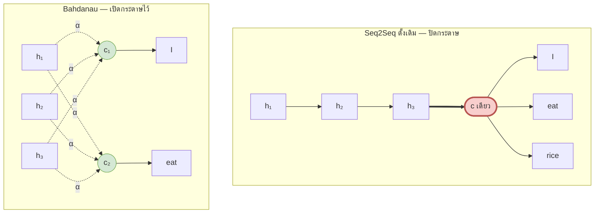
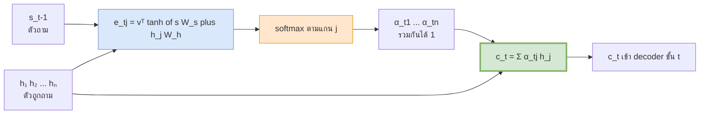
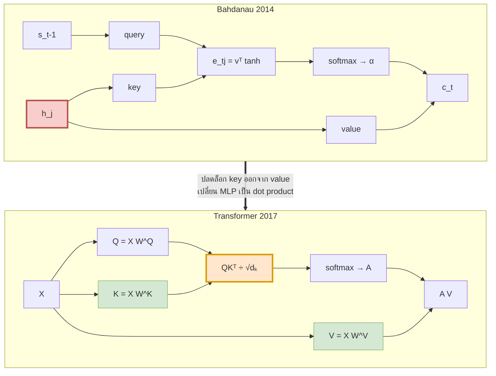
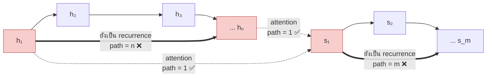

# 03 — Attention ก่อนยุค Transformer

> **ก่อนหน้า:** [02 — ข้อจำกัดของ Seq2Seq](02-seq2seq-limitations.md)
> **ถัดไป:** [04 — ทำไมต้องทิ้ง recurrence](04-transformer-motivation.md)

---

ไฟล์ 02 ทิ้งเช็กลิสต์ไว้ 4 ข้อ ไฟล์นี้เล่าเรื่องปี 2014–2015 ที่มีคนแก้ **ข้อ 1 (คอขวด context vector)** สำเร็จ โดยที่ยัง**ไม่ได้แตะข้อ 2, 3, 4 เลย** — และในระหว่างทางนั้น พวกเขาเขียนสมการที่กลายเป็นแกนกลางของ Transformer ในอีก 3 ปีต่อมา โดยยังไม่ได้เรียกมันว่า query–key–value

---

## 1. แนวคิด: แทนที่จะจำทั้งประโยค ให้ "มองย้อนกลับไปดู" ได้

ลองคิดว่ามนุษย์แปลภาษาอย่างไร — **ไม่มีใครอ่านประโยคภาษาไทยทั้งประโยค ปิดกระดาษ แล้วเขียนภาษาอังกฤษจากความจำ** เราชำเลืองกลับไปดูคำต้นฉบับตลอดเวลา และแต่ละคำที่กำลังเขียน เราชำเลืองไปดู *คนละที่*

seq2seq ดั้งเดิมบังคับให้โมเดล "ปิดกระดาษ"

$$
\mathbf{c} = \mathbf{h}\_n \qquad\text{(เวกเตอร์เดียว ใช้ซ้ำทุกขั้นถอดรหัส)}
$$

**ข้อเสนอของ Bahdanau:** ไม่ต้องปิด — เก็บ $H = [\mathbf{h}\_1; \dots; \mathbf{h}\_n] \in \mathbb{R}^{n \times d}$ ไว้ทั้งก้อน แล้วให้ decoder สร้าง context **ใหม่ทุกขั้น**

$$
\boxed{\ \mathbf{c} \ \longrightarrow\ \mathbf{c}\_t \qquad\text{context vector ที่เปลี่ยนตาม } t\ }
$$



> **สัญชาตญาณ:** ท่อขนาดคงที่ถูกแทนด้วย **ตัวชี้ที่เลื่อนได้** ความจุของ context จึงโตตาม $n$ โดยอัตโนมัติ เพราะ $\mathbf{c}\_t$ ไม่ได้เก็บทุกอย่าง — มันแค่ *เลือก* สิ่งที่ต้องใช้ ณ ขั้นนั้น

คำถามที่เหลือมีสองข้อ และสองข้อนี้คือทั้งหมดของไฟล์นี้

1. จะให้คะแนนว่า "$\mathbf{h}\_j$ เกี่ยวกับขั้น $t$ แค่ไหน" ได้อย่างไร → §2.2, §3.1
2. คะแนนแล้วเอาไปใช้อย่างไรให้ยัง differentiable → §2.3, §2.4

---

## 2. Bahdanau Attention (Additive, 2014)

### 2.1 ที่มา: ผ่อนคลายข้อจำกัด $\mathbf{c}$ คงที่ → $\mathbf{c}\_t$ เปลี่ยนตามขั้นถอดรหัส

decoder เดิม (ไฟล์ 01-5.2)

$$
\mathbf{s}\_t = \text{RNN}\_{\text{dec}}(\mathbf{s}\_{t-1},\ [\mathbf{y}\_{t-1};\ \mathbf{c}])
$$

decoder ใหม่ — เปลี่ยนแค่ตัวเดียว

$$
\mathbf{s}\_t = \text{RNN}\_{\text{dec}}(\mathbf{s}\_{t-1},\ [\mathbf{y}\_{t-1};\ \mathbf{c}\_t])
$$

การเปลี่ยน $\mathbf{c}$ เป็น $\mathbf{c}\_t$ ดูเล็กมาก แต่มันเปลี่ยนคุณสมบัติเชิงข้อมูลไปคนละเรื่อง

| | Seq2Seq ดั้งเดิม | Bahdanau |
|---|---|---|
| ข้อมูลที่ decoder เข้าถึงได้ | $d\_h$ ตัวเลข | $n \times d\_h$ ตัวเลข |
| context เปลี่ยนตาม $t$ ไหม | ไม่ | **ใช่** |
| มี path ตรงจาก $\mathbf{h}\_j$ ไป loss ไหม | ไม่ (ต้องผ่าน $\mathbf{h}\_n$) | **มี** — path length ระหว่าง $\mathbf{h}\_j$ กับ $\mathbf{s}\_t$ = 1 |
| เรียนรู้ alignment โดยไม่มี label ไหม | — | ใช่ (เรียนเองจาก loss ของการแปล) |

> **จุดสำคัญ:** สังเกตแถวที่ 3 — Bahdanau แก้ข้อจำกัดที่ 4 (path length) ไปด้วยแล้ว **แต่เฉพาะเส้นทาง encoder→decoder เท่านั้น** ภายในฝั่ง encoder เองยังเป็น $O(n)$ อยู่ นี่คือช่องว่างที่ไฟล์ 04 จะเข้าไปอุด

### 2.2 สมการคะแนน $e\_{tj}$ (additive / MLP scoring)

เราต้องการฟังก์ชันที่รับ "ขั้นที่ต้องการ" กับ "แหล่งข้อมูล" แล้วคืนคะแนนความเข้ากัน — Bahdanau ใช้ MLP หนึ่งชั้นซ่อน

$$
\boxed{\ e\_{tj} = \mathbf{v}^\top \tanh\\!\left(\mathbf{s}\_{t-1}W\_s + \mathbf{h}\_j W\_h\right)\ }
$$

| สัญลักษณ์ | มิติ | ความหมาย |
|---|---|---|
| $\mathbf{s}\_{t-1}$ | $\mathbb{R}^{1 \times d\_s}$ | decoder state ก่อนสร้างโทเคนที่ $t$ — **ตัวถาม** |
| $\mathbf{h}\_j$ | $\mathbb{R}^{1 \times d\_h}$ | encoder state ตำแหน่ง $j$ — **ตัวถูกถาม** |
| $W\_s$ | $\mathbb{R}^{d\_s \times d\_a}$ | ฉาย decoder state เข้าสู่ "พื้นที่เทียบ" |
| $W\_h$ | $\mathbb{R}^{d\_h \times d\_a}$ | ฉาย encoder state เข้าสู่พื้นที่เดียวกัน |
| $\mathbf{v}$ | $\mathbb{R}^{d\_a}$ | ยุบเวกเตอร์ให้เหลือ scalar |
| $e\_{tj}$ | scalar | คะแนนดิบ (energy / alignment score) |
| $d\_a$ | scalar | มิติของ attention layer (hyperparameter) |

**ทำไมต้องมี $W\_s$ และ $W\_h$ แยกกัน:** $\mathbf{s}$ กับ $\mathbf{h}$ อาจมีมิติต่างกัน และอยู่คนละ "ระบบพิกัด" (ตัวหนึ่งเป็นสถานะฝั่งภาษาเป้าหมาย อีกตัวเป็นฝั่งภาษาต้นทาง) ต้องฉายเข้าพื้นที่กลางก่อนถึงจะเทียบกันได้

**ทำไมชื่อ "additive":** เพราะสองพจน์ถูก **บวก** กันก่อนเข้า nonlinearity — เทียบกับ Luong ที่ **คูณ** กัน (§3)

> **สัญชาตญาณ:** นี่คือโครงข่ายประสาทจิ๋ว 1 ชั้น ที่ทำหน้าที่เดียวคือตอบคำถาม "เกี่ยวกันแค่ไหน" มันยืดหยุ่นมาก (universal approximator) แต่ก็แพง เพราะต้องคำนวณ $\tanh$ ทีละคู่ $(t,j)$

### 2.3 การทำให้เป็นน้ำหนัก $\alpha\_{tj} = \text{softmax}\_j(e\_{tj})$

คะแนนดิบเป็นเลขอะไรก็ได้ ต้องแปลงเป็นน้ำหนักที่รวมกันได้ 1

$$
\boxed{\ \alpha\_{tj} = \frac{\exp(e\_{tj})}{\sum\_{j'=1}^{n} \exp(e\_{tj'})}, \qquad \sum\_{j=1}^{n}\alpha\_{tj} = 1,\ \ \alpha\_{tj} {>} 0\ }
$$

**ทำไมต้อง softmax ไม่ใช่ argmax:**

| ทางเลือก | ผลลัพธ์ | หาอนุพันธ์ได้ไหม |
|---|---|---|
| hard selection ($\arg\max\_j$) | เลือก $\mathbf{h}\_j$ ตัวเดียว | **ไม่ได้** — gradient เป็น 0 ทุกที่ |
| softmax | ค่าเฉลี่ยถ่วงน้ำหนักแบบนุ่ม | **ได้** — เทรน end-to-end ด้วย backprop ตัวเดียวจบ |

> **สัญชาตญาณ:** attention คือ "การเลือก" ที่ถูกทำให้ **นุ่ม (soft)** เพื่อให้ gradient ไหลผ่านได้ นี่เป็นสาเหตุที่คำว่า *soft attention* ติดมาจนถึงทุกวันนี้ และเป็นเหตุผลว่าทำไม Transformer ถึงใช้ softmax ตัวเดียวกันในไฟล์ [05](05-self-attention-math.md)

การที่ $\sum\_j \alpha\_{tj} = 1$ ยังให้ผลพลอยได้: $\mathbf{c}\_t$ เป็น **convex combination** ของ $\\{\mathbf{h}\_j\\}$ จึงอยู่ใน convex hull ของ encoder states เสมอ → ขนาดไม่ระเบิด

### 2.4 บริบทถ่วงน้ำหนัก $\mathbf{c}\_t = \sum\_j \alpha\_{tj}\mathbf{h}\_j$

$$
\boxed{\ \mathbf{c}\_t = \sum\_{j=1}^{n} \alpha\_{tj}\\,\mathbf{h}\_j \ \in \mathbb{R}^{1 \times d\_h} \qquad\text{หรือรูปเมทริกซ์}\quad \mathbf{c}\_t = \boldsymbol{\alpha}\_t H\ }
$$

| สัญลักษณ์ | มิติ |
|---|---|
| $\boldsymbol{\alpha}\_t$ | $\mathbb{R}^{1 \times n}$ |
| $H$ | $\mathbb{R}^{n \times d\_h}$ |
| $\mathbf{c}\_t$ | $\mathbb{R}^{1 \times d\_h}$ |

สามขั้นตอนทั้งหมดรวมกัน



### 2.5 ตัวอย่างคำนวณเชิงตัวเลขพร้อม alignment matrix

ใช้ตัวอย่างเดียวกับไฟล์ 01 — แปล **"ฉัน กิน ข้าว" → "I eat rice"** โดย encoder states คือผลลัพธ์ที่คำนวณไว้แล้วใน [01-6](01-seq2seq-rnn-basics.md)

$$
H = \begin{bmatrix} \mathbf{h}\_1 \\\ \mathbf{h}\_2 \\\ \mathbf{h}\_3 \end{bmatrix}
= \begin{bmatrix} 0.4621 & -0.1974 \\\ 0.2528 & 0.3857 \\\ 0.3250 & 0.1997 \end{bmatrix}
\qquad
\begin{aligned}
\mathbf{h}\_1 &\leftrightarrow \text{ฉัน} \\\ \mathbf{h}\_2 &\leftrightarrow \text{กิน} \\\ \mathbf{h}\_3 &\leftrightarrow \text{ข้าว}
\end{aligned}
$$

**พารามิเตอร์ attention** ($d\_s = d\_h = d\_a = 2$)

$$
W\_s = \begin{bmatrix} 0.0 & 1.5 \\\ -1.5 & -0.5 \end{bmatrix}, \quad
W\_h = \begin{bmatrix} 0.0 & 3.0 \\\ 2.5 & -3.0 \end{bmatrix}, \quad
\mathbf{v} = [-5.5,\ -4.5]
$$

**decoder states** — ขั้นแรกใช้ $\mathbf{s}\_0 = \mathbf{c} = \mathbf{h}\_3$ ตามธรรมเนียมของไฟล์ 01 ส่วนขั้นถัดไปสมมติค่าที่ decoder เดินมาถึง

$$
\mathbf{s}\_0 = [0.3250,\ 0.1997], \qquad
\mathbf{s}\_1 = [0.0,\ -0.5], \qquad
\mathbf{s}\_2 = [-1.0,\ 1.0]
$$

#### ขั้นที่ 1 — ฉายทั้งสองฝั่งเข้าพื้นที่กลาง

$H W\_h$ คำนวณ **ครั้งเดียวต่อประโยค** แล้วใช้ซ้ำทุกขั้น decoder

| $j$ | โทเคน | $\mathbf{h}\_j W\_h$ |
|---|---|---|
| 1 | ฉัน | $[-0.4935,\ \ 1.9785]$ |
| 2 | กิน | $[\ \ 0.9642,\ -0.3987]$ |
| 3 | ข้าว | $[\ \ 0.4992,\ \ 0.3759]$ |

$\mathbf{s}\_{t-1} W\_s$ คำนวณ **ครั้งเดียวต่อขั้น decoder**

| $t$ | $\mathbf{s}\_{t-1}$ | $\mathbf{s}\_{t-1}W\_s$ |
|---|---|---|
| 1 | $[0.3250, 0.1997]$ | $[-0.2996,\ \ 0.3877]$ |
| 2 | $[0.0, -0.5]$ | $[\ \ 0.7500,\ \ 0.2500]$ |
| 3 | $[-1.0, 1.0]$ | $[-1.5000,\ -2.0000]$ |

#### ขั้นที่ 2 — คะแนน $e\_{1j}$ ทีละตัว (แสดงเต็มสำหรับ $t=1$)

$j=1$:

$$
\mathbf{s}\_0W\_s + \mathbf{h}\_1W\_h = [-0.2996, 0.3877] + [-0.4935, 1.9785] = [-0.7930,\ 2.3662]
$$

$$
\tanh(\cdot) = [-0.6601,\ 0.9825] \quad\Rightarrow\quad
e\_{11} = (-5.5)(-0.6601) + (-4.5)(0.9825) = \mathbf{-0.7907}
$$

$j=2$:

$$
[-0.2996, 0.3877] + [0.9642, -0.3987] = [0.6647,\ -0.0110]
$$

$$
\tanh(\cdot) = [0.5815,\ -0.0110] \quad\Rightarrow\quad e\_{12} = \mathbf{-3.1484}
$$

$j=3$:

$$
[-0.2996, 0.3877] + [0.4992, 0.3759] = [0.1997,\ 0.7636]
$$

$$
\tanh(\cdot) = [0.1971,\ 0.6432] \quad\Rightarrow\quad e\_{13} = \mathbf{-3.9782}
$$

#### ขั้นที่ 3 — softmax

ลบ max (= $-0.7907$) เพื่อความเสถียร ตามที่ทบทวนไว้ใน [00-4](00-overview.md)

| $j$ | $e\_{1j}$ | $e\_{1j} - \max$ | $\exp(\cdot)$ | $\alpha\_{1j}$ |
|---|---|---|---|---|
| 1 | $-0.7907$ | $0.0000$ | $1.0000$ | **0.8804** |
| 2 | $-3.1484$ | $-2.3577$ | $0.0946$ | 0.0833 |
| 3 | $-3.9782$ | $-3.1875$ | $0.0413$ | 0.0363 |
| | | | **รวม 1.1359** | **รวม 1.0000** |

#### ขั้นที่ 4 — บริบทถ่วงน้ำหนัก

$$
\mathbf{c}\_1 = 0.8804\\,\mathbf{h}\_1 + 0.0833\\,\mathbf{h}\_2 + 0.0363\\,\mathbf{h}\_3 = [\mathbf{0.4397},\ \mathbf{-0.1344}]
$$

เทียบกับ $\mathbf{c} = \mathbf{h}\_3 = [0.3250, 0.1997]$ ของ seq2seq ดั้งเดิม — $\mathbf{c}\_1$ **เอียงไปทาง $\mathbf{h}\_1$ (`ฉัน`) อย่างชัดเจน** ซึ่งตรงกับคำที่กำลังจะแปล (`I`)

#### Alignment matrix เต็ม 3 ขั้น

**คะแนนดิบ $e\_{tj}$**

| | $j=1$ (ฉัน) | $j=2$ (กิน) | $j=3$ (ข้าว) |
|---|---|---|---|
| $t=1$ (I) | $-0.7907$ | $-3.1484$ | $-3.9782$ |
| $t=2$ (eat) | $-5.7774$ | $-4.4902$ | $-7.1629$ |
| $t=3$ (rice) | $5.3963$ | $7.1200$ | $8.3540$ |

**น้ำหนัก $\alpha\_{tj}$ — alignment matrix**

| | $j=1$ (ฉัน) | $j=2$ (กิน) | $j=3$ (ข้าว) | รวม |
|---|---|---|---|---|
| $t=1$ → **I** | **0.8804** | 0.0833 | 0.0363 | 1.0000 |
| $t=2$ → **eat** | 0.2052 | **0.7434** | 0.0513 | 1.0000 |
| $t=3$ → **rice** | 0.0387 | 0.2168 | **0.7446** | 1.0000 |

**บริบทที่ได้แต่ละขั้น**

| $t$ | $\mathbf{c}\_t$ | ระยะห่างจาก $\mathbf{c}=\mathbf{h}\_3$ |
|---|---|---|
| 1 | $[0.4397,\ -0.1344]$ | 0.3532 |
| 2 | $[0.2995,\ \ \ 0.2565]$ | 0.0623 |
| 3 | $[0.3147,\ \ \ 0.2247]$ | 0.0270 |

> **อ่านผล:** เส้นทแยงมุมเด่นชัด (0.8804 / 0.7434 / 0.7446) → โมเดลจับคู่ ฉัน↔I, กิน↔eat, ข้าว↔rice ได้เอง
> คอลัมน์ "ระยะห่าง" ยืนยันประเด็นหลัก: seq2seq ดั้งเดิมจะใช้ $\mathbf{c}$ ตัวเดียวกันทุกแถว แต่ที่นี่ $\mathbf{c}\_1$ ห่างจากมันถึง 0.3532 — ความต่างนั้นคือข้อมูลที่ seq2seq ดั้งเดิม **ทิ้งไป**

> **สัญชาตญาณ:** alignment matrix นี้คือ **สิ่งเดียวกัน** กับ attention map ที่คุณเห็นในรูปสวย ๆ ของ Transformer ต่างกันแค่ Transformer มีทั้ง $n \times n$ (self) และ $m \times n$ (cross) และมีหลายหัวหลายชั้น

```python
import numpy as np

H   = np.array([[0.4621, -0.1974],      # ฉัน
                [0.2528,  0.3857],      # กิน
                [0.3250,  0.1997]])     # ข้าว
W_s = np.array([[0.0,  1.5], [-1.5, -0.5]])
W_h = np.array([[0.0,  3.0], [ 2.5, -3.0]])
v   = np.array([-5.5, -4.5])
S   = np.array([[0.3250, 0.1997], [0.0, -0.5], [-1.0, 1.0]])   # s_0, s_1, s_2

def softmax(z):
    z = z - z.max(); e = np.exp(z); return e / e.sum()

HW = H @ W_h                                    # ← h_j W_h  คำนวณครั้งเดียวต่อประโยค
E = np.zeros((3, 3)); A = np.zeros((3, 3)); C = np.zeros((3, 2))
for t in range(3):
    sW = S[t] @ W_s                             # ← s_{t-1} W_s  ครั้งเดียวต่อขั้น
    E[t] = np.array([v @ np.tanh(sW + HW[j]) for j in range(3)])   # ← e_tj
    A[t] = softmax(E[t])                        # ← α_tj
    C[t] = A[t] @ H                             # ← c_t = Σ α_tj h_j

print(np.round(E, 4))
# [[-0.7907 -3.1484 -3.9782] [-5.7774 -4.4902 -7.1629] [ 5.3963  7.12    8.354 ]]
print(np.round(A, 4))
# [[0.8804 0.0833 0.0363] [0.2052 0.7434 0.0513] [0.0387 0.2168 0.7446]]
print(np.round(C, 4))
# [[ 0.4397 -0.1344] [ 0.2995  0.2565] [ 0.3147  0.2247]]
```

---

## 3. Luong Attention (Multiplicative, 2015)

Luong et al. ตั้งคำถามตรง ๆ ว่า **"ต้องใช้ MLP ทั้งตัวจริงหรือ เพื่อวัดว่าสองเวกเตอร์เข้ากันแค่ไหน"** คำตอบคือไม่ — dot product ก็วัดความคล้ายได้อยู่แล้ว

### 3.1 สามรูปแบบคะแนน: dot / general / concat

$$
\text{score}(\mathbf{s}\_t, \mathbf{h}\_j) =
\begin{cases}
\mathbf{s}\_t \mathbf{h}\_j^\top & \textbf{dot} \\\\[6pt]
\mathbf{s}\_t W\_a \mathbf{h}\_j^\top & \textbf{general} \\\\[6pt]
\mathbf{v}\_a^\top \tanh\\!\left([\mathbf{s}\_t;\ \mathbf{h}\_j] W\_a\right) & \textbf{concat} \ \text{(รูปแบบ Bahdanau)}
\end{cases}
$$

| รูปแบบ | พารามิเตอร์ | เงื่อนไขมิติ | หมายเหตุ |
|---|---|---|---|
| dot | **ไม่มีเลย** | ต้อง $d\_s = d\_h$ | เร็วสุด แต่บังคับให้สองพื้นที่เป็นอันเดียวกัน |
| general | $W\_a \in \mathbb{R}^{d\_s \times d\_h}$ | มิติต่างกันได้ | ยืดหยุ่นพอควร ราคาปานกลาง |
| concat | $W\_a \in \mathbb{R}^{(d\_s+d\_h) \times d\_a},\ \mathbf{v}\_a \in \mathbb{R}^{d\_a}$ | มิติต่างกันได้ | ยืดหยุ่นสุด แพงสุด |

> **จุดสำคัญ:** แบบ **general** คือสะพานตรงไปยัง Transformer — เขียนใหม่ได้เป็น
> $\mathbf{s}\_t W\_a \mathbf{h}\_j^\top = (\mathbf{s}\_t W^Q)(\mathbf{h}\_j W^K)^\top$ ถ้าแยก $W\_a = W^Q (W^K)^\top$
> นั่นคือ $QK^\top$ ของไฟล์ [05](05-self-attention-math.md) ทั้งดุ้น ต่างแค่ยังไม่มี $1/\sqrt{d\_k}$

#### เดินตัวเลข: dot และ general บนตัวอย่างเดียวกัน

ใช้ $H$ และ $S$ ชุดเดิม และ $W\_a = \begin{bmatrix} 2.0 & -1.0 \\\ 0.5 & 3.0\end{bmatrix}$

**dot:** $e\_{tj} = \mathbf{s}\_{t-1}\mathbf{h}\_j^\top$

| | $j=1$ | $j=2$ | $j=3$ | | $\alpha\_{t1}$ | $\alpha\_{t2}$ | $\alpha\_{t3}$ |
|---|---|---|---|---|---|---|---|
| $t=1$ | $0.1108$ | $0.1592$ | $0.1455$ | → | 0.3242 | 0.3402 | 0.3356 |
| $t=2$ | $0.0987$ | $-0.1928$ | $-0.0998$ | → | 0.3896 | 0.2910 | 0.3194 |
| $t=3$ | $-0.6595$ | $0.1329$ | $-0.1253$ | → | 0.2035 | 0.4494 | 0.3471 |

**general:** $e\_{tj} = \mathbf{s}\_{t-1} W\_a \mathbf{h}\_j^\top$

| | $j=1$ | $j=2$ | $j=3$ | | $\alpha\_{t1}$ | $\alpha\_{t2}$ | $\alpha\_{t3}$ |
|---|---|---|---|---|---|---|---|
| $t=1$ | $0.2924$ | $0.2953$ | $0.2984$ | → | 0.3323 | 0.3333 | 0.3344 |
| $t=2$ | $0.1806$ | $-0.6418$ | $-0.3808$ | → | 0.4976 | 0.2186 | 0.2838 |
| $t=3$ | $-1.4828$ | $1.1636$ | $0.3113$ | → | 0.0474 | 0.6678 | 0.2848 |

> **อ่านผลอย่างระวัง:** ที่ $t=1$ ทั้ง dot และ general ให้ $\boldsymbol{\alpha}\_1$ เกือบ uniform (0.32–0.33) — ไม่ใช่เพราะรูปแบบคะแนนแย่ แต่เพราะ $\\|\mathbf{s}\_0\\| = 0.3815$ และ $\\|\mathbf{h}\_j\\| \in [0.3815,\ 0.5025]$ ทำให้ dot product เล็กมาก (~0.1) และ softmax ของเลขเล็ก ๆ ย่อมแบน
>
> นี่คือคุณสมบัติสำคัญของ dot-product attention: **ความคมของ $\boldsymbol{\alpha}$ ขึ้นกับ *สเกล* ของคะแนน ไม่ใช่แค่ลำดับของมัน** — ซึ่งเป็นเหตุผลตรง ๆ ที่ไฟล์ [05](05-self-attention-math.md) ต้องหารด้วย $\sqrt{d\_k}$ (ในทิศตรงข้าม: เมื่อ $d\_k$ ใหญ่ dot product จะใหญ่เกินจนคมเป็น one-hot และ gradient ตาย)

```python
W_a = np.array([[2.0, -1.0], [0.5, 3.0]])
E_dot = S @ H.T                       # ← dot:     s_t h_jᵀ
E_gen = S @ W_a @ H.T                 # ← general: s_t W_a h_jᵀ
print(np.round(E_dot, 4))   # [[ 0.1108  0.1592  0.1455] ...]
print(np.round(E_gen, 4))   # [[ 0.2924  0.2953  0.2984] ...]
```

### 3.2 ทำไม dot product ถูกกว่า additive (นับจำนวนการคูณจริง)

นับ **การคูณต่อหนึ่งขั้น decoder** สำหรับ key ทั้ง $n$ ตัว โดยให้เครดิตทั้งสองฝ่ายเท่ากัน (precompute ทุกอย่างที่ precompute ได้)

| รูปแบบ | คำนวณครั้งเดียวต่อประโยค | คำนวณต่อขั้น $t$ | ต่อคู่ $(t,j)$ | รวมต่อขั้น |
|---|---|---|---|---|
| additive | $\mathbf{h}\_jW\_h$ : $n \cdot d\_h d\_a$ | $\mathbf{s}W\_s$ : $d\_s d\_a$ | $\mathbf{v}^\top(\cdot)$ : $d\_a$ | $d\_s d\_a + n d\_a$ |
| general | — | $\mathbf{s}W\_a$ : $d\_s d\_h$ | $d\_h$ | $d\_s d\_h + n d\_h$ |
| **dot** | — | **ไม่มี** | $d\_h$ | $\boxed{n\\,d\_h}$ |

ใส่ตัวเลขจริง $d\_s = d\_h = d\_a = 512$, $n = 50$

| รูปแบบ | การคูณต่อขั้น decoder | เรียก $\tanh$ กี่ครั้ง | พารามิเตอร์ |
|---|---|---|---|
| additive (Bahdanau) | **287,744** | 25,600 | 525,312 |
| general (Luong) | 287,744 | 0 | 262,144 |
| **dot (Luong)** | **25,600** | **0** | **0** |

$$
\frac{\text{additive}}{\text{dot}} = \frac{287{,}744}{25{,}600} = \mathbf{11.24}\times
$$

**และตัวเลขข้างบนยังนับแบบใจดีกับ additive ด้วยซ้ำ** — ถ้าไม่ cache $\mathbf{h}\_jW\_h$ ต้นทุนต่อคู่จะเป็น $2d\_hd\_a + d\_a = 524{,}800$ การคูณ เทียบกับ dot ที่ $512$ → ห่างกัน **1,025 เท่า**

บนตัวอย่างจิ๋วในไฟล์นี้ ($n=3$, $d=d\_a=2$): additive $= 2\cdot2 + 3\cdot2 = 10$ การคูณ, dot $= 3\cdot2 = 6$ การคูณ

> **สัญชาตญาณ (สำคัญกว่าตัวเลข):** ข้อได้เปรียบจริงของ dot **ไม่ใช่จำนวน FLOP** แต่คือ **รูปร่างของการคำนวณ**
>
> - additive ต้องสร้างเทนเซอร์ $n \times d\_a$ ขึ้นมาในหน่วยความจำ แล้วเรียก $\tanh$ ทีละช่อง → กิน memory bandwidth และเป็น elementwise op ที่ GPU ไม่ชอบ
> - dot คือ **matmul ก้อนเดียว** $S H^\top$ → ตกลงบน BLAS / Tensor Core ที่ถูกปรับแต่งมา 30 ปี
>
> นี่คือเหตุผลเดียวกับ §3.2 ของไฟล์ [02](02-seq2seq-limitations.md): งานก้อนใหญ่ก้อนเดียว ชนะงานก้อนจิ๋วหลายก้อนเสมอ และเป็นสาเหตุที่ Vaswani et al. เลือก dot product ทั้งที่ระบุเองว่า additive "ทำงานได้ดีกว่าเล็กน้อย" เมื่อ $d\_k$ ใหญ่

---

## 4. Attention คือการหาค่าเฉลี่ยแบบถ่วงน้ำหนัก = "soft dictionary lookup"

ถอยออกมามองสมการทั้งสามบรรทัดของ Bahdanau พร้อมกัน

$$
e\_{tj} = f(\mathbf{s}\_{t-1}, \mathbf{h}\_j), \qquad
\alpha\_{tj} = \text{softmax}\_j(e\_{tj}), \qquad
\mathbf{c}\_t = \sum\_j \alpha\_{tj}\mathbf{h}\_j
$$

เทียบกับการค้นค่าใน dictionary ของโปรแกรมทั่วไป

| dictionary ปกติ (`d[k]`) | attention |
|---|---|
| ให้ **key ที่ต้องการ** มา 1 ตัว | ให้ $\mathbf{s}\_{t-1}$ มา 1 ตัว |
| เทียบกับ key ทุกตัวแบบ **เท่ากันหรือไม่เท่า** | ให้คะแนนความคล้ายกับ $\mathbf{h}\_j$ ทุกตัว |
| ตรงกันพอดี → คืน value ตัวนั้น (น้ำหนัก 1/0) | softmax → น้ำหนัก $\alpha\_{tj}$ ที่นุ่ม |
| คืน value 1 ตัว | คืน **ค่าเฉลี่ยถ่วงน้ำหนักของ value ทุกตัว** |
| ไม่ differentiable | **differentiable ทั้งเส้น** |

$$
\boxed{\ \text{attention} = \text{dictionary lookup ที่แทน "เท่ากันหรือไม่" ด้วย "คล้ายแค่ไหน"}\ }
$$

> **สัญชาตญาณ:** นี่คือสาเหตุที่ attention เรียนรู้ได้ — hard lookup มี gradient เป็นศูนย์ทุกที่ (เปลี่ยน key นิดเดียวผลลัพธ์ไม่ขยับ จนกระโดดทั้งก้อน) แต่ soft lookup ให้ผลลัพธ์ที่ *ขยับทีละนิด* ตามคะแนน → backprop บอกได้ว่า "ควรให้คะแนน $\mathbf{h}\_2$ มากขึ้นอีกหน่อย"

### 4.1 การตีความ query–key–value ที่ซ่อนอยู่ในสมการ Bahdanau

**นี่คือหัวใจของการเชื่อมไปไฟล์ 05 — อ่านช้า ๆ**

ในสมการ Bahdanau มีของอยู่ 3 บทบาท แม้ปี 2014 จะยังไม่มีใครตั้งชื่อมัน

| บทบาท | ในสมการ Bahdanau | หน้าที่ | ใช้ที่ไหนในสมการ |
|---|---|---|---|
| **query** ($\mathbf{q}$) | $\mathbf{s}\_{t-1}$ | "ตอนนี้ฉันกำลังหาอะไร" | เข้าเฉพาะฟังก์ชันคะแนน |
| **key** ($\mathbf{k}$) | $\mathbf{h}\_j$ | "ฉันคือของแบบไหน — เอาไว้ให้ค้น" | เข้าเฉพาะฟังก์ชันคะแนน |
| **value** ($\mathbf{v}$) | $\mathbf{h}\_j$ **ตัวเดิม** | "ถ้าเลือกฉัน จะได้เนื้อหานี้ไป" | เข้าเฉพาะผลรวมถ่วงน้ำหนัก |

แยกสมการให้เห็นบทบาทชัด ๆ

$$
\underbrace{e\_{tj} = f\big(\underbrace{\mathbf{s}\_{t-1}}\_{\text{query}},\ \underbrace{\mathbf{h}\_j}\_{\text{key}}\big)}\_{\text{เฟส "ค้น"}}
\qquad
\underbrace{\mathbf{c}\_t = \sum\_j \alpha\_{tj}\underbrace{\mathbf{h}\_j}\_{\text{value}}}\_{\text{เฟส "ดึงของ"}}
$$

**ข้อสังเกตที่สำคัญที่สุด:** ใน Bahdanau **key กับ value เป็นเวกเตอร์ตัวเดียวกัน** ($\mathbf{h}\_j$ ทำสองหน้าที่พร้อมกัน) ซึ่งเป็นข้อจำกัดที่ไม่จำเป็น เพราะสองหน้าที่นี้ต้องการคุณสมบัติคนละแบบ

| | key ควรเป็น | value ควรเป็น |
|---|---|---|
| หน้าที่ | เป็นตัวชี้วัดความเกี่ยวข้อง | เป็นเนื้อหาที่จะถูกส่งต่อ |
| ตัวอย่างในการแปล | "คำนี้เป็นกริยา อยู่ตำแหน่งกลางประโยค" | "ความหมายของคำนี้คือ eat" |
| ต้องการมิติเท่ากับ value ไหม | ไม่จำเป็น | ไม่จำเป็น |

**สิ่งที่ Transformer ทำเพิ่ม** คือปลดล็อกทั้ง 3 บทบาทให้เป็นอิสระด้วยเมทริกซ์ฉาย 3 ตัว

$$
Q = XW^Q, \qquad K = XW^K, \qquad V = XW^V
$$

แล้วเขียนทั้งกระบวนการเป็นสมการเดียว

$$
\text{Attention}(Q,K,V) = \text{softmax}\\!\left(\frac{QK^\top}{\sqrt{d\_k}}\right)V
$$



**ตารางแปลงสัญลักษณ์ Bahdanau → Transformer** (เก็บไว้ใช้ตอนอ่านไฟล์ 05)

| Bahdanau | Transformer | ต่างกันอย่างไร |
|---|---|---|
| $\mathbf{s}\_{t-1}$ | แถวที่ $i$ ของ $Q$ | Transformer ฉายผ่าน $W^Q$ ก่อน และทำทุก $i$ พร้อมกัน |
| $\mathbf{h}\_j$ (บทบาท key) | แถวที่ $j$ ของ $K$ | ฉายผ่าน $W^K$ แยกต่างหาก |
| $\mathbf{h}\_j$ (บทบาท value) | แถวที่ $j$ ของ $V$ | ฉายผ่าน $W^V$ **คนละตัวกับ $W^K$** |
| $e\_{tj} = \mathbf{v}^\top\tanh(\cdot)$ | $\dfrac{\mathbf{q}\_i\mathbf{k}\_j^\top}{\sqrt{d\_k}}$ | MLP → dot product + scaling |
| $\alpha\_{tj}$ ทีละแถว | เมทริกซ์ $A = \text{softmax}(QK^\top/\sqrt{d\_k})$ ทั้งผืน | ทำทุกแถวพร้อมกัน |
| $\mathbf{c}\_t = \boldsymbol{\alpha}\_t H$ | $AV$ | matmul ก้อนเดียว |
| $\mathbf{s}$ มาจาก decoder, $\mathbf{h}$ มาจาก encoder | ถ้า $Q,K,V$ มาจาก $X$ เดียวกัน → **self-attention** | ความคิดใหม่ทั้งหมดของปี 2017 |

> **จุดสำคัญ:** แถวสุดท้ายคือก้าวกระโดดเชิงแนวคิดที่แท้จริง — Bahdanau ใช้ attention เชื่อม *สองลำดับ* (cross-attention) ส่วน Transformer ถามว่า **"แล้วถ้าให้ลำดับหนึ่งใช้ attention กับตัวเองล่ะ"** ซึ่งเมื่อทำแบบนั้น recurrence ก็ไม่จำเป็นอีกต่อไป

---

## 5. เหลืออะไรที่ยังไม่ถูกแก้: recurrence ยังอยู่ → ยังขนานไม่ได้

กลับไปเปิดเช็กลิสต์ 4 ข้อจากไฟล์ [02-5](02-seq2seq-limitations.md)

| # | ข้อจำกัด | Bahdanau/Luong แก้ได้ไหม | เหตุผล |
|---|---|---|---|
| 1 | คอขวด context vector | ✅ **แก้แล้ว** | $\mathbf{c}\_t$ เข้าถึง $H$ ทั้ง $n \times d\_h$ ตัวเลข |
| 2 | gradient หาย/ระเบิด | ⚠️ **แก้บางส่วน** | เส้นทาง $\mathbf{h}\_j \to \mathbf{c}\_t$ สั้นแล้ว แต่เส้นทางภายใน encoder ($\mathbf{h}\_1 \to \mathbf{h}\_n$) ยังยาว $O(n)$ |
| 3 | คำนวณขนานไม่ได้ | ❌ **ยังไม่แก้** | ทั้ง encoder และ decoder ยังเป็น RNN → sequential ops ยัง $O(n)$ |
| 4 | path length | ⚠️ **แก้บางส่วน** | cross-attention มี path = 1 แต่ intra-encoder ยัง $O(n)$ |

**ที่แย่กว่านั้น — attention *เพิ่ม* งานเข้าไปอีก** ในโครงเดิม decoder ทำงาน $O(m \cdot d^2)$ ตอนนี้ต้องบวก $O(m \cdot n \cdot d)$ สำหรับการคำนวณคะแนนทุกคู่



คำถามที่ค้างอยู่ปลายปี 2016 จึงเป็นคำถามที่ฟังดูบ้าระห่ำ

> **ถ้า attention เก่งขนาดเชื่อมทุกตำแหน่งของ encoder เข้ากับทุกขั้นของ decoder ได้ในก้าวเดียว — แล้วทำไมไม่ใช้มันเชื่อมตำแหน่ง *ภายใน* encoder เข้าด้วยกันเสียเลย และทิ้ง recurrence ไปทั้งหมด?**

คำตอบคือชื่อของงานปี 2017: *Attention Is All You Need* และเป็นเนื้อหาของไฟล์ [04](04-transformer-motivation.md)

| สิ่งที่ต้องพิสูจน์ในไฟล์ 04 | |
|---|---|
| ทิ้ง recurrence แล้วยังจับ dependency ได้จริงไหม | ต้องแสดงว่า self-attention ครอบคลุมสิ่งที่ RNN ทำได้ |
| ทิ้งแล้วเสียอะไร | ข้อมูลลำดับหายหมด → ต้องมี [Positional Encoding](07-positional-encoding.md) |
| ต้นทุนใหม่คืออะไร | $O(n^2)$ memory และเวลา |

---

## 6. สรุปไฟล์นี้

| สิ่งที่ได้ | สมการหลัก / ตัวเลขหลัก |
|---|---|
| แนวคิด attention | เปลี่ยน $\mathbf{c}$ คงที่ → $\mathbf{c}\_t$ ที่คำนวณใหม่ทุกขั้น |
| คะแนน Bahdanau (additive) | $e\_{tj} = \mathbf{v}^\top\tanh(\mathbf{s}\_{t-1}W\_s + \mathbf{h}\_jW\_h)$ |
| น้ำหนัก | $\alpha\_{tj} = \text{softmax}\_j(e\_{tj})$, $\ \sum\_j\alpha\_{tj}=1$ |
| บริบท | $\mathbf{c}\_t = \sum\_j \alpha\_{tj}\mathbf{h}\_j = \boldsymbol{\alpha}\_t H$ |
| Alignment ที่คำนวณได้ | ทแยงมุมเด่น 0.8804 / 0.7434 / 0.7446 (ฉัน↔I, กิน↔eat, ข้าว↔rice) |
| คะแนน Luong | dot $\mathbf{s}\mathbf{h}^\top$ / general $\mathbf{s}W\_a\mathbf{h}^\top$ / concat |
| ต้นทุน | additive 287,744 vs dot 25,600 การคูณต่อขั้น ($d{=}512, n{=}50$) → **11.24×** |
| การตีความ QKV | query $=\mathbf{s}\_{t-1}$, key $=\mathbf{h}\_j$, value $=\mathbf{h}\_j$ (**ตัวเดียวกัน** — Transformer แยกออกจากกัน) |
| เช็กลิสต์ที่เหลือ | ข้อ 1 ✅ / ข้อ 2, 4 ⚠️ / **ข้อ 3 ❌ recurrence ยังอยู่** |

**สิ่งที่ต้องจำไปไฟล์ถัดไป:**

1. $\mathbf{s}\_{t-1}$ คือ query, $\mathbf{h}\_j$ คือทั้ง key และ value — Transformer แค่ปลดล็อกสามบทบาทนี้ด้วย $W^Q, W^K, W^V$
2. dot product ชนะไม่ใช่เพราะ FLOP น้อยกว่า แต่เพราะมันเป็น **matmul ก้อนเดียว**
3. attention แก้คอขวดได้ แต่ **ไม่ได้แตะ recurrence เลย** — นั่นคืองานของไฟล์ 04

---

**ถัดไป:** [04 — ทำไมต้องทิ้ง recurrence](04-transformer-motivation.md)
