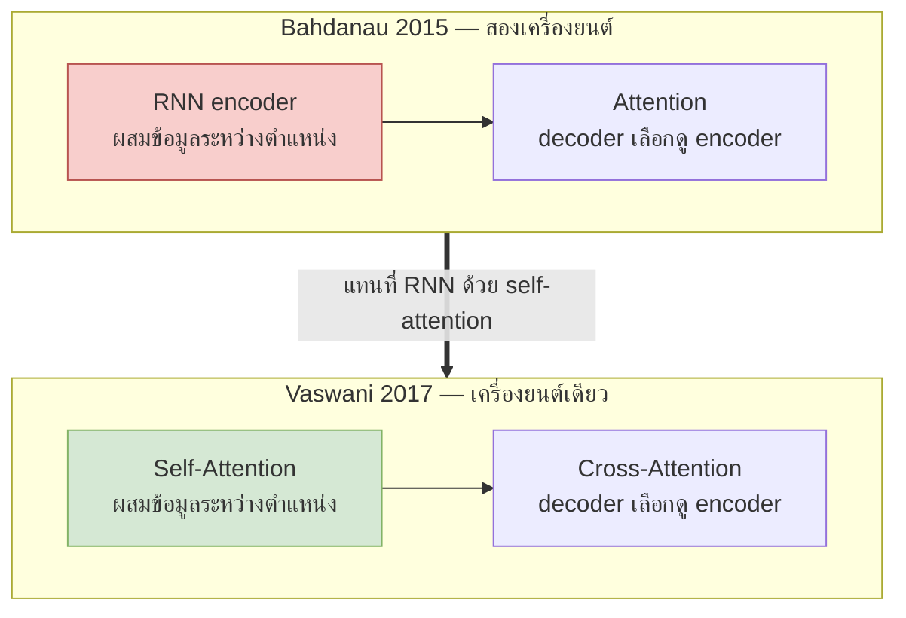
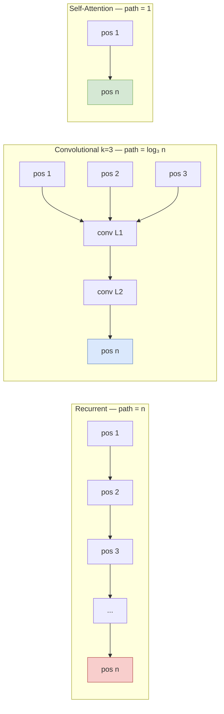
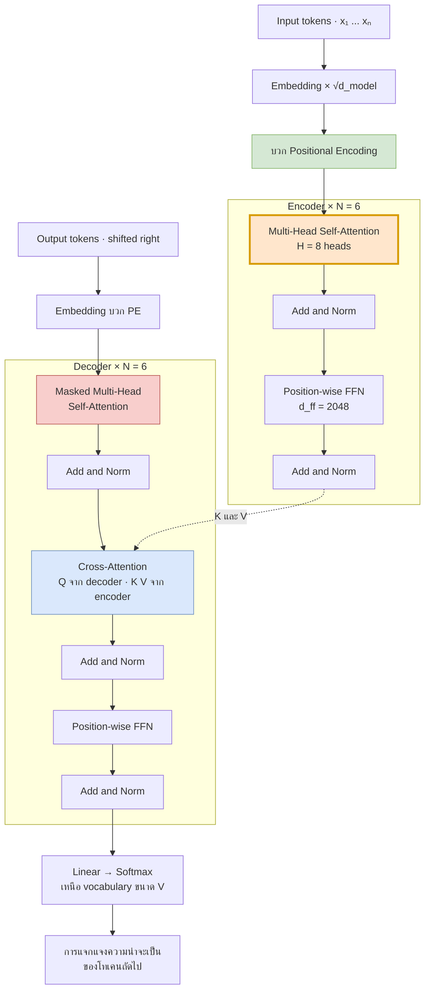
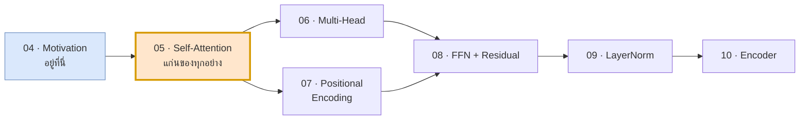

# 04 — ทำไมต้องทิ้ง Recurrence

> **ก่อนหน้า:** [03 — Attention ก่อนยุค Transformer](03-attention-mechanism-origin.md)
> **ถัดไป:** [05 — Scaled Dot-Product Attention](05-self-attention-math.md)

---

## 1. คำถามนำ: ถ้า attention ทำงานได้ดีขนาดนี้ ยังต้องมี RNN ไหม

ในไฟล์ [03](03-attention-mechanism-origin.md) เราเห็นแล้วว่า attention แก้คอขวด context vector ได้จริง
แต่ถ้าดูสถาปัตยกรรมรวมของ Bahdanau seq2seq ให้ดี จะเห็นว่ามันมี **สองเครื่องยนต์ทำงานคู่กัน**

| ส่วนประกอบ | หน้าที่ | ทำงานอย่างไร |
|---|---|---|
| RNN encoder | สร้าง $\mathbf{h}_1 \dots \mathbf{h}_n$ | วนซ้ำตามเวลา — $\mathbf{h}_t$ ต้องรอ $\mathbf{h}_{t-1}$ |
| Attention | เลือกว่าจะดู $\mathbf{h}_j$ ตัวไหน | คำนวณ $n$ คะแนนพร้อมกัน — ขนานได้เต็มที่ |

คำถามที่ Vaswani et al. ตั้งคือ:

> ถ้า attention เป็นตัวที่ให้ decoder "มองเห็นทุกตำแหน่งได้ในก้าวเดียว" อยู่แล้ว
> แล้ว **RNN ยังเหลืองานอะไรให้ทำ**

คำตอบเดียวที่ RNN ยังผูกขาดอยู่คือ **การผสมข้อมูลระหว่างตำแหน่งฝั่ง encoder เอง** — คือการที่ $\mathbf{h}_3$ รู้จัก $x_1$ เพราะข้อมูลไหลผ่าน $\mathbf{h}_1 \to \mathbf{h}_2 \to \mathbf{h}_3$

แต่ถ้าเราให้ encoder ใช้ attention มอง **ตัวมันเอง** ล่ะ? นั่นคือ **self-attention** และงานสุดท้ายของ RNN ก็หายไป



> **สัญชาตญาณ:** RNN คือ "ส่งข่าวแบบต่อ ๆ กันเป็นทอด" ส่วน self-attention คือ "ประชุมพร้อมกันทั้งห้อง" — ถ้าประชุมได้ ก็ไม่ต้องส่งทอด

---

## 2. ข้อเสนอของ Vaswani et al. (2017) — "Attention Is All You Need"

ชื่อเปเปอร์ประกาศข้อเสนอตรง ๆ: **ตัด recurrence และ convolution ทิ้งทั้งหมด เหลือแค่ attention กับ feed-forward**

สิ่งที่ถูกตัดออกและสิ่งที่ใส่เข้ามาแทน:

| ตัดออก | เหตุผล | ใส่อะไรแทน | อธิบายในไฟล์ |
|---|---|---|---|
| RNN recurrence | เป็นคอขวดเชิงเวลา ขนานไม่ได้ | Self-Attention | 05, 06 |
| ลำดับที่มาจาก recurrence "ฟรี ๆ" | หายไปพร้อมกับ RNN | Positional Encoding | 07 |
| ความไม่เชิงเส้นจาก $\tanh$ ในทุก timestep | attention เป็น linear ในตัว $V$ | FFN แบบ position-wise | 08 |
| เส้นทาง gradient จาก cell state | ไม่มี $\mathbf{c}_t$ แล้ว | Residual connection + LayerNorm | 08, 09 |

**ข้ออ้างหลัก 3 ข้อของเปเปอร์:**

1. **ขนานได้เต็มที่** — ทุกตำแหน่งคำนวณพร้อมกันในก้าวเดียว ไม่มีอะไรต้องรอใคร
2. **เส้นทางระหว่างสองตำแหน่งใด ๆ สั้นที่สุดเท่าที่เป็นไปได้** — ยาว 1 ก้าวเสมอ ไม่ว่าจะห่างกันเท่าไร
3. **ต้นทุนต่อเลเยอร์ไม่ได้แพงกว่า** เมื่อ $n$ ยังไม่ยาวเกิน $d_{\text{model}}$

ข้อ 1 กับ 2 คือคำตอบตรง ๆ ต่อข้อจำกัดข้อ 3 และ 4 ใน [ไฟล์ 02](02-seq2seq-limitations.md)
ข้อ 3 คือสิ่งที่ต้องพิสูจน์ด้วยตัวเลข — ซึ่งเป็นเนื้อหาของหัวข้อถัดไป

---

## 3. การวิเคราะห์ความซับซ้อนต่อเลเยอร์ (ตารางที่ 1 ของเปเปอร์)

เปเปอร์เปรียบเทียบ 3 วิธีในการ "ผสมข้อมูลข้ามตำแหน่ง" ด้วย **3 มาตรวัด**

| มาตรวัด | ความหมาย | ทำไมสำคัญ |
|---|---|---|
| Complexity per layer | จำนวนการคูณ-บวก ต่อ 1 เลเยอร์ | ต้นทุนคำนวณรวม |
| Sequential operations | จำนวนขั้นที่ **ต้องทำทีละขั้น** | ตัวชี้ว่าขนานได้แค่ไหน |
| Maximum path length | ระยะทางที่ยาวที่สุดที่ signal ต้องเดินระหว่าง 2 ตำแหน่ง | ตัวชี้ความยากในการเรียน long-range dependency |

> **จุดสำคัญ:** สองคอลัมน์หลังสำคัญกว่าคอลัมน์แรกในทางปฏิบัติ — GPU ทำการคูณเมทริกซ์ใหญ่ ๆ ได้เร็วมาก แต่แก้ปัญหา "ต้องรอผลก่อนหน้า" ไม่ได้เลย

### 3.1 Self-Attention

$$
\text{Attention}(Q,K,V) = \text{softmax}\!\left(\frac{QK^\top}{\sqrt{d_k}}\right)V
$$

| ตัวแปร | มิติ | ต้นทุนการคูณเมทริกซ์ |
|---|---|---|
| $Q, K, V$ | $\mathbb{R}^{n \times d}$ | — |
| $QK^\top$ | $\mathbb{R}^{n \times n}$ | $n \cdot n \cdot d = n^2 d$ |
| $A V$ โดย $A \in \mathbb{R}^{n \times n}$ | $\mathbb{R}^{n \times d}$ | $n \cdot n \cdot d = n^2 d$ |

$$
\boxed{\ \text{Self-Attention:}\quad O(n^2 \cdot d)\ \text{ต่อเลเยอร์}, \quad O(1)\ \text{sequential ops}, \quad O(1)\ \text{max path}\ }
$$

**ทำไม sequential = $O(1)$:** ทั้ง $QK^\top$, softmax และ $AV$ เป็นการดำเนินการเมทริกซ์ก้อนเดียว ไม่มีลูปตามเวลา — ทุกแถวของ $Q$ ประมวลผลพร้อมกัน

**ทำไม max path = $O(1)$:** แถวที่ $i$ ของ output คือผลรวมถ่วงน้ำหนักของ **ทุกแถว** ของ $V$ รวมถึงแถวที่ $j$ ที่ห่างออกไป $|i-j| = n-1$ ตำแหน่ง → ตำแหน่งที่ 1 กับตำแหน่งที่ $n$ ต่อถึงกันด้วย edge เดียว

### 3.2 Recurrent

$$
\mathbf{h}_t = \tanh(\mathbf{h}_{t-1}W_{hh} + \mathbf{x}_t W_{xh} + \mathbf{b})
$$

| การดำเนินการ | มิติ | ต้นทุน |
|---|---|---|
| $\mathbf{h}_{t-1}W_{hh}$ ต่อ 1 timestep | $\mathbb{R}^{1\times d} \times \mathbb{R}^{d\times d}$ | $d^2$ |
| รวม $n$ timesteps | — | $n d^2$ |

$$
\boxed{\ \text{Recurrent:}\quad O(n \cdot d^2)\ \text{ต่อเลเยอร์}, \quad O(n)\ \text{sequential ops}, \quad O(n)\ \text{max path}\ }
$$

**นี่คือจุดตาย:** $O(n)$ ในคอลัมน์ sequential แปลว่าถ้าประโยคยาว 100 คำ GPU ต้องทำ 100 ขั้นเรียงกัน ไม่ว่าจะมีคอร์ว่างกี่พันคอร์ก็ตาม
และ $O(n)$ ในคอลัมน์ max path แปลว่า gradient จากตำแหน่งที่ 100 ต้องเดินย้อน 100 ก้าวไปหาตำแหน่งที่ 1 — ทุกก้าวคือการคูณที่หดหรือขยาย signal

### 3.3 Convolutional

การใช้ 1-D convolution kernel กว้าง $k$ ทับบน sequence

| การดำเนินการ | ต้นทุน |
|---|---|
| ต่อ 1 ตำแหน่ง 1 output channel | $k \cdot d$ |
| $n$ ตำแหน่ง $\times$ $d$ channels | $k \cdot n \cdot d^2$ |

$$
\boxed{\ \text{Convolutional:}\quad O(k \cdot n \cdot d^2)\ \text{ต่อเลเยอร์}, \quad O(1)\ \text{sequential ops}, \quad O(\log_k n)\ \text{max path}\ }
$$

**ทำไม max path เป็น $\log_k n$:** conv เลเยอร์เดียวมองเห็นได้แค่ $k$ ตำแหน่งรอบตัว ต้องซ้อนหลายเลเยอร์ให้ **receptive field** โตขึ้นแบบทวีคูณ ($k \to k^2 \to k^3 \dots$) จึงจะครอบคลุมทั้งประโยค (แบบ dilated convolution)

| $n$ | RNN path | Conv path ที่ $k=3$ | Self-Attn path |
|---|---|---|---|
| 10 | 10 | 3 | **1** |
| 100 | 100 | 5 | **1** |
| 512 | 512 | 6 | **1** |
| 1000 | 1000 | 7 | **1** |

*(Conv path = $\lceil \log_3 n \rceil$; เช่น $\log_3 512 = 5.6784 \to 6$)*



### 3.4 จุดคุ้มทุน: เมื่อ $n \lt{} d$ การ attention ถูกกว่า

เทียบพจน์นำของสองวิธีตรง ๆ:

$$
\underbrace{n^2 d}_{\text{self-attention}} \ \ \text{vs} \ \ \underbrace{n d^2}_{\text{recurrent}}
\qquad\Longrightarrow\qquad
\frac{n^2 d}{n d^2} = \frac{n}{d}
$$

$$
\boxed{\ \text{self-attention ถูกกว่า} \iff n \lt{} d_{\text{model}}\ }
$$

**คำนวณจริงที่ $d_{\text{model}} = 512$** (นับเป็นจำนวนการคูณ-บวก ไม่รวมค่าคงที่)

| $n$ | $n^2 d$ (self-attn) | $n d^2$ (recurrent) | อัตราส่วน SA/RNN | ใครถูกกว่า |
|---:|---:|---:|---:|---|
| 16 | 131,072 | 4,194,304 | 0.0312 | **self-attention** ถูกกว่า 32 เท่า |
| 32 | 524,288 | 8,388,608 | 0.0625 | **self-attention** ถูกกว่า 16 เท่า |
| 64 | 2,097,152 | 16,777,216 | 0.1250 | **self-attention** ถูกกว่า 8 เท่า |
| 128 | 8,388,608 | 33,554,432 | 0.2500 | **self-attention** ถูกกว่า 4 เท่า |
| 256 | 33,554,432 | 67,108,864 | 0.5000 | **self-attention** ถูกกว่า 2 เท่า |
| **512** | **134,217,728** | **134,217,728** | **1.0000** | **เสมอกันพอดี — จุดคุ้มทุน** |
| 1024 | 536,870,912 | 268,435,456 | 2.0000 | recurrent ถูกกว่า 2 เท่า |
| 2048 | 2,147,483,648 | 536,870,912 | 4.0000 | recurrent ถูกกว่า 4 เท่า |
| 4096 | 8,589,934,592 | 1,073,741,824 | 8.0000 | recurrent ถูกกว่า 8 เท่า |

> **จุดสำคัญ:** ประโยคในชุดข้อมูลแปลภาษาปี 2017 (WMT En-De) ส่วนใหญ่ยาวไม่เกิน ~100 โทเคน ซึ่ง **ต่ำกว่าจุดคุ้มทุน 512 อยู่มาก** — ณ ตอนนั้น self-attention จึงถูกกว่าทั้งในเชิงจำนวนการคำนวณ *และ* ในเชิงการขนาน เป็นการชนะสองต่อ

เทียบกับ convolution ก็คล้ายกัน — ที่ $k=3$, $d=512$:

| $n$ | $n^2 d$ (attn) | $k n d^2$ (conv) | อัตราส่วน |
|---:|---:|---:|---:|
| 64 | 2,097,152 | 50,331,648 | 0.0417 |
| 128 | 8,388,608 | 100,663,296 | 0.0833 |
| 512 | 134,217,728 | 402,653,184 | 0.3333 |
| 1024 | 536,870,912 | 805,306,368 | 0.6667 |

conv แพงกว่าเพราะมีตัวคูณ $k$ เกาะอยู่หน้า $nd^2$ — จุดคุ้มทุนของ conv จึงอยู่ที่ $n = k \cdot d = 1536$ ไม่ใช่ 512

```python
d = 512
for n in [64, 128, 256, 512, 1024, 2048]:
    sa = n * n * d          # ← O(n²·d)  self-attention
    rn = n * d * d          # ← O(n·d²)  recurrent
    print(f"n={n:5d}  SA={sa:>14,}  RNN={rn:>14,}  ratio={sa/rn:.4f}")
# n=  512  SA=   134,217,728  RNN=   134,217,728  ratio=1.0000  ← จุดคุ้มทุน
```

---

## 4. ต้นทุนที่ต้องจ่ายแลกมา

ไม่มีอะไรได้มาฟรี — การทิ้ง recurrence มีราคาที่ต้องจ่าย 2 ข้อ

### 4.1 $O(n^2)$ หน่วยความจำ

ปัญหาที่แท้จริงของ self-attention **ไม่ใช่จำนวน FLOPs แต่คือหน่วยความจำ** เพราะเมทริกซ์ $A = \text{softmax}(QK^\top/\sqrt{d_k}) \in \mathbb{R}^{n\times n}$ ต้อง **ถูกเก็บไว้ทั้งก้อน** เพื่อใช้ตอน backward pass

ขนาดจริงที่ fp32 (4 ไบต์ต่อค่า) และ $H = 8$ heads:

| $n$ | $n^2$ | 1 head | $H=8$ heads | $\times N=6$ layers | $\times$ batch 4 |
|---:|---:|---:|---:|---:|---:|
| 128 | 16,384 | 64 KiB | **512 KiB** | 3 MiB | 12 MiB |
| 512 | 262,144 | 1 MiB | **8 MiB** | 48 MiB | 192 MiB |
| 2,048 | 4,194,304 | 16 MiB | **128 MiB** | 768 MiB | 3 GiB |
| 8,192 | 67,108,864 | 256 MiB | **2 GiB** | 12 GiB | 48 GiB |

ค่าดิบเป็นไบต์ของคอลัมน์ $H=8$:

$$
\text{bytes} = H \cdot n^2 \cdot 4
= \begin{cases}
8 \cdot 128^2 \cdot 4 = 524{,}288 & (n=128) \\
8 \cdot 512^2 \cdot 4 = 8{,}388{,}608 & (n=512) \\
8 \cdot 2048^2 \cdot 4 = 134{,}217{,}728 & (n=2048) \\
8 \cdot 8192^2 \cdot 4 = 2{,}147{,}483{,}648 & (n=8192)
\end{cases}
$$

> **สัญชาตญาณ:** สังเกตว่าเพิ่ม $n$ 4 เท่า → หน่วยความจำเพิ่ม **16 เท่า** จาก $n=512$ ไป $n=8192$ (16 เท่า) หน่วยความจำโตจาก 8 MiB เป็น 2 GiB (256 เท่า) — นี่คือกำแพงที่ทำให้ context window ยาว ๆ แพงมหาศาล

```python
import numpy as np

def attn_matrix_bytes(n, H=8, dtype=np.float32):
    """หน่วยความจำของ attention matrix ต่อ 1 layer ต่อ 1 sequence"""
    return H * n * n * np.dtype(dtype).itemsize

for n in [128, 512, 2048, 8192]:
    b = attn_matrix_bytes(n)
    print(f"n={n:5d}  {b:>14,} bytes = {b / 2**20:8.1f} MiB")
# n=  128         524,288 bytes =      0.5 MiB
# n=  512       8,388,608 bytes =      8.0 MiB
# n= 2048     134,217,728 bytes =    128.0 MiB
# n= 8192   2,147,483,648 bytes =   2048.0 MiB
```

```python
import torch
d_model, H, n = 512, 8, 512
x = torch.randn(1, n, d_model)
q = x.view(1, n, H, d_model // H).transpose(1, 2)      # (1, H, n, d_k)
A = torch.softmax(q @ q.transpose(-2, -1) / (d_model // H) ** 0.5, dim=-1)
print(tuple(A.shape), A.element_size() * A.nelement(), "bytes")
# (1, 8, 512, 512) 8388608 bytes   ← ตรงกับตาราง
```

**วิธีบรรเทาที่เกิดขึ้นตามมาภายหลัง** (นอกขอบเขตเอกสารชุดนี้ แต่ควรรู้ว่ามี):

| แนวทาง | ไอเดีย |
|---|---|
| FlashAttention | ไม่เก็บ $A$ ทั้งก้อน — คำนวณเป็น block แล้วรวมผลแบบ online softmax |
| Sparse / Local attention | ให้แต่ละ query มองแค่บางตำแหน่ง → $O(n\sqrt{n})$ หรือ $O(n)$ |
| Linear attention | เขียน softmax เป็น kernel แล้วสลับลำดับการคูณให้เป็น $O(n d^2)$ |

### 4.2 สูญเสียข้อมูลลำดับ → ต้องชดเชยด้วย Positional Encoding

RNN ได้ข้อมูลลำดับมา **ฟรี** เพราะโครงสร้างมันบังคับให้อ่านทีละตัวตามเวลาอยู่แล้ว
พอทิ้ง recurrence ข้อมูลนี้หายไปทันที

พิจารณาสมการ self-attention อีกครั้ง — ไม่มีตัวแปรไหนเลยที่บอกว่า "แถวนี้คือตำแหน่งที่เท่าไร"

$$
\text{Attention}(X) = \text{softmax}\!\left(\frac{(XW^Q)(XW^K)^\top}{\sqrt{d_k}}\right)XW^V
$$

ผลที่ตามมาเป็นทฤษฎีบทเลย: **สลับลำดับแถวของ $X$ แล้ว output ก็สลับตามเป๊ะ ๆ โดยเนื้อหาไม่เปลี่ยน**

$$
\text{Attention}(PX) = P \cdot \text{Attention}(X) \qquad \text{สำหรับ permutation matrix } P \text{ ใด ๆ}
$$

แปลว่าโมเดลมองว่า `"หมากัดคน"` กับ `"คนกัดหมา"` เป็นสิ่งเดียวกัน — จะพิสูจน์ด้วยตัวเลขจริงใน [ไฟล์ 05 §4.1](05-self-attention-math.md)

**ทางแก้:** ฉีดข้อมูลตำแหน่งเข้าไปใน embedding ตั้งแต่ต้น

$$
X' = X_{\text{emb}} + PE, \qquad PE \in \mathbb{R}^{n \times d_{\text{model}}}
$$

รายละเอียดว่าทำไมต้องเป็น sinusoid และทำไมต้อง **บวก** ไม่ใช่ **concat** อยู่ใน [ไฟล์ 07](07-positional-encoding.md)

**สรุปบัญชีกำไรขาดทุน:**

| | RNN seq2seq + attention | Transformer |
|---|---|---|
| Sequential ops | $O(n)$ ❌ | $O(1)$ ✅ |
| Max path length | $O(n)$ ❌ | $O(1)$ ✅ |
| Compute ต่อเลเยอร์ | $O(nd^2)$ | $O(n^2 d)$ — ดีกว่าเมื่อ $n\lt{}d$ ⚠️ |
| Memory | $O(nd)$ ✅ | $O(n^2 H)$ ❌ |
| ข้อมูลลำดับ | มีในตัว ✅ | ต้องใส่เพิ่ม ⚠️ |

---

## 5. แผนผังสถาปัตยกรรมรวม

เมื่อประกอบทุกชิ้นเข้าด้วยกัน จะได้สถาปัตยกรรมนี้ — ทุกบล็อกจะถูกกางในไฟล์ถัด ๆ ไป



### แต่ละบล็อกอธิบายในไฟล์ไหน

| บล็อก | สมการหลัก | อธิบายใน |
|---|---|---|
| Input / Output Embedding | $X = E[\text{tokens}] \cdot \sqrt{d_{\text{model}}}$ | [10 §1](10-encoder-full-pipeline.md) |
| Positional Encoding | $PE_{(pos,2i)} = \sin(pos/10000^{2i/d})$ | [07](07-positional-encoding.md) |
| Scaled Dot-Product Attention | $\text{softmax}(QK^\top/\sqrt{d_k})V$ | [05](05-self-attention-math.md) ← **ไฟล์ถัดไป** |
| Multi-Head Attention | $[\text{head}_1;\dots;\text{head}_H]W^O$ | [06](06-multi-head-attention.md) |
| Masked Self-Attention | $\text{softmax}(QK^\top/\sqrt{d_k} + M)V$ | [11 §2](11-decoder-masked-attention.md) |
| Cross-Attention | $Q$ จาก decoder, $K,V$ จาก encoder | [11 §3](11-decoder-masked-attention.md) |
| Position-wise FFN | $\max(0, \mathbf{x}W_1+\mathbf{b}_1)W_2+\mathbf{b}_2$ | [08 §1](08-feedforward-and-residual.md) |
| Residual connection | $\mathbf{y} = \mathbf{x} + \text{Sublayer}(\mathbf{x})$ | [08 §2](08-feedforward-and-residual.md) |
| Layer Normalization | $\boldsymbol{\gamma}\odot\frac{\mathbf{x}-\mu}{\sqrt{\sigma^2+\epsilon}}+\boldsymbol{\beta}$ | [09](09-layernorm-math.md) |
| Encoder เต็มรูปแบบ | ประกอบทุกอย่างข้างบน | [10](10-encoder-full-pipeline.md) |
| Linear → Softmax + Loss | $\mathcal{L} = -\frac{1}{m}\sum_t \log p(y_t^*\mid\cdot)$ | [12](12-training-objective-backprop.md) |

### ลำดับการอ่านที่เหลือ



---

## 6. สรุปไฟล์นี้

| สิ่งที่ได้ | สมการ / ตัวเลขหลัก |
|---|---|
| Self-Attention complexity | $O(n^2 d)$ ต่อเลเยอร์, sequential $O(1)$, path $O(1)$ |
| Recurrent complexity | $O(n d^2)$ ต่อเลเยอร์, sequential $O(n)$, path $O(n)$ |
| Convolutional complexity | $O(k n d^2)$ ต่อเลเยอร์, sequential $O(1)$, path $O(\log_k n)$ |
| จุดคุ้มทุน | $n^2 d \lt{} n d^2 \iff n \lt{} d_{\text{model}}$ → ที่ $d=512$ คุ้มเมื่อ $n \lt{} 512$ |
| ราคาที่จ่าย 1 | attention matrix $H n^2$ ค่า → ที่ $n=8192$, $H=8$, fp32 = 2 GiB ต่อ layer |
| ราคาที่จ่าย 2 | $\text{Attention}(PX) = P\,\text{Attention}(X)$ → ไม่รู้ลำดับ ต้องใส่ PE |

**สิ่งที่ต้องจำไปไฟล์ถัดไป:**

1. คำสัญญาของ Transformer คือ **sequential ops $= O(1)$** และ **max path length $= O(1)$** — สองตัวนี้คือเหตุผลทั้งหมดที่มันชนะ
2. ราคาคือ $O(n^2)$ memory และการสูญเสียข้อมูลลำดับ
3. ทุกอย่างที่กล่าวมาย่อลงในสมการเดียว ซึ่งเราจะกางมันทีละชิ้นในไฟล์ถัดไป

$$
\text{Attention}(Q,K,V) = \text{softmax}\!\left(\frac{QK^\top}{\sqrt{d_k}}\right)V
$$

---

**ถัดไป:** [05 — Scaled Dot-Product Attention (แก่นของทุกอย่าง)](05-self-attention-math.md)
