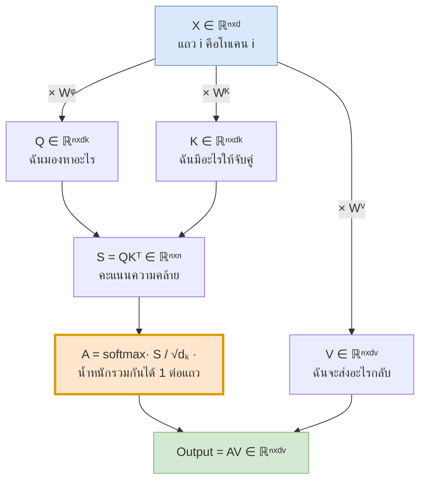
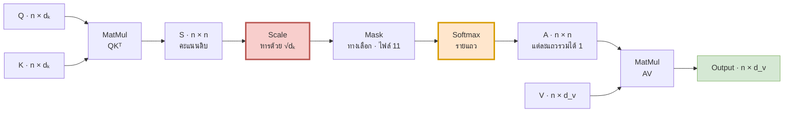
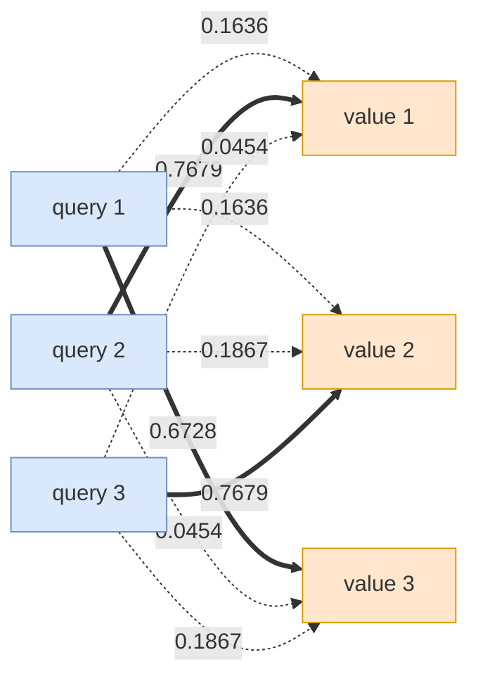
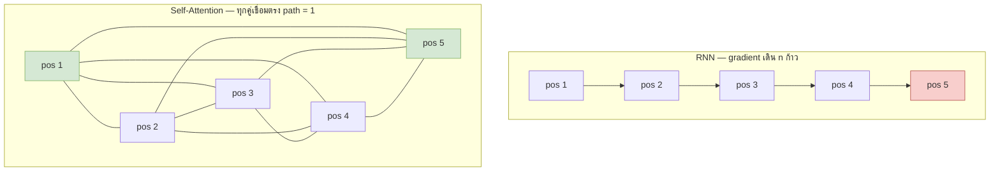
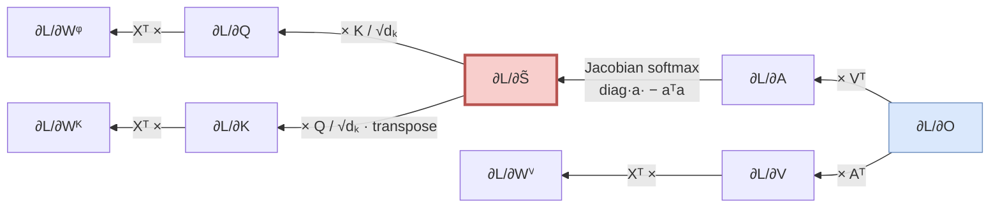

# 05 — Scaled Dot-Product Attention (แก่นของทุกอย่าง)

> **ก่อนหน้า:** [04 — ทำไมต้องทิ้ง Recurrence](04-transformer-motivation.md)
> **ถัดไป:** [06 — Multi-Head Attention](06-multi-head-attention.md)

> **ไฟล์นี้คือแก่นของเอกสารทั้งชุด** ทุกอย่างก่อนหน้านี้คือการอธิบายว่าทำไมต้องมีสมการนี้
> และทุกอย่างหลังจากนี้คือการห่อหุ้ม ขยาย และประกอบสมการนี้เข้าเป็นโมเดล

---

## 1. จาก "ค่าเฉลี่ยถ่วงน้ำหนัก" สู่ Q, K, V

### 1.1 ทำไมต้องแยกบทบาท 3 อย่าง

ใน [ไฟล์ 03-4](03-attention-mechanism-origin.md) เราได้ข้อสรุปว่า attention คือ **ค่าเฉลี่ยถ่วงน้ำหนัก**

$$
\mathbf{c}\_t = \sum\_{j=1}^{n} \alpha\_{tj}\\,\mathbf{h}\_j, \qquad \sum\_j \alpha\_{tj} = 1
$$

โดยน้ำหนัก $\alpha\_{tj}$ มาจากการ "จับคู่" ระหว่างสิ่งที่ decoder ต้องการ ($\mathbf{s}\_{t-1}$) กับสิ่งที่ encoder มี ($\mathbf{h}\_j$)

สังเกตว่าในสูตรนี้ $\mathbf{h}\_j$ ถูกใช้ **สองหน้าที่พร้อมกัน**:

1. ใช้คำนวณคะแนน $e\_{tj}$ — คือทำหน้าที่ "ป้ายชื่อ" ให้ query มาจับคู่
2. ใช้เป็นเนื้อหาที่ถูกถ่วงน้ำหนักออกไป — คือทำหน้าที่ "พัสดุ" ที่ถูกส่งกลับ

**นี่คือข้อจำกัดโดยไม่จำเป็น** — เวกเตอร์เดียวถูกบังคับให้เก่งสองอย่างที่ต้องการคุณสมบัติต่างกัน
เหมือนบังคับให้ "คำค้นในกล่องค้นหา" กับ "เนื้อหาของบทความ" ต้องเป็นข้อความเดียวกัน

Transformer จึงแยกบทบาทออกเป็น **3 บทบาทอิสระ** ด้วยการเรียนรู้ 3 เมทริกซ์ฉายที่ต่างกัน

| บทบาท | สัญลักษณ์ | คำถามที่มันตอบ | คำเทียบจากระบบค้นข้อมูล |
|---|---|---|---|
| **Query** | $Q$ | *"ฉันกำลังมองหาอะไร"* | คำค้นที่พิมพ์ลงกล่องค้นหา |
| **Key** | $K$ | *"ฉันมีอะไรให้จับคู่"* | ป้ายกำกับ / ดัชนีของเอกสาร |
| **Value** | $V$ | *"ถ้าถูกเลือกแล้วฉันจะส่งอะไรกลับ"* | เนื้อหาจริงของเอกสาร |

> **สัญชาตญาณ:** ลองนึกถึงคำว่า `"มัน"` ในประโยค `"แมวไล่หนู เพราะมันหิว"`
> — **Query** ของ `"มัน"` คือ *"ฉันเป็นสรรพนาม ฉันต้องหาคำนามที่เป็นประธาน"*
> — **Key** ของ `"แมว"` คือ *"ฉันเป็นคำนาม เพศ/พจน์แบบนี้ อยู่ตำแหน่งประธาน"*
> — **Value** ของ `"แมว"` คือ *ความหมายเชิงความหมายของแมว* ที่จะถูกส่งกลับไปเติมให้ `"มัน"`
> ถ้าใช้เวกเตอร์เดียวทำทั้งสามอย่าง คุณจะไม่มีทางแยก "เกณฑ์การจับคู่" ออกจาก "เนื้อหาที่จะส่ง" ได้

**คำว่า self ใน self-attention** หมายถึง $Q, K, V$ **มาจากลำดับเดียวกัน** คือ $X$ ตัวเดียว
ต่างจาก cross-attention ในไฟล์ [11-3](11-decoder-masked-attention.md) ที่ $Q$ มาจาก decoder ส่วน $K,V$ มาจาก encoder

### 1.2 การฉาย: $Q = XW^Q$, $K = XW^K$, $V = XW^V$

$$
\boxed{\ Q = XW^Q, \qquad K = XW^K, \qquad V = XW^V\ }
$$

ตารางมิติทุกตัว (ตามข้อตกลง row-major ใน [00-3.4](00-overview.md))

| สัญลักษณ์ | มิติ | ความหมาย | เรียนรู้ได้ไหม |
|---|---|---|---|
| $X$ | $\mathbb{R}^{n \times d\_{\text{model}}}$ | input — แถวที่ $i$ คือ embedding ของโทเคนที่ $i$ | — (มาจากเลเยอร์ก่อน) |
| $W^Q$ | $\mathbb{R}^{d\_{\text{model}} \times d\_k}$ | ฉาย $X$ ไปเป็นคำถาม | ✅ |
| $W^K$ | $\mathbb{R}^{d\_{\text{model}} \times d\_k}$ | ฉาย $X$ ไปเป็นป้ายชื่อ | ✅ |
| $W^V$ | $\mathbb{R}^{d\_{\text{model}} \times d\_v}$ | ฉาย $X$ ไปเป็นเนื้อหา | ✅ |
| $Q$ | $\mathbb{R}^{n \times d\_k}$ | แถวที่ $i$ = $\mathbf{q}\_i$ | — |
| $K$ | $\mathbb{R}^{n \times d\_k}$ | แถวที่ $j$ = $\mathbf{k}\_j$ | — |
| $V$ | $\mathbb{R}^{n \times d\_v}$ | แถวที่ $j$ = $\mathbf{v}\_j$ | — |
| $S = QK^\top$ | $\mathbb{R}^{n \times n}$ | เมทริกซ์คะแนน | — |
| $A = \text{softmax}(S/\sqrt{d\_k})$ | $\mathbb{R}^{n \times n}$ | เมทริกซ์น้ำหนัก | — |
| output $= AV$ | $\mathbb{R}^{n \times d\_v}$ | ผลลัพธ์ | — |

> **จุดสำคัญ 3 ข้อจากตารางนี้:**
> 1. $Q$ กับ $K$ **ต้อง** มีมิติเท่ากัน ($d\_k$) เพราะต้อง dot product กัน — แต่ $V$ ไม่จำเป็น ($d\_v$ อิสระ)
> 2. มิติ $n$ ไม่ปรากฏใน $W$ เลย → **โมเดลรับความยาวเท่าไรก็ได้** ด้วยพารามิเตอร์ชุดเดียว (เหมือน weight sharing ของ RNN ใน [01-2.2](01-seq2seq-rnn-basics.md) แต่ได้มาฟรีกว่า)
> 3. ใน Transformer-base: $d\_{\text{model}}=512$, $H=8$, $d\_k=d\_v=512/8=64$



```python
import numpy as np
n, d_model, d_k, d_v = 5, 512, 64, 64
X  = np.random.randn(n, d_model)          # X ∈ ℝ^{n×d_model}
WQ = np.random.randn(d_model, d_k)        # W^Q ∈ ℝ^{d_model×d_k}
WK = np.random.randn(d_model, d_k)
WV = np.random.randn(d_model, d_v)
Q, K, V = X @ WQ, X @ WK, X @ WV          # ← Q = XW^Q, K = XW^K, V = XW^V
print(Q.shape, K.shape, V.shape)          # (5, 64) (5, 64) (5, 64)
```

---

## 2. Scaled Dot-Product Attention

### 2.1 สมการเต็ม

$$
\boxed{\ \text{Attention}(Q, K, V) = \text{softmax}\\!\left(\frac{QK^\top}{\sqrt{d\_k}}\right)V\ }
$$

สมการเดียวนี้แทนที่ทั้ง RNN encoder และกลไก attention แบบ Bahdanau — และแตกออกได้เป็น 4 ขั้นชัดเจน



| ขั้น | การดำเนินการ | มิติเข้า → ออก | อธิบายใน |
|---|---|---|---|
| 1 | $S = QK^\top$ | $(n\times d\_k),(n\times d\_k) \to (n\times n)$ | §2.2 |
| 2 | $\tilde{S} = S/\sqrt{d\_k}$ | $(n\times n) \to (n\times n)$ | §2.3 |
| 3 | $A = \text{softmax}\_{\text{row}}(\tilde{S})$ | $(n\times n) \to (n\times n)$ | §2.4 |
| 4 | $O = AV$ | $(n\times n),(n\times d\_v) \to (n\times d\_v)$ | §2.5 |

### 2.2 ขั้นที่ 1 — เมทริกซ์คะแนน $S = QK^\top$

$$
S = QK^\top \in \mathbb{R}^{n\times n}, \qquad
S\_{ij} = \mathbf{q}\_i \cdot \mathbf{k}\_j^\top = \sum\_{c=1}^{d\_k} q\_{ic}\\,k\_{jc}
$$

**ความหมายของแต่ละช่อง:**

$$
S\_{ij} = \text{"query ที่ตำแหน่ง } i \text{ เข้ากันได้ดีแค่ไหนกับ key ที่ตำแหน่ง } j\text{"}
$$

| อ่านตาม | ได้อะไร |
|---|---|
| **แถวที่ $i$** | คะแนนของ query $i$ เทียบกับ key ทั้ง $n$ ตัว → หลัง softmax จะกลายเป็น "โทเคน $i$ สนใจใครบ้าง" |
| **คอลัมน์ที่ $j$** | คะแนนที่ key $j$ ได้รับจาก query ทั้ง $n$ ตัว → "โทเคน $j$ ถูกใครสนใจบ้าง" |
| **เส้นทแยงมุม $S\_{ii}$** | โทเคนเทียบกับตัวเอง — มักจะสูง แต่ไม่จำเป็นเสมอไป |

> **สัญชาตญาณ — ทำไม dot product ถึงวัดความคล้ายได้:**
> $\mathbf{q}\cdot\mathbf{k} = \\|\mathbf{q}\\|\\|\mathbf{k}\\|\cos\theta$ — ยิ่งสองเวกเตอร์ชี้ไปทางเดียวกัน ($\theta$ เล็ก) ค่ายิ่งบวกมาก
> แต่สังเกตว่ามันแปรตาม **ขนาด** ของเวกเตอร์ด้วย ไม่ใช่แค่ทิศทาง — ข้อเท็จจริงนี้จะกลายเป็นปัญหาใน §2.3 ทันที

**ทำไมไม่ใช้ additive attention แบบ Bahdanau:** $e\_{ij} = \mathbf{v}^\top\tanh(\mathbf{q}\_iW\_s + \mathbf{k}\_jW\_h)$ ต้องคำนวณทีละคู่ $(i,j)$ ผ่าน MLP → เขียนเป็นการคูณเมทริกซ์ก้อนเดียวไม่ได้
ส่วน dot product คือ `matmul` ตัวเดียว ซึ่ง GPU ทำได้เร็วกว่ามาก แม้ complexity เชิงทฤษฎีจะใกล้กัน

### 2.3 ขั้นที่ 2 — ทำไมต้องหาร $\sqrt{d\_k}$

นี่เป็นรายละเอียดที่ดูเล็กที่สุดในสมการ แต่ถ้าตัดออก **โมเดลจะเทรนไม่ขึ้นเลย**

#### ผลลัพธ์เชิงสถิติ

สมมติ $\mathbf{q}$ และ $\mathbf{k}$ มีสมาชิกเป็น i.i.d. mean $0$ variance $1$ แล้ว

$$
\boxed{\ \mathbb{E}[\mathbf{q}\cdot\mathbf{k}] = 0, \qquad \text{Var}(\mathbf{q}\cdot\mathbf{k}) = d\_k
\quad\Longrightarrow\quad \text{sd} = \sqrt{d\_k}\ }
$$

> **สัญชาตญาณ (ไม่ต้องกาง algebra):** dot product คือ **ผลรวมของ $d\_k$ พจน์อิสระ** $q\_c k\_c$ แต่ละพจน์มี mean 0 และ variance 1
> variance ของผลรวมตัวแปรอิสระ = ผลรวมของ variance → $d\_k \times 1 = d\_k$
> ส่วนเบี่ยงเบนมาตรฐานจึงโตแบบ $\sqrt{d\_k}$ ไม่ใช่ $d\_k$ — **การหารด้วย $\sqrt{d\_k}$ คือการ normalize ให้ variance กลับมาเป็น 1 พอดี**

ที่ $d\_k = 64$ ในโมเดลจริง → sd ของคะแนนดิบ $= \sqrt{64} = 8$

**ยืนยันด้วยการสุ่มจริง 200,000 คู่:**

| ปริมาณ | ค่าทฤษฎี | ค่าที่วัดได้ |
|---|---|---|
| $\mathbb{E}[\mathbf{q}\cdot\mathbf{k}]$ | 0 | **0.0139** |
| $\text{Var}(\mathbf{q}\cdot\mathbf{k})$ | $d\_k = 64$ | **63.9856** |
| $\text{sd}$ | $\sqrt{d\_k} = 8.0$ | **7.9991** |

```python
import numpy as np
np.random.seed(0)
d_k, N = 64, 200_000
q = np.random.randn(N, d_k)          # q ~ N(0,1) แต่ละสมาชิกอิสระ
k = np.random.randn(N, d_k)
dots = (q * k).sum(axis=1)           # ← q·k ทีละคู่
print(round(dots.mean(), 4), round(dots.var(), 4), round(dots.std(), 4))
# 0.0139 63.9856 7.9991      ← ตรงกับ 0, d_k=64, √64=8
```

#### ทำไม variance สูงถึงเป็นปัญหา: softmax saturation

softmax ไม่สนใจค่าสัมบูรณ์ แต่สนใจ **ระยะห่างระหว่างคะแนน** — และระยะห่างนั้นแปรตาม sd โดยตรง

$$
\frac{e^{z\_{\max}}}{\sum\_j e^{z\_j}} \longrightarrow 1 \quad \text{เมื่อ } z\_{\max} - z\_{\text{รองลงมา}} \text{ โตขึ้น}
$$

ถ้า sd $=8$ ความต่างระหว่างคะแนนสูงสุดกับตัวอื่นมักอยู่ระดับ 10–20 ซึ่ง $e^{15} \approx 3.3\times10^6$ — softmax จึงกลายเป็น **one-hot เกือบสมบูรณ์**

ผลที่ตามมาคือ **gradient เกือบศูนย์** เพราะ Jacobian ของ softmax คือ $\text{diag}(\mathbf{p}) - \mathbf{p}^\top\mathbf{p}$ (ดู §5.1)
เมื่อ $\mathbf{p}$ เป็น one-hot → $p\_i(1-p\_i) \approx 0$ ทุกตัว → Jacobian ยุบเป็นศูนย์ → เรียนอะไรไม่ได้เลย

#### การทดลองความคิด: เทียบ softmax ที่ scale ต่างกัน

ใช้ query 1 ตัวเทียบกับ key $n=8$ ตัว ที่ $d\_k=64$ ทั้งหมดสุ่มจาก $\mathcal{N}(0,1)$

| $j$ | คะแนนดิบ $S\_j$ | หลังหาร $\sqrt{64}=8$ | $A\_j$ **ไม่หาร** (sd≈8) | $A\_j$ **หาร** (sd≈1) |
|---:|---:|---:|---:|---:|
| 1 | 1.1820 | 0.1477 | 0.0000 | 0.0619 |
| 2 | −1.2591 | −0.1574 | 0.0000 | 0.0456 |
| 3 | −2.2594 | −0.2824 | 0.0000 | 0.0403 |
| 4 | −7.1091 | −0.8886 | 0.0000 | 0.0220 |
| 5 | **16.8750** | **2.1094** | **0.9776** | **0.4401** |
| 6 | −9.8224 | −1.2278 | 0.0000 | 0.0156 |
| 7 | 5.0182 | 0.6273 | 0.0000 | 0.1000 |
| 8 | 13.0998 | 1.6375 | 0.0224 | 0.2746 |

*(ค่า 0.0000 ในคอลัมน์ "ไม่หาร" ไม่ใช่ศูนย์จริง เช่นแถวที่ 4 คือ $3.750\times10^{-11}$ และแถวที่ 6 คือ $2.487\times10^{-12}$)*

สรุปเชิงตัวเลข:

| ตัววัด | ไม่หาร $\sqrt{d\_k}$ | หาร $\sqrt{d\_k}$ | ค่าอ้างอิง |
|---|---:|---:|---|
| sd ของคะแนน | 8.7016 | 1.0877 | — |
| น้ำหนักสูงสุด $\max\_j A\_j$ | **0.9776** | **0.4401** | uniform = 0.125 |
| entropy ของการแจกแจง | 0.1074 | 1.5376 | uniform = $\ln 8$ = 2.0794 |
| $\\|J\_{\text{softmax}}\\|\_F$ | **0.0438** | **0.3939** | — |
| $\max\_{ij}\\|J\_{ij}\\|$ | 0.0219 | 0.2464 | — |

$$
\frac{\\|J\\|\_F \text{ ที่หาร}}{\\|J\\|\_F \text{ ที่ไม่หาร}} = \frac{0.3939}{0.0438} \approx 8.99
$$

> **จุดสำคัญ:** การหารด้วย $\sqrt{d\_k}$ ทำให้ **gradient ใหญ่ขึ้นเกือบ 9 เท่า** ในตัวอย่างนี้
> และยิ่ง $d\_k$ ใหญ่ ช่องว่างยิ่งถ่างขึ้น — นี่คือเหตุผลทั้งหมดของเครื่องหมายหารตัวเดียวในสมการ

```python
import numpy as np
np.random.seed(42)
d_k, n = 64, 8
def softmax(z):
    z = z - z.max(); e = np.exp(z); return e / e.sum()

q1 = np.random.randn(d_k)
K1 = np.random.randn(n, d_k)
raw = K1 @ q1                                   # คะแนนดิบ  sd ≈ √d_k = 8
p_unscaled = softmax(raw)                       # ← ไม่หาร
p_scaled   = softmax(raw / np.sqrt(d_k))        # ← หาร √dₖ

jac = lambda p: np.diag(p) - np.outer(p, p)     # Jacobian ของ softmax (§5.1)
print(round(p_unscaled.max(), 4), round(p_scaled.max(), 4))
# 0.9776 0.4401
print(round(np.linalg.norm(jac(p_unscaled)), 4),
      round(np.linalg.norm(jac(p_scaled)), 4))
# 0.0438 0.3939      ← ต่างกัน ~9 เท่า
```

### 2.4 ขั้นที่ 3 — Softmax แบบแถว (row-wise)

$$
A\_{ij} = \text{softmax}(\tilde{\mathbf{s}}\_i)\_j = \frac{\exp(\tilde{S}\_{ij})}{\sum\_{j'=1}^{n}\exp(\tilde{S}\_{ij'})}
$$

**สำคัญที่สุด: softmax ทำ "ตามแถว" ไม่ใช่ทั้งเมทริกซ์** — ในโค้ดคือ `axis=-1` / `dim=-1`

| ทำ softmax ตาม | ความหมาย | ถูกต้องไหม |
|---|---|---|
| **แถว** (`dim=-1`) | "query $i$ กระจายความสนใจ 100% ไปยัง key ต่าง ๆ อย่างไร" | ✅ ถูก |
| คอลัมน์ (`dim=-2`) | "key $j$ ถูกแบ่งความสนใจอย่างไร" | ❌ ผิด — ทำให้บาง query ได้น้ำหนักรวมไม่ถึง 1 |
| ทั้งเมทริกซ์ | ทุกช่องในเมทริกซ์รวมกันได้ 1 | ❌ ผิด — output จะหดตัวตาม $n$ |

**คุณสมบัติที่จะใช้ต่อ:**

| คุณสมบัติ | สมการ | ใช้ที่ไหน |
|---|---|---|
| เป็นบวกเสมอ | $A\_{ij} {>} 0$ | §4.3 convex combination |
| รวมกันได้ 1 ต่อแถว | $\sum\_j A\_{ij} = 1$ | §4.3 |
| ไม่แปรตามการบวกค่าคงที่ | $\text{softmax}(\mathbf{z}+c) = \text{softmax}(\mathbf{z})$ | เสถียรภาพเชิงตัวเลข |
| แปรตามการคูณสเกล | $\text{softmax}(\beta\mathbf{z})$ คมขึ้นเมื่อ $\beta$ โต | §2.3 เหตุผลของ $\sqrt{d\_k}$ |
| $-\infty$ → น้ำหนัก 0 | $\exp(-\infty)=0$ | masking ในไฟล์ 11 |

#### เสถียรภาพเชิงตัวเลข — ทำไมต้องลบ max

$e^{800}$ ล้นขอบเขต `float32` ทันที (ค่าสูงสุด $\approx 3.4\times10^{38}$ ซึ่งคือราว $e^{88}$)
ใช้คุณสมบัติ "ไม่แปรตามการบวกค่าคงที่" โดยเลือก $c = -\max\_j \tilde{S}\_{ij}$

$$
A\_{ij} = \frac{\exp(\tilde{S}\_{ij} - \max\_{j'}\tilde{S}\_{ij'})}{\sum\_{j'}\exp(\tilde{S}\_{ij'} - \max\_{j''}\tilde{S}\_{ij''})}
$$

หลังลบ max แล้ว เลขชี้กำลังทุกตัวจะ $\le 0$ → $\exp$ อยู่ในช่วง $(0, 1]$ → ล้นไม่ได้อีก
และตัวส่วนมีพจน์ที่เท่ากับ $\exp(0)=1$ เสมอ → หารด้วยศูนย์ก็ไม่ได้

```python
import numpy as np
def softmax(z, axis=-1):
    z = z - z.max(axis=axis, keepdims=True)     # ← เคล็ดลบ max
    e = np.exp(z)
    return e / e.sum(axis=axis, keepdims=True)

big = np.array([1000., 1001., 1002.])
print(np.exp(big))          # [inf inf inf]           ← overflow
print(np.round(softmax(big), 4))   # [0.09   0.2447 0.6652]  ← ปลอดภัย
```

### 2.5 ขั้นที่ 4 — คูณด้วย $V$

$$
O = AV \in \mathbb{R}^{n\times d\_v}, \qquad
\mathbf{o}\_i = \sum\_{j=1}^{n} A\_{ij}\\,\mathbf{v}\_j
$$

เพราะ $A\_{ij} {>} 0$ และ $\sum\_j A\_{ij} = 1$ แถวที่ $i$ ของ output จึงเป็น **convex combination ของแถวใน $V$**

$$
\boxed{\ \mathbf{o}\_i \in \text{conv}\\{\mathbf{v}\_1, \dots, \mathbf{v}\_n\\}\ }
$$

> **สัญชาตญาณ:** output ของ attention **ไม่เคยหลุดออกนอกกล่อง** ที่ value ทั้งหมดล้อมไว้
> มันเป็นแค่การ "ผสม" ข้อมูลที่มีอยู่แล้ว ไม่ใช่การสร้างข้อมูลใหม่
> — นี่คือเหตุผลว่าทำไม Transformer **ต้องมี FFN** ต่อท้ายทุกบล็อก ([ไฟล์ 08](08-feedforward-and-residual.md))
> เพราะ attention เพียงอย่างเดียวเป็น **linear ในตัว $V$** ความสามารถในการแปลงข้อมูลจึงจำกัด

---

## 3. เดินตัวเลขเต็มรูปแบบ

กำหนด $n = 3$, $d\_{\text{model}} = 4$, $d\_k = d\_v = 2$ — ตัวเลขทุกตัวข้างล่างนี้มาจากการรัน Python จริง (ปัดทศนิยม 4 ตำแหน่ง)

### 3.1 Input $X \in \mathbb{R}^{3\times 4}$

| | $c\_1$ | $c\_2$ | $c\_3$ | $c\_4$ |
|---|---:|---:|---:|---:|
| $\mathbf{x}\_1$ | 1 | 0 | 1 | 0 |
| $\mathbf{x}\_2$ | 0 | 1 | 1 | 0 |
| $\mathbf{x}\_3$ | 1 | 1 | 0 | 1 |

### 3.2 เมทริกซ์ฉายทั้งสาม

$W^Q, W^K, W^V \in \mathbb{R}^{4\times 2}$

| แถว | $W^Q$ | $W^K$ | $W^V$ |
|---|---|---|---|
| 1 | $[\ 1,\ \ 1]$ | $[\ 0,\ -1]$ | $[-1,\ -1]$ |
| 2 | $[-1,\ \ 0]$ | $[\ 0,\ \ 1]$ | $[\ 0,\ \ 1]$ |
| 3 | $[\ 0,\ -1]$ | $[-1,\ -1]$ | $[\ 1,\ \ 0]$ |
| 4 | $[-1,\ \ 1]$ | $[\ 1,\ \ 0]$ | $[\ 0,\ \ 1]$ |

### 3.3 การฉาย → $Q$, $K$, $V$

เพราะ $X$ เป็น 0/1 การคูณจึงกลายเป็น "บวกแถวของ $W$ ที่ตรงกับตำแหน่งที่เป็น 1"

$$
\mathbf{q}\_1 = \mathbf{x}\_1 W^Q = W^Q\_{1,:} + W^Q\_{3,:} = [1,1] + [0,-1] = [1,\ 0]
$$

$$
\mathbf{q}\_3 = W^Q\_{1,:} + W^Q\_{2,:} + W^Q\_{4,:} = [1,1] + [-1,0] + [-1,1] = [-1,\ 2]
$$

ผลลัพธ์ทั้งหมด:

**$Q = XW^Q \in \mathbb{R}^{3\times2}$**

| | คอลัมน์ 1 | คอลัมน์ 2 |
|---|---:|---:|
| $\mathbf{q}\_1$ | 1 | 0 |
| $\mathbf{q}\_2$ | −1 | −1 |
| $\mathbf{q}\_3$ | −1 | 2 |

**$K = XW^K \in \mathbb{R}^{3\times2}$**

| | คอลัมน์ 1 | คอลัมน์ 2 |
|---|---:|---:|
| $\mathbf{k}\_1$ | −1 | −2 |
| $\mathbf{k}\_2$ | −1 | 0 |
| $\mathbf{k}\_3$ | 1 | 0 |

**$V = XW^V \in \mathbb{R}^{3\times2}$**

| | คอลัมน์ 1 | คอลัมน์ 2 |
|---|---:|---:|
| $\mathbf{v}\_1$ | 0 | −1 |
| $\mathbf{v}\_2$ | 1 | 1 |
| $\mathbf{v}\_3$ | −1 | 1 |

### 3.4 เมทริกซ์คะแนน $S = QK^\top \in \mathbb{R}^{3\times3}$

ตัวอย่างการคำนวณ 2 ช่อง:

$$
S\_{21} = \mathbf{q}\_2\cdot\mathbf{k}\_1 = (-1)(-1) + (-1)(-2) = 1 + 2 = 3
$$

$$
S\_{31} = \mathbf{q}\_3\cdot\mathbf{k}\_1 = (-1)(-1) + (2)(-2) = 1 - 4 = -3
$$

**$S$ เต็ม** *(แถว = query, คอลัมน์ = key)*

| $S$ | $\mathbf{k}\_1$ | $\mathbf{k}\_2$ | $\mathbf{k}\_3$ |
|---|---:|---:|---:|
| $\mathbf{q}\_1$ | −1 | −1 | **1** |
| $\mathbf{q}\_2$ | **3** | 1 | −1 |
| $\mathbf{q}\_3$ | −3 | **1** | −1 |

### 3.5 หารด้วย $\sqrt{d\_k} = \sqrt{2} = 1.4142$

**$\tilde{S} = S/\sqrt{2}$**

| $\tilde{S}$ | $\mathbf{k}\_1$ | $\mathbf{k}\_2$ | $\mathbf{k}\_3$ |
|---|---:|---:|---:|
| $\mathbf{q}\_1$ | −0.7071 | −0.7071 | **0.7071** |
| $\mathbf{q}\_2$ | **2.1213** | 0.7071 | −0.7071 |
| $\mathbf{q}\_3$ | −2.1213 | **0.7071** | −0.7071 |

### 3.6 Softmax รายแถว → $A$

กางแถวที่ 1 ให้เห็นทุกขั้น (ใช้เคล็ดลบ max จาก §2.4):

| ขั้น | $j=1$ | $j=2$ | $j=3$ |
|---|---:|---:|---:|
| $\tilde{S}\_{1j}$ | −0.7071 | −0.7071 | 0.7071 |
| ลบ max $=0.7071$ | −1.4142 | −1.4142 | 0.0000 |
| $\exp(\cdot)$ | 0.2431 | 0.2431 | 1.0000 |
| หารด้วยผลรวม $=1.4862$ | **0.1636** | **0.1636** | **0.6728** |

แถวที่ 2: $\exp$ ได้ $[1.0000,\ 0.2431,\ 0.0591]$ ผลรวม $= 1.3022$
แถวที่ 3: $\exp$ ได้ $[0.0591,\ 1.0000,\ 0.2431]$ ผลรวม $= 1.3022$

**$A = \text{softmax}\_{\text{row}}(\tilde{S})$**

| $A$ | ดู $\mathbf{v}\_1$ | ดู $\mathbf{v}\_2$ | ดู $\mathbf{v}\_3$ | รวม |
|---|---:|---:|---:|---:|
| โทเคน 1 | 0.1636 | 0.1636 | **0.6728** | 1.0000 |
| โทเคน 2 | **0.7679** | 0.1867 | 0.0454 | 1.0000 |
| โทเคน 3 | 0.0454 | **0.7679** | 0.1867 | 1.0000 |

### 3.7 การตีความ $A$ แบบแผนที่ความร้อน

อ่านตารางข้างบนเป็นกราฟ "ใครมองใคร" — เส้นหนา = น้ำหนักสูง



| อ่านอย่างไร | ผลจากตัวอย่างนี้ |
|---|---|
| แถวสว่างตรงไหน = โทเคนนั้นสนใจใคร | โทเคน 1 → โทเคน 3, โทเคน 2 → โทเคน 1, โทเคน 3 → โทเคน 2 |
| แถวที่กระจายเรียบ = "ไม่รู้จะดูใคร" | ไม่มีในตัวอย่างนี้ (ทุกแถวมีตัวชนะชัดเจน) |
| เส้นทแยงมุมสว่าง = โทเคนสนใจตัวเอง | **ไม่ใช่ในตัวอย่างนี้** — ทุกโทเคนมองไปที่โทเคนอื่น |
| คอลัมน์สว่างทั้งคอลัมน์ | โทเคนนั้นเป็น "ศูนย์กลางความสนใจ" (ในโมเดลจริงมักเป็นเครื่องหมายวรรคตอนหรือ token พิเศษ) |

### 3.8 คูณด้วย $V$ → Output

$$
\mathbf{o}\_1 = 0.1636\\,[0,-1] + 0.1636\\,[1,1] + 0.6728\\,[-1,1] = [-0.5093,\ 0.6728]
$$

$$
\mathbf{o}\_2 = 0.7679\\,[0,-1] + 0.1867\\,[1,1] + 0.0454\\,[-1,1] = [0.1413,\ -0.5358]
$$

$$
\mathbf{o}\_3 = 0.0454\\,[0,-1] + 0.7679\\,[1,1] + 0.1867\\,[-1,1] = [0.5812,\ 0.9092]
$$

**$O = AV \in \mathbb{R}^{3\times2}$**

| | คอลัมน์ 1 | คอลัมน์ 2 |
|---|---:|---:|
| $\mathbf{o}\_1$ | −0.5093 | 0.6728 |
| $\mathbf{o}\_2$ | 0.1413 | −0.5358 |
| $\mathbf{o}\_3$ | 0.5812 | 0.9092 |

**ตรวจสอบ convex hull:** ค่าใน $V$ อยู่ในช่วง $[-1, 1]$ ทั้งสองคอลัมน์
ค่าใน $O$ อยู่ในช่วง $[-0.5093,\ 0.5812]$ และ $[-0.5358,\ 0.9092]$ — **อยู่ข้างในทั้งหมด** ✅ ตรงกับ §2.5

### 3.9 โค้ดตรวจสอบทั้ง pipeline

**NumPy — implementation เต็ม**

```python
import numpy as np

def softmax(z, axis=-1):
    z = z - z.max(axis=axis, keepdims=True)          # เสถียรภาพเชิงตัวเลข (§2.4)
    e = np.exp(z)
    return e / e.sum(axis=axis, keepdims=True)

def scaled_dot_product_attention(Q, K, V, mask=None):
    """Attention(Q,K,V) = softmax(QKᵀ / √dₖ) V"""
    d_k = Q.shape[-1]
    S = Q @ np.swapaxes(K, -1, -2)                   # ขั้น 1: S = QKᵀ        (§2.2)
    S = S / np.sqrt(d_k)                             # ขั้น 2: หาร √dₖ        (§2.3)
    if mask is not None:
        S = np.where(mask, S, -np.inf)               # (ทางเลือก) mask → ไฟล์ 11
    A = softmax(S, axis=-1)                          # ขั้น 3: softmax รายแถว  (§2.4)
    return A @ V, A                                  # ขั้น 4: O = AV          (§2.5)

X  = np.array([[1., 0., 1., 0.],
               [0., 1., 1., 0.],
               [1., 1., 0., 1.]])
WQ = np.array([[ 1., 1.], [-1., 0.], [ 0., -1.], [-1., 1.]])
WK = np.array([[ 0.,-1.], [ 0., 1.], [-1., -1.], [ 1., 0.]])
WV = np.array([[-1.,-1.], [ 0., 1.], [ 1.,  0.], [ 0., 1.]])

O, A = scaled_dot_product_attention(X @ WQ, X @ WK, X @ WV)
print(np.round(A, 4))
# [[0.1636 0.1636 0.6728]
#  [0.7679 0.1867 0.0454]
#  [0.0454 0.7679 0.1867]]
print(np.round(O, 4))
# [[-0.5093  0.6728]
#  [ 0.1413 -0.5358]
#  [ 0.5812  0.9092]]
```

**PyTorch — implementation เต็ม แล้วเทียบกับของในไลบรารี**

```python
import math, torch, torch.nn.functional as F

def scaled_dot_product_attention(Q, K, V, mask=None):
    d_k = Q.size(-1)
    scores = Q @ K.transpose(-2, -1) / math.sqrt(d_k)      # ขั้น 1 + 2
    if mask is not None:
        scores = scores.masked_fill(mask == 0, float('-inf'))
    A = torch.softmax(scores, dim=-1)                      # ขั้น 3  ← dim=-1 คือ "รายแถว"
    return A @ V, A                                        # ขั้น 4

X  = torch.tensor([[1., 0., 1., 0.],
                   [0., 1., 1., 0.],
                   [1., 1., 0., 1.]])
WQ = torch.tensor([[ 1., 1.], [-1., 0.], [ 0., -1.], [-1., 1.]])
WK = torch.tensor([[ 0.,-1.], [ 0., 1.], [-1., -1.], [ 1., 0.]])
WV = torch.tensor([[-1.,-1.], [ 0., 1.], [ 1.,  0.], [ 0., 1.]])
Q, K, V = X @ WQ, X @ WK, X @ WV

out_mine, A = scaled_dot_product_attention(Q, K, V)
out_torch   = F.scaled_dot_product_attention(Q, K, V)      # ← ของในไลบรารี

print(out_mine)
# tensor([[-0.5093,  0.6728],
#         [ 0.1413, -0.5358],
#         [ 0.5812,  0.9092]])
print(torch.allclose(out_mine, out_torch, atol=1e-6))      # True
print(float((out_mine - out_torch).abs().max()))           # 5.96e-08  ← ต่างแค่ floating point
```

> **หมายเหตุ:** `F.scaled_dot_product_attention` หารด้วย $\sqrt{d\_k}$ ให้อัตโนมัติ และไม่คืนเมทริกซ์ $A$ ออกมา
> (เพราะ backend อย่าง FlashAttention ไม่ได้สร้าง $A$ ทั้งก้อนขึ้นมาจริง ๆ — ดู [04-4.1](04-transformer-motivation.md))
> ถ้าต้องการดู attention map เพื่อ visualize ต้องเขียนเวอร์ชันของตัวเอง

---

## 4. คุณสมบัติเชิงคณิตศาสตร์ที่สำคัญ

### 4.1 Permutation Equivariance

$$
\boxed{\ \text{Attention}(PX) = P\\,\text{Attention}(X)\ }
\qquad \text{สำหรับ permutation matrix } P \text{ ใด ๆ}
$$

และในระดับเมทริกซ์น้ำหนัก: $A(PX) = P\\,A(X)\\,P^\top$

> **สัญชาตญาณ:** ในสมการทั้งหมดไม่มีที่ไหนเลยที่ดัชนี $i$ หรือ $j$ ปรากฏเป็น *ค่า* — มันปรากฏแค่เป็น *ป้ายกำกับ*
> $S\_{ij}$ ขึ้นกับ $\mathbf{x}\_i$ กับ $\mathbf{x}\_j$ เท่านั้น ไม่ขึ้นกับว่าใครมาก่อนใคร
> เปรียบเทียบ: attention มองประโยคเป็น **ถุงของโทเคน** ที่มีเส้นเชื่อมถึงกันหมด ไม่ใช่ **แถวเรียง**

#### ยืนยันด้วยตัวเลข

ใช้ $X$ เดิมจาก §3 และ permutation ที่สลับลำดับแถวเป็น $(3, 1, 2)$

$$
P = \begin{bmatrix} 0&0&1 \\\ 1&0&0 \\\ 0&1&0 \end{bmatrix}
\qquad\Longrightarrow\qquad
PX = \begin{bmatrix} 1&1&0&1 \\\ 1&0&1&0 \\\ 0&1&1&0 \end{bmatrix}
$$

รันใหม่ทั้ง pipeline บน $PX$ ได้

**$A(PX)$**

| | | | |
|---:|---:|---:|---:|
| 0.1867 | 0.0454 | **0.7679** | |
| **0.6728** | 0.1636 | 0.1636 | |
| 0.0454 | **0.7679** | 0.1867 | |

ซึ่งเท่ากับ $P A P^\top$ เป๊ะ ๆ (สลับทั้งแถวและคอลัมน์)

**$O(PX)$ เทียบกับ $PO$**

| แถว | $O(PX)$ | $P\\,O$ | ตรงกัน |
|---|---|---|---|
| 1 | $[0.5812,\ 0.9092]$ | $[0.5812,\ 0.9092]$ | ✅ |
| 2 | $[-0.5093,\ 0.6728]$ | $[-0.5093,\ 0.6728]$ | ✅ |
| 3 | $[0.1413,\ -0.5358]$ | $[0.1413,\ -0.5358]$ | ✅ |

**เนื้อหาไม่เปลี่ยนเลย — เปลี่ยนแค่ลำดับที่มันวางอยู่**

```python
P  = np.array([[0., 0., 1.], [1., 0., 0.], [0., 1., 0.]])   # เรียงใหม่เป็น (3,1,2)
Xp = P @ X
Op, Ap = scaled_dot_product_attention(Xp @ WQ, Xp @ WK, Xp @ WV)
print(np.allclose(Op, P @ O))          # True   ← Attention(PX) = P·Attention(X)
print(np.allclose(Ap, P @ A @ P.T))    # True   ← A(PX) = P A Pᵀ
```

#### ทำไมนี่เป็นปัญหา

| ประโยค | $X$ | ผลลัพธ์จาก self-attention |
|---|---|---|
| `"หมา กัด คน"` | $X$ | $O$ |
| `"คน กัด หมา"` | $PX$ | $PO$ — **เวกเตอร์ชุดเดิม แค่สลับที่** |

โมเดลจะแยกสองประโยคนี้ **ไม่ออก** เพราะข้อมูลที่มันเห็นเหมือนกันทุกประการ
งานทางภาษาแทบทุกงานขึ้นกับลำดับ → ต้องฉีดข้อมูลตำแหน่งเข้าไปเอง

$$
X' = X\_{\text{emb}} + PE
$$

เมื่อบวก $PE$ เข้าไป แถวที่ 1 กับแถวที่ 2 จะ **ไม่เหมือนกันอีกต่อไป** แม้โทเคนจะเป็นคำเดียวกัน → permutation equivariance ถูกทำลายอย่างตั้งใจ
รายละเอียดใน [ไฟล์ 07](07-positional-encoding.md)

> **จุดสำคัญ:** permutation equivariance ไม่ใช่ *บั๊ก* แต่เป็น *คุณสมบัติเชิงโครงสร้าง* ที่เกิดจากการตัด recurrence ทิ้ง
> มันคือ "ใบเรียกเก็บเงิน" ที่เราคุยกันใน [04-4.2](04-transformer-motivation.md)

### 4.2 ทุกตำแหน่งเชื่อมถึงกันใน 1 ก้าว

$$
\frac{\partial \mathbf{o}\_i}{\partial \mathbf{v}\_j} = A\_{ij} I \ne 0 \qquad \text{สำหรับทุกคู่ } (i,j)
$$

เพราะ $A\_{ij} {>} 0$ เสมอ (softmax ไม่เคยให้ศูนย์แท้) **ทุกตำแหน่งมีอิทธิพลต่อทุกตำแหน่งโดยตรง**

| สถาปัตยกรรม | จำนวนก้าวจากตำแหน่ง 1 ถึงตำแหน่ง $n$ | จำนวนการคูณที่ gradient ต้องผ่าน |
|---|---|---|
| RNN / LSTM | $n - 1$ | $n-1$ ครั้ง → หด/ระเบิดแบบเลขชี้กำลัง |
| CNN ($k=3$) | $\lceil\log\_3 n\rceil$ | $O(\log n)$ ครั้ง |
| **Self-Attention** | **1** | **1 ครั้ง** |

> **สัญชาตญาณ:** ปัญหา vanishing gradient ใน [ไฟล์ 02](02-seq2seq-limitations.md) เกิดจากผลคูณของอนุพันธ์จำนวนมากตามความยาว
> ถ้าเส้นทางยาว 1 ก้าว ก็ไม่มีผลคูณสะสมให้หดตัวตั้งแต่แรก — **นี่คือการแก้ปัญหาที่ต้นเหตุ ไม่ใช่การบรรเทา**



ราคาที่จ่ายเห็นชัดในภาพ: จำนวนเส้นเชื่อมคือ $\binom{n}{2}$ → **นี่คือที่มาของ $O(n^2)$** ตรง ๆ

### 4.3 แต่ละแถวของ $A$ รวมกันได้ 1 → output อยู่ใน convex hull

$$
\sum\_{j} A\_{ij} = 1,\quad A\_{ij} {>} 0
\qquad\Longrightarrow\qquad
\mathbf{o}\_i = \sum\_j A\_{ij}\mathbf{v}\_j \in \text{conv}\\{\mathbf{v}\_1,\dots,\mathbf{v}\_n\\}
$$

**ผลที่ตามมา 3 ข้อ:**

| ผล | อธิบาย |
|---|---|
| **เสถียรเชิงตัวเลข** | $\\|\mathbf{o}\_i\\| \le \max\_j\\|\mathbf{v}\_j\\|$ — output ไม่มีวันระเบิด ไม่ต้องมี gate แบบ LSTM |
| **attention เป็น linear ในตัว $V$** | ความไม่เชิงเส้นทั้งหมดอยู่ใน softmax ซึ่งกระทำกับ *น้ำหนัก* ไม่ใช่ *เนื้อหา* |
| **ต้องมี FFN ต่อท้าย** | ถ้ามีแต่ attention ซ้อนกัน โมเดลจะแทน "การผสม" ได้เก่งขึ้นแต่แปลงเนื้อหาไม่เป็น → [ไฟล์ 08](08-feedforward-and-residual.md) |

ตรวจสอบกับตัวเลขจาก §3.8:

| | ช่วงของ $V$ | ช่วงของ $O$ | อยู่ข้างใน |
|---|---|---|---|
| คอลัมน์ 1 | $[-1,\ 1]$ | $[-0.5093,\ 0.5812]$ | ✅ |
| คอลัมน์ 2 | $[-1,\ 1]$ | $[-0.5358,\ 0.9092]$ | ✅ |

---

## 5. อนุพันธ์ของ Softmax และ Attention

> ส่วนนี้เตรียมเครื่องมือไว้ใช้ใน [ไฟล์ 12](12-training-objective-backprop.md) — **ระบุผลลัพธ์ + สัญชาตญาณ ไม่พิสูจน์**

### 5.1 Jacobian ของ Softmax

ให้ $\mathbf{p} = \text{softmax}(\mathbf{z})$ โดย $\mathbf{p}, \mathbf{z} \in \mathbb{R}^{1\times n}$ (row vector ตามข้อตกลง)

$$
\boxed{\ J = \frac{\partial \mathbf{p}}{\partial \mathbf{z}} = \text{diag}(\mathbf{p}) - \mathbf{p}^\top\mathbf{p} \in \mathbb{R}^{n\times n}\ }
$$

เขียนทีละช่อง:

$$
J\_{ij} = \frac{\partial p\_i}{\partial z\_j} =
\begin{cases}
p\_i(1 - p\_i) & i = j \\\
-p\_i p\_j & i \ne j
\end{cases}
$$

> **สัญชาตญาณ — ทำไมมี 2 พจน์:** softmax คือเศษส่วน $p\_i = e^{z\_i}/Z$ โดย $Z = \sum\_j e^{z\_j}$
> การเพิ่ม $z\_j$ ส่งผล **สองทาง** พร้อมกัน:
> — **พจน์ $\text{diag}(\mathbf{p})$** มาจากตัวเศษ: เพิ่ม $z\_i$ → $e^{z\_i}$ โตขึ้น → $p\_i$ โตขึ้น (มีเฉพาะเมื่อ $i=j$)
> — **พจน์ $-\mathbf{p}^\top\mathbf{p}$** มาจากตัวส่วน: เพิ่ม $z\_j$ ตัวไหนก็ตาม → $Z$ โตขึ้น → **ทุก** $p\_i$ หดลง
> รวมกันสะท้อนข้อจำกัด $\sum\_i p\_i = 1$ — ใครได้เพิ่ม คนอื่นต้องเสีย เป็นเกมผลรวมคงที่

**คุณสมบัติที่ตามมา:** ทุกแถวและทุกคอลัมน์ของ $J$ รวมกันได้ 0 → $J$ singular เสมอ (มี eigenvalue 0 ในทิศ $\mathbf{1}$) ซึ่งสมเหตุสมผลเพราะ softmax ไม่แปรตามการบวกค่าคงที่ (§2.4)

### 5.2 อนุพันธ์เทียบ $V$, $Q$, $K$ ของบล็อก attention

ให้ $G = \dfrac{\partial \mathcal{L}}{\partial O} \in \mathbb{R}^{n\times d\_v}$ เป็น gradient ที่ไหลย้อนเข้ามา แล้ว

| เทียบกับ | สูตร | มิติ | ที่มา |
|---|---|---|---|
| $V$ | $\dfrac{\partial\mathcal{L}}{\partial V} = A^\top G$ | $n\times d\_v$ | ตรงจาก $O = AV$ |
| $A$ | $\dfrac{\partial\mathcal{L}}{\partial A} = G V^\top$ | $n\times n$ | ตรงจาก $O = AV$ |
| $\tilde{S}$ | $\dfrac{\partial\mathcal{L}}{\partial \tilde{S}} = A \odot \left(\dfrac{\partial\mathcal{L}}{\partial A} - \text{rowsum}\\!\left(\dfrac{\partial\mathcal{L}}{\partial A}\odot A\right)\right)$ | $n\times n$ | Jacobian ของ softmax (§5.1) รายแถว |
| $Q$ | $\dfrac{\partial\mathcal{L}}{\partial Q} = \dfrac{1}{\sqrt{d\_k}}\\,\dfrac{\partial\mathcal{L}}{\partial \tilde{S}}\\,K$ | $n\times d\_k$ | ตรงจาก $\tilde{S} = QK^\top/\sqrt{d\_k}$ |
| $K$ | $\dfrac{\partial\mathcal{L}}{\partial K} = \dfrac{1}{\sqrt{d\_k}}\left(\dfrac{\partial\mathcal{L}}{\partial \tilde{S}}\right)^{\\!\top} Q$ | $n\times d\_k$ | ตรงจาก $\tilde{S} = QK^\top/\sqrt{d\_k}$ |

แถว $\tilde{S}$ คือรูปย่อของ $\left(\frac{\partial\mathcal{L}}{\partial\tilde{\mathbf{s}}\_i}\right) = \left(\frac{\partial\mathcal{L}}{\partial \mathbf{a}\_i}\right) J\_i$ โดย $J\_i = \text{diag}(\mathbf{a}\_i) - \mathbf{a}\_i^\top\mathbf{a}\_i$ — เขียนแบบ element-wise เพื่อไม่ต้องสร้าง Jacobian ขนาด $n\times n$ ต่อแถวจริง ๆ

จากนั้น gradient ไหลต่อไปยังพารามิเตอร์ผ่านการฉาย:

$$
\frac{\partial\mathcal{L}}{\partial W^Q} = X^\top \frac{\partial\mathcal{L}}{\partial Q}, \qquad
\frac{\partial\mathcal{L}}{\partial W^K} = X^\top \frac{\partial\mathcal{L}}{\partial K}, \qquad
\frac{\partial\mathcal{L}}{\partial W^V} = X^\top \frac{\partial\mathcal{L}}{\partial V}
$$

> **สังเกตความสมมาตร:** $Q$ กับ $K$ เข้ามาในสมการแบบสลับกันได้ ($\tilde{S}^\top$ ใช้กับ $Q$, $\tilde{S}$ ใช้กับ $K$)
> นี่สะท้อนว่า $S = QK^\top$ สมมาตรเชิงโครงสร้าง — แต่ **ไม่สมมาตรเชิงค่า** เพราะ $W^Q \ne W^K$



```python
import torch, math
torch.manual_seed(0)
n, d_k = 4, 3
Q = torch.randn(n, d_k, requires_grad=True)
K = torch.randn(n, d_k, requires_grad=True)
V = torch.randn(n, d_k, requires_grad=True)

St = (Q @ K.T) / math.sqrt(d_k)
A  = torch.softmax(St, dim=-1)
O  = A @ V
G  = torch.randn(n, d_k)                      # ∂L/∂O สมมติขึ้นมา
O.backward(G)

with torch.no_grad():                          # คำนวณมือตามตารางข้างบน
    dV = A.T @ G                                                  # ∂L/∂V
    dA = G @ V.T                                                  # ∂L/∂A
    dS = A * (dA - (dA * A).sum(dim=-1, keepdim=True))            # ∂L/∂S̃
    dQ = (dS @ K) / math.sqrt(d_k)                                # ∂L/∂Q
    dK = (dS.T @ Q) / math.sqrt(d_k)                              # ∂L/∂K

print(torch.allclose(dV, V.grad, atol=1e-5),   # True
      torch.allclose(dQ, Q.grad, atol=1e-5),   # True
      torch.allclose(dK, K.grad, atol=1e-5))   # True
```

### 5.3 สังเกต: เมื่อ softmax saturate → Jacobian ≈ 0

จับสองสิ่งมาต่อกัน:

1. จาก §5.1: $J\_{ii} = p\_i(1-p\_i)$ — ถ้า $p\_i \to 1$ หรือ $p\_i \to 0$ แล้ว $J\_{ii} \to 0$
2. จาก §5.2: gradient ของ **ทุกอย่าง** ที่อยู่ก่อน softmax ($\tilde{S}, Q, K, W^Q, W^K$) ต้องคูณผ่าน $J$

$$
\boxed{\ \mathbf{p} \text{ เข้าใกล้ one-hot} \ \Longrightarrow\ J \approx 0 \ \Longrightarrow\ \frac{\partial\mathcal{L}}{\partial W^Q} \approx 0,\ \frac{\partial\mathcal{L}}{\partial W^K} \approx 0\ }
$$

นี่คือ **เหตุผลทางคณิตศาสตร์เต็มรูปแบบว่าทำไม §2.3 สำคัญ** — ย้อนกลับไปดูตัวเลขจากการทดลอง:

| กรณี | $\max\_j A\_j$ | $\\|J\\|\_F$ | เกิดอะไรขึ้นตอนเทรน |
|---|---:|---:|---|
| ไม่หาร $\sqrt{d\_k}$ | 0.9776 | 0.0438 | gradient เล็กมาก → $W^Q, W^K$ แทบไม่ขยับ |
| หาร $\sqrt{d\_k}$ | 0.4401 | 0.3939 | gradient ปกติ → เรียนได้ |

$$
\text{อัตราส่วนในตัวอย่างเดียวนี้} = \frac{0.3939}{0.0438} \approx 8.99
$$

ตัวอย่างเดียวอาจเป็นความบังเอิญ จึงวัดซ้ำ 2,000 ครั้งที่ $d\_k$ ต่าง ๆ (รายงานเป็นมัธยฐานของอัตราส่วน $\\|J\\|\_F$ ระหว่าง "หาร" กับ "ไม่หาร")

| $d\_k$ | $\sqrt{d\_k}$ | อัตราส่วน $\\|J\\|\_F$ (มัธยฐาน 2,000 ครั้ง) |
|---:|---:|---:|
| 16 | 4.0 | **1.29** |
| 64 | 8.0 | **5.96** |
| 256 | 16.0 | **253.51** |

> **จุดสำคัญ:** อัตราส่วนนี้ **ไม่ได้โตแบบ $\sqrt{d\_k}$** แต่โตเร็วกว่านั้นมาก
> เหตุผล: ระยะห่างระหว่างคะแนนโตแบบ $\sqrt{d\_k}$ แต่ softmax saturate แบบ **เลขชี้กำลัง** ตามระยะห่างนั้น → ผลลัพธ์รวมคือ gradient หดตัวแบบเลขชี้กำลังใน $\sqrt{d\_k}$
> ที่ $d\_k = 16$ แทบไม่ต่าง แต่ที่ $d\_k = 256$ ต่างกันกว่า 250 เท่า — **ยิ่งโมเดลใหญ่ การละตัวหารนี้ทิ้งยิ่งเป็นหายนะ**
> และนี่คือส่วนหนึ่งของเหตุผลว่าทำไม Transformer เลือกใช้ $d\_k = 64$ ต่อ head แทนที่จะใช้ $d\_k = 512$ หัวเดียว ([ไฟล์ 06](06-multi-head-attention.md))

```python
import numpy as np
def softmax(z):
    z = z - z.max(); e = np.exp(z); return e / e.sum()
def jac_norm(p):
    return np.linalg.norm(np.diag(p) - np.outer(p, p))   # ‖J‖_F  (§5.1)

for d_k in [16, 64, 256]:
    rng = np.random.default_rng(1)
    ratios = []
    for _ in range(2000):
        q = rng.standard_normal(d_k)
        Km = rng.standard_normal((8, d_k))
        raw = Km @ q
        ratios.append(jac_norm(softmax(raw / np.sqrt(d_k))) / jac_norm(softmax(raw)))
    print(d_k, round(float(np.median(ratios)), 2))
# 16 1.29
# 64 5.96
# 256 253.51
```

**ข้อควรระวังในทางปฏิบัติ:** การหาร $\sqrt{d\_k}$ ช่วยได้ **เฉพาะตอนเริ่มต้น** เท่านั้น
เมื่อเทรนไปนาน ๆ โมเดลอาจเรียนรู้ที่จะทำให้ $\\|\mathbf{q}\\|, \\|\mathbf{k}\\|$ ใหญ่ขึ้นเองจน saturate อีก — เทคนิคสมัยใหม่อย่าง QK-LayerNorm จึงเกิดขึ้นมาเพื่อคุมเรื่องนี้โดยตรง

---

## 6. สรุปไฟล์นี้

| สิ่งที่ได้ | สมการหลัก |
|---|---|
| **สมการแกนกลาง** | $\text{Attention}(Q,K,V) = \text{softmax}\\!\left(\dfrac{QK^\top}{\sqrt{d\_k}}\right)V$ |
| การฉาย 3 บทบาท | $Q = XW^Q$, $K = XW^K$, $V = XW^V$ |
| เมทริกซ์คะแนน | $S\_{ij} = \mathbf{q}\_i\cdot\mathbf{k}\_j$, $S \in \mathbb{R}^{n\times n}$ |
| เหตุผลของ $\sqrt{d\_k}$ | $\text{Var}(\mathbf{q}\cdot\mathbf{k}) = d\_k$ → sd $=\sqrt{d\_k}$ → ต้อง normalize ไม่งั้น softmax saturate |
| softmax รายแถว | $\sum\_j A\_{ij} = 1$, ลบ max เพื่อความเสถียร |
| output | $\mathbf{o}\_i = \sum\_j A\_{ij}\mathbf{v}\_j \in \text{conv}\\{\mathbf{v}\_j\\}$ |
| Permutation equivariance | $\text{Attention}(PX) = P\\,\text{Attention}(X)$ → ต้องมี PE |
| Path length | 1 ก้าวระหว่างทุกคู่ตำแหน่ง |
| Jacobian ของ softmax | $J = \text{diag}(\mathbf{p}) - \mathbf{p}^\top\mathbf{p}$ |
| Gradient ของบล็อก | $\partial\_V = A^\top G$, $\partial\_Q = \tilde{S}'K/\sqrt{d\_k}$, $\partial\_K = \tilde{S}'^\top Q/\sqrt{d\_k}$ |

**ตัวเลขอ้างอิงจากตัวอย่าง $n=3$, $d\_{\text{model}}=4$, $d\_k=2$:**

$$
A = \begin{bmatrix}
0.1636 & 0.1636 & 0.6728 \\\
0.7679 & 0.1867 & 0.0454 \\\
0.0454 & 0.7679 & 0.1867
\end{bmatrix}
\qquad
O = \begin{bmatrix}
-0.5093 & 0.6728 \\\
0.1413 & -0.5358 \\\
0.5812 & 0.9092
\end{bmatrix}
$$

**สิ่งที่ต้องจำไปไฟล์ถัดไป — คำถาม 2 ข้อที่ไฟล์นี้ยังไม่ตอบ:**

1. attention หัวเดียวถูกบังคับให้ใช้ **การแจกแจงน้ำหนักชุดเดียว** — แต่ความสัมพันธ์ทางภาษามีหลายชนิดพร้อมกัน (ไวยากรณ์ / ความหมาย / การอ้างอิง) จะให้โมเดลมองหลายมุมพร้อมกันได้อย่างไร → [ไฟล์ 06](06-multi-head-attention.md)
2. สมการนี้ไม่รู้จักลำดับเลย ($\text{Attention}(PX) = P\\,\text{Attention}(X)$) จะฉีดข้อมูลตำแหน่งเข้าไปอย่างไรโดยไม่ทำลายคุณสมบัติอื่น → [ไฟล์ 07](07-positional-encoding.md)

---

**ถัดไป:** [06 — Multi-Head Attention](06-multi-head-attention.md)
