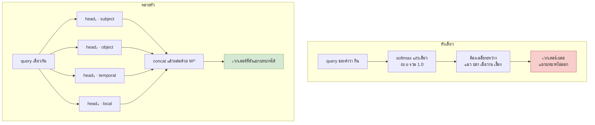
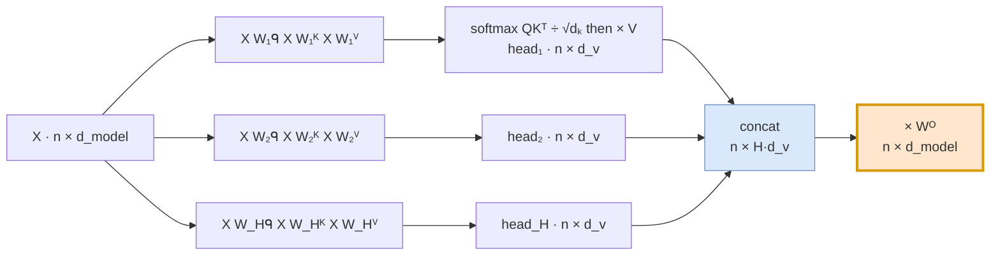
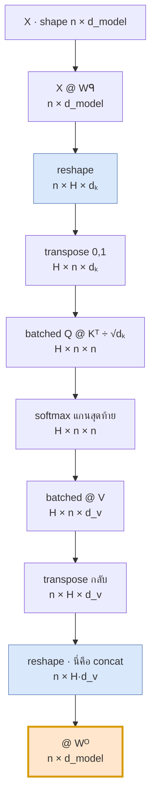
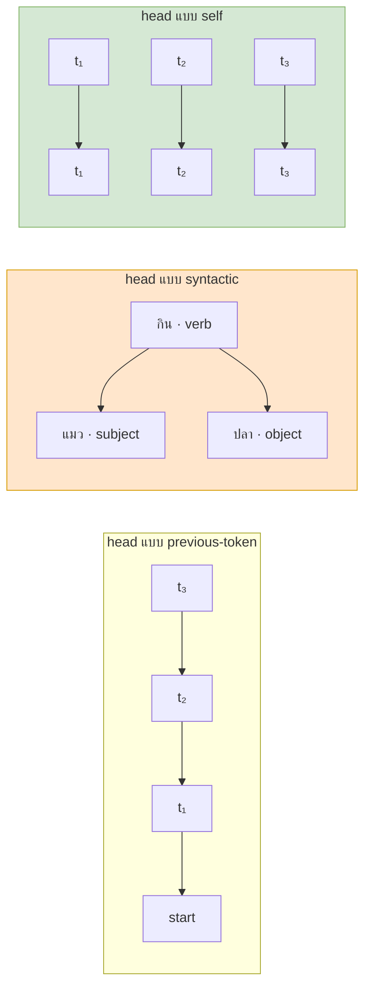

# 06 — Multi-Head Attention

> **ก่อนหน้า:** [05 — Scaled Dot-Product Attention](05-self-attention-math.md)
> **ถัดไป:** [07 — Positional Encoding](07-positional-encoding.md)

---

ไฟล์ [05](05-self-attention-math.md) จบลงด้วยสมการแกนกลาง

$$
\text{Attention}(Q,K,V) = \text{softmax}\!\left(\frac{QK^\top}{\sqrt{d_k}}\right)V,
\qquad Q = XW^Q,\ K = XW^K,\ V = XW^V
$$

ไฟล์นี้ตอบคำถามเดียว: **ทำไมของแค่ชุดเดียวถึงไม่พอ และการมี $H$ ชุดแก้อะไร**

---

## 1. ปัญหาของหัวเดียว: softmax บังคับให้เลือกจุดโฟกัสเดียว

### 1.1 ข้อจำกัดเชิงโครงสร้างของ softmax หนึ่งแถว

แถวที่ $i$ ของ attention matrix คือ

$$
\boldsymbol{\alpha}_i = \text{softmax}\!\left(\frac{\mathbf{q}_i K^\top}{\sqrt{d_k}}\right) \in \mathbb{R}^{1 \times n},
\qquad \sum_{j=1}^{n} \alpha_{ij} = 1,\quad \alpha_{ij} > 0
$$

เงื่อนไข "รวมกันได้ 1" ทำให้ $\boldsymbol{\alpha}_i$ เป็น **งบประมาณความสนใจก้อนเดียว** ที่ต้องแบ่งกันใช้ ถ้าโทเคนหนึ่งได้ 0.9 ที่เหลือทั้งหมดต้องแชร์กัน 0.1

output ที่ได้คือ

$$
\mathbf{z}_i = \sum_{j=1}^{n} \alpha_{ij}\,\mathbf{v}_j
$$

ซึ่งเป็น **convex combination** ของ value ทุกตัว — คือจุดหนึ่งใน convex hull ของ $\{\mathbf{v}_j\}$ เท่านั้น

> **จุดสำคัญ:** หัวเดียวผลิตได้แค่ *ค่าเฉลี่ยถ่วงน้ำหนักหนึ่งชุด* ต่อหนึ่งตำแหน่ง ไม่ว่าโทเคนนั้นจะเกี่ยวข้องกับเพื่อนบ้านด้วยความสัมพันธ์กี่ชนิดก็ตาม

### 1.2 ทำไมนี่เป็นปัญหาจริงในภาษา

พิจารณาประโยค

> "แมว ที่ ฉัน เลี้ยง **กิน** ปลา เมื่อวาน"

เพื่อเข้าใจคำว่า **กิน** โมเดลต้องรู้พร้อมกันหลายเรื่อง

| ความสัมพันธ์ที่ต้องใช้ | ควรโฟกัสที่ | ชนิดของข้อมูล |
|---|---|---|
| ใครเป็นประธาน | "แมว" | syntactic (subject–verb) |
| กรรมคืออะไร | "ปลา" | syntactic (verb–object) |
| เกิดเมื่อไร | "เมื่อวาน" | semantic / temporal |
| คำก่อนหน้าคืออะไร | "เลี้ยง" | positional / local |

ถ้ามีหัวเดียว น้ำหนัก $\alpha$ ต้องแบ่งกันระหว่างสี่เป้าหมายนี้ ผลลัพธ์คือ **ค่าเฉลี่ยที่เบลอ** — ได้เวกเตอร์ที่ผสมทุกอย่างปนกันจนแยกไม่ออกว่าอะไรเป็นอะไร

**สัญชาตญาณ:** เหมือนถ่ายรูปด้วยกล้องตัวเดียวที่ปรับโฟกัสได้จุดเดียว ถ้าอยากได้ทั้งวัตถุใกล้และไกลชัดพร้อมกัน คำตอบไม่ใช่ "หาเลนส์ที่เก่งขึ้น" แต่คือ **ใช้กล้องหลายตัว**



---

## 2. แนวคิด: ฉายลงปริภูมิย่อยหลายอัน แล้ว attend แยกกัน

### 2.1 สมการต่อหัว

แทนที่จะฉาย $X$ ด้วย $W^Q, W^K, W^V$ ชุดเดียวไปยังมิติเต็ม เราใช้ **$H$ ชุดที่เป็นอิสระต่อกัน** โดยแต่ละชุดฉายลงมิติที่เล็กลง

$$
\text{head}_h = \text{Attention}\!\left(XW_h^Q,\ XW_h^K,\ XW_h^V\right), \qquad h = 1 \dots H
$$

กางออกเต็มรูป

$$
\text{head}_h = \text{softmax}\!\left(\frac{(XW_h^Q)(XW_h^K)^\top}{\sqrt{d_k}}\right)XW_h^V
$$

| สัญลักษณ์ | มิติ | ความหมาย |
|---|---|---|
| $X$ | $\mathbb{R}^{n \times d_{\text{model}}}$ | input (row-major, แถวคือ token) |
| $W_h^Q$ | $\mathbb{R}^{d_{\text{model}} \times d_k}$ | projection ของ query สำหรับหัวที่ $h$ |
| $W_h^K$ | $\mathbb{R}^{d_{\text{model}} \times d_k}$ | projection ของ key |
| $W_h^V$ | $\mathbb{R}^{d_{\text{model}} \times d_v}$ | projection ของ value |
| $A_h = \text{softmax}(\cdot)$ | $\mathbb{R}^{n \times n}$ | attention matrix ของหัวที่ $h$ |
| $\text{head}_h$ | $\mathbb{R}^{n \times d_v}$ | output ของหัวที่ $h$ |

> **สัญชาตญาณ:** $W_h^Q$ และ $W_h^K$ ทำหน้าที่เหมือน "แว่นกรอง" — มันเลือกว่าจะเอา feature ชุดไหนของโทเคนมาใช้วัดความคล้าย หัวที่ $h$ จึงนิยาม *มาตรวัดความเกี่ยวข้องของตัวเอง* บนปริภูมิย่อยมิติ $d_k$ และ softmax ของหัวนั้นก็มีงบ 1.0 **ของตัวเอง** ไม่ต้องแย่งกับหัวอื่น

จุดสำคัญเชิงคณิตศาสตร์: คะแนนของหัวที่ $h$ คือ

$$
\mathbf{q}_i^{(h)} \cdot \mathbf{k}_j^{(h)} = \mathbf{x}_i \left(W_h^Q (W_h^K)^\top\right) \mathbf{x}_j^\top
$$

พจน์ $W_h^Q (W_h^K)^\top \in \mathbb{R}^{d_{\text{model}} \times d_{\text{model}}}$ คือ **bilinear form** ที่มี rank ไม่เกิน $d_k$ — แต่ละหัวจึงเรียน "รูปแบบความคล้าย" ที่ต่างกันได้จริง ไม่ใช่แค่สเกลของกันและกัน

### 2.2 การรวมหัวทั้งหมด

$$
\boxed{\ \text{MultiHead}(X) = \left[\text{head}_1;\ \text{head}_2;\ \dots;\ \text{head}_H\right]W^O\ }
$$

| สัญลักษณ์ | มิติ |
|---|---|
| $[\text{head}_1; \dots; \text{head}_H]$ | $\mathbb{R}^{n \times H d_v}$ |
| $W^O$ | $\mathbb{R}^{H d_v \times d_{\text{model}}}$ |
| $\text{MultiHead}(X)$ | $\mathbb{R}^{n \times d_{\text{model}}}$ |

**ทำไมต้องมี $W^O$ ไม่ใช่แค่ concat แล้วจบ:**

1. concat อย่างเดียวได้มิติ $H d_v$ ซึ่งต้องกลับเป็น $d_{\text{model}}$ เพื่อเข้า residual stream (ไฟล์ [08](08-feedforward-and-residual.md))
2. concat ทำให้แต่ละหัวอยู่ในบล็อกมิติของตัวเอง **ไม่มีการคุยกัน** — $W^O$ คือชั้นที่ให้หัวต่าง ๆ ผสมข้อมูลกัน
3. เขียนอีกแบบได้ว่า $W^O$ แบ่งเป็น $H$ บล็อกแนวตั้ง $W^O = [W_1^O; \dots; W_H^O]$ โดย $W_h^O \in \mathbb{R}^{d_v \times d_{\text{model}}}$ แล้ว

$$
\text{MultiHead}(X) = \sum_{h=1}^{H} \text{head}_h\, W_h^O
$$

> **จุดสำคัญ:** รูปผลรวมข้างบนบอกว่า multi-head **ไม่ใช่** การต่อท่อกัน แต่คือ **การบวกกันของ $H$ สายอิสระ** ที่แต่ละสายเขียนผลของตัวเองลง residual stream — มุมมองนี้จะสำคัญมากตอนอ่านเรื่อง residual ในไฟล์ 08



---

## 3. การเลือกมิติ: ทำไม $d_k = d_v = d_{\text{model}} / H$

### 3.1 การนับต้นทุนคำนวณ

ข้อเสนอของ Vaswani et al. คือ **ไม่ให้ multi-head แพงกว่า single-head** นับเป็นจำนวน multiply–accumulate (MAC) ต่อหนึ่ง sequence

| ขั้นตอน | สูตร MAC | ขึ้นกับ $H$ ไหม |
|---|---|---|
| $Q,K,V$ projection (รวมทุกหัว) | $3 \cdot n \cdot d_{\text{model}} \cdot (H d_k) = 3n\,d_{\text{model}}^2$ | **ไม่** (เพราะ $Hd_k = d_{\text{model}}$) |
| คะแนน $Q_hK_h^\top$ ทุกหัว | $H \cdot n^2 d_k = n^2 d_{\text{model}}$ | **ไม่** |
| $A_h V_h$ ทุกหัว | $H \cdot n^2 d_v = n^2 d_{\text{model}}$ | **ไม่** |
| $W^O$ | $n \cdot (Hd_v) \cdot d_{\text{model}} = n\,d_{\text{model}}^2$ | **ไม่** |
| **รวม** | $4n\,d_{\text{model}}^2 + 2n^2 d_{\text{model}}$ | **ไม่** |

หัวใจอยู่ที่พีชคณิตบรรทัดเดียว

$$
H \cdot n^2 d_k = n^2 \cdot (H d_k) = n^2 d_{\text{model}}
$$

> **สัญชาตญาณ:** งานคำนวณต่อหัว *หารด้วย $H$* พอดี เพราะ $d_k$ เล็กลง $H$ เท่า แล้วเราทำ $H$ หัว → คูณกลับหมดพอดี **multi-head จึงฟรี** ในแง่ FLOPs

**ตัวเลขจริง** ($n=10$, $d_{\text{model}}=512$):

| ขั้นตอน | MAC | ค่าเมื่อ $H=1$ | ค่าเมื่อ $H=8$ |
|---|---|---|---|
| projection $Q,K,V$ | $3nd_{\text{model}}^2$ | 7,864,320 | 7,864,320 |
| คะแนน | $n^2 d_{\text{model}}$ | 51,200 | 51,200 |
| $AV$ | $n^2 d_{\text{model}}$ | 51,200 | 51,200 |
| $W^O$ | $nd_{\text{model}}^2$ | 2,621,440 | 2,621,440 |
| **รวม** | | **10,588,160** | **10,588,160** |

เท่ากันเป๊ะ

### 3.2 ตัวอย่างการตั้งค่ามาตรฐาน

Transformer-base ใช้ $d_{\text{model}} = 512$, $H = 8$

$$
d_k = d_v = \frac{512}{8} = 64, \qquad H d_v = 8 \times 64 = 512 = d_{\text{model}}
$$

| โมเดล | $d_{\text{model}}$ | $H$ | $d_k$ |
|---|---|---|---|
| Transformer-base | 512 | 8 | 64 |
| Transformer-big | 1024 | 16 | 64 |
| BERT-base | 768 | 12 | 64 |
| GPT-2 medium | 1024 | 16 | 64 |

> **สังเกต:** $d_k = 64$ แทบทุกโมเดล — เมื่อโมเดลใหญ่ขึ้นเขาเพิ่ม **จำนวนหัว** ไม่ใช่ขนาดหัว เพราะ $d_k$ เล็กเกินไปจะทำให้ bilinear form มี rank ต่ำจนแสดงความสัมพันธ์ไม่ได้ ส่วนใหญ่เกินไปจะเปลืองโดยไม่เพิ่มความสามารถ

**ข้อแลกเปลี่ยน:** $H$ มากขึ้นที่ $d_{\text{model}}$ คงที่ = มีมุมมองมากขึ้น แต่แต่ละมุมมองหยาบลง งานทดลองในเปเปอร์เดิมพบว่า $H=1$ แย่ลงชัดเจน (BLEU ตก ~0.9) และ $H=32$ ก็เริ่มแย่ลงเช่นกัน — มีจุดเหมาะสมตรงกลาง

---

## 4. นับพารามิเตอร์ทั้งบล็อก

รวมทุกหัวเข้าเป็นเมทริกซ์เดียว (นี่คือสิ่งที่โค้ดจริงทำ)

$$
W^Q = \left[W_1^Q \ \middle|\ W_2^Q \ \middle|\ \dots \ \middle|\ W_H^Q\right] \in \mathbb{R}^{d_{\text{model}} \times H d_k} = \mathbb{R}^{d_{\text{model}} \times d_{\text{model}}}
$$

| พารามิเตอร์ | มิติ | จำนวน |
|---|---|---|
| $W^Q$ (รวมทุกหัว) | $d_{\text{model}} \times H d_k$ | $d_{\text{model}}^2$ |
| $W^K$ (รวมทุกหัว) | $d_{\text{model}} \times H d_k$ | $d_{\text{model}}^2$ |
| $W^V$ (รวมทุกหัว) | $d_{\text{model}} \times H d_v$ | $d_{\text{model}}^2$ |
| $W^O$ | $H d_v \times d_{\text{model}}$ | $d_{\text{model}}^2$ |
| **รวม** | | $\boxed{4\,d_{\text{model}}^2}$ |

ที่ $d_{\text{model}} = 512$: $4 \times 512^2 = 1{,}048{,}576 \approx 1.05$M ต่อหนึ่ง multi-head block (ยังไม่รวม bias ซึ่งเพิ่มอีก $4 d_{\text{model}} = 2048$ ตัว)

> **จุดสำคัญ:** จำนวนพารามิเตอร์ **ไม่ขึ้นกับ $H$** เช่นเดียวกับ FLOPs — $H$ เป็นแค่วิธี *แบ่ง* เมทริกซ์ที่มีอยู่แล้ว ไม่ใช่การเพิ่มของ

เทียบกับส่วนอื่นของเลเยอร์ (ดูไฟล์ [08](08-feedforward-and-residual.md)): FFN มี $2 d_{\text{model}} d_{\text{ff}} = 2 \times 512 \times 2048 = 2{,}097{,}152$ พารามิเตอร์ — **มากกว่า attention เท่าตัว**

---

## 5. การมองเป็นเทนเซอร์: reshape / transpose / batched matmul

โค้ดจริงไม่วน loop ทีละหัว แต่ใช้การจัดรูปเทนเซอร์แล้ว batch ทั้ง $H$ หัวพร้อมกัน

$$
\underbrace{X W^Q}_{(n,\ d_{\text{model}})}
\ \xrightarrow{\ \text{reshape}\ }\
\underbrace{(n,\ H,\ d_k)}_{\text{split into blocks}}
\ \xrightarrow{\ \text{transpose}\ }\
\underbrace{(H,\ n,\ d_k)}_{H\ \text{as batch axis}}
$$

จากนั้น

$$
(H, n, d_k) \times (H, d_k, n) \rightarrow (H, n, n)
\quad\xrightarrow{\ \text{softmax on last axis}\ }\quad
(H, n, n) \times (H, n, d_v) \rightarrow (H, n, d_v)
$$

แล้วย้อนกลับ

$$
(H, n, d_v) \xrightarrow{\text{transpose}} (n, H, d_v) \xrightarrow{\text{reshape}} (n, H d_v) \xrightarrow{\times W^O} (n, d_{\text{model}})
$$



> **จุดสำคัญ:** `reshape` ตอนขาออก **คือ** ตัวดำเนินการ concat $[\text{head}_1; \dots; \text{head}_H]$ ในสมการ — ไม่มีการ copy ข้อมูลจริง แค่ตีความ memory layout ใหม่ นี่คือเหตุผลที่สมการกับโค้ดหน้าตาเหมือนกันเป๊ะเมื่อใช้ convention row-major ตาม [00 §3.4](00-overview.md)

```python
import numpy as np

def softmax(z, axis=-1):
    z = z - z.max(axis=axis, keepdims=True)      # numerical stability
    e = np.exp(z)
    return e / e.sum(axis=axis, keepdims=True)

def multi_head_attention(X, WQ, WK, WV, WO, H):
    """X: (n, d_model) -> (n, d_model)   ตรงกับสมการ MultiHead(X)"""
    n, d_model = X.shape
    d_k = d_model // H

    Q = (X @ WQ).reshape(n, H, d_k).transpose(1, 0, 2)   # (H, n, d_k)  ← XW_h^Q ทุกหัวพร้อมกัน
    K = (X @ WK).reshape(n, H, d_k).transpose(1, 0, 2)   # (H, n, d_k)
    V = (X @ WV).reshape(n, H, d_k).transpose(1, 0, 2)   # (H, n, d_v)

    S = Q @ K.transpose(0, 2, 1) / np.sqrt(d_k)          # (H, n, n)    ← Q_hK_h^T / √d_k
    A = softmax(S, axis=-1)                              # (H, n, n)    ← attention matrix ต่อหัว
    heads = A @ V                                        # (H, n, d_v)  ← head_h

    C = heads.transpose(1, 0, 2).reshape(n, H * d_k)     # (n, H·d_v)   ← [head_1; ...; head_H]
    return C @ WO, A                                     # (n, d_model) ← × W^O
```

```python
import torch, torch.nn as nn

class MultiHeadAttention(nn.Module):
    def __init__(self, d_model=512, H=8):
        super().__init__()
        assert d_model % H == 0
        self.H, self.d_k = H, d_model // H
        self.WQ = nn.Linear(d_model, d_model, bias=False)   # รวม W_1^Q ... W_H^Q ไว้ก้อนเดียว
        self.WK = nn.Linear(d_model, d_model, bias=False)
        self.WV = nn.Linear(d_model, d_model, bias=False)
        self.WO = nn.Linear(d_model, d_model, bias=False)

    def forward(self, x):                                   # x: (B, n, d_model)
        B, n, _ = x.shape
        split = lambda t: t.view(B, n, self.H, self.d_k).transpose(1, 2)   # (B, H, n, d_k)
        q, k, v = split(self.WQ(x)), split(self.WK(x)), split(self.WV(x))

        s = q @ k.transpose(-2, -1) / self.d_k ** 0.5       # (B, H, n, n)  ← QK^T/√d_k
        a = torch.softmax(s, dim=-1)
        o = a @ v                                           # (B, H, n, d_v) ← head_h

        o = o.transpose(1, 2).reshape(B, n, self.H * self.d_k)   # concat
        return self.WO(o), a                                # (B, n, d_model)
```

> ใน PyTorch สมัยใหม่ บรรทัด `s → a → o` แทนได้ด้วย `torch.nn.functional.scaled_dot_product_attention(q, k, v)` ซึ่งให้ผลเท่ากันทุกหลัก แต่ประหยัด memory (FlashAttention)

---

## 6. หัวต่าง ๆ เรียนรู้อะไร

หลังเทรนเสร็จ นักวิจัยพบว่าหัวจำนวนหนึ่งมีพฤติกรรมที่ตีความได้ชัดเจนและ *เกิดขึ้นซ้ำ ๆ* ข้ามโมเดล

| ชนิดของหัว | รูปแบบของ $A$ | ตัวอย่างสิ่งที่จับ |
|---|---|---|
| **previous-token** | มวลอยู่บนเส้นทแยงล่าง $j = i-1$ | ต่อ n-gram, ประกอบคำ |
| **positional / local** | มวลกระจุกรอบเส้นทแยง $\lvert i-j \rvert \le 2$ | บริบทใกล้ตัว |
| **syntactic** | เชื่อม verb→object, noun→determiner ข้ามระยะไกล | โครงสร้างประโยค |
| **rare-token** | มวลพุ่งไปที่โทเคนความถี่ต่ำในประโยค | ชื่อเฉพาะ ศัพท์เทคนิค |
| **delimiter / no-op** | มวลเกือบทั้งหมดไปที่ `[SEP]` หรือ `[CLS]` | "ไม่ทำอะไร" — ทิ้งงบ attention |
| **self / identity** | มวลอยู่บนเส้นทแยงหลัก $j = i$ | ส่งข้อมูลตัวเองผ่านไปตรง ๆ |



**ข้อควรระวังเชิงวิชาการ:** งาน *Are Sixteen Heads Really Better than One?* (Michel et al., 2019) แสดงว่าหลังเทรนเสร็จ หัวจำนวนมากตัดทิ้งได้โดยประสิทธิภาพแทบไม่ตก — บางเลเยอร์เหลือหัวเดียวก็ยังใช้ได้ แต่ **ระหว่างเทรน** การมีหลายหัวสำคัญมาก

> **สัญชาตญาณ:** หลายหัวทำหน้าที่คล้าย *ensemble ตอนเทรน* — เพิ่มโอกาสที่จะมีหัวสักหัวเริ่มต้นในทิศที่ดี แล้ว gradient จะไหลไปทางนั้น เมื่อโมเดลลู่เข้าแล้ว ส่วนเกินจึงตัดได้

---

## 7. เดินตัวเลข: $n=3$, $d_{\text{model}}=4$, $H=2$, $d_k = d_v = 2$

### 7.1 ตั้งค่า

$$
X = \begin{bmatrix} 1 & 0 & 1 & 0 \\ 0 & 1 & 0 & 1 \\ 1 & 1 & 0 & 0 \end{bmatrix} \in \mathbb{R}^{3\times 4}
$$

น้ำหนักรวมทุกหัว (คอลัมน์ 1–2 = หัวที่ 1, คอลัมน์ 3–4 = หัวที่ 2)

$$
W^Q = \begin{bmatrix} 1 & 1 & -1 & 1 \\ -1 & 0 & 0.5 & -0.5 \\ 1 & 0 & 0 & 0.5 \\ 0 & -1 & 1 & 0 \end{bmatrix},\quad
W^K = \begin{bmatrix} -0.5 & -0.5 & -1 & 0.5 \\ 1 & 1 & -0.5 & -1 \\ -1 & 0.5 & 0 & 1 \\ 0 & 1 & 0.5 & 0 \end{bmatrix}
$$

$$
W^V = \begin{bmatrix} -1 & -1 & -1 & 0.5 \\ -0.5 & 0.5 & -0.5 & -0.5 \\ 1 & -1 & -1 & 0.5 \\ -0.5 & -0.5 & -0.5 & 0 \end{bmatrix},\quad
W^O = \begin{bmatrix} 1 & 0 & 0.5 & -0.5 \\ 0 & 1 & -0.5 & 0.5 \\ 0.5 & -0.5 & 1 & 0 \\ -0.5 & 0.5 & 0 & 1 \end{bmatrix}
$$

### 7.2 ฉายรวมทีเดียว

$$
Q = XW^Q = \begin{bmatrix} 2 & 1 & -1 & 1.5 \\ -1 & -1 & 1.5 & -0.5 \\ 0 & 1 & -0.5 & 0.5 \end{bmatrix},\quad
K = XW^K = \begin{bmatrix} -1.5 & 0 & -1 & 1.5 \\ 1 & 2 & 0 & -1 \\ 0.5 & 0.5 & -1.5 & -0.5 \end{bmatrix}
$$

$$
V = XW^V = \begin{bmatrix} 0 & -2 & -2 & 1 \\ -1 & 0 & -1 & -0.5 \\ -1.5 & -0.5 & -1.5 & 0 \end{bmatrix}
$$

**นี่คือขั้น reshape:** ตัดคอลัมน์ 1–2 ให้หัวที่ 1 และคอลัมน์ 3–4 ให้หัวที่ 2

### 7.3 หัวที่ 1

$$
Q_1 = \begin{bmatrix} 2 & 1 \\ -1 & -1 \\ 0 & 1 \end{bmatrix},\quad
K_1 = \begin{bmatrix} -1.5 & 0 \\ 1 & 2 \\ 0.5 & 0.5 \end{bmatrix},\quad
V_1 = \begin{bmatrix} 0 & -2 \\ -1 & 0 \\ -1.5 & -0.5 \end{bmatrix}
$$

$$
Q_1K_1^\top = \begin{bmatrix} -3 & 4 & 1.5 \\ 1.5 & -3 & -1 \\ 0 & 2 & 0.5 \end{bmatrix}
\quad\xrightarrow{\ \div\sqrt{2}\ }\quad
\begin{bmatrix} -2.1213 & 2.8284 & 1.0607 \\ 1.0607 & -2.1213 & -0.7071 \\ 0 & 1.4142 & 0.3536 \end{bmatrix}
$$

$$
A_1 = \text{softmax}(\cdot) = \begin{bmatrix}
\mathbf{0.0060} & \mathbf{0.8490} & 0.1449 \\
\mathbf{0.8249} & 0.0342 & 0.1408 \\
0.1530 & \mathbf{0.6292} & 0.2178
\end{bmatrix}
$$

$$
\text{head}_1 = A_1V_1 = \begin{bmatrix} -1.0665 & -0.0845 \\ -0.2455 & -1.7203 \\ -0.9560 & -0.4149 \end{bmatrix}
$$

### 7.4 หัวที่ 2

$$
Q_2 = \begin{bmatrix} -1 & 1.5 \\ 1.5 & -0.5 \\ -0.5 & 0.5 \end{bmatrix},\quad
K_2 = \begin{bmatrix} -1 & 1.5 \\ 0 & -1 \\ -1.5 & -0.5 \end{bmatrix},\quad
V_2 = \begin{bmatrix} -2 & 1 \\ -1 & -0.5 \\ -1.5 & 0 \end{bmatrix}
$$

$$
Q_2K_2^\top = \begin{bmatrix} 3.25 & -1.5 & 0.75 \\ -2.25 & 0.5 & -2 \\ 1.25 & -0.5 & 0.5 \end{bmatrix}
\quad\xrightarrow{\ \div\sqrt{2}\ }\quad
\begin{bmatrix} 2.2981 & -1.0607 & 0.5303 \\ -1.5910 & 0.3536 & -1.4142 \\ 0.8839 & -0.3536 & 0.3536 \end{bmatrix}
$$

$$
A_2 = \begin{bmatrix}
\mathbf{0.8295} & 0.0289 & 0.1416 \\
0.1089 & \mathbf{0.7612} & 0.1299 \\
\mathbf{0.5323} & 0.1544 & 0.3132
\end{bmatrix}
$$

$$
\text{head}_2 = A_2V_2 = \begin{bmatrix} -1.9003 & 0.8151 \\ -1.1739 & -0.2717 \\ -1.6889 & 0.4551 \end{bmatrix}
$$

### 7.5 สองหัวเห็นไม่เหมือนกัน

| แถว (query) | $A_1$ โฟกัสที่ | $A_2$ โฟกัสที่ |
|---|---|---|
| $i=1$ | โทเคน **2** (0.8490) | โทเคน **1 / ตัวเอง** (0.8295) |
| $i=2$ | โทเคน **1** (0.8249) | โทเคน **2 / ตัวเอง** (0.7612) |
| $i=3$ | โทเคน **2** (0.6292) | โทเคน **1** (0.5323) |

วัดเป็นตัวเลขเดียว — **น้ำหนักเฉลี่ยบนเส้นทแยงมุม** (ความสนใจตัวเอง)

$$
\frac{1}{n}\sum_i (A_1)_{ii} = 0.0860, \qquad \frac{1}{n}\sum_i (A_2)_{ii} = 0.6346
$$

> **อ่านผล:** หัวที่ 1 แทบไม่สนใจตัวเองเลย (0.0860) — มันเป็นหัวแบบ *มองออกไปหาโทเคนอื่น*
> หัวที่ 2 ทุ่มน้ำหนักไปที่ตัวเองเป็นหลัก (0.6346) — เป็นหัวแบบ *self / identity* ที่ส่งข้อมูลของตัวเองผ่านไป
> ทั้งสองใช้ $X$ ก้อนเดียวกัน ต่างกันแค่ subspace ที่ฉายลงไป **นี่คือทั้งหมดของ multi-head**

### 7.6 Concat แล้วผ่าน $W^O$

$$
[\text{head}_1; \text{head}_2] = \begin{bmatrix}
-1.0665 & -0.0845 & -1.9003 & 0.8151 \\
-0.2455 & -1.7203 & -1.1739 & -0.2717 \\
-0.9560 & -0.4149 & -1.6889 & 0.4551
\end{bmatrix} \in \mathbb{R}^{3\times 4}
$$

$$
\boxed{\ \text{MultiHead}(X) = \begin{bmatrix}
-2.4242 & 1.2732 & -2.3913 & 1.3061 \\
-0.6966 & -1.2692 & -0.4365 & -1.0091 \\
-2.0280 & 0.6572 & -1.9595 & 0.7257
\end{bmatrix}\ }
$$

ตรวจแถวแรกด้วยมือ: คอลัมน์แรกของ $W^O$ คือ $[1, 0, 0.5, -0.5]^\top$

$$
1(-1.0665) + 0(-0.0845) + 0.5(-1.9003) - 0.5(0.8151) = -1.0665 - 0.9502 - 0.4076 = -2.4242\ \checkmark
$$

สังเกตว่า $W^O$ ผสมข้อมูลจาก **ทั้งสองหัว** เข้ามาในเลขตัวเดียว — นี่คือหน้าที่ที่ concat เพียว ๆ ทำไม่ได้

### 7.7 โค้ดตรวจสอบทั้งหมด

```python
import numpy as np
np.set_printoptions(precision=4, suppress=True)

def softmax(z, axis=-1):
    z = z - z.max(axis=axis, keepdims=True)
    e = np.exp(z)
    return e / e.sum(axis=axis, keepdims=True)

n, d_model, H = 3, 4, 2
d_k = d_model // H                                  # = 2

X  = np.array([[1., 0., 1., 0.],
               [0., 1., 0., 1.],
               [1., 1., 0., 0.]])
WQ = np.array([[ 1., 1., -1.,  1.], [-1., 0., 0.5, -0.5],
               [ 1., 0.,  0., 0.5], [ 0.,-1., 1.,   0. ]])
WK = np.array([[-0.5,-0.5,-1., 0.5], [ 1., 1.,-0.5,-1.],
               [-1.,  0.5, 0., 1. ], [ 0., 1., 0.5, 0.]])
WV = np.array([[-1., -1., -1., 0.5], [-0.5, 0.5,-0.5,-0.5],
               [ 1., -1., -1., 0.5], [-0.5,-0.5,-0.5, 0. ]])
WO = np.array([[ 1., 0., 0.5,-0.5], [ 0., 1.,-0.5, 0.5],
               [ 0.5,-0.5, 1., 0. ], [-0.5, 0.5, 0., 1. ]])

Q, K, V = X @ WQ, X @ WK, X @ WV                    # ฉายรวมทุกหัว
heads, As = [], []
for h in range(H):
    sl = slice(h * d_k, (h + 1) * d_k)              # ← นี่คือขั้น reshape
    A = softmax(Q[:, sl] @ K[:, sl].T / np.sqrt(d_k))
    heads.append(A @ V[:, sl]); As.append(A)
    print(f"A_{h+1} =\n{np.round(A, 4)}")

C = np.concatenate(heads, axis=1)                   # [head_1; head_2]
print("concat =\n", np.round(C, 4))
print("MultiHead(X) =\n", np.round(C @ WO, 4))
print("diag เฉลี่ย:", round(np.trace(As[0]) / n, 4), round(np.trace(As[1]) / n, 4))
# A_1 diag เฉลี่ย 0.086   A_2 diag เฉลี่ย 0.6346
```

```python
import torch
X  = torch.tensor(X,  dtype=torch.float32)
WQ, WK, WV, WO = (torch.tensor(M, dtype=torch.float32) for M in (WQ, WK, WV, WO))

split = lambda M: (X @ M).view(n, H, d_k).transpose(0, 1)     # (H, n, d_k)
q, k, v = split(WQ), split(WK), split(WV)
a = torch.softmax(q @ k.transpose(-2, -1) / d_k ** 0.5, dim=-1)   # (H, n, n)
o = (a @ v).transpose(0, 1).reshape(n, d_model) @ WO              # (n, d_model)
print(o)     # tensor([[-2.4242,  1.2732, -2.3913,  1.3061], ...])  ← ตรงกับ NumPy
```

---

## 8. สรุปไฟล์นี้

| สิ่งที่ได้ | สมการหลัก / ค่า |
|---|---|
| ปัญหาของหัวเดียว | $\sum_j \alpha_{ij} = 1$ → งบ attention ก้อนเดียว ต้องเฉลี่ยความสัมพันธ์ทุกชนิด |
| Attention ต่อหัว | $\text{head}_h = \text{Attention}(XW_h^Q, XW_h^K, XW_h^V)$ |
| การรวมหัว | $\text{MultiHead}(X) = [\text{head}_1; \dots; \text{head}_H]W^O$ |
| รูปผลรวมเทียบเท่า | $\text{MultiHead}(X) = \sum_h \text{head}_h W_h^O$ |
| การเลือกมิติ | $d_k = d_v = d_{\text{model}}/H$ → $H \cdot n^2 d_k = n^2 d_{\text{model}}$ (ต้นทุนคงที่) |
| ต้นทุนคำนวณ | $4n\,d_{\text{model}}^2 + 2n^2 d_{\text{model}}$ MAC — ไม่ขึ้นกับ $H$ |
| จำนวนพารามิเตอร์ | $4\,d_{\text{model}}^2$ = 1,048,576 ที่ $d_{\text{model}}=512$ |
| การมองเป็นเทนเซอร์ | $(n, d_{\text{model}}) \to (n,H,d_k) \to (H,n,d_k) \to$ batched matmul |

**สิ่งที่ยังขาดอยู่:** สังเกตว่าตลอดไฟล์นี้ ไม่มีจุดไหนเลยที่ใช้ข้อมูล *ลำดับ* ของโทเคน — ถ้าสลับแถวของ $X$ ผลลัพธ์ก็แค่สลับแถวตาม multi-head จึงมองประโยคเป็น **ถุงของโทเคน** ไม่ใช่ลำดับ

นั่นคือช่องโหว่ที่ไฟล์ถัดไปต้องอุด

---

**ถัดไป:** [07 — Positional Encoding](07-positional-encoding.md)
