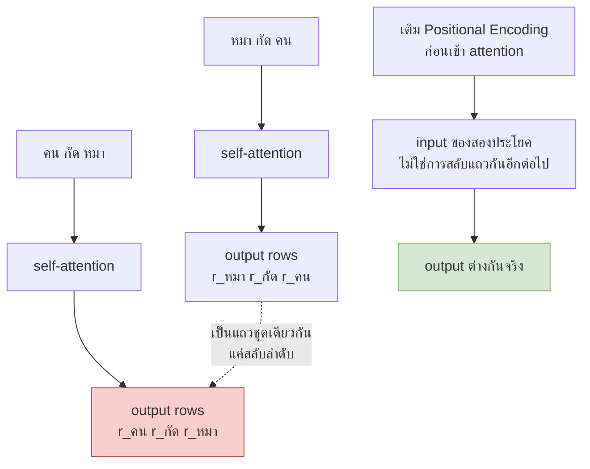
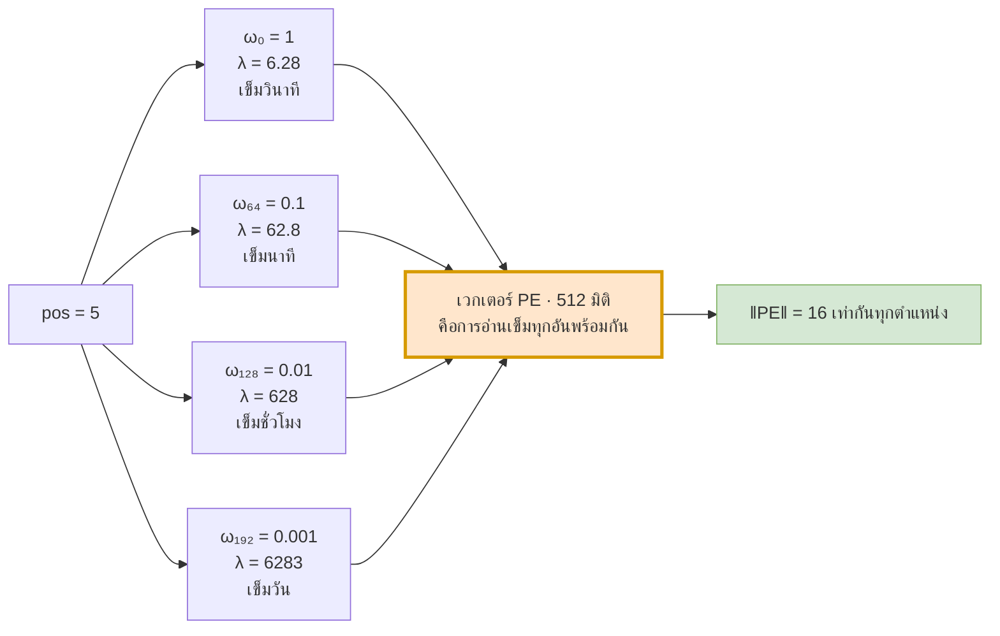
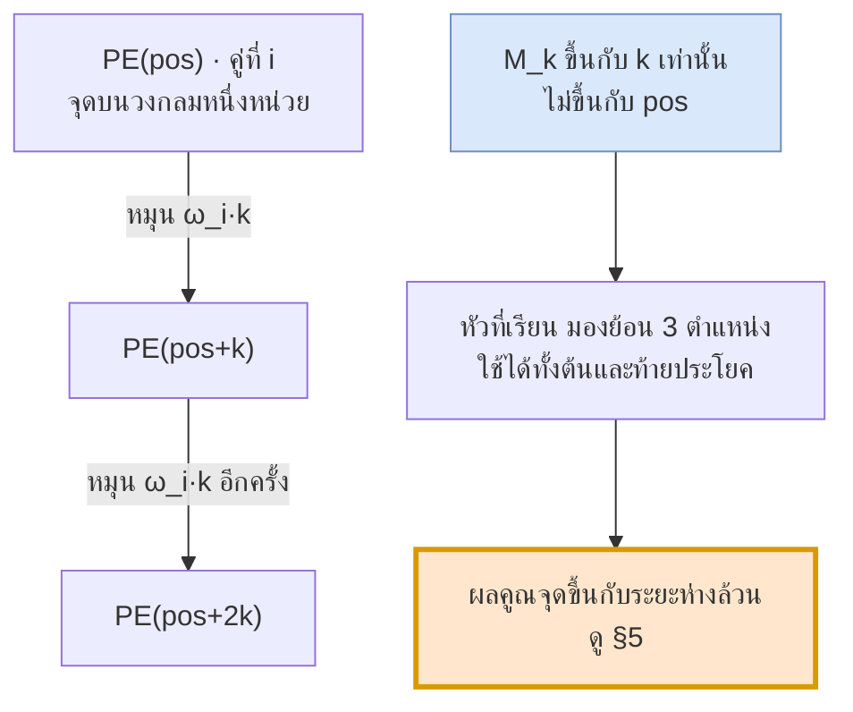

# 07 — Positional Encoding

> **ก่อนหน้า:** [06 — Multi-Head Attention](06-multi-head-attention.md)
> **ถัดไป:** [08 — FFN และ Residual Connection](08-feedforward-and-residual.md)

---

ไฟล์ [05](05-self-attention-math.md) และ [06](06-multi-head-attention.md) สร้างกลไก attention จนครบ แต่มีข้อบกพร่องหนึ่งที่ยังไม่ได้แตะ

RNN ในไฟล์ [01](01-seq2seq-rnn-basics.md) รู้ลำดับ "ฟรี" เพราะมันประมวลผลทีละก้าวเวลา — $\mathbf{h}\_t$ ต้องรอ $\mathbf{h}\_{t-1}$ เสมอ พอ Transformer ทิ้ง recurrence เพื่อให้ขนานได้ **มันก็ทิ้งข้อมูลลำดับไปด้วย** ไฟล์นี้คือการเอาข้อมูลนั้นกลับมาใส่

---

## 1. ปัญหา: self-attention เป็น permutation equivariant

### 1.1 ระบุผลลัพธ์ด้วยเมทริกซ์สับเปลี่ยน

ให้ $P \in \mathbb{R}^{n \times n}$ เป็น **permutation matrix** (แต่ละแถวและคอลัมน์มีเลข 1 ตัวเดียว ที่เหลือเป็น 0) การคูณ $PX$ คือการสลับแถวของ $X$

> **ผลลัพธ์:** สำหรับทุก permutation matrix $P$
> $$\boxed{\ \text{Attention}(PX) = P \cdot \text{Attention}(X)\ }$$

**สัญชาตญาณว่าทำไมจึงเป็นจริง:** ทุกขั้นตอนในสมการ attention ทำงาน "ตามแถว" ล้วน ๆ

| ขั้นตอน | เกิดอะไรเมื่อสลับแถว input |
|---|---|
| $Q = (PX)W^Q = P(XW^Q)$ | แถวของ $Q$ สลับตาม |
| $QK^\top \to (PQ)(PK)^\top = P(QK^\top)P^\top$ | ทั้งแถวและคอลัมน์ของ score matrix สลับตาม |
| softmax ทีละแถว | ไม่สนใจว่าแถวอยู่ลำดับไหน → $\text{softmax}(PSP^\top) = P\\,\text{softmax}(S)\\,P^\top$ |
| $AV \to (PAP^\top)(PV) = P(AV)$ | $P^\top P = I$ ตัดกันพอดี |

พูดสั้น ๆ: **ไม่มีที่ไหนในสมการที่ดัชนี $i$ กับ $j$ ปรากฏในฐานะ "ตัวเลข"** มันปรากฏแค่ในฐานะ "ป้ายชื่อของแถว" เท่านั้น

### 1.2 ยืนยันด้วยตัวเลขจริง

ใช้ $n=3$, $d\_{\text{model}} = 4$ และเพื่อความชัด ตั้ง $W^Q = W^K = W^V = I$ (ดังนั้น $d\_k = 4$, $\sqrt{d\_k} = 2$)

$$
X = \begin{bmatrix} 1 & 0 & 1 & 0 \\\ 0 & 1 & 0 & 1 \\\ 1 & 1 & 0 & 0 \end{bmatrix}
$$

โดยแถวที่ 1, 2, 3 คือ embedding ของ `หมา`, `กัด`, `คน` ตามลำดับ — ประโยค **"หมา กัด คน"**

$$
XX^\top = \begin{bmatrix} 2 & 0 & 1 \\\ 0 & 2 & 1 \\\ 1 & 1 & 2 \end{bmatrix}
\quad\xrightarrow{\ \div 2\ }\quad
\begin{bmatrix} 1 & 0 & 0.5 \\\ 0 & 1 & 0.5 \\\ 0.5 & 0.5 & 1 \end{bmatrix}
\quad\xrightarrow{\ \text{softmax}\ }\quad
A = \begin{bmatrix}
0.5065 & 0.1863 & 0.3072 \\\
0.1863 & 0.5065 & 0.3072 \\\
0.2741 & 0.2741 & 0.4519
\end{bmatrix}
$$

$$
\text{Attention}(X) = AX = \begin{bmatrix}
0.8137 & 0.4935 & 0.5065 & 0.1863 \\\
0.4935 & 0.8137 & 0.1863 & 0.5065 \\\
0.7259 & 0.7259 & 0.2741 & 0.2741
\end{bmatrix}
$$

ตอนนี้สลับ "หมา" กับ "คน" ด้วย $P = \begin{bmatrix} 0&0&1 \\\ 0&1&0 \\\ 1&0&0 \end{bmatrix}$ → ได้ประโยค **"คน กัด หมา"**

$$
\text{Attention}(PX) = \begin{bmatrix}
0.7259 & 0.7259 & 0.2741 & 0.2741 \\\
0.4935 & 0.8137 & 0.1863 & 0.5065 \\\
0.8137 & 0.4935 & 0.5065 & 0.1863
\end{bmatrix} = P \cdot \text{Attention}(X)
$$

**เป็นแถวเดียวกันเป๊ะ แค่สลับที่** — output ของโทเคน "หมา" ยังเหมือนเดิมทุกตัวเลข ไม่ว่ามันจะเป็นประธานหรือกรรม

> **จุดสำคัญ:** โมเดลที่แยก "หมากัดคน" กับ "คนกัดหมา" ไม่ออก ก็แปลภาษาไม่ได้ — self-attention เพียว ๆ เห็นประโยคเป็น **เซตของโทเคน** ไม่ใช่ **ลำดับ**



### 1.3 ยืนยันว่าการเติม PE แก้ปัญหาได้จริง

ใช้ $X$ ชุดเดิม บวก $PE$ สำหรับ $d\_{\text{model}}=4$

$$
PE\_{0:2} = \begin{bmatrix} 0 & 1 & 0 & 1 \\\ 0.8415 & 0.5403 & 0.0100 & 1.0000 \\\ 0.9093 & -0.4161 & 0.0200 & 0.9998 \end{bmatrix}
$$

| ประโยค | input | $A$ แถวแรก |
|---|---|---|
| หมา กัด คน | $X + PE$ | $[0.3333,\ 0.4054,\ 0.2613]$ |
| คน กัด หมา | $PX + PE$ | $[0.4756,\ 0.4575,\ 0.0669]$ |

$$
\text{Attention}(PX + PE) = \begin{bmatrix}
0.9883 & 1.6281 & 0.0728 & 1.4574 \\\
0.9753 & 1.5441 & 0.0835 & 1.5921 \\\
1.6283 & 0.1802 & 0.7368 & 1.1703
\end{bmatrix}
\ \ne\ 
P\cdot\text{Attention}(X + PE) = \begin{bmatrix}
1.3464 & 1.0039 & 0.2236 & 1.3471 \\\
1.0601 & 1.2769 & 0.1797 & 1.6507 \\\
1.1733 & 1.1103 & 0.3426 & 1.4054
\end{bmatrix}
$$

ต่างกันสูงสุดถึง **0.9301** — สมมาตรถูกทำลายเรียบร้อย

```python
import numpy as np
def softmax(z, axis=-1):
    z = z - z.max(axis=axis, keepdims=True); e = np.exp(z)
    return e / e.sum(axis=axis, keepdims=True)

X = np.array([[1., 0., 1., 0.], [0., 1., 0., 1.], [1., 1., 0., 0.]])
P = np.array([[0., 0., 1.], [0., 1., 0.], [1., 0., 0.]])       # สลับแถว 1 กับ 3
attn = lambda Z: softmax(Z @ Z.T / np.sqrt(Z.shape[1])) @ Z     # W = I

print(np.allclose(attn(P @ X), P @ attn(X)))                    # True  ← equivariant

PE = positional_encoding(3, 4)                                  # นิยามใน §3.1
print(np.allclose(attn(P @ X + PE), P @ attn(X + PE)))          # False ← พังแล้ว
print(np.abs(attn(P @ X + PE) - P @ attn(X + PE)).max())        # 0.9301
```

---

## 2. ทางเลือกในการฉีดข้อมูลตำแหน่ง

มีแกนการตัดสินใจ 3 แกนที่เป็นอิสระต่อกัน

| แกน | ตัวเลือก | ข้อดี | ข้อเสีย |
|---|---|---|---|
| **มาจากไหน** | *learned* — ตาราง $E\_{pos} \in \mathbb{R}^{n\_{\max} \times d\_{\text{model}}}$ ที่เทรนได้ | โมเดลเลือกเองว่าอะไรมีประโยชน์ | ใช้เกิน $n\_{\max}$ ไม่ได้เลย, เพิ่มพารามิเตอร์ |
| | *fixed* — ฟังก์ชันคงที่ เช่น sinusoid | ไม่มีพารามิเตอร์, นิยามได้ทุก $pos$ | โมเดลปรับแต่งไม่ได้ |
| **อ้างอิงอะไร** | *absolute* — เข้ารหัส "ตำแหน่งที่ 5" | ง่าย, ใส่ครั้งเดียวที่ input | ประโยคเลื่อนทั้งก้อนแล้วรหัสเปลี่ยนหมด |
| | *relative* — เข้ารหัส "ห่างกัน 3" ลงใน attention score | ตรงกับสิ่งที่ภาษาสนใจจริง | ต้องแก้ทุกเลเยอร์, คำนวณแพงกว่า |
| **ผสมอย่างไร** | *บวก* — $X + PE$ | ไม่เปลืองมิติ | ปนกับ semantic ในท่อเดียวกัน |
| | *concat* — $[X;\ PE]$ | แยกกันชัดเจน | เปลืองมิติ, พารามิเตอร์ทุกเลเยอร์โตตาม |

| งาน | ทางเลือกที่ใช้ |
|---|---|
| Transformer (Vaswani 2017) | fixed · absolute · บวก |
| BERT, GPT-2 | learned · absolute · บวก |
| Transformer-XL, T5 | relative (bias ใน attention score) |
| RoFormer / LLaMA | RoPE — relative โดยการหมุน $Q,K$ |
| ALiBi | relative — bias เชิงเส้นตามระยะ ไม่มีเวกเตอร์ PE เลย |

เปเปอร์ต้นฉบับทดลองทั้ง fixed และ learned แล้วพบว่า **ผลแทบไม่ต่างกัน** จึงเลือก sinusoid ด้วยเหตุผลว่า *น่าจะขยายไปยังความยาวที่ไม่เคยเห็นได้*

---

## 3. Sinusoidal Positional Encoding

### 3.1 สมการ

$$
\boxed{\ 
PE\_{(pos,\\,2i)} = \sin\\!\left(\frac{pos}{10000^{2i/d\_{\text{model}}}}\right), \qquad
PE\_{(pos,\\,2i+1)} = \cos\\!\left(\frac{pos}{10000^{2i/d\_{\text{model}}}}\right)
\ }
$$

| สัญลักษณ์ | ช่วงค่า | ความหมาย |
|---|---|---|
| $pos$ | $0, 1, \dots, n-1$ | ตำแหน่งของโทเคนในลำดับ |
| $i$ | $0, 1, \dots, d\_{\text{model}}/2 - 1$ | ดัชนีของ **คู่** มิติ |
| $2i,\ 2i+1$ | $0 \dots d\_{\text{model}}-1$ | มิติจริงในเวกเตอร์ |
| $\omega\_i = 10000^{-2i/d\_{\text{model}}}$ | $(10^{-4},\ 1]$ | ความถี่เชิงมุมของคู่ที่ $i$ |
| $PE$ | $\mathbb{R}^{n \times d\_{\text{model}}}$ | เมทริกซ์ที่บวกเข้ากับ embedding |

เขียนย่อ: มิติถูกจับเป็น **คู่** $(2i, 2i+1)$ และคู่ที่ $i$ เก็บ $(\sin(\omega\_i \cdot pos),\ \cos(\omega\_i \cdot pos))$ — คือ **จุดบนวงกลมหนึ่งหน่วย** ที่หมุนด้วยอัตรา $\omega\_i$

ผลพลอยได้ที่มีประโยชน์: ทุกตำแหน่งมีความยาวเท่ากันเป๊ะ

$$
\lVert PE(pos) \rVert^2 = \sum\_{i} \left(\sin^2(\omega\_i pos) + \cos^2(\omega\_i pos)\right) = \frac{d\_{\text{model}}}{2}
$$

ที่ $d\_{\text{model}} = 512$: $\lVert PE \rVert = \sqrt{256} = 16$ ทุกตำแหน่ง

**ตาราง $PE$ จริง สำหรับ $d\_{\text{model}} = 8$, $pos = 0 \dots 5$** (ปัด 4 ตำแหน่ง)

| $pos$ | dim0 sin | dim1 cos | dim2 sin | dim3 cos | dim4 sin | dim5 cos | dim6 sin | dim7 cos |
|---|---|---|---|---|---|---|---|---|
| 0 | 0.0000 | 1.0000 | 0.0000 | 1.0000 | 0.0000 | 1.0000 | 0.0000 | 1.0000 |
| 1 | 0.8415 | 0.5403 | 0.0998 | 0.9950 | 0.0100 | 1.0000 | 0.0010 | 1.0000 |
| 2 | 0.9093 | −0.4161 | 0.1987 | 0.9801 | 0.0200 | 0.9998 | 0.0020 | 1.0000 |
| 3 | 0.1411 | −0.9900 | 0.2955 | 0.9553 | 0.0300 | 0.9996 | 0.0030 | 1.0000 |
| 4 | −0.7568 | −0.6536 | 0.3894 | 0.9211 | 0.0400 | 0.9992 | 0.0040 | 1.0000 |
| 5 | −0.9589 | 0.2837 | 0.4794 | 0.8776 | 0.0500 | 0.9988 | 0.0050 | 1.0000 |

> **อ่านตาราง:** คู่ซ้ายสุด (dim0/dim1, $\omega\_0 = 1$) หมุนเร็วมาก — ผ่านไป 5 ตำแหน่งก็เกือบครบรอบ
> คู่ขวาสุด (dim6/dim7, $\omega\_3 = 10^{-3}$) แทบไม่ขยับเลย — 0.0010, 0.0020, 0.0030, …
> **มิติซ้าย = เข็มวินาที, มิติขวา = เข็มชั่วโมง**

```python
import numpy as np

def positional_encoding(n, d_model):
    """คืน PE: (n, d_model) ตรงกับสมการ PE(pos,2i), PE(pos,2i+1)"""
    pos = np.arange(n)[:, None]                              # (n, 1)
    i   = np.arange(d_model // 2)[None, :]                   # (1, d_model/2)
    ang = pos / np.power(10000.0, (2 * i) / d_model)         # pos * ω_i
    PE = np.zeros((n, d_model))
    PE[:, 0::2] = np.sin(ang)                                # ← มิติคู่
    PE[:, 1::2] = np.cos(ang)                                # ← มิติคี่
    return PE

print(np.round(positional_encoding(6, 8), 4))
print(np.linalg.norm(positional_encoding(100, 512), axis=1)[:3])   # [16. 16. 16.]
```

```python
import torch, math

def positional_encoding_torch(n, d_model):
    pos = torch.arange(n).unsqueeze(1).float()               # (n, 1)
    div = torch.exp(torch.arange(0, d_model, 2).float()
                    * (-math.log(10000.0) / d_model))        # ω_i = exp(-2i·ln(10000)/d)
    PE = torch.zeros(n, d_model)
    PE[:, 0::2] = torch.sin(pos * div)
    PE[:, 1::2] = torch.cos(pos * div)
    return PE

# ใช้งานจริง: บวกเข้ากับ embedding ที่สเกลด้วย √d_model แล้ว
# x = embedding(tokens) * math.sqrt(d_model) + positional_encoding_torch(n, d_model)
```

> เวอร์ชัน PyTorch คำนวณ $\omega\_i$ ผ่าน $\exp(-2i\ln(10000)/d\_{\text{model}})$ แทนการยกกำลังตรง ๆ เพราะเสถียรเชิงตัวเลขกว่าเมื่อ $d\_{\text{model}}$ ใหญ่ — ค่าที่ได้เท่ากัน

### 3.2 ที่มาของฐาน 10000 และการไล่ความถี่แบบเรขาคณิต

ความยาวคลื่นของคู่ที่ $i$ คือ

$$
\lambda\_i = \frac{2\pi}{\omega\_i} = 2\pi \cdot 10000^{\\,2i/d\_{\text{model}}}
$$

เมื่อ $i$ ไล่จาก $0$ ถึง $d\_{\text{model}}/2 - 1$ ค่า $\lambda\_i$ ไล่แบบ **เรขาคณิต** จาก $2\pi \approx 6.28$ ไปจนเข้าใกล้ $10000 \cdot 2\pi \approx 62832$

**ตารางความยาวคลื่นจริง ($d\_{\text{model}} = 512$)**

| $i$ | มิติ | $\omega\_i$ | $\lambda\_i$ | ตีความ |
|---|---|---|---|---|
| 0 | 0, 1 | 1 | 6.2832 | ครบรอบทุก ~6 โทเคน |
| 1 | 2, 3 | 0.964662 | 6.5134 | |
| 2 | 4, 5 | 0.930572 | 6.7520 | |
| 4 | 8, 9 | 0.865964 | 7.2557 | |
| 8 | 16, 17 | 0.749894 | 8.3788 | |
| 16 | 32, 33 | 0.562341 | 11.1733 | ระดับวลี |
| 32 | 64, 65 | 0.316228 | 19.8692 | |
| 64 | 128, 129 | 0.1 | 62.8319 | ระดับประโยค |
| 128 | 256, 257 | 0.01 | 628.3185 | ระดับย่อหน้า |
| 192 | 384, 385 | 0.001 | 6283.1853 | ยาวกว่า context ทั้งหมด |
| 255 | 510, 511 | 0.000103663 | 60611.4772 | เกือบเป็นค่าคงที่ |

**ทำไมต้อง 10000:**

1. **ครอบคลุมช่วงความยาวที่สนใจ** — ปลายบน $\lambda \approx 62832$ ยาวกว่าประโยคยาวที่สุดหลายเท่า จึงมีมิติที่ทำหน้าที่เหมือน "ตัวนับดิบ" ที่ไม่วนซ้ำในช่วงใช้งานจริง
2. **ปลายล่าง $\lambda = 2\pi$ คือขีดจำกัดทางทฤษฎี** — ต่ำกว่านี้ (คาบ < 2 โทเคน) จะเกิด aliasing ตำแหน่งต่างกันได้ค่าซ้ำกัน
3. **การไล่แบบเรขาคณิตทำให้ resolution กระจายทั่วสเกล** — ถ้าไล่แบบเลขคณิต ความถี่จะกระจุกอยู่ปลายเดียว

> **สัญชาตญาณ:** 10000 คือ "ช่วงไดนามิก" ที่เลือกมา ไม่ใช่ค่าวิเศษ โมเดลรุ่นหลังปรับตัวเลขนี้กันเป็นเรื่องปกติ — เช่น LLaMA ขยาย context ด้วยการเพิ่มฐาน RoPE จาก 10000 เป็น 500000 เพื่อยืด $\lambda$ ทุกตัวออกไป

### 3.3 การตีความเป็น "นาฬิกาไบนารีแบบต่อเนื่อง"

ลองเขียนเลข 0–7 เป็นเลขฐานสอง 3 บิต

| $pos$ | $b\_2$ | $b\_1$ | $b\_0$ |
|---|---|---|---|
| 0 | 0 | 0 | 0 |
| 1 | 0 | 0 | 1 |
| 2 | 0 | 1 | 0 |
| 3 | 0 | 1 | 1 |
| 4 | 1 | 0 | 0 |
| 5 | 1 | 0 | 1 |
| 6 | 1 | 1 | 0 |
| 7 | 1 | 1 | 1 |

บิต $b\_0$ สลับทุก 1 ก้าว, $b\_1$ ทุก 2 ก้าว, $b\_2$ ทุก 4 ก้าว — **คาบเพิ่มแบบเรขาคณิต อัตราส่วน 2**

Sinusoidal PE คือสิ่งเดียวกันแต่เป็น **ค่าต่อเนื่อง** และอัตราส่วนคาบไม่ใช่ 2 แต่เป็น $10000^{2/d\_{\text{model}}}$

| | binary counter | sinusoidal PE |
|---|---|---|
| ค่าแต่ละหลัก | $\\{0, 1\\}$ | $[-1, 1]$ ต่อเนื่อง |
| คาบของหลักที่ $i$ | $2^{i+1}$ | $\lambda\_i = 2\pi \cdot 10000^{2i/d\_{\text{model}}}$ |
| อัตราส่วนคาบ | 2 | $10000^{2/d\_{\text{model}}} \approx 1.0366$ ที่ $d=512$ |
| จำนวนตำแหน่งที่แทนได้ | $2^{d}$ (แต่ต้องกำหนดล่วงหน้า) | ไม่จำกัด (นิยามได้ทุก $pos$ จริง) |
| อนุพันธ์เทียบ $pos$ | ไม่มี (ไม่ต่อเนื่อง) | เรียบ — เหมาะกับ gradient descent |

ดูตาราง $d\_{\text{model}}=8$ ใน §3.1 อีกครั้ง: dim0 คือ "บิตต่ำ" ที่พลิกเร็ว ($0 \to 0.8415 \to 0.9093 \to 0.1411 \to -0.7568$) ส่วน dim6 คือ "บิตสูง" ที่แทบนิ่ง ($0 \to 0.0010 \to 0.0020$) เวกเตอร์ทั้งก้อนคือ **การอ่านนาฬิกาหลายเข็มพร้อมกัน**



### 3.4 ทำไมบวก ไม่ใช่ concat

$$
\text{input} = \text{Embed}(\text{tokens})\cdot\sqrt{d\_{\text{model}}} + PE
$$

| ประเด็น | บวก | concat |
|---|---|---|
| มิติของ residual stream | $d\_{\text{model}}$ เท่าเดิม | $d\_{\text{model}} + d\_{pos}$ |
| พารามิเตอร์ที่เพิ่ม | 0 | ทุกเมทริกซ์ในทุกเลเยอร์โตตาม |
| ข้อมูล semantic ที่เหลือ | $d\_{\text{model}}$ เต็ม | $d\_{\text{model}}$ เต็ม แต่จ่ายด้วยมิติที่เพิ่ม |
| การแยกสองส่วนออกจากกัน | ต้องพึ่ง $W^Q, W^K$ | แยกได้ตรง ๆ |

**ทำไมการบวกจึงยังใช้ได้ทั้งที่ดูเหมือนข้อมูลปนกัน:** ใน $d\_{\text{model}} = 512$ มิติ เวกเตอร์สุ่มสองตัวมีแนวโน้มเกือบตั้งฉากกัน (blessing of dimensionality) semantic กับ positional จึงกินคนละ subspace โดยประมาณ และที่สำคัญกว่านั้น — $W\_h^Q, W\_h^K$ ใน [ไฟล์ 06](06-multi-head-attention.md) เป็นการฉายเชิงเส้นที่ **เลือกได้เองว่าจะอ่าน subspace ไหน** หัวหนึ่งจึงเรียนที่จะสนใจแต่ส่วน positional ได้ อีกหัวสนใจแต่ semantic ได้

จริง ๆ แล้ว **concat คือกรณีพิเศษของการบวก**: ถ้ากันบางมิติของ embedding ไว้เป็นศูนย์เสมอ แล้วให้ $PE$ ไม่เป็นศูนย์เฉพาะมิติเหล่านั้น การบวกก็กลายเป็น concat พอดี → การบวกจึงยืดหยุ่นกว่าอย่างเคร่งครัด

> **เกร็ด:** ตัวคูณ $\sqrt{d\_{\text{model}}} = \sqrt{512} \approx 22.6274$ มีไว้ยกสเกลของ embedding (ซึ่ง init ด้วยค่าเล็ก) ให้เทียบเคียงกับ $\lVert PE \rVert = 16$ — ถ้าไม่คูณ สัญญาณตำแหน่งจะกลบ semantic

---

## 4. คุณสมบัติสำคัญ: $PE(pos+k)$ เป็นฟังก์ชันเชิงเส้นของ $PE(pos)$

### 4.1 ระบุผลลัพธ์

> **ผลลัพธ์:** สำหรับ offset $k$ ที่คงที่ มีเมทริกซ์ $M\_k^{(i)} \in \mathbb{R}^{2\times 2}$ **ที่ไม่ขึ้นกับ $pos$** ซึ่งทำให้
> $$
> \left[PE\_{(pos+k,\\,2i)},\ PE\_{(pos+k,\\,2i+1)}\right] = \left[PE\_{(pos,\\,2i)},\ PE\_{(pos,\\,2i+1)}\right] M\_k^{(i)}
> $$
> โดย
> $$
> M\_k^{(i)} = \begin{bmatrix} \cos(\omega\_i k) & -\sin(\omega\_i k) \\\ \sin(\omega\_i k) & \cos(\omega\_i k) \end{bmatrix}
> $$

นี่คือ **เมทริกซ์หมุน** มุม $\omega\_i k$ พอดี

**สัญชาตญาณ (สูตรผลรวมมุม):** ไม่ต้องพิสูจน์ยาว แค่กระจาย

$$
\sin(\omega\_i(pos+k)) = \sin(\omega\_i pos)\cos(\omega\_i k) + \cos(\omega\_i pos)\sin(\omega\_i k)
$$

$$
\cos(\omega\_i(pos+k)) = \cos(\omega\_i pos)\cos(\omega\_i k) - \sin(\omega\_i pos)\sin(\omega\_i k)
$$

สังเกตว่าฝั่งขวาเป็น **ผลรวมเชิงเส้นของ $\sin(\omega\_i pos)$ และ $\cos(\omega\_i pos)$** โดยสัมประสิทธิ์ ($\cos(\omega\_i k)$, $\sin(\omega\_i k)$) ขึ้นกับ $k$ เท่านั้น — นั่นแหละคือเมทริกซ์ $M\_k^{(i)}$ ทั้งหมดของเรื่อง

รวมทุกคู่ $i$ เข้าด้วยกัน ได้เมทริกซ์บล็อกทแยง $M\_k \in \mathbb{R}^{d\_{\text{model}}\times d\_{\text{model}}}$ ที่

$$
PE(pos+k) = PE(pos)\\,M\_k \qquad \text{for all } pos
$$

**ตรวจด้วยตัวเลข** ($d\_{\text{model}}=512$, คู่ $i=0$ → $\omega\_0 = 1$, $pos=3$, $k=1$):

$$
[PE\_{(3,0)},\ PE\_{(3,1)}]\\,M\_1
= [0.1411,\ -0.9900]\begin{bmatrix} \cos 1 & -\sin 1 \\\ \sin 1 & \cos 1\end{bmatrix}
= [0.1411,\ -0.9900]\begin{bmatrix} 0.5403 & -0.8415 \\\ 0.8415 & 0.5403\end{bmatrix}
= [-0.7568,\ -0.6536]
$$

ค่าที่ได้ตรงกับ $[PE\_{(4,0)},\ PE\_{(4,1)}]$ ในตาราง §3.1 พอดี — และเมทริกซ์ $M\_1$ ตัวเดียวกันนี้ใช้ได้กับทุก $pos$

```python
import numpy as np
d_model, i, k, pos = 512, 0, 1, 3
om = 1.0 / np.power(10000.0, (2 * i) / d_model)          # ω_i = 1
v  = np.array([np.sin(pos * om), np.cos(pos * om)])       # [0.1411, -0.9900]
Mk = np.array([[np.cos(k * om), -np.sin(k * om)],
               [np.sin(k * om),  np.cos(k * om)]])        # เมทริกซ์หมุน
tgt = np.array([np.sin((pos + k) * om), np.cos((pos + k) * om)])
print(np.round(v @ Mk, 4), np.round(tgt, 4), np.allclose(v @ Mk, tgt))
# [-0.7568 -0.6536] [-0.7568 -0.6536] True
```

### 4.2 ทำไมคุณสมบัตินี้ทำให้เรียน relative position ได้

หัวใจคือคำว่า **"$M\_k$ ไม่ขึ้นกับ $pos$"**

ใน [ไฟล์ 06](06-multi-head-attention.md) เราเห็นว่าคะแนน attention คือ bilinear form

$$
\text{score}(i,j) = \mathbf{x}\_i \left(W^Q (W^K)^\top\right)\mathbf{x}\_j^\top
$$

ถ้าโมเดลอยากสร้างหัวที่ทำงานว่า *"มองย้อนไป 3 ตำแหน่ง"* มันแค่ต้องเรียนเมทริกซ์ $W^Q(W^K)^\top$ ที่ทำตัวเหมือนการหมุนด้วย $M\_3$ แล้วคะแนนจะสูงเมื่อ $j = i-3$ — **โดยใช้เมทริกซ์ก้อนเดียวกันสำหรับทุก $i$** เพราะการหมุนไม่ขึ้นกับตำแหน่งสัมบูรณ์

เทียบกับ learned PE: เวกเตอร์ของตำแหน่ง 5 กับ 8 ไม่มีความสัมพันธ์เชิงพีชคณิตใด ๆ กับเวกเตอร์ของตำแหน่ง 105 กับ 108 โมเดลต้องเรียน "ห่างกัน 3" ใหม่ทุกช่วงตำแหน่ง



### 4.3 การประมาณค่านอกช่วงและข้อจำกัดจริง

ในทางทฤษฎี sinusoidal PE นิยามได้ทุก $pos \in \mathbb{R}$ จึง "ควร" ใช้กับลำดับยาวกว่าที่เทรนได้ ในทางปฏิบัติ **มันไม่ค่อยได้ผล** ด้วยเหตุผลสามข้อ

| ข้อจำกัด | รายละเอียด |
|---|---|
| เฟสที่ไม่เคยเห็น | มิติความถี่ต่ำ (เช่น $i=192$, $\lambda \approx 6283$) ถ้าเทรนที่ $n \le 512$ โมเดลเห็นแค่ ~8% ของรอบแรก ค่าที่ $pos {>} 512$ เป็นย่านที่ไม่เคยเจอเลย |
| การรวมกับ semantic | น้ำหนักที่เรียนมาปรับตัวเข้ากับ *การกระจายร่วม* ของ embedding + PE ในช่วงที่เห็นเท่านั้น |
| ผลคูณจุดไม่ลดลงจริงเมื่อ $k$ ใหญ่ | ดู §5 — มันลดแบบโมโนโทนแค่ช่วงต้น |

หลักฐานเชิงประจักษ์: Press et al. (2021, ALiBi) วัด perplexity ของโมเดลที่เทรนที่ 512 โทเคนแล้วทดสอบที่ 1024+ พบว่า sinusoidal PE เสื่อมชัดเจน ซึ่งนำไปสู่การออกแบบ ALiBi ที่ทิ้งเวกเตอร์ PE ไปเลย

---

## 5. ผลคูณจุดของ PE สองตำแหน่งขึ้นกับระยะห่างเท่านั้น

รวมทุกคู่มิติเข้าด้วยกันแล้วใช้สูตรผลต่างมุม $\cos A\cos B + \sin A \sin B = \cos(A-B)$ จะได้

$$
\boxed{\ PE(p) \cdot PE(p+k) = \sum\_{i=0}^{d\_{\text{model}}/2 - 1} \cos(\omega\_i k)\ }
$$

**ฝั่งขวาไม่มี $p$ ปรากฏเลย** — ผลคูณจุดเป็นฟังก์ชันของ $k$ ล้วน ๆ

**ตัวเลขจริง ($d\_{\text{model}} = 512$)**

| $k$ | $PE(10)\cdot PE(10{+}k)$ | $PE(50)\cdot PE(50{+}k)$ | $PE(100)\cdot PE(100{+}k)$ |
|---|---|---|---|
| 0 | 256.0000 | 256.0000 | 256.0000 |
| 1 | 249.1021 | 249.1021 | 249.1021 |
| 2 | 231.7336 | 231.7336 | 231.7336 |
| 3 | 211.7494 | 211.7494 | 211.7494 |
| 4 | 196.6882 | 196.6882 | 196.6882 |
| 5 | 189.5967 | 189.5967 | 189.5967 |

> **จุดสำคัญ:** สามคอลัมน์ **เท่ากันทุกหลัก** ไม่ใช่แค่ใกล้เคียง — เพราะสูตรบอกว่ามันเท่ากันเป๊ะทางพีชคณิต ที่ $k=0$ ได้ $\sum\_i \cos 0 = d\_{\text{model}}/2 = 256$ ตรงกับ $\lVert PE \rVert^2 = 16^2$

และค่าลดลงเมื่อ $k$ เพิ่ม — คือ **โมเดลได้ prior เรื่อง locality มาฟรี ๆ** ตำแหน่งใกล้กันมี PE คล้ายกันมากกว่า

| $k$ | 10 | 20 | 50 | 100 | 150 | 200 |
|---|---|---|---|---|---|---|
| $PE(10)\cdot PE(10{+}k)$ | 173.7897 | 157.5740 | 131.0908 | 111.9502 | 101.3479 | 89.5715 |

**ข้อจำกัดที่ต้องพูดตรง ๆ:** การลดลงนี้ **ไม่โมโนโทนตลอด** จากการคำนวณจริง ค่าลดลงต่อเนื่องถึง $k = 43$ (134.7587) แล้วเด้งขึ้นที่ $k = 44$ (134.7704) จากนั้นสั่นแบบลดลงช้า ๆ จนต่ำสุดที่ $k = 285$ (76.6946) แล้วเริ่มเพิ่มกลับ

> **สัญชาตญาณ:** ผลรวมของ cosine 256 ตัวที่มีความถี่ต่างกัน = การแทรกสอด (interference) ช่วงแรกทุกพจน์ยังเฟสใกล้กันจึงหักล้างกันอย่างเป็นระเบียบ พอ $k$ ใหญ่ พจน์ความถี่สูงกระจายเฟสจนสุ่ม เหลือแค่พจน์ความถี่ต่ำที่ยังไม่ขยับ ผลรวมจึงนิ่งอยู่ที่ค่าพื้นแล้วสั่นเล็กน้อย

นี่คือหลักฐานเชิงตัวเลขว่า sinusoidal PE ให้ *สัญญาณระยะห่าง* ที่ดีในช่วงสั้น แต่ไม่ใช่ "ตัววัดระยะ" ที่เชื่อถือได้ในช่วงยาว — และเป็นแรงจูงใจตรง ๆ ของ ALiBi ที่ใส่ bias $-m\lvert i-j\rvert$ ซึ่งลดลงแบบโมโนโทนแน่นอน

```python
import numpy as np
PE = positional_encoding(600, 512)

for k in range(6):
    print(k, round(PE[10] @ PE[10 + k], 4),
             round(PE[50] @ PE[50 + k], 4),
             round(PE[100] @ PE[100 + k], 4))     # สามค่าเท่ากันทุกหลัก

# ยืนยันสูตร Σ cos(ω_i k)
i  = np.arange(256)
om = 1.0 / np.power(10000.0, (2 * i) / 512)
print(round(np.cos(3 * om).sum(), 4), round(PE[10] @ PE[13], 4))   # 211.7494 211.7494

d = np.array([PE[10] @ PE[10 + k] for k in range(301)])
print("โมโนโทนถึง k =", int(np.argmax(np.diff(d) > 0)))            # 43
print("ต่ำสุดที่ k =", int(d.argmin()), round(d.min(), 4))          # 285 76.6946
```

---

## 6. หมายเหตุงานยุคหลัง

| วิธี | สมการย่อ | ใส่ที่ไหน | จุดขาย |
|---|---|---|---|
| **Sinusoidal** (2017) | $PE\_{(pos,2i)} = \sin(pos\\,\omega\_i)$ | บวกที่ input ครั้งเดียว | ไม่มีพารามิเตอร์, relative โดยปริยาย |
| **Learned absolute** (BERT, GPT-2) | $\mathbf{p}\_{pos} = E\_{pos}[pos,:]$ เทรนได้ | บวกที่ input ครั้งเดียว | ยืดหยุ่นสุด แต่จำกัดที่ $n\_{\max}$ ตายตัว |
| **Relative bias** (T5) | $\text{score}\_{ij} \mathrel{+}= b\_{\text{bucket}(i-j)}$ | ทุกเลเยอร์ ใน attention score | เรียน bias ตามระยะโดยตรง, ทนความยาว |
| **RoPE** (RoFormer, LLaMA) | หมุน $\mathbf{q}\_i, \mathbf{k}\_j$ ด้วย $R\_{\Theta,i}$ → $\mathbf{q}\_i^\top\mathbf{k}\_j$ ขึ้นกับ $i-j$ | ทุกเลเยอร์ กับ $Q,K$ (ไม่แตะ $V$) | relative แท้ ๆ, ไม่มีพารามิเตอร์, ยืด context ได้ด้วยการปรับฐาน |
| **ALiBi** (2021) | $\text{score}\_{ij} \mathrel{+}= -m\_h\lvert i-j\rvert$ | ทุกเลเยอร์ ($m\_h$ ต่างกันรายหัว) | ไม่มีเวกเตอร์ PE เลย, extrapolate ได้ดีเยี่ยม |

> **เส้นเรื่องร่วมกัน:** ทุกวิธีหลังปี 2017 เดินไปทางเดียวกัน — **เลิกฉีดตำแหน่งที่ input แล้วย้ายไปฉีดที่ attention score โดยตรง** เพราะสิ่งที่ attention ต้องการจริง ๆ คือ *ระยะห่าง $i-j$* ไม่ใช่ *ตำแหน่งสัมบูรณ์*
>
> สังเกตว่า RoPE คือการเอาผลลัพธ์ §4.1 มาใช้ตรง ๆ: แทนที่จะ *หวัง* ให้โมเดลเรียนเมทริกซ์หมุนขึ้นมาเอง ก็ **บังคับใส่การหมุนลงใน $Q, K$ เลย**

---

## 7. สรุปไฟล์นี้

| สิ่งที่ได้ | สมการหลัก / ค่า |
|---|---|
| ปัญหา | $\text{Attention}(PX) = P\cdot\text{Attention}(X)$ — ไม่รู้ลำดับ |
| ทางแก้ | $\text{input} = \text{Embed}\cdot\sqrt{d\_{\text{model}}} + PE$ |
| สมการ PE | $PE\_{(pos,2i)} = \sin(pos/10000^{2i/d\_{\text{model}}})$, $PE\_{(pos,2i+1)} = \cos(\cdot)$ |
| ความถี่ | $\omega\_i = 10000^{-2i/d\_{\text{model}}}$, $\lambda\_i = 2\pi/\omega\_i$ ไล่จาก 6.2832 ถึง 60611.4772 |
| ความยาวคงที่ | $\lVert PE(pos)\rVert^2 = d\_{\text{model}}/2 = 256$ ที่ $d\_{\text{model}}=512$ |
| คุณสมบัติเชิงเส้น | $PE(pos+k) = PE(pos)M\_k$, $M\_k^{(i)}$ = เมทริกซ์หมุนมุม $\omega\_i k$ |
| ผลคูณจุด | $PE(p)\cdot PE(p+k) = \sum\_i \cos(\omega\_i k)$ — ไม่ขึ้นกับ $p$ |
| ข้อจำกัด | ลดลงโมโนโทนแค่ถึง $k=43$, extrapolate ได้ไม่ดีจริง |

**สถานะตอนนี้:** เรามีครบแล้วสำหรับ "การผสมข้อมูลข้ามตำแหน่ง" — attention บอกว่าโทเคนไหนเกี่ยวกับโทเคนไหน ([05](05-self-attention-math.md)) หลายหัวทำให้เห็นความสัมพันธ์หลายชนิดพร้อมกัน ([06](06-multi-head-attention.md)) และ PE บอกว่าโทเคนไหนอยู่ตรงไหน (ไฟล์นี้)

แต่ทั้งหมดนี้เป็น **การดำเนินการเชิงเส้นบวกกับ softmax** เท่านั้น ยังไม่มีการแปลงแบบไม่เชิงเส้นที่ทำงาน *ภายในแต่ละตำแหน่ง* และยังไม่มีกลไกที่ทำให้ซ้อนเลเยอร์ลึก ๆ แล้วเทรนได้

นั่นคือหน้าที่ของไฟล์ถัดไป

---

**ถัดไป:** [08 — FFN และ Residual Connection](08-feedforward-and-residual.md)
