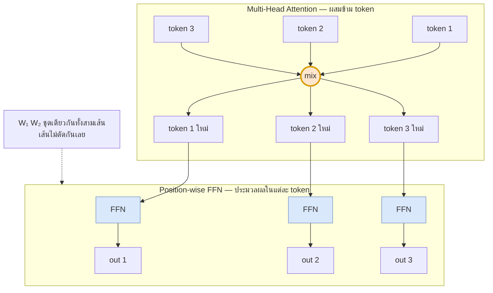
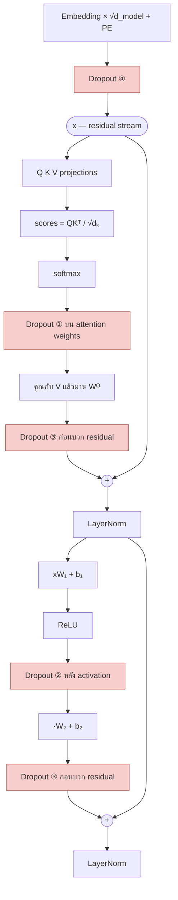

# 08 — Feed-Forward Network และ Residual Connection

> **ก่อนหน้า:** [07 — Positional Encoding](07-positional-encoding.md)
> **ถัดไป:** [09 — Layer Normalization](09-layernorm-math.md)

---

ไฟล์ 05–07 สร้าง attention เสร็จแล้ว แต่ attention ล้วน ๆ ยังเป็นแค่ **การเฉลี่ยแบบถ่วงน้ำหนัก** ของ value เท่านั้น — มันย้ายข้อมูลข้าม token ได้เก่ง แต่ *แปลง* ข้อมูลในแต่ละ token ได้น้อยมาก (แทบเป็น linear)

ไฟล์นี้เติมสองชิ้นที่เหลือของ Transformer block:

| ชิ้นส่วน | หน้าที่ | แก้ปัญหาอะไร |
|---|---|---|
| **Feed-Forward Network (FFN)** | ประมวลผลแบบ non-linear ภายในแต่ละ token | attention ไม่มีกำลังแปลงค่า |
| **Residual Connection** | บวก input กลับเข้า output | gradient หายเมื่อซ้อนเลเยอร์ลึก (ไฟล์ [02-2](02-seq2seq-limitations.md)) |

---

## 1. Position-wise Feed-Forward Network

### 1.1 สมการ

$$
\boxed{\ \text{FFN}(\mathbf{x}) = \max(0,\ \mathbf{x}W\_1 + \mathbf{b}\_1)\\,W\_2 + \mathbf{b}\_2\ }
$$

| สัญลักษณ์ | มิติ | ความหมาย |
|---|---|---|
| $\mathbf{x}$ | $\mathbb{R}^{1 \times d\_{\text{model}}}$ | เวกเตอร์ของ token **หนึ่งตำแหน่ง** |
| $W\_1$ | $\mathbb{R}^{d\_{\text{model}} \times d\_{\text{ff}}}$ | น้ำหนักชั้นขยาย (expand) |
| $\mathbf{b}\_1$ | $\mathbb{R}^{1 \times d\_{\text{ff}}}$ | bias ชั้นขยาย |
| $W\_2$ | $\mathbb{R}^{d\_{\text{ff}} \times d\_{\text{model}}}$ | น้ำหนักชั้นบีบ (contract) |
| $\mathbf{b}\_2$ | $\mathbb{R}^{1 \times d\_{\text{model}}}$ | bias ชั้นบีบ |
| $\text{FFN}(\mathbf{x})$ | $\mathbb{R}^{1 \times d\_{\text{model}}}$ | output — **มิติเท่า input เสมอ** |

เขียนแบบทั้งลำดับพร้อมกัน (row-major ตามข้อตกลงในไฟล์ [00](00-overview.md)) ก็แค่เปลี่ยน $\mathbf{x}$ เป็น $X$

$$
\text{FFN}(X) = \max(0,\ XW\_1 + \mathbf{1}\mathbf{b}\_1)\\,W\_2 + \mathbf{1}\mathbf{b}\_2, \qquad X \in \mathbb{R}^{n \times d\_{\text{model}}}
$$

โดย $\mathbf{1} \in \mathbb{R}^{n \times 1}$ คือการ broadcast bias ไปทุกแถว

> **จุดสำคัญ:** สังเกตว่าไม่มีดัชนี $i$ หรือ $j$ อยู่ในสมการเลย — FFN ไม่รู้จักเลยว่ามี token อื่นอยู่ในโลก

### 1.2 "Position-wise" แปลว่าอะไร

คำว่า *position-wise* หมายถึงสองอย่างพร้อมกัน:

1. **แชร์น้ำหนักทุกตำแหน่ง** — $W\_1, W\_2$ ชุดเดียวถูกใช้กับทุก token ในลำดับ (เหมือนที่ RNN แชร์ $W\_{hh}$ ข้ามเวลาในไฟล์ [01-2.2](01-seq2seq-rnn-basics.md))
2. **ไม่ผสมข้ามตำแหน่ง** — แถวที่ $i$ ของ output ขึ้นกับแถวที่ $i$ ของ input **เท่านั้น**

$$
\frac{\partial\\,\text{FFN}(X)\_i}{\partial X\_j} = 0 \quad \text{เมื่อ } i \ne j
$$

ต่างจาก attention อย่างสิ้นเชิง ซึ่งแถวที่ $i$ ของ output ขึ้นกับ **ทุกแถว** ของ input ผ่าน $\alpha\_{ij}$

### การแบ่งงานใน Transformer block



| | ผสมข้าม token | Non-linear แรง | พารามิเตอร์ต่อเลเยอร์ (base) |
|---|---|---|---|
| Attention | ✅ (นี่คืองานหลัก) | ❌ (softmax แค่สร้างน้ำหนัก ที่เหลือคือ linear) | 1,048,576 |
| FFN | ❌ | ✅ (ReLU + ขยาย 4 เท่า) | 2,097,152 |

> **สัญชาตญาณ:** คิดว่า attention คือ **"ไปหยิบของจาก token อื่นมา"** และ FFN คือ **"เอาของที่หยิบมาแล้วมานั่งคิด"** ถ้าขาด attention โมเดลจะเป็นแค่ MLP รายคำ; ถ้าขาด FFN โมเดลจะเป็นแค่เครื่องเฉลี่ยเวกเตอร์ที่ไม่มีกำลังคิด

### 1.3 ทำไม $d\_{\text{ff}} = 4 \cdot d\_{\text{model}}$

ใน Transformer-base: $d\_{\text{model}} = 512 \to d\_{\text{ff}} = 2048$ คืออัตราส่วน 4 เท่า (โมเดลยุคหลังอย่าง GPT-2/GPT-3 ก็ยังใช้ 4)

รูปทรงนี้เรียกว่า **expand แล้ว contract**

$$
\underbrace{\mathbb{R}^{512}}\_{\text{residual stream}}
\ \xrightarrow{\ W\_1\ }\ \underbrace{\mathbb{R}^{2048}}\_{\text{พื้นที่ทำงาน}}
\ \xrightarrow{\ \text{ReLU}\ }\ \mathbb{R}^{2048}
\ \xrightarrow{\ W\_2\ }\ \underbrace{\mathbb{R}^{512}}\_{\text{กลับเข้าท่อ}}
$$

**ทำไมต้องขยายก่อน:** ReLU ตัดค่าลบทิ้ง ถ้าทำในมิติ 512 เท่าเดิม จะเสียข้อมูลไปครึ่งหนึ่งของแกนโดยไม่มีที่ให้ชดเชย การขยายเป็น 2048 ก่อน ทำให้โมเดลสร้าง "ตัวตรวจจับ" (feature detector) ได้ 2048 ตัว แล้วค่อยเลือกสรุปกลับลงมา 512 มิติ — เป็นการซื้อกำลังแทนค่าด้วยพารามิเตอร์

**ผลต่อจำนวนพารามิเตอร์** — ให้ $r = d\_{\text{ff}}/d\_{\text{model}}$

$$
|\text{FFN}| = 2\\,r\\,d\_{\text{model}}^2, \qquad |\text{Attention}| = 4\\,d\_{\text{model}}^2
$$

| $r$ | $d\_{\text{ff}}$ | พารามิเตอร์ FFN | สัดส่วนต่อทั้งเลเยอร์ |
|---|---|---|---|
| 1 | 512 | 524,288 | 33.33% |
| 2 | 1024 | 1,048,576 | 50.00% |
| **4** | **2048** | **2,097,152** | **66.67%** |
| 8 | 4096 | 4,194,304 | 80.00% |

> $r=4$ คือจุดที่ชุมชนวิจัยลงตัวโดยการทดลอง ไม่ใช่จากทฤษฎี — เล็กกว่านี้โมเดลอ่อน ใหญ่กว่านี้ได้ผลตอบแทนลดลงเทียบกับต้นทุน

### 1.4 อีกสองมุมมองของ FFN

**มุมมองที่ 1 — Key-Value Memory**

แตกสมการออกเป็นรายคอลัมน์ ให้ $\mathbf{k}\_u$ = คอลัมน์ที่ $u$ ของ $W\_1$ และ $\mathbf{v}\_u$ = แถวที่ $u$ ของ $W\_2$

$$
\text{FFN}(\mathbf{x}) = \sum\_{u=1}^{d\_{\text{ff}}} \underbrace{\max(0,\ \mathbf{x}\cdot\mathbf{k}\_u + b\_{1u})}\_{\text{คะแนนความเข้ากัน (scalar)}} \cdot \underbrace{\mathbf{v}\_u}\_{\text{เนื้อหาที่จะเติม}} \ +\ \mathbf{b}\_2
$$

| ส่วน | บทบาท | เทียบกับ attention |
|---|---|---|
| คอลัมน์ของ $W\_1$ | **keys** — pattern ที่จะตรวจจับ | เหมือน $K$ แต่เป็นพารามิเตอร์ ไม่ได้มาจาก input |
| แถวของ $W\_2$ | **values** — เขียนอะไรกลับลงท่อ | เหมือน $V$ แต่คงที่ |
| ReLU | ฟังก์ชันถ่วงน้ำหนัก | เหมือน softmax แต่ **ไม่ normalize** และเป็น 0 ได้จริง |

> **สัญชาตญาณ:** FFN คือ attention ที่ key/value ไม่ได้มาจากประโยค แต่มาจาก **ความรู้ที่จำไว้ในน้ำหนัก** — งานวิจัยตีความว่านี่คือที่เก็บ "ข้อเท็จจริง" ของโมเดล (เช่น *ปารีสอยู่ในฝรั่งเศส*) ส่วน attention คือที่เก็บ "ความสัมพันธ์ในบริบทตรงหน้า"

**มุมมองที่ 2 — Convolution เคอร์เนลขนาด 1**

การ apply matrix เดียวกันกับทุกตำแหน่งของลำดับ ก็คือนิยามของ **1-D convolution ที่ kernel size = 1** พอดี

```python
import torch.nn as nn
ffn_linear = nn.Sequential(nn.Linear(512, 2048), nn.ReLU(), nn.Linear(2048, 512))
ffn_conv   = nn.Sequential(nn.Conv1d(512, 2048, kernel_size=1), nn.ReLU(),
                           nn.Conv1d(2048, 512, kernel_size=1))
# สองอันนี้เทียบเท่ากันทุกประการ ต่างแค่ layout ของ tensor
# Linear: (B, n, d)      Conv1d: (B, d, n)
```

นี่อธิบายว่าทำไมบางเปเปอร์เรียกมันว่า *point-wise convolution* — และชี้ชัดว่า FFN **ไม่มีทาง** มองเห็น token ข้างเคียง เพราะ receptive field กว้าง 1

### 1.5 ตัวเลือก Activation: ReLU → GELU → SwiGLU

| ชื่อ | สมการ | ใช้ใน |
|---|---|---|
| **ReLU** | $\text{ReLU}(z) = \max(0, z)$ | Transformer ต้นฉบับ (2017) |
| **GELU** | $\text{GELU}(z) = z\\,\Phi(z) = \tfrac{z}{2}\left[1 + \text{erf}\\!\left(\tfrac{z}{\sqrt{2}}\right)\right]$ | BERT, GPT-2, GPT-3 |
| **SwiGLU** | $\text{SwiGLU}(\mathbf{x}) = \left[\text{Swish}(\mathbf{x}W\_1 + \mathbf{b}\_1)\right] \odot \left(\mathbf{x}W\_g + \mathbf{b}\_g\right)$ | LLaMA, PaLM, Mistral |

โดย $\Phi$ คือ CDF ของ normal มาตรฐาน และ $\text{Swish}(z) = z\\,\sigma(z) = \dfrac{z}{1+e^{-z}}$

**เมื่อใช้ SwiGLU สมการ FFN เต็มกลายเป็น**

$$
\text{FFN}\_{\text{SwiGLU}}(\mathbf{x}) = \Big[\text{Swish}(\mathbf{x}W\_1 + \mathbf{b}\_1) \odot (\mathbf{x}W\_g + \mathbf{b}\_g)\Big] W\_2 + \mathbf{b}\_2
$$

| | ต่อเนื่องอนุพันธ์ | ค่าลบผ่านได้ | จำนวนเมทริกซ์ | หมายเหตุ |
|---|---|---|---|---|
| ReLU | ❌ (หักที่ 0) | ❌ | 2 | เร็วที่สุด, dead unit ได้ |
| GELU | ✅ | ✅ (นิดหน่อย) | 2 | นุ่มกว่า, ค่าใกล้ 0 ไม่ถูกตัดทิ้งทันที |
| SwiGLU | ✅ | ✅ | **3** | ดีที่สุดเชิงคุณภาพ แต่ต้องลด $d\_{\text{ff}}$ เหลือ $\approx \tfrac{8}{3}d\_{\text{model}}$ เพื่อคุมพารามิเตอร์ให้เท่าเดิม |

> **สัญชาตญาณของ GELU:** ReLU ตัดสินแบบแข็ง — "ถ้า $z{<}0$ ทิ้ง" ส่วน GELU ตัดสินแบบนุ่ม — "เก็บ $z$ ไว้ตามความน่าจะเป็นที่ $z$ จะมากกว่า noise มาตรฐาน" ผลคือกราฟเรียบ ไม่มีจุดหักที่ทำให้ gradient กระโดด
>
> **สัญชาตญาณของ SwiGLU:** เพิ่ม "ประตู" อีกทาง ($W\_g$) ที่คูณเข้ามาแบบ element-wise — โมเดลเลือกได้ว่าจะเปิดหรือปิดแต่ละหน่วยโดยดูจาก input เดียวกัน เป็นแนวคิดเดียวกับ gate ของ LSTM ในไฟล์ [01-3](01-seq2seq-rnn-basics.md)

---

## 2. Residual Connection

### 2.1 สมการ

$$
\boxed{\ \mathbf{y} = \mathbf{x} + \text{Sublayer}(\mathbf{x})\ }
$$

| สัญลักษณ์ | มิติ | ความหมาย |
|---|---|---|
| $\mathbf{x}$ | $\mathbb{R}^{1 \times d\_{\text{model}}}$ | input ของ sublayer |
| $\text{Sublayer}(\mathbf{x})$ | $\mathbb{R}^{1 \times d\_{\text{model}}}$ | ผลลัพธ์ของ attention หรือ FFN |
| $\mathbf{y}$ | $\mathbb{R}^{1 \times d\_{\text{model}}}$ | output |

ใน Transformer ต้นฉบับ สมการเต็มของแต่ละ sublayer คือ (Post-LN — ดูไฟล์ [09-4](09-layernorm-math.md))

$$
\mathbf{y} = \text{LN}\big(\mathbf{x} + \text{Dropout}(\text{Sublayer}(\mathbf{x}))\big)
$$

### 2.2 อนุพันธ์: ทำไม Gradient ถึงไม่หาย

อนุพันธ์ของ residual block คือ

$$
\frac{\partial \mathbf{y}}{\partial \mathbf{x}} = I + \frac{\partial\\,\text{Sublayer}(\mathbf{x})}{\partial \mathbf{x}}
$$

ซ้อน $N$ ชั้น แล้วกางด้วย chain rule จะได้

$$
\frac{\partial \mathbf{y}\_N}{\partial \mathbf{x}\_0} = \prod\_{l=1}^{N}\left(I + J\_l\right)
= I + \sum\_l J\_l + \sum\_{l{<}l'} J\_{l'}J\_l + \cdots
$$

**ผลลัพธ์ที่ต้องจำ:** ในผลคูณนั้นมีพจน์ $I$ อยู่เสมอ — คือ **ทางลัดที่คูณด้วย identity ตลอด ไม่ว่า $J\_l$ จะเล็กแค่ไหน**

เทียบกับกรณีไม่มี residual ($\mathbf{y} = \text{Sublayer}(\mathbf{x})$)

$$
\frac{\partial \mathbf{y}\_N}{\partial \mathbf{x}\_0} = \prod\_{l=1}^{N} J\_l
$$

ถ้า $\\|J\_l\\| \approx 0.8$ ทุกชั้น พอ $N = 30$ ก็เหลือ $0.8^{30} \approx 0.0012$ — gradient หายไป 99.9%

> **สัญชาตญาณ:** ไม่มี residual = gradient ต้องเดินผ่านทุกด่านและถูกหักภาษีทุกด่าน
> มี residual = มี**ทางด่วนตรง**จาก loss ถึงทุกเลเยอร์ ที่ไม่ผ่านด่านไหนเลย ชั้นลึกแค่ไหนก็ได้รับสัญญาณเต็ม ๆ อย่างน้อยหนึ่งเส้นทาง

**โยงกลับไฟล์ [02-2](02-seq2seq-limitations.md):** ปัญหา vanishing gradient ของ RNN คือ $\prod\_t \frac{\partial \mathbf{h}\_t}{\partial \mathbf{h}\_{t-1}}$ หดตัวตามความยาวลำดับ LSTM แก้บางส่วนด้วย $\frac{\partial \mathbf{c}\_t}{\partial \mathbf{c}\_{t-1}} = \mathbf{f}\_t$ ซึ่งเป็นการคูณ (เข้าใกล้ 1 ถ้า gate เปิด) แต่ residual connection **ดีกว่านั้นอีกขั้น** เพราะเป็น $I$ เป๊ะ ๆ ไม่ใช่ค่าที่เรียนแล้วหวังว่าจะใกล้ 1

| | เส้นทาง gradient | รับประกันไหม |
|---|---|---|
| RNN | $\prod\_t W\_{hh}^\top \text{diag}(\tanh')$ | ❌ หดหรือระเบิดตาม eigenvalue |
| LSTM cell | $\prod\_t \mathbf{f}\_t$ | ⚠️ ต้องเรียนให้ $\mathbf{f}\_t \approx 1$ |
| **Residual** | $\prod\_l (I + J\_l) \supseteq I$ | ✅ พจน์ $I$ มีอยู่เสมอ ไม่ต้องเรียน |

### 2.3 การตีความเป็น Residual Stream

จัดสมการใหม่เป็นรูปสะสม จะเห็นภาพที่ทรงพลังกว่า

$$
\mathbf{x}\_N = \mathbf{x}\_0 + \sum\_{l=1}^{N} \text{Sublayer}\_l(\mathbf{x}\_{l-1})
$$

**อ่านว่า:** output สุดท้าย = embedding ตั้งต้น **บวก** ผลรวมของสิ่งที่ทุก sublayer เขียนเพิ่มเข้าไป

```mermaid
flowchart LR
    E["Embedding + PE"] --> S0(["residual stream<br/>d_model = 512"])
    S0 --> S1(["stream"]) --> S2(["stream"]) --> S3(["stream"]) --> S4(["stream"]) --> OUT["Encoder output"]

    S0 -.->|"อ่าน"| A1["Self-Attention L1"]
    A1 -.->|"เขียนบวกกลับ"| S1
    S1 -.->|"อ่าน"| F1["FFN L1"]
    F1 -.->|"เขียนบวกกลับ"| S2
    S2 -.->|"อ่าน"| A2["Self-Attention L2"]
    A2 -.->|"เขียนบวกกลับ"| S3
    S3 -.->|"อ่าน"| F2["FFN L2"]
    F2 -.->|"เขียนบวกกลับ"| S4

    style S0 fill:#dae8fc,stroke:#6c8ebf,stroke-width:3px
    style S4 fill:#dae8fc,stroke:#6c8ebf,stroke-width:3px
    style A1 fill:#ffe6cc,stroke:#d79b00
    style A2 fill:#ffe6cc,stroke:#d79b00
    style F1 fill:#d5e8d4,stroke:#82b366
    style F2 fill:#d5e8d4,stroke:#82b366
```



> **สัญชาตญาณ:** residual stream คือ **"ท่อกลาง" หรือ "กระดานดำร่วม"** ที่มีความจุ $d\_{\text{model}}$ ตัวเลข ทุก sublayer ทำงานเหมือนกันหมด คือ *อ่านจากท่อ → คิด → เขียนบวกกลับลงท่อทีละน้อย* ไม่มี sublayer ไหนเขียนทับของเดิม
>
> ผลข้างเคียงที่สำคัญ: โมเดลจึงเรียนได้ง่ายมากที่จะ **"ไม่ทำอะไรเลย"** — แค่ให้ $\text{Sublayer}(\mathbf{x}) \approx \mathbf{0}$ ก็ได้ identity function ทันที นี่คือเหตุผลลึก ๆ ที่ทำให้ซ้อนเลเยอร์เยอะ ๆ แล้วไม่แย่ลง (เพิ่มเลเยอร์แล้วอย่างน้อยก็เสมอตัว)

### 2.4 ทำไมทุก Sublayer ต้อง Output มิติ $d\_{\text{model}}$

เพราะสมการ $\mathbf{y} = \mathbf{x} + \text{Sublayer}(\mathbf{x})$ **ต้องบวกกันได้** การบวกเวกเตอร์ต้องมีมิติเท่ากันเป๊ะ

นี่คือข้อบังคับเชิงสถาปัตยกรรมที่ไล่ย้อนกลับไปกำหนดทุกอย่าง:

| ชิ้นส่วน | ทำไมมิติต้องลงเอยที่ $d\_{\text{model}}$ |
|---|---|
| Multi-Head Attention | $H$ หัว × $d\_v$ = $8 \times 64 = 512$ แล้วผ่าน $W^O \in \mathbb{R}^{Hd\_v \times d\_{\text{model}}}$ (ไฟล์ [06](06-multi-head-attention.md)) |
| FFN | ขยายไป $d\_{\text{ff}}$ ได้ชั่วคราว แต่ $W\_2$ ต้องบีบกลับมา $d\_{\text{model}}$ |
| Positional Encoding | $PE$ ต้องมีมิติ $d\_{\text{model}}$ เพราะบวกกับ embedding (ไฟล์ [07](07-positional-encoding.md)) |
| Embedding | $d\_{\text{model}}$ ตั้งแต่แรก |

> **จุดสำคัญ:** $d\_{\text{model}}$ ไม่ได้เป็นแค่ hyperparameter ตัวหนึ่ง — มันคือ **ความกว้างของท่อ** ที่ทุกชิ้นส่วนต้องเคารพ ถ้าจะเปลี่ยน ต้องเปลี่ยนพร้อมกันทั้งโมเดล

---

## 3. Dropout วางตรงไหนบ้าง

Transformer ต้นฉบับใช้ $P\_{\text{drop}} = 0.1$ และวาง dropout ไว้ **4 จุด**



| จุด | ตำแหน่ง | เหตุผล |
|---|---|---|
| ① | หลัง softmax ของ attention | บังคับไม่ให้พึ่ง token ใด token หนึ่งมากเกินไป |
| ② | หลัง activation ใน FFN | regularize หน่วยใน $d\_{\text{ff}}$ ทั้ง 2048 ตัว |
| ③ | บน output ของ sublayer **ก่อน** บวก residual | สำคัญที่สุด — ห้าม drop ตัว $\mathbf{x}$ บนท่อ ไม่งั้นทางลัด identity พัง |
| ④ | หลัง embedding + positional encoding | กันการ overfit ต่อคำเฉพาะ |

### สมการเชิงคาดหวัง (Inverted Dropout)

ตอน **train** สุ่มหน้ากาก $m\_u \sim \text{Bernoulli}(1-p)$ แล้ว

$$
\tilde{x}\_u = \frac{m\_u}{1-p}\\,x\_u
$$

ตอน **inference** ไม่ทำอะไรเลย: $\tilde{x}\_u = x\_u$

**ทำไมต้องหารด้วย $1-p$:** เพื่อให้ค่าคาดหวังไม่เปลี่ยน

$$
\mathbb{E}[\tilde{x}\_u] = \frac{\mathbb{E}[m\_u]}{1-p}x\_u = \frac{1-p}{1-p}x\_u = x\_u
$$

> **สัญชาตญาณ:** ถ้าไม่หาร ตอน train ค่าเฉลี่ยของ activation จะเล็กลง $(1-p)$ เท่า แต่ตอน inference กลับเต็ม → สเกลไม่ตรงกัน โมเดลที่เทรนมาจะเจอค่าที่ใหญ่กว่าที่เคยเห็น การหารตอน train ("inverted") ย้ายภาระมาไว้ฝั่ง train ทั้งหมด ทำให้โค้ด inference ไม่ต้องทำอะไรเลย

```python
import numpy as np
def dropout_train(x, p=0.1, rng=np.random.default_rng(0)):
    mask = (rng.random(x.shape) > p).astype(x.dtype)
    return x * mask / (1.0 - p)      # ← inverted: หารตอน train

def dropout_eval(x, p=0.1):
    return x                          # ← inference ไม่แตะเลย
```

```python
import torch, torch.nn as nn
x = torch.ones(1, 8)
drop = nn.Dropout(p=0.1)
drop.train();  print(drop(x))   # สุ่ม mask + หารด้วย 0.9 ให้อัตโนมัติ → ค่าที่รอดเป็น 1.1111
drop.eval();   print(drop(x))   # กลายเป็น identity → ทุกค่าเป็น 1.0
```

---

## 4. เดินตัวเลข

### 4.1 เดิน token เดียวผ่าน FFN + Residual

ใช้โมเดลจิ๋ว $d\_{\text{model}} = 4$, $d\_{\text{ff}} = 8$ (ยังคงอัตราส่วน 2 เท่าเพื่อให้ตารางพอดีหน้า)

**Input** — เวกเตอร์ของ token หนึ่งตัวบนท่อ

$$
\mathbf{x} = [1.0,\ -2.0,\ 0.5,\ 3.0]
$$

**น้ำหนัก**

$$
W\_1 = \begin{bmatrix}
 0.5 & -0.3 &  0.2 &  1.0 & -0.6 &  0.4 & -0.1 &  0.7 \\\
-0.2 &  0.6 & -0.4 &  0.3 &  0.5 & -0.7 &  0.2 & -0.5 \\\
 0.8 &  0.1 & -0.9 &  0.4 &  0.3 &  0.6 & -0.3 &  0.2 \\\
 0.1 & -0.4 &  0.5 & -0.2 &  0.7 &  0.3 &  0.9 & -0.6
\end{bmatrix},
\quad
\mathbf{b}\_1 = [0.1,\ 0,\ -0.2,\ 0.3,\ -0.1,\ 0.2,\ 0,\ -0.3]
$$

$$
W\_2 = \begin{bmatrix}
 0.3 & -0.5 &  0.2 &  0.4 \\\
-0.6 &  0.1 &  0.7 & -0.2 \\\
 0.2 &  0.8 & -0.3 &  0.5 \\\
 0.9 & -0.1 &  0.4 & -0.7 \\\
-0.4 &  0.3 &  0.6 &  0.1 \\\
 0.5 &  0.2 & -0.8 &  0.3 \\\
 0.1 & -0.7 &  0.2 &  0.6 \\\
-0.3 &  0.4 &  0.1 & -0.4
\end{bmatrix},
\quad
\mathbf{b}\_2 = [0.05,\ -0.1,\ 0.2,\ 0.0]
$$

**ขั้นที่ 1 — ขยายเป็น 8 มิติ**

$$
\mathbf{h} = \mathbf{x}W\_1 + \mathbf{b}\_1 = [1.7,\ -2.65,\ 1.85,\ 0.3,\ 0.55,\ 3.2,\ 2.05,\ -0.3]
$$

*(ตรวจหน่วยที่ 1: $1.0(0.5) + (-2.0)(-0.2) + 0.5(0.8) + 3.0(0.1) + 0.1 = 0.5+0.4+0.4+0.3+0.1 = 1.7$ ✔)*

**ขั้นที่ 2 — ReLU**

| หน่วย $u$ | 1 | 2 | 3 | 4 | 5 | 6 | 7 | 8 |
|---|---|---|---|---|---|---|---|---|
| $h\_u$ | 1.7 | **−2.65** | 1.85 | 0.3 | 0.55 | 3.2 | 2.05 | **−0.3** |
| $\max(0,h\_u)$ | 1.7 | **0** | 1.85 | 0.3 | 0.55 | 3.2 | 2.05 | **0** |

หน่วยที่ **2 และ 8 ถูกตัดเป็น 0** — คิดเป็น 25% ของ $d\_{\text{ff}}$ ทั้งหมด (ในโมเดลจริงมักถูกตัดราว ๆ ครึ่งหนึ่ง)

> **จุดสำคัญ:** หน่วยที่ถูกตัดจะไม่มี gradient ไหลย้อนผ่านมันเลย ($\text{ReLU}'(z) = 0$ เมื่อ $z{<}0$) ถ้าหน่วยไหนติดลบ *ทุก input* ตลอดกาล จะกลายเป็น **dead unit** ที่ไม่มีวันฟื้น — นี่คือแรงจูงใจข้อหนึ่งของ GELU

**ขั้นที่ 3 — บีบกลับเป็น 4 มิติ**

$$
\text{FFN}(\mathbf{x}) = \max(0,\mathbf{h})\\,W\_2 + \mathbf{b}\_2 = [2.785,\ -0.13,\ -1.715,\ 3.64]
$$

**ขั้นที่ 4 — บวก residual**

$$
\mathbf{y} = \mathbf{x} + \text{FFN}(\mathbf{x}) = [1.0, -2.0, 0.5, 3.0] + [2.785, -0.13, -1.715, 3.64]
$$

$$
\boxed{\ \mathbf{y} = [3.785,\ -2.13,\ -1.215,\ 6.64]\ }
$$

| มิติ | $x$ | $\text{FFN}(x)$ | $y = x + \text{FFN}(x)$ | สิ่งที่ sublayer ทำ |
|---|---|---|---|---|
| 1 | 1.0 | +2.785 | 3.785 | เสริมแรง |
| 2 | −2.0 | −0.130 | −2.130 | แทบไม่แตะ — ปล่อยข้อมูลเดิมผ่าน |
| 3 | 0.5 | −1.715 | −1.215 | **กลับเครื่องหมาย** |
| 4 | 3.0 | +3.640 | 6.640 | ขยายแรง |

**อ่านผล:** มิติที่ 2 คือตัวอย่างของสิ่งที่ residual ทำให้เป็นไปได้ — sublayer เลือก "ไม่ทำอะไร" กับมิตินั้น แล้วข้อมูลเดิม $-2.0$ ก็เดินทางต่อไปยังเลเยอร์ถัดไปแทบไม่บุบสลาย

```python
import numpy as np

x  = np.array([1.0, -2.0, 0.5, 3.0])
W1 = np.array([[ 0.5,-0.3, 0.2, 1.0,-0.6, 0.4,-0.1, 0.7],
               [-0.2, 0.6,-0.4, 0.3, 0.5,-0.7, 0.2,-0.5],
               [ 0.8, 0.1,-0.9, 0.4, 0.3, 0.6,-0.3, 0.2],
               [ 0.1,-0.4, 0.5,-0.2, 0.7, 0.3, 0.9,-0.6]])
b1 = np.array([0.1, 0.0,-0.2, 0.3,-0.1, 0.2, 0.0,-0.3])
W2 = np.array([[ 0.3,-0.5, 0.2, 0.4],[-0.6, 0.1, 0.7,-0.2],
               [ 0.2, 0.8,-0.3, 0.5],[ 0.9,-0.1, 0.4,-0.7],
               [-0.4, 0.3, 0.6, 0.1],[ 0.5, 0.2,-0.8, 0.3],
               [ 0.1,-0.7, 0.2, 0.6],[-0.3, 0.4, 0.1,-0.4]])
b2 = np.array([0.05,-0.1, 0.2, 0.0])

h = x @ W1 + b1                 # ← ขยาย: [ 1.7 -2.65 1.85 0.3 0.55 3.2 2.05 -0.3 ]
a = np.maximum(0.0, h)          # ← ReLU: หน่วย 2 และ 8 เป็น 0
y = a @ W2 + b2                 # ← บีบ:  [ 2.785 -0.13 -1.715 3.64 ]
out = x + y                     # ← residual: [ 3.785 -2.13 -1.215 6.64 ]
print(np.round(h,4), np.round(y,4), np.round(out,4), sep="\n")
```

```python
import torch, torch.nn as nn

class PositionwiseFFN(nn.Module):
    def __init__(self, d_model=512, d_ff=2048, p=0.1):
        super().__init__()
        self.w1 = nn.Linear(d_model, d_ff)      # ← xW₁ + b₁
        self.w2 = nn.Linear(d_ff, d_model)      # ← ·W₂ + b₂
        self.drop = nn.Dropout(p)               # ← Dropout ②
    def forward(self, x):
        return self.w2(self.drop(torch.relu(self.w1(x))))

ffn, ln, drop3 = PositionwiseFFN(), nn.LayerNorm(512), nn.Dropout(0.1)
x = torch.randn(2, 10, 512)
y = ln(x + drop3(ffn(x)))       # ← Post-LN residual block: y = LN(x + Dropout(Sublayer(x)))
print(y.shape)                  # torch.Size([2, 10, 512])
```

### 4.2 เทียบ Activation บนเวกเตอร์ pre-activation เดียวกัน

ใช้ $\mathbf{h}$ จากขั้นที่ 1 ข้างบน และให้ gate ของ SwiGLU เป็น $\mathbf{g} = \mathbf{x}W\_g + \mathbf{b}\_g = [0.5, -1.0, 1.5, 0.8, -0.4, 1.2, 0.3, -0.7]$

| $u$ | $h\_u$ | $\text{ReLU}$ | $\text{GELU}$ | $\text{Swish}$ | $g\_u$ | $\text{SwiGLU} = \text{Swish}(h\_u)\cdot g\_u$ |
|---|---|---|---|---|---|---|
| 1 | 1.70 | 1.7000 | 1.6242 | 1.4374 | 0.5 | 0.7187 |
| 2 | −2.65 | **0.0000** | −0.0107 | −0.1749 | −1.0 | 0.1749 |
| 3 | 1.85 | 1.8500 | 1.7905 | 1.5986 | 1.5 | 2.3980 |
| 4 | 0.30 | 0.3000 | 0.1854 | 0.1723 | 0.8 | 0.1379 |
| 5 | 0.55 | 0.5500 | 0.3899 | 0.3488 | −0.4 | −0.1395 |
| 6 | 3.20 | 3.2000 | 3.1978 | 3.0747 | 1.2 | 3.6896 |
| 7 | 2.05 | 2.0500 | 2.0086 | 1.8162 | 0.3 | 0.5449 |
| 8 | −0.30 | **0.0000** | −0.1146 | −0.1277 | −0.7 | 0.0894 |

**สิ่งที่เห็นจากตาราง:**

1. **ค่าบวกใหญ่ ๆ ทั้งสามเหมือนกันหมด** — ที่ $h=3.2$: ReLU 3.2000 vs GELU 3.1978 ต่างกัน 0.0022 ความแตกต่างอยู่ที่ย่านใกล้ศูนย์เท่านั้น
2. **ค่าลบไม่ถูกฆ่าทิ้ง** — ที่ $h = -0.3$ ReLU ให้ 0 แต่ GELU ให้ −0.1146 → ยังมี gradient ไหลย้อนได้ ไม่เกิด dead unit
3. **GELU กดค่ากลาง ๆ ลง** — ที่ $h=0.55$ ReLU ให้ 0.55 แต่ GELU ให้ 0.3899 (เหลือ 71%) เพราะยังไม่ "มั่นใจ" ว่าสัญญาณนี้จริง
4. **SwiGLU สลับเครื่องหมายได้** — หน่วยที่ 2 มี $h{<}0$ และ $g{<}0$ ผลคูณกลับเป็น **บวก** 0.1749 และหน่วยที่ 5 มี $h{>}0$ แต่ $g{<}0$ ผลกลับเป็น **ลบ** −0.1395 → gate ให้อิสระที่ ReLU/GELU ไม่มีเลย

```python
import numpy as np
from scipy.special import erf

h = np.array([1.7, -2.65, 1.85, 0.3, 0.55, 3.2, 2.05, -0.3])
g = np.array([0.5, -1.0, 1.5, 0.8, -0.4, 1.2, 0.3, -0.7])

relu  = np.maximum(0.0, h)
gelu  = 0.5 * h * (1.0 + erf(h / np.sqrt(2.0)))     # ← GELU แบบ exact
swish = h / (1.0 + np.exp(-h))                       # ← Swish/SiLU
swiglu = swish * g                                   # ← SwiGLU: Swish(hW₁) ⊙ (xW_g)
print(np.round(np.stack([relu, gelu, swish, swiglu]), 4))
```

```python
import torch
h = torch.tensor([1.7, -2.65, 1.85, 0.3, 0.55, 3.2, 2.05, -0.3])
g = torch.tensor([0.5, -1.0, 1.5, 0.8, -0.4, 1.2, 0.3, -0.7])
torch.relu(h)                                   # [1.7000, 0.0000, 1.8500, ...]
torch.nn.functional.gelu(h)                     # [1.6242, -0.0107, 1.7905, ...]
torch.nn.functional.silu(h)                     # [1.4374, -0.1749, 1.5986, ...]  (= Swish)
torch.nn.functional.silu(h) * g                 # [0.7187, 0.1749, 2.3980, ...]   (= SwiGLU)
```

### 4.3 นับพารามิเตอร์ของหนึ่งเลเยอร์ (Transformer-base จริง)

ค่าคงที่: $d\_{\text{model}}=512$, $d\_{\text{ff}}=2048$, $H=8$, $N=6$, $V \approx 37{,}000$

**สูตร**

$$
|\text{Attention}| = \underbrace{4 \cdot d\_{\text{model}}^2}\_{W^Q, W^K, W^V, W^O}, \qquad
|\text{FFN}| = \underbrace{2 \cdot d\_{\text{model}} \cdot d\_{\text{ff}}}\_{W\_1, W\_2}
$$

> $W^Q$ ทั้ง $H$ หัวรวมกันมีขนาด $d\_{\text{model}} \times H d\_k = 512 \times 512$ พอดี เพราะ $d\_k = d\_{\text{model}}/H$ (ไฟล์ [06](06-multi-head-attention.md)) จึงนับเป็น $d\_{\text{model}}^2$ ตัวเดียว ไม่ใช่ $H$ ตัว

> **ข้อตกลงการนับ (ใช้เหมือนกันทั้งชุดเอกสาร):** projection ของ attention ($W^Q, W^K, W^V, W^O$) **ไม่มี bias** ตาม implementation มาตรฐาน ส่วน FFN และ LayerNorm มี — ดูตารางเต็มทั้ง base/big ที่ไฟล์ [13-3.2](13-summary-notation-reference.md)

| ส่วนประกอบ | สูตร | น้ำหนัก | bias | รวม |
|---|---|---|---|---|
| Multi-Head Attention | $4d\_{\text{model}}^2$ | 1,048,576 | — | 1,048,576 |
| Feed-Forward | $2d\_{\text{model}}d\_{\text{ff}}$ | 2,097,152 | 2,560 | 2,099,712 |
| LayerNorm × 2 | $2 \cdot 2d\_{\text{model}}$ | — | 2,048 | 2,048 |
| **รวม 1 encoder layer** | | **3,145,728** | **4,608** | **3,150,336** |

| ระดับ | จำนวน | พารามิเตอร์ |
|---|---|---|
| Encoder 1 เลเยอร์ | | 3,150,336 |
| Encoder ทั้งหมด | $N = 6$ | 18,902,016 |
| Decoder 1 เลเยอร์ (มี cross-attention เพิ่ม) | | 4,199,936 |
| Decoder ทั้งหมด | $N = 6$ | 25,199,616 |
| Embedding (ใช้ร่วม encoder/decoder/output) | $V \times d\_{\text{model}}$ | 18,944,000 |
| **รวมทั้งโมเดล** | | **63,045,632 ≈ 63.0M** |

> **สิ่งที่ควรจำจากตารางนี้ 2 ข้อ:**
> 1. **FFN กิน 66.67% ของพารามิเตอร์ในแต่ละเลเยอร์** — มากกว่า attention เป็นสองเท่า ทั้งที่ attention คือส่วนที่คนพูดถึงมากกว่ามาก
> 2. **Embedding เพียงชั้นเดียวใหญ่เกือบเท่า encoder ทั้ง 6 ชั้น** (18.94M vs 18.90M) — เพราะ $V$ ใหญ่มาก นี่คือเหตุผลที่โมเดลจริงมัก **แชร์น้ำหนัก** ระหว่าง input embedding, output embedding และเมทริกซ์ projection สุดท้าย (*weight tying*)

```python
d_model, d_ff, H, N, V = 512, 2048, 8, 6, 37000

attn_w        = 4*d_model**2                      # W^Q W^K W^V W^O (ไม่มี bias)
ffn_w, ffn_b  = 2*d_model*d_ff, d_ff + d_model    # W₁ W₂
ln            = 2*d_model                         # gamma + beta ต่อ LayerNorm หนึ่งอัน

enc_layer = attn_w + ffn_w + ffn_b + 2*ln
dec_layer = 2*attn_w + ffn_w + ffn_b + 3*ln       # + cross-attention + LN อีกอัน
total     = V*d_model + N*enc_layer + N*dec_layer # embedding แบบ tied

print(attn_w, ffn_w, enc_layer)                   # 1048576 2097152 3150336
print(dec_layer, total)                           # 4199936 63045632
print(f"FFN คิดเป็น {ffn_w/(attn_w+ffn_w):.2%} ของน้ำหนักในเลเยอร์")   # 66.67%
print(N*enc_layer, N*dec_layer, V*d_model)        # 18902016 25199616 18944000
```

---

## 5. สรุปไฟล์นี้

| สิ่งที่ได้ | สมการหลัก |
|---|---|
| Position-wise FFN | $\text{FFN}(\mathbf{x}) = \max(0, \mathbf{x}W\_1 + \mathbf{b}\_1)W\_2 + \mathbf{b}\_2$ |
| การแบ่งงาน | attention = ผสมข้าม token; FFN = คิดในแต่ละ token (ไม่มีเทอมข้ามตำแหน่ง) |
| อัตราส่วนขยาย | $d\_{\text{ff}} = 4d\_{\text{model}}$ → FFN กิน 66.67% ของน้ำหนักต่อเลเยอร์ |
| มุมมอง key-value | $\text{FFN}(\mathbf{x}) = \sum\_u \max(0, \mathbf{x}\cdot\mathbf{k}\_u + b\_{1u})\\,\mathbf{v}\_u + \mathbf{b}\_2$ |
| Activation ยุคใหม่ | $\text{GELU}(z) = \tfrac{z}{2}[1+\text{erf}(z/\sqrt{2})]$, $\ \text{SwiGLU} = \text{Swish}(\mathbf{x}W\_1)\odot(\mathbf{x}W\_g)$ |
| Residual | $\mathbf{y} = \mathbf{x} + \text{Sublayer}(\mathbf{x})$ |
| ทำไม gradient ไม่หาย | $\frac{\partial \mathbf{y}\_N}{\partial \mathbf{x}\_0} = \prod\_l (I + J\_l)$ — มีพจน์ $I$ เสมอ |
| Residual stream | $\mathbf{x}\_N = \mathbf{x}\_0 + \sum\_l \text{Sublayer}\_l(\mathbf{x}\_{l-1})$ — ทุก sublayer อ่านจากท่อ เขียนบวกกลับลงท่อ |
| ข้อบังคับมิติ | ทุก sublayer ต้อง output $\mathbb{R}^{d\_{\text{model}}}$ เพราะต้องบวกกลับได้ |
| Inverted dropout | train: $\tilde{x} = \frac{m}{1-p}x$ ; inference: $\tilde{x} = x$ |

**คำถามที่ยังค้างอยู่:** เราบวก $\mathbf{x} + \text{Sublayer}(\mathbf{x})$ ไปเรื่อย ๆ ทุกเลเยอร์ — แล้วสเกลของค่าบนท่อจะไม่ระเบิดหรือ

ตอบ: จะระเบิดจริง ถ้าไม่มีตัวคุม ตัวคุมนั้นคือ **LayerNorm** ในไฟล์ถัดไป

---

**ถัดไป:** [09 — Layer Normalization](09-layernorm-math.md)
