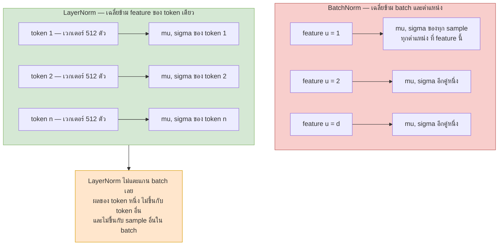
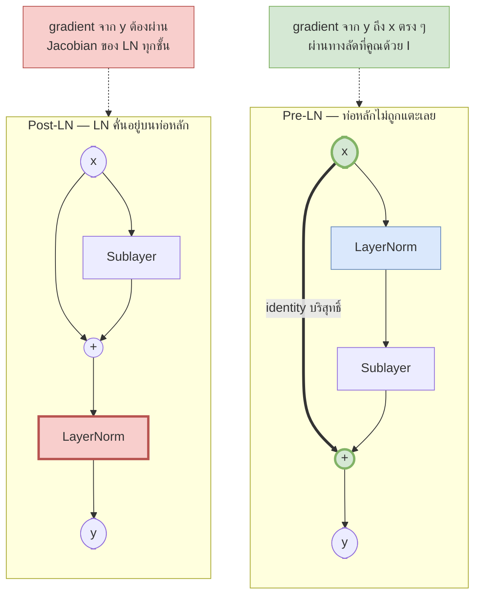

# 09 — Layer Normalization

> **ก่อนหน้า:** [08 — FFN และ Residual Connection](08-feedforward-and-residual.md)
> **ถัดไป:** [10 — Encoder เต็มรูปแบบ](10-encoder-full-pipeline.md)

---

ไฟล์ [08](08-feedforward-and-residual.md) จบด้วยคำถามค้างคา: ถ้าเราบวก $\mathbf{x} + \text{Sublayer}(\mathbf{x})$ ซ้ำไป 6 ครั้ง (หรือ 96 ครั้งในโมเดลใหญ่) สเกลของค่าบน residual stream จะโตขึ้นเรื่อย ๆ หรือไม่

ไฟล์นี้ตอบด้วยชิ้นส่วนสุดท้ายของ Transformer block คือ **LayerNorm**

---

## 1. ปัญหา: สเกลของ Activation ไม่คงที่ระหว่างเลเยอร์

### 1.1 อาการ

เมื่อซ้อนเลเยอร์ลึก ๆ การแจกแจงของ activation ที่เข้าแต่ละเลเยอร์จะ **เลื่อนและขยาย** ตลอดเวลาระหว่างเทรน เพราะน้ำหนักของเลเยอร์ก่อนหน้าเปลี่ยนทุก step

ผลที่ตามมา:

| อาการ | ทำไมถึงแย่ |
|---|---|
| สเกลของ input แต่ละเลเยอร์เปลี่ยนไปมา | เลเยอร์ต้อง "ไล่ตาม" เป้าที่ขยับ — เรียนช้า |
| ค่าบางมิติใหญ่มาก | อิ่มตัวใน $\tanh/\sigma$, ระเบิดใน softmax ของ attention |
| gradient ต่างสเกลกันมากในแต่ละเลเยอร์ | learning rate เดียวใช้ได้ไม่ดีกับทุกเลเยอร์ |
| residual บวกสะสม | $\text{Var}(\mathbf{x}\_N) \approx \text{Var}(\mathbf{x}\_0) + \sum\_l \text{Var}(\text{Sublayer}\_l)$ → โตแบบสะสม |

ชื่อดั้งเดิมของปัญหานี้คือ **internal covariate shift** (Ioffe & Szegedy, 2015) — "การแจกแจงของ input ที่เลเยอร์ชั้นในเห็น เปลี่ยนไปเรื่อย ๆ ระหว่างเทรน"

### 1.2 มุมมองยุคใหม่

งานวิจัยหลังจากนั้น (Santurkar et al., 2018) แสดงหลักฐานว่า internal covariate shift **ไม่ใช่** คำอธิบายหลัก — จงใจฉีด noise ให้การแจกแจงเลื่อนหลัง normalization โมเดลก็ยังเทรนเร็วอยู่ดี

คำอธิบายที่ยอมรับกันมากกว่าตอนนี้คือ **normalization ทำให้ loss landscape เรียบขึ้น** (smoother / Lipschitz ดีขึ้น)

> **สัญชาตญาณ:** ลอง normalize แล้ววาดภูมิประเทศของ loss ใหม่ — หุบเขาที่เคยเป็นร่องแคบยาว (สเกลแต่ละแกนต่างกันมาก) จะกลายเป็นชามที่กลมขึ้น เมื่อภูมิประเทศเรียบ:
> - gradient ที่จุดปัจจุบันยังเชื่อถือได้แม้ก้าวไกลขึ้น → **ใช้ learning rate ใหญ่ได้**
> - เส้นทางลงเขาไม่เด้งไปมา → **เทรนเสถียร**

| | ไม่มี normalization | มี LayerNorm |
|---|---|---|
| Learning rate ที่ใช้ได้ | เล็ก | ใหญ่กว่ามาก |
| ไวต่อการ init | มาก | น้อย |
| ความลึกที่เทรนไหว | ตื้น | ลึกได้หลายสิบชั้น |

---

## 2. Layer Normalization

### 2.1 สมการ

สำหรับเวกเตอร์ของ **token หนึ่งตัว** $\mathbf{x} \in \mathbb{R}^{1 \times d}$ (โดย $d = d\_{\text{model}}$)

$$
\mu = \frac{1}{d}\sum\_{u=1}^{d} x\_u, \qquad
\sigma^2 = \frac{1}{d}\sum\_{u=1}^{d} (x\_u - \mu)^2
$$

$$
\boxed{\ \text{LN}(\mathbf{x}) = \boldsymbol{\gamma} \odot \frac{\mathbf{x} - \mu}{\sqrt{\sigma^2 + \epsilon}} + \boldsymbol{\beta}\ }
$$

| สัญลักษณ์ | มิติ | ความหมาย |
|---|---|---|
| $\mathbf{x}$ | $\mathbb{R}^{1 \times d\_{\text{model}}}$ | เวกเตอร์ของ token หนึ่งตำแหน่ง |
| $\mu$ | scalar | ค่าเฉลี่ย **ของ token นั้นตัวเดียว** ข้าม $d$ มิติ |
| $\sigma^2$ | scalar | ความแปรปรวน (หารด้วย $d$ ไม่ใช่ $d-1$) |
| $\epsilon$ | scalar | ค่าคงที่กันหารศูนย์ — ปกติ $10^{-5}$ |
| $\boldsymbol{\gamma}$ | $\mathbb{R}^{1 \times d\_{\text{model}}}$ | **พารามิเตอร์เรียนได้** — สเกลรายมิติ (init = $\mathbf{1}$) |
| $\boldsymbol{\beta}$ | $\mathbb{R}^{1 \times d\_{\text{model}}}$ | **พารามิเตอร์เรียนได้** — เลื่อนรายมิติ (init = $\mathbf{0}$) |
| $\text{LN}(\mathbf{x})$ | $\mathbb{R}^{1 \times d\_{\text{model}}}$ | output มิติเท่าเดิม |

> **จุดสำคัญ:** $\mu$ และ $\sigma^2$ เป็น **scalar ต่อหนึ่ง token** ไม่ใช่ต่อหนึ่ง batch ถ้า input เป็น $X \in \mathbb{R}^{n \times d}$ จะได้ $\mu, \sigma^2$ อย่างละ $n$ ค่า — token ละคู่ ไม่ยุ่งกันเลย
>
> จำนวนพารามิเตอร์ของ LayerNorm หนึ่งอัน = $2d\_{\text{model}} = 1024$ ตัว — จิ๋วมากเทียบกับ 3.1M ของทั้งเลเยอร์ (ไฟล์ [08-4.3](08-feedforward-and-residual.md))

### 2.2 ทำไมหาสถิติตามแกน Feature ไม่ใช่แกน Batch

tensor ใน Transformer มีสามแกน: $(B,\ n,\ d\_{\text{model}})$ การเลือกว่าจะเฉลี่ยตามแกนไหนคือหัวใจของเรื่องนี้



เหตุผลที่ต้องเป็นแกน feature ใน NLP:

1. **ความยาวไม่เท่ากัน** — ประโยคใน batch เดียวกันยาว 5, 30, 100 token ตำแหน่งที่ 90 มีข้อมูลจริงแค่ sample เดียว ค่าเฉลี่ยข้าม batch ที่ตำแหน่งนั้นจึงคำนวณจากตัวอย่างเดียว → ไร้ความหมาย
2. **padding ปนเปื้อนสถิติ** — ถ้าเฉลี่ยข้าม batch ค่า padding (ศูนย์) จะถูกนับรวมเข้าไปด้วย ทำให้สถิติเพี้ยนตามสัดส่วน padding ในแต่ละ batch
3. **inference ทีละหนึ่ง** — ตอน generate ข้อความ batch size = 1 เสมอ ถ้าพึ่งสถิติ batch ก็ไม่มีอะไรให้เฉลี่ย
4. **ต้องสอดคล้องกับ residual stream** — สิ่งที่เราอยากคุมสเกลคือ "เวกเตอร์ของ token หนึ่งบนท่อ" ซึ่งเป็นวัตถุตามแกน feature พอดี

> **สัญชาตญาณ:** LayerNorm ถามว่า *"เวกเตอร์ 512 ตัวของ token นี้ กระจายตัวยังไงกันเอง"* ส่วน BatchNorm ถามว่า *"feature ที่ 37 ของทุกตัวอย่างใน batch กระจายตัวยังไง"* คำถามแรกตอบได้เสมอ ไม่ว่า batch จะมีกี่ตัวอย่าง คำถามที่สองต้องพึ่งเพื่อนร่วม batch

### 2.3 บทบาทของ $\boldsymbol{\gamma}$ และ $\boldsymbol{\beta}$

หลัง normalize แล้ว เวกเตอร์ $\hat{\mathbf{x}} = \frac{\mathbf{x}-\mu}{\sqrt{\sigma^2+\epsilon}}$ ถูกบังคับให้ mean = 0, std = 1 **เสมอ** ซึ่งเป็นการ **ริบอิสระ** ไป 2 องศาต่อหนึ่ง token

นั่นทำให้เลเยอร์เสียกำลังการแทนค่า เช่น:
- ถ้าเลเยอร์ก่อนหน้าอยากส่งสัญญาณว่า "ค่าเฉลี่ยของ token นี้สูงผิดปกติ" → ข้อมูลนั้นถูกลบทิ้ง
- ถ้า sublayer ถัดไปทำงานได้ดีที่สุดเมื่อ input มี std = 3 → มันทำไม่ได้

$\boldsymbol{\gamma}, \boldsymbol{\beta}$ **คืนอิสระนั้นกลับให้โมเดล** โดยให้มันเลือกเองว่าจะเอาสเกลและตำแหน่งเท่าไร — และเลือกได้ **แยกรายมิติ** ด้วย

$$
\text{ถ้า}\ \boldsymbol{\gamma} = \sqrt{\sigma^2 + \epsilon}\ \text{และ}\ \boldsymbol{\beta} = \mu \quad\Longrightarrow\quad \text{LN}(\mathbf{x}) = \mathbf{x}
$$

> **จุดสำคัญ:** LayerNorm จึงไม่ได้ "บังคับ" ให้ output เป็น mean 0 / std 1 — มัน **ตัดการพึ่งพาสเกลของ input ทิ้ง** แล้วให้โมเดลกำหนดสเกลใหม่ด้วยพารามิเตอร์ที่ควบคุมได้โดยตรง ต่างกันตรงที่สเกลใหม่นี้เป็นของ *เลเยอร์นี้* ไม่ใช่ผลพลอยได้จากเลเยอร์ก่อนหน้าที่กำลังเปลี่ยนไปทุก step

---

## 3. เทียบกับ BatchNorm

### 3.1 ตารางเปรียบเทียบ

| ประเด็น | **BatchNorm** | **LayerNorm** |
|---|---|---|
| แกนที่ normalize | ข้าม $(B, n)$ — ทีละ feature | ข้าม $d\_{\text{model}}$ — ทีละ token |
| จำนวนคู่ $(\mu,\sigma^2)$ | $d\_{\text{model}}$ คู่ | $B \times n$ คู่ |
| ขึ้นกับ batch size | ✅ ใช่ — batch เล็กสถิติมั่ว | ❌ ไม่เลย |
| ตัวอย่างอื่นใน batch มีผลกับผลลัพธ์ | ✅ ใช่ | ❌ ไม่ |
| พฤติกรรมตอน inference | ต่างจากตอน train — ต้องใช้ **running mean/var** ที่สะสมไว้ | **เหมือนกันเป๊ะ** ไม่มีโหมด train/eval |
| ลำดับยาวไม่เท่ากัน / padding | สถิติปนเปื้อน ต้อง mask เอง | ไม่มีปัญหา ทุก token คิดของตัวเอง |
| batch size = 1 | ใช้ไม่ได้ (var = 0) | ใช้ได้ปกติ |
| พารามิเตอร์ | $2d\_{\text{model}}$ + buffer อีก $2d\_{\text{model}}$ | $2d\_{\text{model}}$ |
| เหมาะกับ | CNN / vision (ขนาด input คงที่) | NLP / sequence (ความยาวแปรผัน) |

### 3.2 ทำไม BatchNorm ใช้กับ NLP ได้ไม่ดี

**เหตุผลที่ 1 — ความยาวแปรผันทำให้สถิติไม่เท่าเทียม**

สมมติ batch มี 32 ประโยค ยาว 5 ถึง 100 token

| ตำแหน่ง | จำนวน sample ที่มีข้อมูลจริง | คุณภาพของ $(\mu, \sigma^2)$ |
|---|---|---|
| 1 | 32 | ดี |
| 20 | ~12 | เริ่มไม่นิ่ง |
| 90 | 1–2 | ใช้ไม่ได้ |

**เหตุผลที่ 2 — train/inference ไม่ตรงกัน**

BatchNorm ตอน inference ใช้ running statistics

$$
\mu\_{\text{run}} \leftarrow (1-\alpha)\mu\_{\text{run}} + \alpha\\,\mu\_{\text{batch}}
$$

ถ้าการแจกแจงตอนใช้งานต่างจากตอนเทรน (ประโยคยาวกว่า โดเมนต่าง) สถิติที่สะสมไว้จะผิด — และ **ยิ่งเป็นเรื่องใหญ่ใน generation** ที่ decoder ผลิตทีละ token ด้วย batch size 1

**เหตุผลที่ 3 — ผลลัพธ์ขึ้นกับเพื่อนร่วม batch**

ภายใต้ BatchNorm การแปลประโยค A จะเปลี่ยนไป ถ้าจับคู่ประโยค A เข้ากับ batch ที่ต่างกัน ซึ่งเป็นพฤติกรรมที่ยอมรับไม่ได้ตอน deploy

> **สรุปสั้น ๆ:** BatchNorm สมมติว่า "ทุกตัวอย่างใน batch เทียบกันได้ตรงตำแหน่ง" — สมมติฐานนี้จริงกับภาพขนาด 224×224 แต่ไม่จริงกับประโยค

```python
import torch, torch.nn as nn
x = torch.randn(4, 7, 512)                 # (B=4, n=7, d_model=512)

ln = nn.LayerNorm(512)                     # normalize แกนสุดท้าย
print(ln(x).shape)                         # (4, 7, 512)
print(ln(x[:1]).allclose(ln(x)[:1], atol=1e-6))   # True ← ผลของ sample 0 ไม่ขึ้นกับเพื่อนใน batch

bn = nn.BatchNorm1d(512)
print(bn(x.transpose(1, 2)).shape)         # ต้องสลับแกนเป็น (B, d, n) ก่อน
print(bn(x[:1].transpose(1, 2)).allclose(bn(x.transpose(1, 2))[:1]))   # False ← ขึ้นกับ batch
```

---

## 4. Post-LN vs Pre-LN

### 4.1 สมการทั้งสองแบบ

$$
\textbf{Post-LN (2017 ต้นฉบับ)}: \quad \mathbf{y} = \text{LN}\big(\mathbf{x} + \text{Sublayer}(\mathbf{x})\big)
$$

$$
\textbf{Pre-LN (GPT-2 เป็นต้นมา)}: \quad \mathbf{y} = \mathbf{x} + \text{Sublayer}\big(\text{LN}(\mathbf{x})\big)
$$



ในสถาปัตยกรรมจริง Pre-LN ต้องเติม **LayerNorm ตัวสุดท้าย** หลัง stack ทั้งหมด เพราะไม่มีอะไรคุมสเกลของท่อเลย

$$
\text{Encoder}\_{\text{Pre-LN}}(X) = \text{LN}\_{\text{final}}\Big(\big(\text{block}\_N \circ \cdots \circ \text{block}\_1\big)(X)\Big)
$$

### 4.2 การวิเคราะห์ขนาด Gradient

กางเส้นทาง gradient ของทั้งสองแบบผ่าน $N$ ชั้น

**Pre-LN** — ให้ $F\_l = \text{Sublayer}\_l \circ \text{LN}$

$$
\mathbf{x}\_N = \mathbf{x}\_0 + \sum\_{l=1}^{N} F\_l(\mathbf{x}\_{l-1})
\quad\Longrightarrow\quad
\frac{\partial \mathbf{x}\_N}{\partial \mathbf{x}\_0} = \prod\_{l=1}^{N}\left(I + \frac{\partial F\_l}{\partial \mathbf{x}\_{l-1}}\right)
$$

**Post-LN** — ให้ $J^{\text{LN}}\_l$ คือ Jacobian ของ LayerNorm ชั้นที่ $l$

$$
\frac{\partial \mathbf{x}\_N}{\partial \mathbf{x}\_0} = \prod\_{l=1}^{N} J^{\text{LN}}\_l\left(I + \frac{\partial \text{Sublayer}\_l}{\partial \mathbf{x}\_{l-1}}\right)
$$

**ผลลัพธ์ที่ต้องจำ:**

| | มีพจน์ $I$ ล้วน ๆ ในผลคูณ | ผลของ $J^{\text{LN}}$ |
|---|---|---|
| Pre-LN | ✅ กระจายแล้วได้ $I + \sum\_l \frac{\partial F\_l}{\partial \mathbf{x}}+ \cdots$ | อยู่ใน **สาขาข้าง** เท่านั้น |
| Post-LN | ❌ ทุกพจน์ถูกคูณด้วย $J^{\text{LN}}\_l$ ครบทุกชั้น | อยู่บน **ท่อหลัก** ทุกชั้น |

Jacobian ของ LayerNorm มีตัวประกอบ $\frac{1}{\sqrt{\sigma^2+\epsilon}}$ อยู่ข้างหน้า — และใน Post-LN ค่า $\sigma$ ที่ใช้คือ std ของ $\mathbf{x} + \text{Sublayer}(\mathbf{x})$ ซึ่ง **ใหญ่กว่า** std ของ $\mathbf{x}$ เพราะบวกของใหม่เข้าไป ดังนั้น $J^{\text{LN}}$ จึง *หด* gradient ลงในทุกชั้น และปริมาณการหดขึ้นกับ input กับ init โดยตรง

> **สัญชาตญาณ:** Pre-LN มี **ทางด่วนที่ไม่มีด่านเก็บเงินเลย** จาก loss ถึง embedding — gradient ไหลลงมาถึงชั้นล่างสุดเต็ม ๆ อย่างน้อยหนึ่งเส้นทาง (นี่คือพจน์ $I$ จากไฟล์ [08-2.2](08-feedforward-and-residual.md) ที่ยังอยู่ครบ)
>
> Post-LN เอา LayerNorm มา **ตั้งด่านคร่อมทางด่วน** ทุกชั้น — ผ่านได้แต่ถูกปรับสเกลทุกครั้ง และตัวคูณที่ได้ขึ้นกับข้อมูลและน้ำหนัก ณ ขณะนั้น ทำให้ขนาด gradient ที่ชั้นล่างเดาไม่ได้

### เหตุผลที่ Post-LN ต้อง Warmup

เพราะขนาด gradient ที่ชั้นต่าง ๆ ของ Post-LN **ไม่สมดุลและอ่อนไหวต่อ init มาก** ถ้าใช้ learning rate เต็มตั้งแต่ step แรก:

1. บาง step gradient ที่ชั้นบนใหญ่ผิดปกติ → น้ำหนักกระโดดไปไกล
2. น้ำหนักที่กระโดดทำให้ $\sigma$ ของ LN เปลี่ยน → ตัวคูณ $1/\sigma$ ของทุกชั้นเปลี่ยนตาม
3. วนกลับไปข้อ 1 → loss ระเบิด (`NaN`)

**warmup** คือการไต่ learning rate จาก ~0 ขึ้นไปช้า ๆ ในช่วงต้น เพื่อให้โมเดลได้ปรับตัวเข้าสู่ย่านที่สถิติของ LN นิ่งก่อน — สูตรของ Transformer ต้นฉบับคือ

$$
\text{lr}(s) = d\_{\text{model}}^{-0.5}\cdot\min\left(s^{-0.5},\ s \cdot s\_{\text{warmup}}^{-1.5}\right), \qquad s\_{\text{warmup}} = 4000
$$

Pre-LN ไม่ต้องพึ่ง warmup ในระดับเดียวกัน (ยังใช้อยู่เพื่อความปลอดภัย แต่ตัดออกก็มักไม่พัง)

### 4.3 ทำไมโมเดลยุคใหม่เลือก Pre-LN

| โมเดล | ปี | ตำแหน่ง LN |
|---|---|---|
| Transformer ต้นฉบับ | 2017 | Post-LN |
| BERT | 2018 | Post-LN |
| GPT-2 | 2019 | **Pre-LN** |
| GPT-3, T5, LLaMA, Mistral | 2020+ | **Pre-LN** (+ RMSNorm) |

**สาเหตุ:** ความลึกเพิ่มจาก 6 เป็น 48, 96, 120 ชั้น ปัญหาความไม่เสถียรของ Post-LN โตตามความลึกจนเทรนไม่ผ่าน — และการเทรนโมเดลใหญ่ล้มกลางคันมีต้นทุนมหาศาล

**ข้อแลกเปลี่ยน (ต้องรู้):**

| | Post-LN | Pre-LN |
|---|---|---|
| ต้อง warmup | ✅ จำเป็นมาก | ⭕ ช่วยได้แต่ไม่จำเป็น |
| เทรนโมเดลลึกได้ | ยาก ที่ >12 ชั้นเริ่มเจ็บ | ง่าย ถึงหลักร้อยชั้น |
| ไวต่อ learning rate | มาก | น้อย |
| **คุณภาพสุดท้ายเมื่อเทรนสำเร็จ** | **มักดีกว่านิดหน่อย** | ต่ำกว่าเล็กน้อย |
| ต้องมี LN ตัวสุดท้าย | ไม่ต้อง | ต้องมี |

> **สัญชาตญาณของข้อแลกเปลี่ยน:** Pre-LN ทำให้ "การไม่ทำอะไรเลย" ง่ายเกินไป — สาขาข้างถูก normalize ก่อนเสมอ จึงมีขนาดจำกัด ในขณะที่ท่อหลักโตขึ้นเรื่อย ๆ ตามความลึก ผลคือ **สัดส่วนอิทธิพลของ sublayer ชั้นลึก ๆ เจือจางลง** โมเดลจึง "ตื้น" กว่าที่ความลึกบอกไว้เล็กน้อย
>
> สรุปเป็นประโยคเดียว: **Post-LN แลกความยากในการเทรนกับคุณภาพ ส่วน Pre-LN แลกคุณภาพเล็กน้อยกับความที่มันเทรนผ่านแน่ ๆ** — พอโมเดลใหญ่ขึ้น การเทรนผ่านสำคัญกว่ามาก

---

## 5. RMSNorm: การลดรูป

RMSNorm (Zhang & Sennrich, 2019) ตั้งคำถามว่า *"ส่วนที่ทำให้ LayerNorm ได้ผล คือการลบ mean หรือการหารด้วย std กันแน่"* คำตอบจากการทดลองคือ **การหารด้วยสเกลเป็นตัวหลัก** จึงตัด mean กับ $\boldsymbol{\beta}$ ทิ้ง

$$
\boxed{\ \text{RMSNorm}(\mathbf{x}) = \boldsymbol{\gamma} \odot \frac{\mathbf{x}}{\text{RMS}(\mathbf{x})}, \qquad
\text{RMS}(\mathbf{x}) = \sqrt{\frac{1}{d}\sum\_{u=1}^{d} x\_u^2 + \epsilon}\ }
$$

| | LayerNorm | RMSNorm |
|---|---|---|
| ลบ mean | ✅ | ❌ |
| หารด้วยสเกล | $\sqrt{\sigma^2 + \epsilon}$ | $\sqrt{\overline{x^2} + \epsilon}$ |
| พารามิเตอร์ | $\boldsymbol{\gamma}, \boldsymbol{\beta}$ → $2d$ | $\boldsymbol{\gamma}$ → $d$ |
| การ reduce ข้อมูล | 2 รอบ (หา $\mu$ ก่อน แล้วหา $\sigma^2$) | **1 รอบ** |

**เหตุผลด้านความเร็ว:** LayerNorm ต้องอ่านเวกเตอร์ 2 ครั้ง (ครั้งแรกหา $\mu$ ครั้งที่สองหา $\sigma^2$ ซึ่งต้องใช้ $\mu$) ส่วน RMSNorm สะสม $\sum x\_u^2$ ได้รอบเดียวจบ — ในโมเดลใหญ่ที่ติดคอขวดที่ **memory bandwidth** ไม่ใช่การคูณ การลดรอบอ่านลงครึ่งหนึ่งให้ผลจริงราว 7–15% ต่อ normalization layer

> **หมายเหตุ:** ถ้า $\mu = 0$ อยู่แล้ว RMSNorm กับ LayerNorm จะเท่ากันเป๊ะ ในทางปฏิบัติ activation ของ Transformer มักมี mean ใกล้ 0 อยู่แล้ว การลบ mean จึงเปลี่ยนอะไรไม่มาก — LLaMA, Mistral, Gemma ใช้ RMSNorm ทั้งหมด

---

## 6. เดินตัวเลข

### 6.1 Normalize เวกเตอร์ 4 มิติทีละขั้น

$$
\mathbf{x} = [2.0,\ -1.0,\ 0.5,\ 3.5], \qquad d = 4, \qquad \epsilon = 10^{-5}
$$

**ขั้นที่ 1 — ค่าเฉลี่ย**

$$
\mu = \frac{2.0 + (-1.0) + 0.5 + 3.5}{4} = \frac{5.0}{4} = 1.25
$$

**ขั้นที่ 2 — ความแปรปรวน**

| $u$ | $x\_u$ | $x\_u - \mu$ | $(x\_u-\mu)^2$ |
|---|---|---|---|
| 1 | 2.0 | 0.75 | 0.5625 |
| 2 | −1.0 | −2.25 | 5.0625 |
| 3 | 0.5 | −0.75 | 0.5625 |
| 4 | 3.5 | 2.25 | 5.0625 |
| | | **รวม 0.00** | **รวม 11.25** |

$$
\sigma^2 = \frac{11.25}{4} = 2.8125, \qquad \sqrt{\sigma^2 + \epsilon} = \sqrt{2.81251} = 1.6771
$$

**ขั้นที่ 3 — normalize**

$$
\hat{\mathbf{x}} = \frac{[0.75,\ -2.25,\ -0.75,\ 2.25]}{1.6771} = [0.4472,\ -1.3416,\ -0.4472,\ 1.3416]
$$

ตรวจ: $\text{mean}(\hat{\mathbf{x}}) = 0.0000$, $\ \text{std}(\hat{\mathbf{x}}) = 1.0000$ ✔

**ขั้นที่ 4 — ใส่ $\boldsymbol{\gamma}, \boldsymbol{\beta}$**

$$
\boldsymbol{\gamma} = [1.2,\ 0.8,\ 1.0,\ 0.5], \qquad \boldsymbol{\beta} = [0.1,\ 0.0,\ -0.2,\ 0.3]
$$

| $u$ | $\hat{x}\_u$ | $\gamma\_u \hat{x}\_u$ | $+\\,\beta\_u$ | ผลลัพธ์ |
|---|---|---|---|---|
| 1 | 0.4472 | 0.5367 | +0.1 | **0.6367** |
| 2 | −1.3416 | −1.0733 | +0.0 | **−1.0733** |
| 3 | −0.4472 | −0.4472 | −0.2 | **−0.6472** |
| 4 | 1.3416 | 0.6708 | +0.3 | **0.9708** |

$$
\boxed{\ \text{LN}(\mathbf{x}) = [0.6367,\ -1.0733,\ -0.6472,\ 0.9708]\ }
$$

**อ่านผล:** สังเกตว่า output ไม่ได้ mean 0 / std 1 อีกแล้ว — $\boldsymbol{\gamma}, \boldsymbol{\beta}$ ดึงมันออกจากรูปมาตรฐานตามที่โมเดลเลือกไว้ นั่นคือหน้าที่ของมันตาม §2.3 พอดี

**เทียบกับ RMSNorm บนเวกเตอร์เดียวกัน**

$$
\text{RMS}(\mathbf{x}) = \sqrt{\frac{4 + 1 + 0.25 + 12.25}{4} + \epsilon} = \sqrt{4.37501} = 2.0917
$$

$$
\text{RMSNorm}(\mathbf{x}) = \boldsymbol{\gamma}\odot\frac{\mathbf{x}}{2.0917} = [1.1474,\ -0.3825,\ 0.2390,\ 0.8367]
$$

ต่างจาก LayerNorm ชัดเจน เพราะเวกเตอร์นี้มี $\mu = 1.25$ ซึ่งไม่ใช่ 0

```python
import numpy as np

x, eps = np.array([2.0, -1.0, 0.5, 3.5]), 1e-5
gamma  = np.array([1.2, 0.8, 1.0, 0.5])
beta   = np.array([0.1, 0.0, -0.2, 0.3])

mu   = x.mean()                          # ← 1.25
var  = x.var()                           # ← 2.8125 (หารด้วย d ไม่ใช่ d-1)
xhat = (x - mu) / np.sqrt(var + eps)     # ← [ 0.4472 -1.3416 -0.4472  1.3416 ]
out  = gamma * xhat + beta               # ← [ 0.6367 -1.0733 -0.6472  0.9708 ]
print(np.round(mu,4), np.round(var,4), np.round(np.sqrt(var+eps),4))
print(np.round(xhat,4), np.round(out,4))

rms = np.sqrt((x**2).mean() + eps)       # ← 2.0917
print(np.round(gamma * x / rms, 4))      # ← [ 1.1474 -0.3825  0.239   0.8367 ]
```

```python
import torch, torch.nn as nn

ln = nn.LayerNorm(4, eps=1e-5)                       # ← เทียบเท่าสมการข้างบนทุกประการ
with torch.no_grad():
    ln.weight.copy_(torch.tensor([1.2, 0.8, 1.0, 0.5]))   # ← gamma
    ln.bias.copy_(torch.tensor([0.1, 0.0, -0.2, 0.3]))    # ← beta

x = torch.tensor([2.0, -1.0, 0.5, 3.5])
print(ln(x))          # tensor([ 0.6367, -1.0733, -0.6472,  0.9708]) ← ตรงกับ NumPy

# rms = nn.RMSNorm(4, eps=1e-5)                      # มีให้ใช้ตั้งแต่ PyTorch 2.4 ขึ้นไป
```

### 6.2 LN ลบสเกลของ Input ทิ้งจริงหรือไม่

เอา $\mathbf{x}$ เดิมมาแปลงแบบ affine: $\mathbf{x}' = 100\mathbf{x} + 50$ ซึ่งเปลี่ยนทั้งสเกลและตำแหน่งอย่างรุนแรง

| | $\mathbf{x} = [2.0, -1.0, 0.5, 3.5]$ | $\mathbf{x}' = [250, -50, 100, 400]$ |
|---|---|---|
| $\mu$ | 1.2500 | 175.0000 |
| $\sigma^2$ | 2.8125 | 28125.0000 |
| $\sqrt{\sigma^2+\epsilon}$ | 1.6771 | 167.7051 |
| $\hat{\mathbf{x}}$ | $[0.4472,\ -1.3416,\ -0.4472,\ 1.3416]$ | $[0.4472,\ -1.3416,\ -0.4472,\ 1.3416]$ |

**เหมือนกันทุกตัวเลขถึงทศนิยม 4 ตำแหน่ง** ทั้งที่ input ต่างกัน 100 เท่า

เหตุผล: $\mu' = a\mu + b$ และ $\sigma' = |a|\sigma$ ดังนั้น

$$
\frac{(a x\_u + b) - (a\mu + b)}{|a|\sigma} = \frac{a(x\_u - \mu)}{|a|\sigma} = \frac{x\_u-\mu}{\sigma}
$$

> **จุดสำคัญ:** LayerNorm **ไม่แปรตามการแปลงแบบ affine ของ input ทั้งเวกเตอร์** นี่คือเหตุผลที่มันคุมสเกลของ residual stream ได้ ไม่ว่าเลเยอร์ก่อนหน้าจะบวกอะไรเข้าไปแล้วทำให้ค่าโตแค่ไหน LayerNorm ก็รีเซ็ตสเกลกลับมาที่เดิมทุกครั้ง

**แต่ระวัง $\epsilon$ ที่สเกลเล็กมาก** — ลองย่อลง 100 เท่า: $\mathbf{x}'' = 0.01\mathbf{x} = [0.02, -0.01, 0.005, 0.035]$

| | $\mu$ | $\sigma^2$ | $\sqrt{\sigma^2+\epsilon}$ | $\hat{\mathbf{x}}$ |
|---|---|---|---|---|
| $\mathbf{x}$ | 1.2500 | 2.812500 | 1.677051 | $[0.4472,\ -1.3416,\ -0.4472,\ 1.3416]$ |
| $\mathbf{x}''$ | 0.0125 | 0.000281 | 0.017066 | $[0.4395,\ -1.3184,\ -0.4395,\ 1.3184]$ |

ต่างกันแล้ว ~1.7% เพราะ $\epsilon = 10^{-5}$ ไม่เล็กเมื่อเทียบกับ $\sigma^2 = 0.000281$ อีกต่อไป — ความไม่แปรตามสเกลเป็นจริง **เฉพาะเมื่อ $\sigma^2 \gg \epsilon$**

```python
import numpy as np
eps = 1e-5
def ln_hat(x): return (x - x.mean()) / np.sqrt(x.var() + eps)

x = np.array([2.0, -1.0, 0.5, 3.5])
print(np.round(ln_hat(x), 4))            # [ 0.4472 -1.3416 -0.4472  1.3416 ]
print(np.round(ln_hat(100*x + 50), 4))   # [ 0.4472 -1.3416 -0.4472  1.3416 ]  ← เหมือนเป๊ะ
print(np.round(ln_hat(0.01*x), 4))       # [ 0.4395 -1.3184 -0.4395  1.3184 ]  ← eps เริ่มมีผล
```

### 6.3 เทียบ Gradient ที่ไหลถึง Input: Pre-LN vs Post-LN

**การทดลอง:** ซ้อน block $N = 1 \dots 12$ ชั้น ($d = 64$, sublayer = `ReLU(x @ W)` โดย $W \sim \mathcal{N}(0, 4/d)$, LayerNorm ไม่มี affine) ป้อน gradient $\mathbf{g}\_{\text{out}}$ สุ่มที่ output แล้ววัด

$$
\rho\_N = \frac{\\|\partial L / \partial \mathbf{x}\_{\text{input}}\\|}{\\|\mathbf{g}\_{\text{out}}\\|}
= \text{"สัดส่วน gradient ที่เดินทางถึงชั้นล่างสุด"}
$$

รายงานค่า **median จาก 500 seed** พร้อม **coefficient of variation (CV)** ที่บอกความอ่อนไหวต่อการ init

| $N$ | Post-LN $\rho\_N$ | CV ของ Post-LN | Pre-LN $\rho\_N$ | CV ของ Pre-LN | Post / Pre |
|---|---|---|---|---|---|
| 1 | 1.0931 | 0.1783 | 1.7036 | 0.1271 | 0.6416 |
| 2 | 1.2308 | 0.2188 | 2.2999 | 0.1713 | 0.5352 |
| 3 | 1.3978 | 0.2725 | 2.8587 | 0.1994 | 0.4890 |
| 4 | 1.5868 | 0.2816 | 3.3549 | 0.2247 | 0.4730 |
| 5 | 1.7019 | 0.3541 | 3.9125 | 0.2437 | 0.4350 |
| 6 | 1.9407 | 0.3826 | 4.3700 | 0.2451 | 0.4441 |
| 7 | 2.1264 | 0.3767 | 4.6456 | 0.2726 | 0.4577 |
| 8 | 2.3318 | 0.4570 | 5.1718 | 0.2855 | 0.4509 |
| 9 | 2.6541 | 0.4335 | 5.5311 | 0.2969 | 0.4799 |
| 10 | 2.8401 | 0.4841 | 5.8595 | 0.3171 | 0.4847 |
| 11 | 3.2369 | 0.4897 | 6.3730 | 0.3082 | 0.5079 |
| 12 | 3.6201 | 0.5733 | 6.8234 | 0.3040 | 0.5305 |

**อ่านผล 3 ข้อ:**

1. **Pre-LN ส่ง gradient ถึงชั้นล่างได้ประมาณ 2 เท่าของ Post-LN เสมอ** — ที่ $N=1$ อัตราส่วนคือ 0.6416 แล้วตกลงมาอยู่ย่าน 0.43–0.53 ตั้งแต่ $N \ge 3$ เป็นต้นไป ส่วนต่างนี้คือราคาของการเอา Jacobian ของ LN มาคั่นบนท่อหลักทุกชั้น
2. **CV ของ Post-LN โตเร็วกว่ามาก** — จาก 0.1783 ที่ $N=1$ เป็น **0.5733** ที่ $N=12$ (เพิ่ม 3.2 เท่า) ขณะที่ Pre-LN ไปแค่ 0.1271 → 0.3040 (เพิ่ม 2.4 เท่า) แปลว่า **ขนาด gradient ของ Post-LN เดาไม่ได้ ขึ้นกับ init ที่จับได้ในวันนั้น** — และยิ่งลึกยิ่งเดาไม่ได้
3. **ข้อ 2 คือเหตุผลของ warmup โดยตรง** — ถ้าขนาดก้าวแปรผันตาม seed แบบนี้ การใช้ learning rate เต็มตั้งแต่ step แรกคือการเสี่ยงว่าจะเจอ seed ที่ gradient ใหญ่ผิดปกติแล้วโมเดลระเบิดตั้งแต่ต้น warmup ลด learning rate ในช่วงที่ความแปรปรวนสูงที่สุดพอดี

```python
import numpy as np, torch, torch.nn as nn
d, TRIALS = 64, 500

def grad_ratio(N, mode, seed):
    g  = torch.Generator().manual_seed(seed)
    Ws = [torch.randn(d, d, generator=g) * 2.0/np.sqrt(d) for _ in range(N)]
    ln = nn.LayerNorm(d, elementwise_affine=False)
    x  = torch.randn(1, d, generator=g).requires_grad_(True)
    h  = x
    for W in Ws:
        h = ln(h + torch.relu(h @ W)) if mode == "post" \
            else h + torch.relu(ln(h) @ W)      # ← Post-LN vs Pre-LN ต่างกันแค่บรรทัดนี้
    gout = torch.randn(1, d, generator=g)
    h.backward(gout)
    return x.grad.norm().item() / gout.norm().item()

for N in range(1, 13):
    P = np.array([grad_ratio(N, "post", s) for s in range(TRIALS)])
    Q = np.array([grad_ratio(N, "pre",  s) for s in range(TRIALS)])
    print(f"{N:2d} | {np.median(P):.4f} | {P.std()/P.mean():.4f} "
          f"| {np.median(Q):.4f} | {Q.std()/Q.mean():.4f} | {np.median(P)/np.median(Q):.4f}")
```

---

## 7. สรุปไฟล์นี้

| สิ่งที่ได้ | สมการหลัก |
|---|---|
| Layer Normalization | $\text{LN}(\mathbf{x}) = \boldsymbol{\gamma}\odot\dfrac{\mathbf{x}-\mu}{\sqrt{\sigma^2+\epsilon}} + \boldsymbol{\beta}$ |
| สถิติต่อ token | $\mu = \frac{1}{d}\sum\_u x\_u$, $\ \sigma^2 = \frac{1}{d}\sum\_u (x\_u-\mu)^2$ — scalar ต่อหนึ่ง token |
| ทำไมแกน feature | ความยาวแปรผัน, padding, inference batch = 1, ตรงกับ residual stream |
| บทบาท $\boldsymbol{\gamma},\boldsymbol{\beta}$ | คืนกำลังแทนค่าที่ normalize ริบไป — ตั้ง $\boldsymbol{\gamma}=\sqrt{\sigma^2+\epsilon},\boldsymbol{\beta}=\mu$ ก็ได้ identity |
| ไม่แปรตาม affine | $\text{LN}(a\mathbf{x}+b) = \text{LN}(\mathbf{x})$ เมื่อ $\sigma^2 \gg \epsilon$ |
| vs BatchNorm | LN ไม่ขึ้นกับ batch, ไม่มีโหมด train/eval, ไม่มี running stats |
| Post-LN | $\mathbf{y} = \text{LN}(\mathbf{x} + \text{Sublayer}(\mathbf{x}))$ — คุณภาพดีกว่า แต่ต้อง warmup |
| Pre-LN | $\mathbf{y} = \mathbf{x} + \text{Sublayer}(\text{LN}(\mathbf{x}))$ — ทางลัด identity บริสุทธิ์ เทรนลึกได้ |
| RMSNorm | $\boldsymbol{\gamma}\odot\dfrac{\mathbf{x}}{\sqrt{\overline{x^2}+\epsilon}}$ — ตัด mean และ $\boldsymbol{\beta}$ reduce รอบเดียว |
| ตัวเลขตรวจสอบ | $\mathbf{x}=[2, -1, 0.5, 3.5] \Rightarrow \mu=1.25,\ \sigma^2=2.8125,\ \text{LN} = [0.6367, -1.0733, -0.6472, 0.9708]$ |

**ตอนนี้เรามีชิ้นส่วนครบทุกชิ้นแล้ว:**

| ชิ้น | ไฟล์ |
|---|---|
| Scaled dot-product attention | [05](05-self-attention-math.md) |
| Multi-head | [06](06-multi-head-attention.md) |
| Positional encoding | [07](07-positional-encoding.md) |
| FFN + residual | [08](08-feedforward-and-residual.md) |
| LayerNorm | 09 *(หน้านี้)* |

ไฟล์ถัดไปจะประกอบทั้งหมดเข้าด้วยกันเป็น encoder เต็มรูปแบบ แล้วเดินตัวเลขทะลุตั้งแต่ token ID จนถึง output ของ encoder

---

**ถัดไป:** [10 — Encoder เต็มรูปแบบ](10-encoder-full-pipeline.md)
