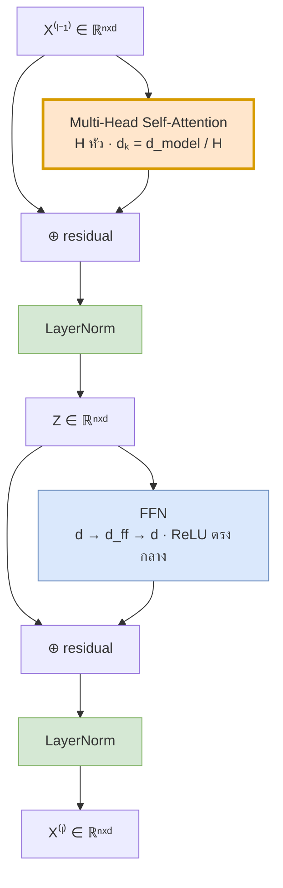
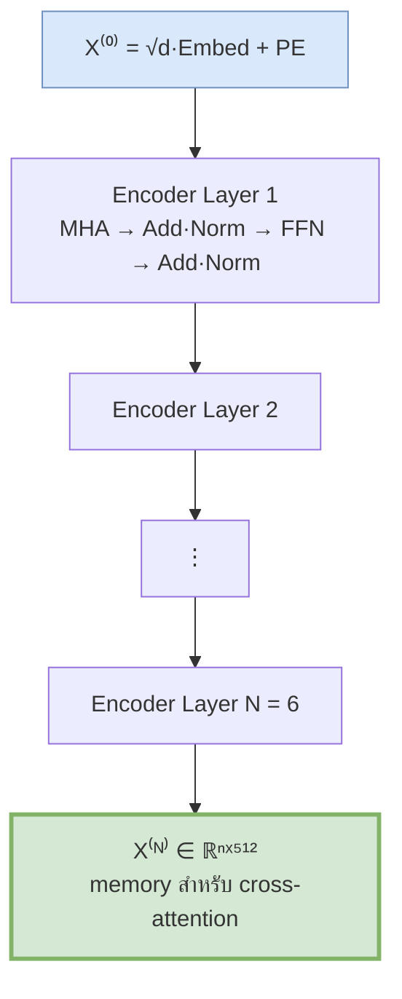
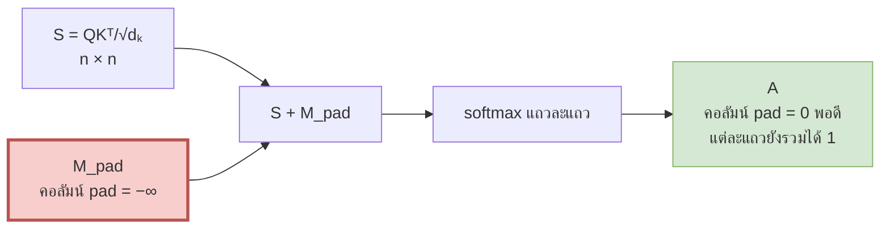

# 10 — Encoder เต็มรูปแบบ

> **ก่อนหน้า:** [09 — Layer Normalization](09-layernorm-math.md)
> **ถัดไป:** [11 — Decoder และ Masked Attention](11-decoder-masked-attention.md)

---

แปดไฟล์ที่ผ่านมาเราสร้างชิ้นส่วนทีละชิ้น — attention (05), multi-head (06), positional encoding (07), FFN + residual (08), LayerNorm (09)
ไฟล์นี้คือการ **ประกอบทุกชิ้นเข้าด้วยกัน** ตั้งแต่ข้อความดิบจนถึง encoder output พร้อมไล่มิติทุกขั้นและเดินตัวเลขจริงทั้ง pipeline

---

## 1. Input Pipeline: จากข้อความถึงเมทริกซ์ $X$


### 1.1 Tokenization → token ids

โมเดลไม่รู้จัก "ตัวอักษร" หรือ "คำ" — รู้จักแค่ **จำนวนเต็ม** เราจึงต้องมีพจนานุกรมที่แมป *หน่วยข้อความ* → *เลขจำนวนเต็ม* $\{0, 1, \dots, V-1\}$

ทางเลือกของ "หน่วยข้อความ":

| ระดับ | $V$ ทั่วไป | ปัญหา |
|---|---|---|
| ตัวอักษร (character) | ~100 | ลำดับยาวมาก → $O(n^2)$ ของ attention ระเบิด |
| คำ (word) | 100k–1M | เจอคำที่ไม่เคยเห็น → `<unk>` และ $V$ ใหญ่มาก |
| **subword (BPE / WordPiece)** | **32k–50k** | จุดกึ่งกลางที่ใช้จริง |

**BPE (Byte-Pair Encoding)** เริ่มจากตัวอักษรเดี่ยว แล้ว *ผสานคู่ที่ปรากฏบ่อยที่สุด* ซ้ำ ๆ จนได้ vocabulary ตามขนาดที่ตั้งไว้ ผลคือ

- คำที่พบบ่อยจะเป็นโทเคนเดียว: `กิน` → `["กิน"]`
- คำหายากถูกแตกเป็นชิ้น: `unconvincingly` → `["un", "convincing", "ly"]`
- **ไม่มี `<unk>` เลย** เพราะสุดท้ายถอยไปถึงระดับ byte ได้เสมอ

เปเปอร์ Transformer ต้นฉบับใช้ BPE ร่วมกันสองภาษา (shared source-target vocabulary) ขนาด ~37,000 โทเคน

> **สัญชาตญาณ:** subword คือการต่อรองระหว่าง "ลำดับสั้น" กับ "vocabulary เล็ก" — ทั้งสองอย่างเป็นต้นทุนคนละก้อน ($n^2$ กับ $V \cdot d$) จึงต้องหาจุดสมดุล

ในเอกสารชุดนี้เราใช้ตัวอย่างเดินเรื่องจากไฟล์ [01](01-seq2seq-rnn-basics.md): `ฉัน กิน ข้าว` → `I eat rice`

| โทเคน | id |
|---|---|
| `<pad>` | 0 |
| `ฉัน` | 1 |
| `กิน` | 2 |
| `ข้าว` | 3 |
| `<unk>` | 4 |

### 1.2 Embedding Lookup: index หรือ one-hot คูณเมทริกซ์

เมทริกซ์ embedding คือ

$$
E \in \mathbb{R}^{V \times d_{\text{model}}}
$$

แถวที่ $v$ คือเวกเตอร์ตัวแทนของโทเคน id $v$

มองได้ **สองแบบที่เท่ากันทางคณิตศาสตร์**

| มุมมอง | สมการ | ต้นทุน |
|---|---|---|
| พีชคณิต | $\mathbf{e}_i = \mathbf{o}_i E$ เมื่อ $\mathbf{o}_i \in \\{0,1\\}^{1 \times V}$ เป็น one-hot | $O(V \cdot d_{\text{model}})$ ต่อโทเคน |
| ปฏิบัติ | $\mathbf{e}_i = E[\text{id}_i,\ :]$ (index เข้าไปตรง ๆ) | $O(d_{\text{model}})$ |

$$
\boxed{\ \mathbf{o}_i E = E[\text{id}_i, :]\ }
$$

**สัญชาตญาณ:** การคูณ one-hot กับเมทริกซ์ คือการ "เลือกแถว" ล้วน ๆ — ทุกพจน์อื่นคูณด้วย 0 หมด เฟรมเวิร์กจึงข้ามการคูณไปใช้ index แทน (`nn.Embedding` = `nn.Linear` แบบไม่มี bias ที่รับ one-hot แต่ลัดวงจร)

แต่มุมมอง one-hot **ไม่ไร้ประโยชน์** — มันบอกเราสองอย่าง:
1. gradient ของ $E$ ที่แถว $v$ จะไม่เป็นศูนย์ก็ต่อเมื่อโทเคน $v$ ปรากฏใน batch → embedding เป็นเลเยอร์ที่ **sparse gradient**
2. เพราะมันคือ linear layer จริง ๆ เราจึงเอามัน *ผูก* (tie) กับ output projection ได้ในไฟล์ [11 §5](11-decoder-masked-attention.md)

```python
import torch, torch.nn as nn
V, d_model = 5, 4
emb = nn.Embedding(V, d_model)
ids = torch.tensor([[1, 2, 3]])          # (batch=1, n=3)
e   = emb(ids)                           # (1, 3, 4)  ← E[ids]

# ยืนยันว่าเท่ากับ one-hot @ E
oh = torch.nn.functional.one_hot(ids, V).float()   # (1, 3, 5)
assert torch.allclose(oh @ emb.weight, e)          # ← o_i E == E[id_i]
```

### 1.3 ทำไมต้องคูณ $\sqrt{d_{\text{model}}}$ ก่อนบวก PE

เปเปอร์เขียนบรรทัดนี้ไว้สั้น ๆ แต่มีเหตุผลเชิงสเกลชัดเจน

$$
\boxed{\ X^{(0)} = \sqrt{d_{\text{model}}}\ E[\text{ids}] + PE\ }
$$

**ปัญหา:** embedding มักถูก init ด้วย $\mathcal{N}(0,\ 1/d_{\text{model}})$ (คือ std $= 1/\sqrt{d_{\text{model}}}$) ในขณะที่ $PE$ (ไฟล์ [07](07-positional-encoding.md)) เป็น sin/cos ซึ่งมี amplitude เท่ากับ **1 เสมอ** ไม่ขึ้นกับ $d_{\text{model}}$

ผลคือถ้าบวกกันตรง ๆ **PE จะกลบ embedding**

ตัวเลขยืนยัน ($d_{\text{model}} = 512$, สุ่ม 1000 โทเคน):

| ปริมาณ | ค่า | หมายเหตุ |
|---|---|---|
| std ของ $E$ ตอน init | 0.0442 | $= 1/\sqrt{512}$ |
| $\\|\mathbf{e}\\|$ เฉลี่ย (ก่อนสเกล) | 1.0007 | $\approx 1$ ตามการออกแบบ |
| std ของ $PE$ | 0.5864 | ค่าระดับ $O(1)$ เพราะ sin/cos อยู่ในช่วง $[-1,1]$ เสมอ |
| $\\|PE_{pos}\\|$ | **16.0000** | $= \sqrt{d_{\text{model}}/2} = \sqrt{256}$ **เป๊ะทุกตำแหน่ง** |
| อัตราส่วน $\\|\mathbf{e}\\| / \\|PE\\|$ **ก่อน** สเกล | **0.0625** | $= 1/16$ → embedding เบากว่า PE 16 เท่า |
| std ของ $\sqrt{d}\\,E$ | 1.0012 | $\approx 1$ |
| $\\|\sqrt{d}\\,\mathbf{e}\\|$ เฉลี่ย | 22.6440 | $\approx \sqrt{512} = 22.6274$ |
| อัตราส่วน **หลัง** สเกล | **1.4153** | $\approx \sqrt{2}$ → ทั้งสองสัญญาณมีน้ำหนักพอ ๆ กัน |

> **สัญชาตญาณ:** $\|PE_{pos}\|^2 = \sum_{i}(\sin^2\theta_i + \cos^2\theta_i) = d_{\text{model}}/2$ — คงที่เป๊ะ ๆ ทุกตำแหน่ง
> ส่วน $\|\mathbf{e}\| \approx 1$ ตามการ init การคูณ $\sqrt{d_{\text{model}}}$ จึงยก embedding ขึ้นไปอยู่ระดับเดียวกับ PE พอดี ($22.63$ vs $16$ ต่างกันแค่ $\sqrt{2}$)
> ถ้าไม่คูณ ข้อมูล *ความหมาย* ของคำจะกลายเป็นเสียงกระซิบเทียบกับข้อมูล *ตำแหน่ง* ที่ตะโกน

```python
import numpy as np
d_model = 512
rng = np.random.default_rng(0)
E = rng.normal(0, 1/np.sqrt(d_model), size=(1000, d_model))   # init มาตรฐาน

pos = np.arange(50)[:, None]; i = np.arange(d_model//2)[None, :]
ang = pos / (10000 ** (2*i/d_model))
PE = np.zeros((50, d_model)); PE[:, 0::2] = np.sin(ang); PE[:, 1::2] = np.cos(ang)

ne  = np.linalg.norm(E, axis=1).mean()            # 1.0007
npe = np.linalg.norm(PE, axis=1).mean()           # 16.0
print(round(ne/npe, 4))                           # 0.0625   ← embedding จมหาย
print(round(ne*np.sqrt(d_model)/npe, 4))          # 1.4153   ← สมดุลแล้ว
```

> **ข้อควรระวัง:** ถ้าเฟรมเวิร์กของคุณ init embedding ด้วย $\mathcal{N}(0,1)$ (std $=1$) การคูณ $\sqrt{d_{\text{model}}}$ จะทำให้ **ใหญ่เกินไป** — ตัวคูณนี้ผูกกับสมมติฐานเรื่อง init เสมอ ไม่ใช่สูตรศักดิ์สิทธิ์

---

## 2. โครงสร้าง 1 เลเยอร์ของ Encoder

หนึ่ง encoder layer มี **2 sublayer** ต่อกัน แต่ละ sublayer ห่อด้วย residual + LayerNorm เหมือนกันเป๊ะ

$$
\text{Sublayer output} = \text{LN}\big(x + \text{Sublayer}(x)\big)
$$



### 2.1 Sublayer 1 — Multi-Head Self-Attention

$$
\boxed{\ Z = \text{LN}\big(X + \text{MultiHead}(X)\big)\ }
$$

โดย (จากไฟล์ [06](06-multi-head-attention.md))

$$
\text{MultiHead}(X) = \big[\text{head}_1; \dots; \text{head}_H\big]W^O,
\qquad
\text{head}_h = \text{softmax}\!\left(\frac{(XW_h^Q)(XW_h^K)^\top}{\sqrt{d_k}}\right)XW_h^V
$$

| ตัวแปร | มิติ |
|---|---|
| $X$ | $\mathbb{R}^{n \times d_{\text{model}}}$ |
| $W_h^Q, W_h^K$ | $\mathbb{R}^{d_{\text{model}} \times d_k}$ |
| $W_h^V$ | $\mathbb{R}^{d_{\text{model}} \times d_v}$ |
| $\text{head}_h$ | $\mathbb{R}^{n \times d_v}$ |
| $[\text{head}_1;\dots;\text{head}_H]$ | $\mathbb{R}^{n \times H d_v} = \mathbb{R}^{n \times d_{\text{model}}}$ |
| $W^O$ | $\mathbb{R}^{d_{\text{model}} \times d_{\text{model}}}$ |
| $Z$ | $\mathbb{R}^{n \times d_{\text{model}}}$ |

**หน้าที่:** ผสมข้อมูล *ข้ามตำแหน่ง* — นี่คือ sublayer เดียวในเลเยอร์ที่โทเคนคุยกัน

### 2.2 Sublayer 2 — Position-wise Feed-Forward

$$
\boxed{\ Y = \text{LN}\big(Z + \text{FFN}(Z)\big)\ },
\qquad
\text{FFN}(\mathbf{z}) = \max(0,\ \mathbf{z}W_1 + \mathbf{b}_1)W_2 + \mathbf{b}_2
$$

| ตัวแปร | มิติ |
|---|---|
| $W_1$ | $\mathbb{R}^{d_{\text{model}} \times d_{\text{ff}}}$ |
| $\mathbf{b}_1$ | $\mathbb{R}^{1 \times d_{\text{ff}}}$ |
| $W_2$ | $\mathbb{R}^{d_{\text{ff}} \times d_{\text{model}}}$ |
| $\mathbf{b}_2$ | $\mathbb{R}^{1 \times d_{\text{model}}}$ |
| $Y$ | $\mathbb{R}^{n \times d_{\text{model}}}$ |

**หน้าที่:** ประมวลผล *ภายในตำแหน่ง* — ใช้น้ำหนักชุดเดียวกันกับทุกแถวอย่างอิสระ (จึงเรียก *position-wise*) ไม่มีการผสมข้ามตำแหน่งเลย (ไฟล์ [08](08-feedforward-and-residual.md))

> **จุดสำคัญ — การแบ่งงานสองจังหวะ:** encoder layer สลับ "ผสมข้ามโทเคน" (attention) กับ "คิดในโทเคนตัวเอง" (FFN) ไปเรื่อย ๆ ถ้าเอา FFN ออก โมเดลจะกลายเป็นการเฉลี่ยเชิงเส้นซ้อนกันซึ่งไม่มีกำลังพอ ถ้าเอา attention ออก ก็ไม่มีทางรู้บริบท

### 2.3 Post-LN vs Pre-LN

เปเปอร์ต้นฉบับ (2017) ใช้ **Post-LN** ตามสมการข้างบน — LN อยู่ *หลัง* การบวก residual

$$
\text{Post-LN:}\quad x_{l} = \text{LN}\big(x_{l-1} + F(x_{l-1})\big)
\qquad\qquad
\text{Pre-LN:}\quad x_{l} = x_{l-1} + F\big(\text{LN}(x_{l-1})\big)
$$

| | Post-LN (2017) | Pre-LN (ที่นิยมหลังปี 2019) |
|---|---|---|
| ตำแหน่ง LN | หลัง residual | ก่อนเข้า sublayer |
| ทางลัดของ gradient | ถูก LN คั่นทุกเลเยอร์ | เป็น **identity ล้วน** จาก output ถึง input |
| ต้องมี LR warm-up ไหม | **ต้องมี** ไม่งั้นแตกตอนต้น | แทบไม่ต้อง |
| คุณภาพเมื่อเทรนสำเร็จ | มักดีกว่าเล็กน้อย | เสถียรกว่ามากที่ $N$ ใหญ่ |
| ใช้ใน | เปเปอร์ต้นฉบับ, BERT | GPT-2/3, LLaMA, ViT |

> **สัญชาตญาณ:** ใน Pre-LN เส้นทาง residual คือ $x_N = x_0 + \sum_l F_l(\cdot)$ — gradient ไหลกลับได้โดยไม่ผ่านอะไรเลย เหมือน cell state ของ LSTM ในไฟล์ [01 §3.2](01-seq2seq-rnn-basics.md) ส่วน Post-LN มี LN คั่นทุกก้าว จึงต้องอุ่นเครื่อง learning rate ก่อน
> ไฟล์นี้ยึด **Post-LN** ตามเปเปอร์ เพื่อให้สมการตรงกับ [00 §6](00-overview.md)

---

## 3. การซ้อน $N$ เลเยอร์

$$
\boxed{
\begin{aligned}
X^{(0)} &= \sqrt{d_{\text{model}}}\,E[\text{ids}] + PE \\[4pt]
Z^{(l)} &= \text{LN}_1^{(l)}\big(X^{(l-1)} + \text{MultiHead}^{(l)}(X^{(l-1)})\big) \\[2pt]
X^{(l)} &= \text{LN}_2^{(l)}\big(Z^{(l)} + \text{FFN}^{(l)}(Z^{(l)})\big)
\end{aligned}
\qquad l = 1, \dots, N}
$$

ผลลัพธ์สุดท้าย $\text{Enc}(\mathbf{x}) = X^{(N)} \in \mathbb{R}^{n \times d_{\text{model}}}$ คือสิ่งที่ decoder จะใช้เป็น $K, V$ ในไฟล์ [11](11-decoder-masked-attention.md)



**สามข้อสังเกตสำคัญ:**

1. **มิติไม่เปลี่ยนเลย** ตั้งแต่ $X^{(0)}$ ถึง $X^{(N)}$ ทุกตัวคือ $\mathbb{R}^{n \times d_{\text{model}}}$ — เรียกท่อนี้ว่า *residual stream* ซึ่งทำให้ซ้อนกี่เลเยอร์ก็ได้
2. **น้ำหนักไม่แชร์ข้ามเลเยอร์** ต่างจาก RNN ที่แชร์ข้ามเวลา — เลเยอร์ 1 กับเลเยอร์ 6 มีพารามิเตอร์คนละชุด
3. **PE ใส่ครั้งเดียวที่ $l=0$** ข้อมูลตำแหน่งเดินทางต่อผ่าน residual stream เอง

---

## 4. ตารางไล่มิติทุกขั้น

ตารางนี้ใช้ Transformer-base: $d_{\text{model}}=512$, $H=8$, $d_k=d_v=64$, $d_{\text{ff}}=2048$, $N=6$, $V=37{,}000$
(นับพารามิเตอร์แบบ projection ของ attention **ไม่มี bias** ตามการ implement มาตรฐาน)

| # | ขั้นตอน | สมการ | shape ผลลัพธ์ | พารามิเตอร์ |
|---|---|---|---|---|
| 0 | token ids | $\text{ids} = \text{tok}(\text{text})$ | $(n,)$ จำนวนเต็ม | 0 |
| 1 | embedding lookup | $E[\text{ids}]$ | $n \times 512$ | $V d = 18{,}944{,}000$ |
| 2 | สเกล | $\sqrt{d_{\text{model}}}\\,E[\text{ids}]$ | $n \times 512$ | 0 |
| 3 | บวก PE | $X^{(0)} = (2) + PE$ | $n \times 512$ | 0 *(sinusoidal คงที่)* |
| 4 | ฉาย Q, K, V ทุกหัว | $XW^Q, XW^K, XW^V$ | $3 \times (n \times 512)$ | $3 d^2 = 786{,}432$ |
| 5 | แยกหัว | reshape $\to (H, n, d_k)$ | $8 \times n \times 64$ | 0 |
| 6 | คะแนน | $S_h = Q_hK_h^\top/\sqrt{d_k}$ | $8 \times n \times n$ | 0 |
| 7 | มาสก์ + softmax | $A_h = \text{softmax}(S_h + M)$ | $8 \times n \times n$ | 0 |
| 8 | ถ่วงน้ำหนัก value | $A_hV_h$ | $8 \times n \times 64$ | 0 |
| 9 | concat | $[\text{head}_1;\dots;\text{head}_8]$ | $n \times 512$ | 0 |
| 10 | ฉายออก | $(9)\\,W^O$ | $n \times 512$ | $d^2 = 262{,}144$ |
| 11 | residual + LN | $Z = \text{LN}(X + (10))$ | $n \times 512$ | $2d = 1{,}024$ |
| 12 | FFN ชั้นใน | $\max(0, ZW_1 + \mathbf{b}_1)$ | $n \times 2048$ | $d\\,d_{\text{ff}} + d_{\text{ff}} = 1{,}050{,}624$ |
| 13 | FFN ชั้นนอก | $(12)W_2 + \mathbf{b}_2$ | $n \times 512$ | $d_{\text{ff}}d + d = 1{,}049{,}088$ |
| 14 | residual + LN | $X^{(l)} = \text{LN}(Z + (13))$ | $n \times 512$ | $2d = 1{,}024$ |
| — | **รวม 1 เลเยอร์** | ขั้น 4–14 | $n \times 512$ | **3,150,336** |
| 15 | ซ้อน $N=6$ | ทำขั้น 4–14 หกรอบ | $n \times 512$ | $6 \times 3{,}150{,}336 = 18{,}902{,}016$ |
| — | **encoder ทั้งก้อน + embedding** | | $n \times 512$ | **37,846,016** |

> **จุดสำคัญ:** ทุกแถวตั้งแต่ 3 ถึง 15 มี shape $n \times 512$ เหมือนกันหมด (ยกเว้นภายในหัวและภายใน FFN ที่แวะออกไปชั่วคราว) — **residual stream คือกระดูกสันหลังที่มิติคงที่**

---

## 5. Padding Mask

### 5.1 ที่มา

การเทรนจริงป้อนเป็น **batch** แต่ประโยคในหนึ่ง batch ยาวไม่เท่ากัน ขณะที่เทนเซอร์ต้องเป็นสี่เหลี่ยม เราจึงเติม `<pad>` ให้ยาวเท่ากัน

```
ประโยค 1: ฉัน  กิน  ข้าว  <pad>       → [1, 2, 3, 0]
ประโยค 2: ฉัน  กิน  ข้าว  อร่อย        → [1, 2, 3, 7]
```

**ปัญหา:** ถ้าไม่ทำอะไรเลย โทเคน `<pad>` จะมี key/value ของตัวเอง แล้ว softmax จะจัดสรรน้ำหนักให้มัน → **ข้อมูลขยะรั่วเข้าไปในทุกตำแหน่ง**

### 5.2 รูปแบบเมทริกซ์

นิยาม mask จากเวกเตอร์บอกความยาวจริง

$$
\boxed{\ M^{\text{pad}}_{ij} = \begin{cases} 0 & \text{ถ้าตำแหน่ง } j \text{ เป็นโทเคนจริง} \\ -\infty & \text{ถ้าตำแหน่ง } j \text{ เป็น } \texttt{{<}pad{>}} \end{cases}\ }
$$

สังเกตว่ามาสก์นี้ขึ้นกับ **คอลัมน์ $j$ อย่างเดียว** — ทุกแถวโดนมาสก์ชุดเดียวกัน (ต่างจาก causal mask ในไฟล์ 11 ที่ขึ้นกับทั้ง $i$ และ $j$)

$$
M^{\text{pad}} = \begin{bmatrix}
0 & 0 & 0 & -\infty \\
0 & 0 & 0 & -\infty \\
0 & 0 & 0 & -\infty \\
0 & 0 & 0 & -\infty
\end{bmatrix} \in \mathbb{R}^{4 \times 4}
$$



### 5.3 เมทริกซ์จริง

ใช้โมเดลจิ๋วในหัวข้อ 6 (head 1) กับ `[ฉัน, กิน, ข้าว, <pad>]`

**คะแนนดิบ $S$ (ยังไม่มาสก์)**

| | ฉัน | กิน | ข้าว | \<pad\> |
|---|---|---|---|---|
| **ฉัน** | 0.4047 | 0.1967 | 0.2500 | 0.0229 |
| **กิน** | 0.3995 | 0.1986 | 0.2460 | 0.0163 |
| **ข้าว** | -0.1004 | 0.3670 | -0.1250 | -0.5810 |
| **\<pad\>** | -0.1909 | -0.0016 | -0.1317 | -0.1368 |

**$A = \text{softmax}(S)$ — ยังไม่มาสก์ ← ผิด**

| | ฉัน | กิน | ข้าว | \<pad\> |
|---|---|---|---|---|
| **ฉัน** | 0.2984 | 0.2423 | 0.2556 | **0.2037** |
| **กิน** | 0.2978 | 0.2436 | 0.2555 | **0.2030** |
| **ข้าว** | 0.2387 | 0.3809 | 0.2329 | **0.1476** |
| **\<pad\>** | 0.2312 | 0.2794 | 0.2453 | 0.2441 |

> โทเคนจริงเทน้ำหนักให้ `<pad>` ถึง **14.8–20.4%** — เกือบหนึ่งในห้าของ "ความสนใจ" ถูกเทให้ช่องว่าง

**$A = \text{softmax}(S + M^{\text{pad}})$ ← ถูก**

| | ฉัน | กิน | ข้าว | \<pad\> |
|---|---|---|---|---|
| **ฉัน** | 0.3747 | 0.3043 | 0.3210 | **0.0000** |
| **กิน** | 0.3737 | 0.3057 | 0.3206 | **0.0000** |
| **ข้าว** | 0.2800 | 0.4468 | 0.2732 | **0.0000** |
| **\<pad\>** | 0.3059 | 0.3696 | 0.3245 | **0.0000** |

ผลรวมแต่ละแถว $= 1.0000$ ทุกแถว และสามแถวบนตรงกับกรณี $n=3$ ที่ไม่มี pad เลย **เป๊ะทุกหลัก** (เทียบกับ head 1 ในหัวข้อ 6.3) — นี่คือข้อพิสูจน์ว่ามาสก์ทำงานถูกต้อง: ผลลัพธ์ของโทเคนจริงต้อง *ไม่ขึ้นกับ* จำนวน pad ที่เติมเข้าไป

> **หมายเหตุ:** แถว `<pad>` ยังคำนวณออกมาเป็นเลขบางอย่าง (เราไม่ได้มาสก์แถว) — ไม่เป็นไร เพราะตอนคิด loss เราจะข้ามตำแหน่ง pad อยู่แล้ว การมาสก์ทั้งแถวจะให้ $-\infty$ ทั้งแถว → softmax ได้ `NaN` ซึ่งแย่กว่า

```python
import numpy as np
def softmax(z, axis=-1):
    z = z - z.max(axis=axis, keepdims=True)
    e = np.exp(z); return e / e.sum(axis=axis, keepdims=True)

S = np.array([[ 0.4047,  0.1967,  0.2500,  0.0229],
              [ 0.3995,  0.1986,  0.2460,  0.0163],
              [-0.1004,  0.3670, -0.1250, -0.5810],
              [-0.1909, -0.0016, -0.1317, -0.1368]])
is_pad = np.array([False, False, False, True])
M = np.where(is_pad[None, :], -np.inf, 0.0)      # ← M_pad ขึ้นกับคอลัมน์ j เท่านั้น
print(np.round(softmax(S + M), 4))
```

```python
import torch
S = torch.tensor([[ 0.4047,  0.1967,  0.2500,  0.0229],
                  [ 0.3995,  0.1986,  0.2460,  0.0163],
                  [-0.1004,  0.3670, -0.1250, -0.5810],
                  [-0.1909, -0.0016, -0.1317, -0.1368]])
is_pad = torch.tensor([False, False, False, True])
A = S.masked_fill(is_pad[None, :], float('-inf')).softmax(-1)   # ← วิธีมาตรฐานใน PyTorch
print(torch.round(A, decimals=4))
# tensor([[0.3747, 0.3043, 0.3210, 0.0000],
#         [0.3737, 0.3057, 0.3206, 0.0000],
#         [0.2800, 0.4468, 0.2732, 0.0000],
#         [0.3059, 0.3696, 0.3245, 0.0000]])
```

---

## 6. เดินตัวเลขทั้ง Pipeline ด้วยโมเดลจิ๋ว

**การตั้งค่า:** $d_{\text{model}}=4$, $H=2$ (จึง $d_k=d_v=2$), $d_{\text{ff}}=8$, $N=1$, $n=3$, LN ใช้ $\gamma=\mathbf{1}, \beta=\mathbf{0}, \epsilon=10^{-5}$
ประโยค `ฉัน กิน ข้าว` → ids `[1, 2, 3]`

### 6.1 Embedding lookup

$$
E = \begin{bmatrix}
0.0 & 0.0 & 0.0 & 0.0 \\
0.3 & -0.1 & 0.5 & 0.2 \\
-0.2 & 0.4 & 0.1 & -0.3 \\
0.5 & 0.2 & -0.4 & 0.1 \\
0.1 & 0.1 & 0.1 & 0.1
\end{bmatrix}
\quad
\Rightarrow
\quad
E[[1,2,3]] = \begin{bmatrix}
0.3 & -0.1 & 0.5 & 0.2 \\
-0.2 & 0.4 & 0.1 & -0.3 \\
0.5 & 0.2 & -0.4 & 0.1
\end{bmatrix}
$$

### 6.2 สเกล $\times\sqrt{4}=2$ แล้วบวก PE

**PE ($n=3$, $d_{\text{model}}=4$)**

| | $d_1{=}\sin$ | $d_2{=}\cos$ | $d_3{=}\sin$ | $d_4{=}\cos$ |
|---|---|---|---|---|
| **pos=0** | 0.0000 | 1.0000 | 0.0000 | 1.0000 |
| **pos=1** | 0.8415 | 0.5403 | 0.0100 | 1.0000 |
| **pos=2** | 0.9093 | -0.4161 | 0.0200 | 0.9998 |

**$X = 2E[\text{ids}] + PE$**

| | $d_1$ | $d_2$ | $d_3$ | $d_4$ |
|---|---|---|---|---|
| **ฉัน** | 0.6000 | 0.8000 | 1.0000 | 1.4000 |
| **กิน** | 0.4415 | 1.3403 | 0.2100 | 0.4000 |
| **ข้าว** | 1.9093 | -0.0161 | -0.7800 | 1.1998 |

### 6.3 Multi-Head Self-Attention

น้ำหนักที่ใช้ (แต่ละหัว $4 \times 2$):

$$
W_1^Q = \begin{bmatrix}0.5&-0.2\\0.1&0.4\\-0.3&0.2\\0.2&0.1\end{bmatrix}\!,\;
W_1^K = \begin{bmatrix}0.2&0.4\\0.3&-0.1\\0.1&0.5\\-0.2&0.2\end{bmatrix}\!,\;
W_1^V = \begin{bmatrix}0.3&0.1\\-0.2&0.5\\0.4&-0.3\\0.1&0.2\end{bmatrix}
$$

$$
W_2^Q = \begin{bmatrix}0.1&0.3\\-0.4&0.2\\0.2&-0.1\\0.3&0.5\end{bmatrix}\!,\;
W_2^K = \begin{bmatrix}-0.1&0.2\\0.5&0.1\\0.2&0.3\\0.1&-0.4\end{bmatrix}\!,\;
W_2^V = \begin{bmatrix}0.2&-0.3\\0.1&0.4\\-0.5&0.2\\0.3&0.1\end{bmatrix}
$$

$$
W^O = \begin{bmatrix}0.4&-0.2&0.1&0.3\\0.1&0.5&-0.3&0.2\\-0.2&0.3&0.4&-0.1\\0.5&0.1&0.2&0.4\end{bmatrix}
$$

**หัวที่ 1** — $Q_1 = XW_1^Q$, $K_1 = XW_1^K$, $V_1 = XW_1^V$

| | $q_1$ | $q_2$ | | $k_1$ | $k_2$ | | $v_1$ | $v_2$ |
|---|---|---|---|---|---|---|---|---|
| **ฉัน** | 0.3600 | 0.5400 | | 0.1800 | 0.9400 | | 0.5600 | 0.4400 |
| **กิน** | 0.3718 | 0.5298 | | 0.4314 | 0.2275 | | -0.0116 | 0.7313 |
| **ข้าว** | 1.4270 | -0.4243 | | 0.0591 | 0.6153 | | 0.3840 | 0.6568 |

$S_1 = Q_1K_1^\top/\sqrt{2}$ และ $A_1 = \text{softmax}(S_1)$

| $S_1$ | ฉัน | กิน | ข้าว | | $A_1$ | ฉัน | กิน | ข้าว |
|---|---|---|---|---|---|---|---|---|
| **ฉัน** | 0.4047 | 0.1967 | 0.2500 | | **ฉัน** | 0.3747 | 0.3043 | 0.3210 |
| **กิน** | 0.3995 | 0.1986 | 0.2460 | | **กิน** | 0.3737 | 0.3057 | 0.3206 |
| **ข้าว** | -0.1004 | 0.3670 | -0.1250 | | **ข้าว** | 0.2800 | 0.4468 | 0.2732 |

$\text{head}_1 = A_1V_1$

| | $o_1$ | $o_2$ |
|---|---|---|
| **ฉัน** | 0.3295 | 0.5982 |
| **กิน** | 0.3288 | 0.5986 |
| **ข้าว** | 0.2565 | 0.6294 |

**หัวที่ 2** — $A_2 = \text{softmax}(Q_2K_2^\top/\sqrt{2})$ และ $\text{head}_2 = A_2V_2$

| $A_2$ | ฉัน | กิน | ข้าว | | $\text{head}_2$ | $o_1$ | $o_2$ |
|---|---|---|---|---|---|---|---|
| **ฉัน** | 0.3572 | 0.4069 | 0.2359 | | **ฉัน** | 0.4060 | 0.2239 |
| **กิน** | 0.3146 | 0.3372 | 0.3482 | | **กิน** | 0.5113 | 0.1006 |
| **ข้าว** | 0.3581 | 0.4250 | 0.2169 | | **ข้าว** | 0.3890 | 0.2448 |

> สังเกตว่าสองหัว **สนใจคนละอย่าง**: หัวที่ 1 แถว `ข้าว` เทน้ำหนักไป `กิน` (0.4468) ส่วนหัวที่ 2 แถว `กิน` กระจายเกือบเท่ากันทั้งสามตำแหน่ง (0.3146 / 0.3372 / 0.3482) — นี่คือเหตุผลของ multi-head ในไฟล์ [06](06-multi-head-attention.md)

**Concat แล้วฉายผ่าน $W^O$**

| concat | $h_{1a}$ | $h_{1b}$ | $h_{2a}$ | $h_{2b}$ | | $\text{MultiHead}(X)$ | $d_1$ | $d_2$ | $d_3$ | $d_4$ |
|---|---|---|---|---|---|---|---|---|---|---|
| **ฉัน** | 0.3295 | 0.5982 | 0.4060 | 0.2239 | | **ฉัน** | 0.2224 | 0.3774 | 0.0607 | 0.2675 |
| **กิน** | 0.3288 | 0.5986 | 0.5113 | 0.1006 | | **กิน** | 0.1394 | 0.3970 | 0.0779 | 0.2075 |
| **ข้าว** | 0.2565 | 0.6294 | 0.3890 | 0.2448 | | **ข้าว** | 0.2101 | 0.4046 | 0.0414 | 0.2618 |

### 6.4 Residual + LayerNorm → $Z$

$X + \text{MultiHead}(X)$

| | $d_1$ | $d_2$ | $d_3$ | $d_4$ | mean | std |
|---|---|---|---|---|---|---|
| **ฉัน** | 0.8224 | 1.1774 | 1.0607 | 1.6675 | 1.1820 | 0.3081 |
| **กิน** | 0.5809 | 1.7373 | 0.2879 | 0.6074 | 0.8034 | 0.5536 |
| **ข้าว** | 2.1194 | 0.3884 | -0.7386 | 1.4616 | 0.8077 | 1.0857 |

$Z = \text{LN}(X + \text{MultiHead}(X))$

| | $d_1$ | $d_2$ | $d_3$ | $d_4$ |
|---|---|---|---|---|
| **ฉัน** | -1.1670 | -0.0149 | -0.3937 | 1.5756 |
| **กิน** | -0.4019 | 1.6870 | -0.9311 | -0.3540 |
| **ข้าว** | 1.2081 | -0.3862 | -1.4242 | 0.6023 |

> **สังเกต:** ก่อน LN สามแถวมี std ต่างกัน 3.5 เท่า (0.3081 vs 1.0857) หลัง LN ทุกแถวมี mean $=0$, std $=1$ เท่ากันหมด — LN "ปรับระดับเสียง" ให้ทุกโทเคนก่อนส่งเข้า FFN (ไฟล์ [09](09-layernorm-math.md))

### 6.5 FFN

$W_1 \in \mathbb{R}^{4\times8}$, $W_2 \in \mathbb{R}^{8\times4}$

$$
W_1 = \begin{bmatrix}
0.2&-0.3&0.5&0.1&-0.2&0.4&0.1&-0.5\\
0.4&0.1&-0.2&0.3&0.5&-0.1&0.2&0.3\\
-0.1&0.5&0.3&-0.4&0.1&0.2&-0.3&0.4\\
0.3&0.2&-0.4&0.5&-0.3&0.1&0.4&-0.2
\end{bmatrix},\;
\mathbf{b}_1 = [0.1, -0.1, 0, 0.2, -0.2, 0.1, 0, -0.1]
$$

**ก่อน ReLU** ($ZW_1 + \mathbf{b}_1$)

| | $f_1$ | $f_2$ | $f_3$ | $f_4$ | $f_5$ | $f_6$ | $f_7$ | $f_8$ |
|---|---|---|---|---|---|---|---|---|
| **ฉัน** | 0.3727 | 0.3669 | -1.3289 | 1.0241 | -0.4861 | -0.2865 | 0.6287 | 0.0065 |
| **กิน** | 0.6813 | -0.3471 | -0.6761 | 0.8614 | 0.7370 | -0.4511 | 0.4349 | 0.3054 |
| **ข้าว** | 0.5103 | -1.0927 | 0.0131 | 1.0758 | -0.9578 | 0.3973 | 0.7118 | -1.5101 |

**หลัง ReLU** — ค่าลบกลายเป็น 0 (นับได้ 9 จาก 24 ช่อง = 37.5% sparsity)

| | $f_1$ | $f_2$ | $f_3$ | $f_4$ | $f_5$ | $f_6$ | $f_7$ | $f_8$ |
|---|---|---|---|---|---|---|---|---|
| **ฉัน** | 0.3727 | 0.3669 | 0.0000 | 1.0241 | 0.0000 | 0.0000 | 0.6287 | 0.0065 |
| **กิน** | 0.6813 | 0.0000 | 0.0000 | 0.8614 | 0.7370 | 0.0000 | 0.4349 | 0.3054 |
| **ข้าว** | 0.5103 | 0.0000 | 0.0131 | 1.0758 | 0.0000 | 0.3973 | 0.7118 | 0.0000 |

**$\text{FFN}(Z)$** (หลัง $W_2 + \mathbf{b}_2$, $\mathbf{b}_2 = [0, 0.1, -0.1, 0.05]$)

| | $d_1$ | $d_2$ | $d_3$ | $d_4$ |
|---|---|---|---|---|
| **ฉัน** | 0.3415 | -0.2610 | 0.6329 | 0.3774 |
| **กิน** | 0.1380 | -0.1547 | 0.7694 | 0.3433 |
| **ข้าว** | 0.6433 | -0.3831 | 0.5436 | 0.6573 |

### 6.6 Residual + LayerNorm → $Y$ (encoder output)

$Z + \text{FFN}(Z)$

| | $d_1$ | $d_2$ | $d_3$ | $d_4$ |
|---|---|---|---|---|
| **ฉัน** | -0.8255 | -0.2759 | 0.2392 | 1.9530 |
| **กิน** | -0.2639 | 1.5323 | -0.1618 | -0.0107 |
| **ข้าว** | 1.8514 | -0.7693 | -0.8806 | 1.2596 |

$$
\boxed{\ Y = X^{(1)} = \text{LN}(Z + \text{FFN}(Z))\ }
$$

| | $d_1$ | $d_2$ | $d_3$ | $d_4$ |
|---|---|---|---|---|
| **ฉัน** | -1.0553 | -0.5272 | -0.0322 | 1.6147 |
| **กิน** | -0.7348 | 1.7189 | -0.5952 | -0.3889 |
| **ข้าว** | 1.2291 | -0.9383 | -1.0304 | 0.7396 |

ทุกแถวมี mean $= 0.0000$ และ std $= 1.0000$ ตามที่ LN รับประกัน
เมทริกซ์ $3 \times 4$ นี้คือ **memory** ที่ decoder จะดึงไปใช้เป็น $K$ และ $V$ ในไฟล์ [11 §3](11-decoder-masked-attention.md)

### 6.7 โค้ด NumPy ที่ผลิตตัวเลขข้างบนทั้งหมด

```python
import numpy as np

d_model, H, dk, d_ff, n = 4, 2, 2, 8, 3

def softmax(z, axis=-1):
    z = z - z.max(axis=axis, keepdims=True)
    e = np.exp(z); return e / e.sum(axis=axis, keepdims=True)

def LN(A, eps=1e-5):                                   # γ=1, β=0
    mu = A.mean(-1, keepdims=True); var = A.var(-1, keepdims=True)
    return (A - mu) / np.sqrt(var + eps)

Emb = np.array([[0.0,0.0,0.0,0.0], [0.3,-0.1,0.5,0.2], [-0.2,0.4,0.1,-0.3],
                [0.5,0.2,-0.4,0.1], [0.1,0.1,0.1,0.1]])
ids = [1, 2, 3]                                        # ฉัน กิน ข้าว

# --- §1: embedding × √d_model + PE ---
pos = np.arange(n)[:, None]; i = np.arange(d_model//2)[None, :]
ang = pos / (10000 ** (2*i/d_model))
PE  = np.zeros((n, d_model)); PE[:, 0::2] = np.sin(ang); PE[:, 1::2] = np.cos(ang)
X   = Emb[ids] * np.sqrt(d_model) + PE                 # ← สมการใน §1.3

WQ = [np.array([[.5,-.2],[.1,.4],[-.3,.2],[.2,.1]]), np.array([[.1,.3],[-.4,.2],[.2,-.1],[.3,.5]])]
WK = [np.array([[.2,.4],[.3,-.1],[.1,.5],[-.2,.2]]),  np.array([[-.1,.2],[.5,.1],[.2,.3],[.1,-.4]])]
WV = [np.array([[.3,.1],[-.2,.5],[.4,-.3],[.1,.2]]),  np.array([[.2,-.3],[.1,.4],[-.5,.2],[.3,.1]])]
WO = np.array([[.4,-.2,.1,.3],[.1,.5,-.3,.2],[-.2,.3,.4,-.1],[.5,.1,.2,.4]])
W1 = np.array([[.2,-.3,.5,.1,-.2,.4,.1,-.5],[.4,.1,-.2,.3,.5,-.1,.2,.3],
               [-.1,.5,.3,-.4,.1,.2,-.3,.4],[.3,.2,-.4,.5,-.3,.1,.4,-.2]])
b1 = np.array([.1,-.1,0.,.2,-.2,.1,0.,-.1])
W2 = np.array([[.3,-.2,.1,.4],[-.1,.5,.2,-.3],[.4,.1,-.5,.2],[.2,-.4,.3,.1],
               [-.3,.2,.4,-.1],[.5,.3,-.2,.2],[.1,-.1,.5,.3],[-.2,.4,.1,-.4]])
b2 = np.array([0., .1, -.1, .05])

# --- §2.1: Sublayer 1 ---
heads = []
for h in range(H):
    Q, K, V = X @ WQ[h], X @ WK[h], X @ WV[h]
    A = softmax(Q @ K.T / np.sqrt(dk))                 # ← softmax(QKᵀ/√dₖ)
    heads.append(A @ V)
MHA = np.concatenate(heads, axis=1) @ WO               # ← [head₁;head₂] Wᴼ
Z   = LN(X + MHA)                                      # ← Z = LN(X + MHA(X))

# --- §2.2: Sublayer 2 ---
F = np.maximum(0, Z @ W1 + b1) @ W2 + b2               # ← FFN
Y = LN(Z + F)                                          # ← Y = LN(Z + FFN(Z))

print(np.round(Y, 4))
# [[-1.0553 -0.5272 -0.0322  1.6147]
#  [-0.7348  1.7189 -0.5952 -0.3889]
#  [ 1.2291 -0.9383 -1.0304  0.7396]]
```

### 6.8 EncoderLayer แบบเต็มใน PyTorch (รันได้จริง)

```python
import math, torch, torch.nn as nn

class MultiHeadSelfAttention(nn.Module):
    def __init__(self, d_model, H):
        super().__init__()
        assert d_model % H == 0
        self.H, self.dk = H, d_model // H
        self.Wq = nn.Linear(d_model, d_model, bias=False)   # รวม H หัวไว้ในเมทริกซ์เดียว
        self.Wk = nn.Linear(d_model, d_model, bias=False)
        self.Wv = nn.Linear(d_model, d_model, bias=False)
        self.Wo = nn.Linear(d_model, d_model, bias=False)   # ← Wᴼ

    def forward(self, x, pad_mask=None):                    # x: (B, n, d)
        B, n, d = x.shape
        split = lambda t: t.view(B, n, self.H, self.dk).transpose(1, 2)   # (B,H,n,dk)
        Q, K, V = split(self.Wq(x)), split(self.Wk(x)), split(self.Wv(x))
        S = Q @ K.transpose(-2, -1) / math.sqrt(self.dk)                  # ← QKᵀ/√dₖ
        if pad_mask is not None:                                          # pad_mask: (B, n) bool
            S = S.masked_fill(pad_mask[:, None, None, :], float('-inf'))  # ← + M_pad  (§5)
        A = S.softmax(-1)
        out = (A @ V).transpose(1, 2).reshape(B, n, d)                    # ← concat หัว
        return self.Wo(out)

class EncoderLayer(nn.Module):
    """Post-LN ตามเปเปอร์ต้นฉบับ"""
    def __init__(self, d_model, H, d_ff, p=0.1):
        super().__init__()
        self.mha  = MultiHeadSelfAttention(d_model, H)
        self.ln1  = nn.LayerNorm(d_model)
        self.ffn  = nn.Sequential(nn.Linear(d_model, d_ff), nn.ReLU(),
                                  nn.Linear(d_ff, d_model))
        self.ln2  = nn.LayerNorm(d_model)
        self.drop = nn.Dropout(p)

    def forward(self, x, pad_mask=None):
        x = self.ln1(x + self.drop(self.mha(x, pad_mask)))   # ← Z = LN(X + MHA(X))   §2.1
        x = self.ln2(x + self.drop(self.ffn(x)))             # ← Y = LN(Z + FFN(Z))   §2.2
        return x

class Encoder(nn.Module):
    def __init__(self, V, d_model=512, H=8, d_ff=2048, N=6, max_len=512):
        super().__init__()
        self.d_model = d_model
        self.emb = nn.Embedding(V, d_model)
        self.register_buffer("pe", self._pe(max_len, d_model))
        self.layers = nn.ModuleList([EncoderLayer(d_model, H, d_ff) for _ in range(N)])

    @staticmethod
    def _pe(L, d):                                           # ← ไฟล์ 07
        pos = torch.arange(L).unsqueeze(1).float()
        i   = torch.arange(0, d, 2).float()
        ang = pos / (10000 ** (i / d))
        pe  = torch.zeros(L, d)
        pe[:, 0::2], pe[:, 1::2] = ang.sin(), ang.cos()
        return pe

    def forward(self, ids, pad_mask=None):
        x = self.emb(ids) * math.sqrt(self.d_model) + self.pe[:ids.size(1)]   # ← §1.3
        for lyr in self.layers:                                               # ← §3
            x = lyr(x, pad_mask)
        return x

enc = Encoder(V=1000).eval()
ids = torch.randint(1, 1000, (2, 7)); ids[1, 5:] = 0        # ประโยคที่ 2 มี pad 2 ตัว
out = enc(ids, pad_mask=(ids == 0))
print(tuple(out.shape))                                     # (2, 7, 512)
print(sum(p.numel() for p in enc.layers.parameters()))      # 18902016  ← ตรงกับ §4
```

> ตรวจแล้ว: ถ้ายัดน้ำหนักจิ๋วในหัวข้อ 6.3–6.5 เข้า `EncoderLayer` (ตั้ง `p=0.0`) จะได้ $Y$ ตรงกับ NumPy ทุกหลัก

---

## 7. นับพารามิเตอร์และ FLOPs ของ Encoder จริง

### 7.1 พารามิเตอร์ (Transformer-base)

| ส่วนประกอบ | สูตร | จำนวน |
|---|---|---|
| $W^Q, W^K, W^V, W^O$ | $4d_{\text{model}}^2$ | 1,048,576 |
| $W_1, \mathbf{b}_1$ | $d_{\text{model}}d_{\text{ff}} + d_{\text{ff}}$ | 1,050,624 |
| $W_2, \mathbf{b}_2$ | $d_{\text{ff}}d_{\text{model}} + d_{\text{model}}$ | 1,049,088 |
| LN สองตัว | $2 \times 2d_{\text{model}}$ | 2,048 |
| **รวม 1 เลเยอร์** | | **3,150,336** |
| **encoder $N=6$** | $\times 6$ | **18,902,016** |
| embedding | $Vd_{\text{model}}$ | 18,944,000 |
| **encoder + embedding** | | **37,846,016** |

**อ่านตาราง:** FFN กิน $\approx \frac{2{,}099{,}712}{3{,}150{,}336} = 66.7\%$ ของพารามิเตอร์ในเลเยอร์ — **สองในสาม** เพราะ $d_{\text{ff}} = 4d_{\text{model}}$
ส่วน LN แทบไม่มีอะไรเลย (0.065%) แต่ขาดไม่ได้

> **สัญชาตญาณ:** attention คือส่วนที่ *มีชื่อเสียง* แต่ FFN คือส่วนที่ *เก็บความรู้* — งานวิจัยยุคหลังชี้ว่า FFN ทำตัวคล้าย key-value memory ของข้อเท็จจริง

### 7.2 FLOPs (นับ multiply-add = 2 FLOPs, batch = 1)

| ส่วน | สูตร | ขึ้นกับ |
|---|---|---|
| ฉาย $Q,K,V,O$ | $2 \cdot 4nd_{\text{model}}^2$ | $O(n)$ |
| คะแนน $QK^\top$ + $AV$ | $2 \cdot 2n^2d_{\text{model}}$ | $O(n^2)$ ← ตัวปัญหา |
| FFN | $2 \cdot 2nd_{\text{model}}d_{\text{ff}}$ | $O(n)$ |

ตัวเลขจริงต่อ **1 เลเยอร์** (GFLOPs):

| $n$ | ฉาย QKVO | $QK^\top$+$AV$ | FFN | รวม/เลเยอร์ | encoder ×6 | สัดส่วนของ $O(n^2)$ |
|---|---|---|---|---|---|---|
| 10 | 0.0210 | 0.0002 | 0.0419 | 0.0631 | 0.3787 | 0.32% |
| 100 | 0.2097 | 0.0205 | 0.4194 | 0.6496 | 3.8978 | 3.15% |
| 512 | 1.0737 | 0.5369 | 2.1475 | 3.7581 | 22.5486 | 14.29% |
| 1000 | 2.0972 | 2.0480 | 4.1943 | 8.3395 | 50.0367 | 24.56% |

> **จุดสำคัญ:** ที่ความยาวปกติ ($n \le 512$) พจน์ $O(n^2)$ **ยังไม่ใช่** ตัวกิน FLOPs หลัก — FFN ต่างหากที่ครองเวลา
> จุดที่ $QK^\top$ แซงการฉาย QKVO อยู่ที่ $n = 2d_{\text{model}} = 1024$ พอดี
> แต่ **หน่วยความจำ** $O(n^2)$ (เก็บ $A$ ขนาด $H \times n \times n$) เจ็บก่อนเสมอ — นี่คือเหตุผลที่มี FlashAttention

```python
d, dff, N = 512, 2048, 6
for n in [10, 100, 512, 1000]:
    proj  = 2 * 4 * n * d * d          # ฉาย Q,K,V,O
    score = 2 * 2 * n * n * d          # QKᵀ และ AV   ← O(n²)
    ffn   = 2 * 2 * n * d * dff
    tot   = proj + score + ffn
    print(n, [round(v/1e9, 4) for v in (proj, score, ffn, tot, N*tot)],
          f"{score/tot*100:.2f}%")
```

---

## 8. สรุปไฟล์นี้

| สิ่งที่ได้ | สมการหลัก |
|---|---|
| Input pipeline | $X^{(0)} = \sqrt{d_{\text{model}}}\\,E[\text{ids}] + PE$ |
| ทำไมต้อง $\sqrt{d_{\text{model}}}$ | $\\|\mathbf{e}\\| \approx 1$ แต่ $\\|PE\\| = \sqrt{d_{\text{model}}/2} = 16$ → อัตราส่วน $0.0625 \to 1.4153$ |
| Sublayer 1 | $Z = \text{LN}(X + \text{MultiHead}(X))$ |
| Sublayer 2 | $Y = \text{LN}(Z + \text{FFN}(Z))$ |
| ซ้อน $N$ เลเยอร์ | $X^{(l)} = \text{LN}_2(Z^{(l)} + \text{FFN}(Z^{(l)}))$, $l=1..N$ |
| Padding mask | $M^{\text{pad}}_{ij} = -\infty$ ถ้า $j$ เป็น `<pad>` (ขึ้นกับ $j$ อย่างเดียว) |
| มิติคงที่ | ทุกขั้นในท่อหลักคือ $\mathbb{R}^{n \times d_{\text{model}}}$ |
| พารามิเตอร์ | 3,150,336 ต่อเลเยอร์ · 18,902,016 ต่อ encoder · FFN กิน 66.7% |
| FLOPs | $O(n^2)$ ยังไม่ครองที่ $n \le 512$ — FFN ครองแทน |

**สิ่งที่ต้องจำไปไฟล์ถัดไป:**

1. encoder เห็น **ทุกตำแหน่ง** ได้อิสระ (มาสก์แค่ pad) — decoder จะทำแบบนี้ไม่ได้
2. output $X^{(N)} \in \mathbb{R}^{n \times d_{\text{model}}}$ จะกลายเป็น $K$ และ $V$ ของ cross-attention
3. รูปแบบ `LN(x + Sublayer(x))` จะถูกใช้ซ้ำอีก **3 ครั้ง** ในหนึ่ง decoder layer

---

**ถัดไป:** [11 — Decoder และ Masked Attention](11-decoder-masked-attention.md)
