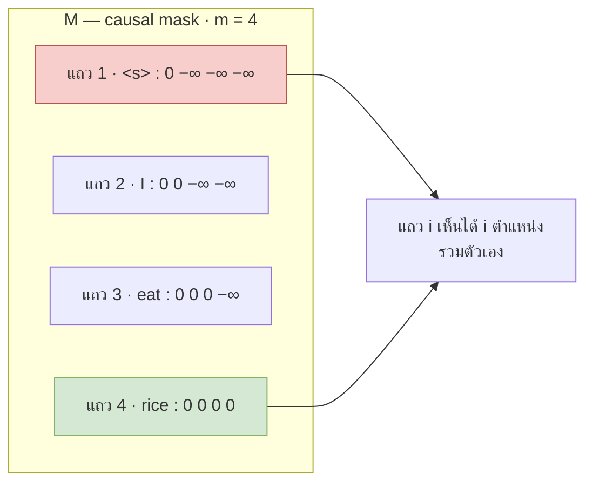
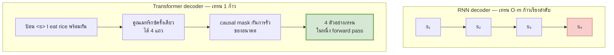
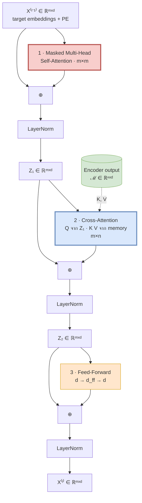
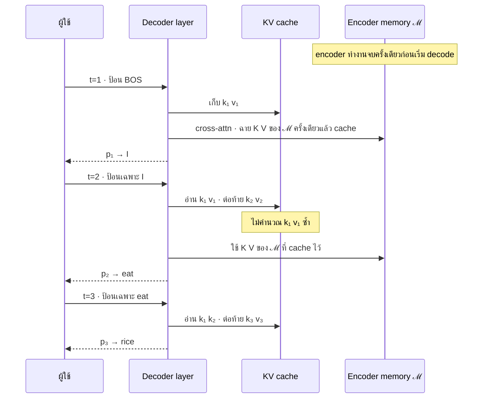

# 11 — Decoder และ Masked Attention

> **ก่อนหน้า:** [10 — Encoder เต็มรูปแบบ](10-encoder-full-pipeline.md)
> **ถัดไป:** [12 — การเทรนและ Backpropagation](12-training-objective-backprop.md)

---

Encoder ในไฟล์ที่แล้วมีอิสระเต็มที่ — ทุกโทเคนเห็นทุกโทเคน
Decoder ทำแบบนั้น**ไม่ได้** และข้อจำกัดข้อเดียวนี้เองที่สร้างทุกอย่างที่ต่างกัน: causal mask, cross-attention, KV cache และช่องว่างระหว่างความเร็วตอนเทรนกับตอนใช้งาน

---

## 1. ทำไม Decoder ต่างจาก Encoder

กลับไปที่ chain rule ในไฟล์ [01 §1.2](01-seq2seq-rnn-basics.md)

$$
p(\mathbf{y} \mid \mathbf{x}) = \prod_{t=1}^{m} p(y_t \mid y_{\lt{}t},\ \mathbf{x})
$$

พจน์ที่ $t$ เขียนไว้ชัดว่าเงื่อนไขคือ $y_{\lt{}t}$ — **คำที่มาก่อนเท่านั้น** ไม่ใช่ $y_{\le m}$

> **จุดสำคัญ:** ถ้าตอนเทรนเราปล่อยให้ตำแหน่ง $t$ มองเห็น $y_t$ หรือ $y_{t+1}$ ได้ โมเดลจะเรียนทางลัดที่ง่ายที่สุด คือ "ก๊อป $y_t$ มาตอบ" → loss ลงสวยงาม แต่ตอน inference จริง $y_t$ **ยังไม่มีอยู่** → พังทันที
> เราเรียกข้อจำกัดนี้ว่า **autoregressive constraint** และเรียกความผิดพลาดแบบนั้นว่า *label leakage*

| | Encoder | Decoder |
|---|---|---|
| ตำแหน่ง $i$ มองเห็น | ทุกตำแหน่ง $j = 1..n$ | เฉพาะ $j \le i$ |
| มาสก์ที่ใช้ใน self-attention | padding mask เท่านั้น | **causal mask** + padding mask |
| รูปร่างเมทริกซ์ attention | $n \times n$ | $m \times m$ (self) และ $m \times n$ (cross) |
| จำนวน sublayer ต่อเลเยอร์ | 2 | **3** |
| ตอน inference | 1 forward pass | $O(m)$ ก้าวเรียงลำดับ |

---

## 2. Masked (Causal) Self-Attention

### 2.1 นิยามมาสก์

$$
\boxed{\ M_{ij} = \begin{cases} 0 & j \le i \\[2pt] -\infty & j \gt{} i \end{cases}
\qquad\qquad
\text{MaskedAttn}(Q,K,V) = \text{softmax}\!\left(\frac{QK^\top}{\sqrt{d_k}} + M\right)V\ }
$$

| ตัวแปร | มิติ | หมายเหตุ |
|---|---|---|
| $Q, K, V$ | $\mathbb{R}^{m \times d_k}$ | มาจาก decoder ทั้งหมด |
| $S = QK^\top/\sqrt{d_k}$ | $\mathbb{R}^{m \times m}$ | |
| $M$ | $\mathbb{R}^{m \times m}$ | **สามเหลี่ยมล่างเป็น 0, บนเป็น $-\infty$** |
| $A = \text{softmax}(S+M)$ | $\mathbb{R}^{m \times m}$ | สามเหลี่ยมบนเป็น 0 พอดี |
| ผลลัพธ์ | $\mathbb{R}^{m \times d_v}$ | |



**สัญชาตญาณ:** $M$ คือ "ผ้าคลุมอนาคต" — คะแนนที่โดนบวก $-\infty$ จะกลายเป็น $e^{-\infty} = 0$ หลัง softmax น้ำหนักจึงเป็นศูนย์เป๊ะ ไม่ใช่แค่เล็ก

### 2.2 เดินตัวเลข: ก่อนและหลังมาสก์

ใช้ target `<s> I eat rice` ($m=4$) สมมติได้คะแนนดิบ

**$S = QK^\top/\sqrt{d_k}$**

| | \<s\> | I | eat | rice |
|---|---|---|---|---|
| **\<s\>** | 1.2000 | 0.5000 | -0.3000 | 0.8000 |
| **I** | 0.4000 | 1.5000 | 0.2000 | -0.6000 |
| **eat** | -0.1000 | 0.7000 | 1.3000 | 0.9000 |
| **rice** | 0.6000 | -0.2000 | 0.4000 | 1.1000 |

**$\text{softmax}(S)$ — ยังไม่มาสก์ ← อนาคตรั่ว**

| | \<s\> | I | eat | rice |
|---|---|---|---|---|
| **\<s\>** | 0.4184 | **0.2078** | **0.0934** | **0.2805** |
| **I** | 0.1926 | 0.5788 | **0.1577** | **0.0709** |
| **eat** | 0.1000 | 0.2226 | 0.4056 | **0.2719** |
| **rice** | 0.2553 | 0.1147 | 0.2090 | 0.4209 |

> แถว `<s>` เท 28.05% ให้ `rice` ทั้งที่ตอน inference จริง `rice` ยังไม่ถูกสร้าง — ตัวเลขตัวหนาทั้งหมดคือการรั่วของอนาคต

**$S + M$**

| | \<s\> | I | eat | rice |
|---|---|---|---|---|
| **\<s\>** | 1.2000 | $-\infty$ | $-\infty$ | $-\infty$ |
| **I** | 0.4000 | 1.5000 | $-\infty$ | $-\infty$ |
| **eat** | -0.1000 | 0.7000 | 1.3000 | $-\infty$ |
| **rice** | 0.6000 | -0.2000 | 0.4000 | 1.1000 |

**$A = \text{softmax}(S + M)$**

| | \<s\> | I | eat | rice | ผลรวมแถว |
|---|---|---|---|---|---|
| **\<s\>** | **1.0000** | 0.0000 | 0.0000 | 0.0000 | 1.0000 |
| **I** | 0.2497 | 0.7503 | 0.0000 | 0.0000 | 1.0000 |
| **eat** | 0.1373 | 0.3057 | 0.5570 | 0.0000 | 1.0000 |
| **rice** | 0.2553 | 0.1147 | 0.2090 | 0.4209 | 1.0000 |

**อ่านผล:**
- แถวแรกเห็นตัวเองตัวเดียว → น้ำหนัก 1.0000 (softmax ของค่าเดียวคือ 1 เสมอ ไม่ว่าคะแนนดิบเป็นเท่าไร)
- แถวสุดท้ายไม่ถูกมาสก์เลย → ค่าตรงกับ $\text{softmax}(S)$ แถวสุดท้ายทุกหลัก (0.2553 / 0.1147 / 0.2090 / 0.4209)
- ทุกแถวยังรวมได้ **1.0000** พอดี

### 2.3 ทำไมบวก $-\infty$ ก่อน softmax ไม่ใช่คูณศูนย์หลัง softmax

ถ้าลองทำแบบหลัง — คำนวณ $\text{softmax}(S)$ ก่อน แล้วค่อยคูณด้วยสามเหลี่ยมล่างของ 0/1:

| | \<s\> | I | eat | rice | **ผลรวมแถว** |
|---|---|---|---|---|---|
| **\<s\>** | 0.4184 | 0 | 0 | 0 | **0.4184** ✗ |
| **I** | 0.1926 | 0.5788 | 0 | 0 | **0.7714** ✗ |
| **eat** | 0.1000 | 0.2226 | 0.4056 | 0 | **0.7281** ✗ |
| **rice** | 0.2553 | 0.1147 | 0.2090 | 0.4209 | 1.0000 |

**แถวไม่รวมเป็น 1 อีกต่อไป** — และผลรวมยัง *ต่างกันในแต่ละแถว* ด้วย (0.4184 vs 0.7714 vs 0.7281) ผลลัพธ์ $AV$ จึงกลายเป็น "ค่าเฉลี่ยที่ถูกหรี่ลงไม่เท่ากัน" แทนที่จะเป็น convex combination ของ value

$$
\text{ต้องการ:}\quad \mathbf{o}_i = \sum_{j \le i} \alpha_{ij}\mathbf{v}_j \quad\text{โดย}\quad \sum_{j\le i}\alpha_{ij} = 1
$$

| เหตุผล | รายละเอียด |
|---|---|
| **สเกลของ output** | ถ้าแถวรวมได้ 0.4184 output จะเล็กลง 58% เฉย ๆ → residual stream เพี้ยน และ LN ต้องมาแก้ทีหลัง |
| **สเกลไม่คงที่ข้ามตำแหน่ง** | แถวต้น ๆ ถูกหรี่มากกว่าแถวท้าย → โมเดลได้สัญญาณเทียมว่า "ตำแหน่งต้นสำคัญน้อยกว่า" |
| **หนึ่งครั้งจบ** | บวก $-\infty$ แล้ว softmax normalize ให้เองอัตโนมัติ ไม่ต้อง normalize ซ้ำ |
| **ตัวเลขเสถียร** | ทำใน log-space ก่อน exp — ตรงกับเคล็ดลบ max ของ softmax พอดี |

> **หมายเหตุที่ซื่อสัตย์:** ถ้าคุณ *normalize ใหม่* หลังคูณศูนย์ ($\alpha_{ij} / \sum_{j'} \alpha_{ij'}$) จะได้ผลเท่ากันเป๊ะ — ลองแถว `I`: $0.1926/0.7714 = 0.2497$ ✓ และ $0.5788/0.7714 = 0.7503$ ✓
> แต่นั่นคือทำสองขั้นเพื่อผลลัพธ์เดียวกัน แถมยังต้อง exp ค่าที่จะถูกทิ้งอยู่ดี วิธี $-\infty$ จึงชนะทั้งความเรียบง่ายและความเร็ว

**ทำไมโค้ดจริงใช้ $-10^9$ แทน $-\infty$:** ค่า $-\infty$ จริงทำให้เกิด `NaN` ทันทีถ้าทั้งแถวถูกมาสก์ ($-\infty - (-\infty)$) และ mixed-precision (fp16) มี $-\infty$ ที่จัดการยาก ค่า $-10^9$ ให้ $e^{-10^9} = 0$ ในทางปฏิบัติอยู่แล้ว (ใน fp16 ใช้ $-10^4$ เพราะ $-10^9$ ล้นช่วง)

```python
import numpy as np
def softmax(z, axis=-1):
    z = z - z.max(axis=axis, keepdims=True)
    e = np.exp(z); return e / e.sum(axis=axis, keepdims=True)

S = np.array([[ 1.2,  0.5, -0.3,  0.8],
              [ 0.4,  1.5,  0.2, -0.6],
              [-0.1,  0.7,  1.3,  0.9],
              [ 0.6, -0.2,  0.4,  1.1]])
M = np.triu(np.full((4, 4), -np.inf), k=1)      # ← M_ij = −∞ เมื่อ j > i
A = softmax(S + M)
print(np.round(A, 4))
# [[1.     0.     0.     0.    ]
#  [0.2497 0.7503 0.     0.    ]
#  [0.1373 0.3057 0.557  0.    ]
#  [0.2553 0.1147 0.209  0.4209]]
print(A.sum(-1))                                 # [1. 1. 1. 1.]
```

```python
import torch
S = torch.tensor([[ 1.2,  0.5, -0.3,  0.8],
                  [ 0.4,  1.5,  0.2, -0.6],
                  [-0.1,  0.7,  1.3,  0.9],
                  [ 0.6, -0.2,  0.4,  1.1]])
M = torch.triu(torch.full((4, 4), float('-inf')), diagonal=1)   # ← มาตรฐาน PyTorch
A = (S + M).softmax(-1)
# หรือเขียนแบบ boolean mask — ได้ผลเท่ากัน
causal = torch.ones(4, 4, dtype=torch.bool).triu(1)
A2 = S.masked_fill(causal, float('-inf')).softmax(-1)
assert torch.allclose(A, A2)
print(torch.round(A, decimals=4))
```

### 2.4 ทำไม masking ทำให้เทรนแบบขนานได้ — จุดที่สำคัญที่สุดของไฟล์นี้

นี่คือเหตุผลที่ Transformer เอาชนะ RNN ในเชิงวิศวกรรม

**RNN decoder ตอนเทรน:** ต้องคำนวณ $\mathbf{s}_1 \to \mathbf{s}_2 \to \dots \to \mathbf{s}_m$ ตามลำดับ เพราะ $\mathbf{s}_t$ ต้องรอ $\mathbf{s}_{t-1}$ → **$O(m)$ ก้าวเรียงลำดับ** แม้จะรู้คำตอบทั้งประโยคอยู่แล้ว

**Transformer decoder ตอนเทรน:** ใช้สองอย่างร่วมกัน

1. **Teacher forcing** — ป้อน *เฉลย* ทั้งประโยค (shifted right) เป็น input: `[<s>, I, eat, rice]` ไม่ใช่คำที่โมเดลทายเอง
2. **Causal mask** — รับประกันว่าแถว $t$ คำนวณโดยใช้แค่คอลัมน์ $\le t$ เท่านั้น

$$
\boxed{\ \underbrace{\text{teacher forcing}}_{\text{รู้ } y_{\lt{}t} \text{ ทุก } t \text{ ล่วงหน้า}} + \underbrace{\text{causal mask}}_{\text{กันไม่ให้เห็น } y_{\ge t}} = \underbrace{m \text{ ตัวอย่างเทรนใน 1 forward pass}}_{O(1) \text{ ก้าวเรียงลำดับ}}\ }
$$

แถวที่ $t$ ของ output คือการทำนาย $p(y_{t+1} \mid y_{\le t}, \mathbf{x})$ พอดี — **ทุกแถวคือหนึ่งตัวอย่างเทรน** และทั้ง $m$ แถวคำนวณพร้อมกันในการคูณเมทริกซ์ครั้งเดียว

| input ตำแหน่ง | โมเดลเห็น | ต้องทำนาย | เป็นตัวอย่างที่ |
|---|---|---|---|
| 1: `<s>` | `<s>` | `I` | 1 |
| 2: `I` | `<s> I` | `eat` | 2 |
| 3: `eat` | `<s> I eat` | `rice` | 3 |
| 4: `rice` | `<s> I eat rice` | `<eos>` | 4 |



> **จุดสำคัญ:** causal mask ไม่ใช่ "ข้อจำกัดที่น่ารำคาญ" แต่เป็น **เครื่องมือที่ปลดล็อกการเทรนแบบขนาน** — มันเปลี่ยนการวนลูป $m$ รอบให้กลายเป็นการคูณเมทริกซ์ครั้งเดียวที่ GPU ชอบที่สุด
> และนี่คือคำตอบของคำถามในไฟล์ [04](04-transformer-motivation.md) ว่าทำไมทิ้ง recurrence แล้วยังเทรน autoregressive model ได้

**ระวัง:** ข้อได้เปรียบนี้มีเฉพาะ **ตอนเทรน** เท่านั้น ตอน inference เราไม่มีเฉลย → กลับไปเป็น $O(m)$ ก้าวเรียงลำดับ (หัวข้อ 6)

---

## 3. Cross-Attention (Encoder–Decoder Attention)

### 3.1 $Q$ จาก decoder, $K$ กับ $V$ จาก encoder

$$
\boxed{\ \text{CrossAttn}(Z, \mathcal{M}) = \text{softmax}\!\left(\frac{(ZW^Q)(\mathcal{M}W^K)^\top}{\sqrt{d_k}} + M^{\text{pad}}_{\text{src}}\right)(\mathcal{M}W^V)\ }
$$

โดย $\mathcal{M} = X^{(N)}_{\text{enc}}$ คือ encoder output (เรียกว่า *memory*)

| ตัวแปร | มิติ | มาจากไหน |
|---|---|---|
| $Z$ | $\mathbb{R}^{m \times d_{\text{model}}}$ | decoder (หลัง sublayer 1) |
| $\mathcal{M}$ | $\mathbb{R}^{n \times d_{\text{model}}}$ | **encoder output** |
| $Q = ZW^Q$ | $\mathbb{R}^{m \times d_k}$ | decoder |
| $K = \mathcal{M}W^K$ | $\mathbb{R}^{n \times d_k}$ | encoder |
| $V = \mathcal{M}W^V$ | $\mathbb{R}^{n \times d_v}$ | encoder |
| $QK^\top$ | $\mathbb{R}^{m \times n}$ ← **ไม่ใช่จัตุรัส** | |
| output | $\mathbb{R}^{m \times d_v}$ | |

**สัญชาตญาณ:** decoder ถามคำถาม ("ตอนนี้ฉันกำลังจะแปลคำอะไร?") แล้วไปค้นในคลังของ encoder — $Q$ คือคำถาม, $K$ คือดัชนีของคลัง, $V$ คือเนื้อหาที่ดึงกลับมา

**เดินตัวเลข:** decoder $m=3$ (`<s>, I, eat`) กับ encoder $n=3$ (`ฉัน, กิน, ข้าว`)

$S_{\text{cross}} = QK^\top/\sqrt{d_k}$ ขนาด $3\times3$ (บังเอิญจัตุรัสเพราะ $m=n$ แต่โดยทั่วไปไม่ใช่)

| | ฉัน | กิน | ข้าว |
|---|---|---|---|
| **\<s\>** | 0.1556 | 0.1697 | 0.3253 |
| **I** | 0.0849 | 0.4101 | 0.2263 |
| **eat** | 0.2333 | -0.0212 | 0.4455 |

$A_{\text{cross}} = \text{softmax}(S_{\text{cross}})$ — **normalize ตามแกน source ($n$)**

| | ฉัน | กิน | ข้าว | รวม |
|---|---|---|---|---|
| **\<s\>** | 0.3126 | 0.3170 | 0.3704 | 1.0000 |
| **I** | 0.2828 | 0.3915 | 0.3257 | 1.0000 |
| **eat** | 0.3321 | 0.2574 | 0.4105 | 1.0000 |

> แถว `eat` ให้น้ำหนัก `ข้าว` มากที่สุด (0.4105) — ในโมเดลที่เทรนแล้ว เมทริกซ์นี้จะกลายเป็น **alignment matrix** ที่อ่านออกได้ว่าคำไหนแปลมาจากคำไหน

### 3.2 นี่คือ Bahdanau attention ที่เขียนใหม่ด้วย Q/K/V

เทียบกับไฟล์ [03](03-attention-mechanism-origin.md) ตรง ๆ

| | Bahdanau (2015) | Cross-Attention (2017) |
|---|---|---|
| คะแนน | $e_{tj} = \mathbf{v}^\top\tanh(\mathbf{s}_{t-1}W_s + \mathbf{h}_jW_h)$ | $s_{tj} = \dfrac{(\mathbf{z}_tW^Q)(\mathbf{h}_jW^K)^\top}{\sqrt{d_k}}$ |
| ประเภทคะแนน | additive (MLP 1 ชั้น) | scaled dot-product |
| น้ำหนัก | $\alpha_{tj} = \text{softmax}_j(e_{tj})$ | $\alpha_{tj} = \text{softmax}_j(s_{tj})$ **เหมือนกันเป๊ะ** |
| context | $\mathbf{c}_t = \sum_j \alpha_{tj}\mathbf{h}_j$ | $\mathbf{c}_t = \sum_j \alpha_{tj}(\mathbf{h}_jW^V)$ |
| "query" | $\mathbf{s}_{t-1}$ (RNN state) | $\mathbf{z}_t$ (decoder residual stream) |
| "key" กับ "value" | เป็น $\mathbf{h}_j$ **ตัวเดียวกัน** | **แยกกัน** ผ่าน $W^K$ และ $W^V$ |
| จำนวนหัว | 1 | $H = 8$ |
| คำนวณทุก $t$ พร้อมกันได้ไหม | ไม่ได้ ($\mathbf{s}_{t-1}$ ต้องรอ) | **ได้** (ทั้ง $m$ แถวพร้อมกัน) |

**สามการเปลี่ยนแปลงที่เกิดขึ้น:**

1. **additive → dot-product** เร็วกว่ามากเพราะยุบเป็น matmul ตัวเดียว (ไฟล์ [05](05-self-attention-math.md)) แลกด้วยต้องหาร $\sqrt{d_k}$
2. **แยก key ออกจาก value** — $\mathbf{h}_j$ ทำสองหน้าที่ที่ขัดกัน (เป็นทั้งตัวจับคู่และตัวเนื้อหา) การแยกให้อิสระในการเรียนคนละแบบ
3. **หลายหัว** — จับ alignment ได้หลายมุมพร้อมกัน (ไฟล์ [06](06-multi-head-attention.md))

> **สัญชาตญาณ:** Cross-attention ไม่ใช่ของใหม่ มันคือ Bahdanau attention ที่ถูกจัดระเบียบใหม่ให้เป็น matmul ล้วน ๆ — และการจัดระเบียบนั้นเองที่ทำให้ recurrence กลายเป็นสิ่งที่ตัดทิ้งได้

### 3.3 มาสก์ที่ใช้ต่างกันอย่างไร

| ตำแหน่ง | มาสก์ที่ใช้ | รูปร่าง | เหตุผล |
|---|---|---|---|
| Decoder self-attention | **causal + pad ของ target** | $m \times m$ | ห้ามเห็นอนาคตของ target |
| Cross-attention | **pad ของ source เท่านั้น** | $m \times n$ | source มีให้ครบตั้งแต่ต้น ไม่มี "อนาคต" ให้ห้าม |
| Encoder self-attention | **pad ของ source เท่านั้น** | $n \times n$ | ไฟล์ [10 §5](10-encoder-full-pipeline.md) |

> **จุดสำคัญที่คนพลาดบ่อย:** cross-attention **ไม่มี causal mask** — decoder ตำแหน่งที่ 1 มองเห็น source ได้ทั้งประโยครวมถึงคำสุดท้าย นี่ถูกต้องแล้ว เพราะ "ห้ามมองอนาคต" หมายถึงอนาคตของ *สิ่งที่กำลังสร้าง* ไม่ใช่ของ *สิ่งที่อ่านเข้ามา*
> การเผลอใส่ causal mask ตรงนี้จะทำให้โมเดลแปลได้เฉพาะแบบเรียงคำตรง ๆ

---

## 4. โครงสร้าง 1 เลเยอร์ของ Decoder: 3 Sublayer

$$
\boxed{
\begin{aligned}
Z_1 &= \text{LN}_1\big(X + \text{MaskedMultiHead}(X,\ M^{\text{causal}})\big) && \text{sublayer 1} \\[3pt]
Z_2 &= \text{LN}_2\big(Z_1 + \text{MultiHead}(\underbrace{Z_1}_{Q},\ \underbrace{\mathcal{M},\ \mathcal{M}}_{K,\,V})\big) && \text{sublayer 2} \\[3pt]
Y   &= \text{LN}_3\big(Z_2 + \text{FFN}(Z_2)\big) && \text{sublayer 3}
\end{aligned}}
$$



| sublayer | ผสมข้อมูลข้าม | มาสก์ | shape ของ $A$ |
|---|---|---|---|
| 1 · masked self-attn | ตำแหน่ง target ที่ผ่านมา | causal + target pad | $m \times m$ |
| 2 · cross-attn | ตำแหน่ง **source ทั้งหมด** | source pad | $m \times n$ |
| 3 · FFN | ไม่ผสมเลย (position-wise) | — | — |

**หมายเหตุสำคัญ:** $\mathcal{M}$ ตัวเดียวกันถูกใช้ในทุกเลเยอร์ของ decoder และ **encoder ทำงานจบไปแล้วครั้งเดียว** ก่อน decoder เริ่ม → ตอน inference เราคำนวณ $\mathcal{M}W^K$ และ $\mathcal{M}W^V$ ครั้งเดียวแล้ว cache ไว้ตลอดการ decode

**จำนวนพารามิเตอร์ต่อ decoder layer** (Transformer-base, projection ไม่มี bias):

| ส่วน | สูตร | จำนวน |
|---|---|---|
| masked self-attn ($W^Q,W^K,W^V,W^O$) | $4d^2$ | 1,048,576 |
| cross-attn ($W^Q,W^K,W^V,W^O$) | $4d^2$ | 1,048,576 |
| FFN | $2dd_{\text{ff}} + d_{\text{ff}} + d$ | 2,099,712 |
| LN สามตัว | $3 \times 2d$ | 3,072 |
| **รวม 1 เลเยอร์** | | **4,199,936** |
| **decoder $N=6$** | | **25,199,616** |

เทียบกับ encoder layer 3,150,336 → decoder layer หนักกว่า **33%** เพราะมี attention block เพิ่มมาอีกก้อน

---

## 5. Output Head และ Weight Tying

หลัง decoder layer สุดท้าย เราแปลง $\mathbb{R}^{m\times d_{\text{model}}}$ เป็นการแจกแจงเหนือ vocabulary

$$
\boxed{\ Z = X^{(N)}_{\text{dec}}W_{\text{out}} + \mathbf{b}_{\text{out}} \in \mathbb{R}^{m \times V},
\qquad
p(y_t \mid y_{\lt{}t}, \mathbf{x}) = \text{softmax}(\mathbf{z}_t)\ }
$$

| ตัวแปร | มิติ |
|---|---|
| $X^{(N)}_{\text{dec}}$ | $\mathbb{R}^{m \times d_{\text{model}}}$ |
| $W_{\text{out}}$ | $\mathbb{R}^{d_{\text{model}} \times V}$ |
| $Z$ (logits) | $\mathbb{R}^{m \times V}$ |
| $p$ | $\mathbb{R}^{m \times V}$, แต่ละแถวรวมได้ 1 |

### Weight Tying

**Weight tying** คือการบังคับให้

$$
\boxed{\ W_{\text{out}} = E^\top\ }
\qquad (E \in \mathbb{R}^{V \times d_{\text{model}}}\ \text{คือ embedding matrix})
$$

ทำให้ logit ของโทเคน $v$ กลายเป็น dot product ตรง ๆ

$$
z_{tv} = \mathbf{x}_t \cdot \mathbf{e}_v
$$

เปเปอร์ Transformer ผูก **3 เมทริกซ์เข้าด้วยกัน**: source embedding, target embedding และ output projection (เป็นไปได้เพราะใช้ shared BPE vocabulary)

**เหตุผลที่ 1 — ประหยัดพารามิเตอร์**

| แบบ | เมทริกซ์ที่ต้องเก็บ | จำนวน ($V=37{,}000$, $d=512$) |
|---|---|---|
| ไม่ผูก | src emb + tgt emb + output proj (+ bias) | 56,869,000 |
| ผูกทั้งสาม | เมทริกซ์เดียว (+ bias) | 18,981,000 |
| **ประหยัด** | | **37,888,000 (≈ 66.6%)** |

เทียบกับโมเดลทั้งก้อน:

| ส่วน | พารามิเตอร์ |
|---|---|
| embedding (ผูกแล้ว) | 18,944,000 |
| encoder ×6 | 18,902,016 |
| decoder ×6 | 25,199,616 |
| **รวม** | **63,045,632** ≈ 63M |

(เปเปอร์รายงาน 65M — ต่างกันเล็กน้อยตามรายละเอียดการนับ bias และ vocabulary จริง)

> ถ้า **ไม่** ผูกน้ำหนัก โมเดลจะโตเป็น ~101M คือ embedding อย่างเดียวกิน 56% ของทั้งโมเดล

**เหตุผลที่ 2 — regularization และความสมเหตุสมผลเชิงความหมาย**

โทเคนหนึ่งตัวควรมี "ตัวแทน" อันเดียว ไม่ว่าจะใช้ตอน *อ่านเข้า* หรือตอน *เขียนออก*

- ถ้าไม่ผูก: คำหายากจะได้ gradient ที่ input embedding น้อยมาก และที่ output ก็น้อยมาก → เรียนได้แย่ทั้งสองทาง
- ถ้าผูก: gradient จากทั้งสองเส้นทางไปรวมกันที่เมทริกซ์เดียว → คำหายากได้สัญญาณมากขึ้นเท่าตัว
- ผลเชิงเรขาคณิต: logit $= \mathbf{x}_t \cdot \mathbf{e}_v$ แปลว่า "ทำนายโทเคน $v$" $\equiv$ "ทำให้ hidden state ชี้ไปทางเดียวกับ embedding ของ $v$" ซึ่งบังคับให้ output space กับ embedding space เป็นปริภูมิเดียวกันโดยอัตโนมัติ

> **ระวัง:** เมื่อผูกน้ำหนักแล้ว ตัวคูณ $\sqrt{d_{\text{model}}}$ ในไฟล์ [10 §1.3](10-encoder-full-pipeline.md) มีผลต่อ *ขนาดของ logits* ด้วย — สองอย่างนี้ต้องปรับด้วยกันเสมอ

```python
import torch.nn as nn

class OutputHead(nn.Module):
    def __init__(self, emb: nn.Embedding, tie=True):
        super().__init__()
        V, d = emb.weight.shape
        self.proj = nn.Linear(d, V, bias=False)
        if tie:
            self.proj.weight = emb.weight        # ← W_out = Eᵀ (แชร์เทนเซอร์เดียวกันจริง ๆ)

    def forward(self, x):                        # x: (B, m, d)
        return self.proj(x)                      # logits: (B, m, V)
```

---

## 6. การอนุมาน (Inference)

### 6.1 Autoregressive Loop และทำไมช้ากว่าตอนเทรน

ตอนเทรนเรามีเฉลย → 1 forward pass
ตอน inference เราไม่มี → **ต้องสร้างทีละโทเคนแล้วป้อนกลับเข้าไปเอง**

```
t=1: input [<s>]                → p₁ → เลือก "I"
t=2: input [<s>, I]             → p₂ → เลือก "eat"
t=3: input [<s>, I, eat]        → p₃ → เลือก "rice"
t=4: input [<s>, I, eat, rice]  → p₄ → เลือก "<eos>" → หยุด
```

> **จุดสำคัญ — $O(m)$ ก้าวเรียงลำดับกลับมาอีกครั้ง:** ไฟล์ [02](02-seq2seq-limitations.md) โจมตี RNN ว่าคำนวณขนานไม่ได้ Transformer แก้ปัญหานั้นได้ **เฉพาะตอนเทรน** ตอน inference ยังต้องเดินทีละก้าวเหมือนเดิม
> ต่างกันตรงที่ *ภายในหนึ่งก้าว* Transformer ยังขนานได้เต็มที่ (ทุก head ทุกมิติพร้อมกัน) ในขณะที่ RNN ก็ขนานไม่ได้ในก้าวนั้นด้วย

**เลวร้ายกว่านั้น:** แบบไร้เดียงสา ก้าวที่ $t$ ต้องคำนวณ attention ใหม่ทั้ง $t$ ตำแหน่ง ทั้งที่ $t-1$ ตำแหน่งแรก **ไม่มีอะไรเปลี่ยนเลย**

### 6.2 KV Cache

**ข้อสังเกตที่ทำให้ทุกอย่างเปลี่ยน:** ด้วย causal mask ตำแหน่ง $j$ ไม่เคยเห็นตำแหน่งที่มาทีหลัง → $\mathbf{k}_j$ และ $\mathbf{v}_j$ **ไม่มีวันเปลี่ยน** เมื่อคำนวณไปแล้ว

$$
\mathbf{k}_j = \mathbf{x}_jW^K, \quad \mathbf{v}_j = \mathbf{x}_jW^V
\qquad \text{และ} \qquad
\mathbf{x}_j \text{ ขึ้นกับแค่ } y_{\le j}
$$

จึงเก็บใส่ cache ได้ ก้าวที่ $t$ เหลือแค่

$$
\boxed{
\begin{aligned}
K_{\le t} &= [K_{\le t-1};\ \mathbf{x}_tW^K] && \text{ต่อท้าย 1 แถว} \\
V_{\le t} &= [V_{\le t-1};\ \mathbf{x}_tW^V] && \text{ต่อท้าย 1 แถว} \\
\mathbf{o}_t &= \text{softmax}\!\left(\frac{(\mathbf{x}_tW^Q)K_{\le t}^\top}{\sqrt{d_k}}\right)V_{\le t} && \text{query แถวเดียว}
\end{aligned}}
$$

สังเกตว่า **ไม่ต้องใช้ causal mask อีกแล้ว** ตอน decode ทีละก้าว เพราะ cache มีแค่อดีตอยู่แล้วโดยธรรมชาติ



**สิ่งที่ประหยัดได้ต่อก้าว**

| การคำนวณ | ไม่มี cache | มี cache | ประหยัด |
|---|---|---|---|
| ฉาย $Q,K,V,O$ | $t$ แถว | **1 แถว** | $t$ เท่า |
| $QK^\top$ + $AV$ | $t \times t$ | **$1 \times t$** | $t$ เท่า |
| FFN | $t$ แถว | **1 แถว** | $t$ เท่า |
| cross-attn $K,V$ | คำนวณใหม่ทุกก้าว | คำนวณครั้งเดียวตอนต้น | $m$ เท่า |

**FLOPs รวมของการ decode ทั้งประโยค** (Transformer-base, $N=6$, ไม่รวม output head, batch = 1)

| $m$ | ไม่มี cache (GFLOPs) | มี cache (GFLOPs) | เร็วขึ้น |
|---|---|---|---|
| 8 | 1.36 | 0.30 | **4.50×** |
| 32 | 20.07 | 1.21 | **16.53×** |
| 128 | 320.34 | 4.93 | **64.94×** |
| 512 | 5,508.83 | 20.94 | **263.06×** |

> **สัญชาตญาณ:** ไม่มี cache งานรวมโตแบบ $O(m^2)$ ถึง $O(m^3)$ มี cache โตแบบ $O(m)$ ถึง $O(m^2)$ — ยิ่งประโยคยาว ยิ่งได้กำไรมาก

**ต้นทุนที่แลกมา: หน่วยความจำ** cache มีขนาด $2 \times N \times m \times d_{\text{model}}$ ตัวเลข

| $m$ | ขนาด cache (fp32, batch = 1) |
|---|---|
| 512 | 12.58 MB |
| 2048 | 50.33 MB |

คูณด้วย batch size แล้วมันกลายเป็นคอขวดหลักของการ serve LLM — เป็นที่มาของ Multi-Query Attention, Grouped-Query Attention และ PagedAttention

```python
d, dff, N = 512, 2048, 6
def step_nocache(t):                  # ก้าวที่ t ต้องคำนวณใหม่ทั้ง t ตำแหน่ง
    return 2*(4*t*d*d) + 2*(2*t*t*d) + 2*(2*t*d*dff)
def step_cache(t):                    # ก้าวที่ t คำนวณแค่ 1 แถว, attend ไป t ตำแหน่ง
    return 2*(4*1*d*d) + 2*(2*1*t*d) + 2*(2*1*d*dff)

for m in [8, 32, 128, 512]:
    a = sum(step_nocache(t) for t in range(1, m+1)) * N
    b = sum(step_cache(t)   for t in range(1, m+1)) * N
    print(m, round(a/1e9, 2), round(b/1e9, 2), f"{a/b:.2f}x")
# 8   1.36    0.30   4.50x
# 32  20.07   1.21   16.53x
# 128 320.34  4.93   64.94x
# 512 5508.83 20.94  263.06x
```

### 6.3 กลยุทธ์การเลือกโทเคน

ทุกก้าวเราได้เวกเตอร์ logits $\mathbf{z} \in \mathbb{R}^{V}$ คำถามคือจะแปลงเป็นโทเคนตัวถัดไปอย่างไร

**Temperature** — ปรับความ "คม" ของการแจกแจงก่อนสุ่ม

$$
p_v = \frac{\exp(z_v / T)}{\sum_{v'}\exp(z_{v'} / T)}
$$

**Greedy** — คือกรณี $T \to 0$

$$
\hat{y}_t = \arg\max_v\ p_v
$$

**Beam Search** (จากไฟล์ [01 §5.4](01-seq2seq-rnn-basics.md)) — เก็บ $B$ เส้นทางที่ดีที่สุด ให้คะแนนด้วย log-prob สะสมหารด้วยความยาว

$$
\text{score}(\mathbf{y}_{\le t}) = \frac{1}{t^\alpha}\sum_{t'=1}^{t}\log p(y_{t'} \mid y_{\lt{}t'}, \mathbf{x}), \qquad \alpha \approx 0.6
$$

**Top-$k$ sampling** — เก็บเฉพาะ $k$ ตัวที่น่าจะเป็นที่สุด แล้ว normalize ใหม่

$$
\mathcal{V}_k = \text{top-}k\text{ ของ } p, \qquad
p'_v = \begin{cases} \dfrac{p_v}{\sum_{v'\in\mathcal{V}_k}p_{v'}} & v \in \mathcal{V}_k \\[6pt] 0 & \text{อื่น ๆ} \end{cases}
$$

**Top-$p$ (nucleus) sampling** — เก็บเซตที่เล็กที่สุดที่ความน่าจะเป็นสะสมถึง $p$

$$
\mathcal{V}_p = \text{เซตเล็กสุดที่}\ \sum_{v \in \mathcal{V}_p} p_v \ge p,
\qquad
p'_v = \frac{p_v\,\mathbb{1}[v \in \mathcal{V}_p]}{\sum_{v'\in\mathcal{V}_p}p_{v'}}
$$

**เดินตัวเลขทั้งหมดบนเวกเตอร์เดียวกัน** — logits $\mathbf{z} = [3.2,\ 1.8,\ 1.5,\ 0.4,\ -0.5]$ เหนือ vocabulary `{rice, noodle, bread, water, <eos>}`

| วิธี | rice | noodle | bread | water | \<eos\> | สังเกต |
|---|---|---|---|---|---|---|
| $T = 1.0$ (ฐาน) | 0.6601 | 0.1628 | 0.1206 | 0.0401 | 0.0163 | |
| $T = 0.5$ | **0.9103** | 0.0554 | 0.0304 | 0.0034 | 0.0006 | คมขึ้น → เข้าใกล้ greedy |
| $T = 2.0$ | 0.4296 | 0.2133 | 0.1836 | 0.1059 | 0.0675 | แบนลง → หลากหลาย/มั่วขึ้น |
| greedy ($T\to0$) | 1.0000 | 0 | 0 | 0 | 0 | ตัดขาด |
| top-$k$, $k=2$ | 0.8022 | 0.1978 | 0 | 0 | 0 | ตัดหางทิ้ง |
| top-$k$, $k=3$ | 0.6997 | 0.1725 | 0.1278 | 0 | 0 | |
| top-$p$, $p=0.8$ | 0.8022 | 0.1978 | 0 | 0 | 0 | |
| top-$p$, $p=0.9$ | 0.6997 | 0.1725 | 0.1278 | 0 | 0 | |

ความน่าจะเป็นสะสม (เรียงจากมากไปน้อย): $[0.6601,\ 0.8229,\ 0.9435,\ 0.9837,\ 1.0000]$
→ ต้องใช้ 2 ตัวจึงถึง 0.8 และ 3 ตัวจึงถึง 0.9

> **สังเกต:** บนเวกเตอร์นี้ top-$p$ 0.9 ให้ผลเท่ากับ top-$k$ 3 เป๊ะ ๆ — **ความต่างอยู่ที่การปรับตัว** ถ้าเจอการแจกแจงที่คมมาก (เช่น $p_1 = 0.95$) top-$p$ 0.9 จะเก็บแค่ **1 ตัว** ในขณะที่ top-$k$ 3 ยังยัด 2 ตัวหางเข้ามาเสมอ
> นั่นคือเหตุผลที่ nucleus sampling ชนะในทางปฏิบัติ: จำนวนตัวเลือกปรับตามความมั่นใจของโมเดล

| วิธี | ใช้เมื่อไร |
|---|---|
| Greedy | ต้องการผลซ้ำได้เป๊ะ · งานที่มีคำตอบเดียว |
| Beam search | แปลภาษา · สรุปความ (มีคำตอบ "ถูก" ชัดเจน) |
| Top-$k$ / Top-$p$ + temperature | สร้างข้อความเปิด (บทสนทนา นิยาย) ที่ beam จะออกมาซ้ำซากน่าเบื่อ |

```python
import numpy as np
def softmax(z):
    z = z - z.max(); e = np.exp(z); return e / e.sum()

z = np.array([3.2, 1.8, 1.5, 0.4, -0.5])

def temperature(z, T):  return softmax(z / T)                   # ← สมการ temperature
def top_k(p, k):
    idx = np.argsort(-p)[:k]
    q = np.zeros_like(p); q[idx] = p[idx]; return q / q.sum()    # ← normalize ใหม่
def top_p(p, thr):
    order = np.argsort(-p); c = np.cumsum(p[order])
    keep = order[:int(np.searchsorted(c, thr)) + 1]              # ← เซตเล็กสุดที่สะสม ≥ thr
    q = np.zeros_like(p); q[keep] = p[keep]; return q / q.sum()

p = softmax(z)
print(np.round(p, 4))                    # [0.6601 0.1628 0.1206 0.0401 0.0163]
print(np.round(temperature(z, 0.5), 4))  # [0.9103 0.0554 0.0304 0.0034 0.0006]
print(np.round(temperature(z, 2.0), 4))  # [0.4296 0.2133 0.1836 0.1059 0.0675]
print(np.round(top_k(p, 2), 4))          # [0.8022 0.1978 0.     0.     0.    ]
print(np.round(top_p(p, 0.9), 4))        # [0.6997 0.1725 0.1278 0.     0.    ]
```

---

## 7. เดินตัวเลขการถอดรหัส 3 ขั้นแรก

**การตั้งค่า:** โมเดลจิ๋ว $d=2$, vocabulary `{<s>, I, eat, rice, <eos>}` ($V=5$)
encoder memory $\mathcal{M} \in \mathbb{R}^{3\times2}$ แทน `ฉัน กิน ข้าว`

$$
E_{\text{dec}} = \begin{bmatrix}
0.0 & 0.0 \\ 0.6 & 0.2 \\ 0.1 & 0.7 \\ 0.5 & -0.4 \\ -0.3 & -0.6
\end{bmatrix},
\qquad
\mathcal{M} = \begin{bmatrix} 0.8 & 0.1 \\ 0.2 & 0.9 \\ 0.7 & -0.5 \end{bmatrix},
\qquad
W^Q = \begin{bmatrix} 1.0 & 0.3 \\ 0.2 & 1.0 \end{bmatrix}
$$

ขั้นตอนต่อก้าว: masked self-attn (บนโทเคนที่มีแล้ว) → cross-attn ไป $\mathcal{M}$ → output head

### ก้าวที่ 1 — input `[<s>]`

$m=1$ → causal mask ทำให้ $A = [1.0]$ ตัวเดียว

$A_{\text{cross}}$ แถวสุดท้าย $= [0.3333,\ 0.3333,\ 0.3333]$ (กระจายเท่ากันเพราะ query เป็นศูนย์)

$$
\mathbf{h} = [0.5667,\ 0.1667]
\quad\Rightarrow\quad
\mathbf{z} = [-0.7333,\ 1.2967,\ 0.6267,\ 0.1567,\ -0.3500]
$$

| โทเคน | \<s\> | **I** | eat | rice | \<eos\> |
|---|---|---|---|---|---|
| $p_1$ | 0.0609 | **0.4639** | 0.2374 | 0.1484 | 0.0894 |

→ greedy เลือก **`I`**

### ก้าวที่ 2 — input `[<s>, I]`

$A_{\text{cross}}$ แถวสุดท้าย $= [0.3508,\ 0.3391,\ 0.3101]$

$$
\mathbf{h} = [0.5655,\ 0.1852]
\quad\Rightarrow\quad
\mathbf{z} = [-0.7507,\ 0.1316,\ 1.2051,\ 0.7644,\ -0.2067]
$$

| โทเคน | \<s\> | I | **eat** | rice | \<eos\> |
|---|---|---|---|---|---|
| $p_2$ | 0.0597 | 0.1442 | **0.4219** | 0.2715 | 0.1028 |

→ greedy เลือก **`eat`**

### ก้าวที่ 3 — input `[<s>, I, eat]`

$A_{\text{cross}}$ แถวสุดท้าย $= [0.3418,\ 0.3785,\ 0.2797]$

$$
\mathbf{h} = [0.5449,\ 0.2350]
\quad\Rightarrow\quad
\mathbf{z} = [-0.7799,\ 0.0545,\ 0.1325,\ 1.7543,\ -0.2105]
$$

| โทเคน | \<s\> | I | eat | **rice** | \<eos\> |
|---|---|---|---|---|---|
| $p_3$ | 0.0496 | 0.1142 | 0.1235 | **0.6251** | 0.0876 |

→ greedy เลือก **`rice`**

$$
\boxed{\ \texttt{ฉัน กิน ข้าว} \ \longrightarrow\ \texttt{I eat rice}\ }
$$

**สองข้อสังเกต:**

1. **การแจกแจงคมขึ้นเรื่อย ๆ**: 0.4639 → 0.4219 → 0.6251 เพราะบริบทที่สะสมมามากขึ้นทำให้โมเดล "มั่นใจ" ขึ้น
2. **cross-attention ขยับตามการแปล**: แถว 1 กระจายเท่ากันหมด → แถว 2 เอนไปทาง `ฉัน` (0.3508) → แถว 3 เอนไปทาง `กิน` (0.3785) เห็นการเลื่อนของ alignment แม้ในโมเดลที่ยังไม่ได้เทรน

### โค้ดเต็ม: causal-masked attention + greedy decode loop

```python
import numpy as np

def softmax(z, axis=-1):
    z = z - z.max(axis=axis, keepdims=True)
    e = np.exp(z); return e / e.sum(axis=axis, keepdims=True)

def causal_mask(m):
    return np.triu(np.full((m, m), -np.inf), k=1)          # ← M_ij = −∞ เมื่อ j > i

def attention(Q, K, V, mask=None):
    S = Q @ K.T / np.sqrt(Q.shape[-1])                     # ← QKᵀ/√dₖ
    if mask is not None:
        S = S + mask                                       # ← + M
    return softmax(S) @ V

VOCAB = ["<s>", "I", "eat", "rice", "<eos>"]
E = np.array([[0.0,0.0], [0.6,0.2], [0.1,0.7], [0.5,-0.4], [-0.3,-0.6]])
MEM = np.array([[0.8,0.1], [0.2,0.9], [0.7,-0.5]])         # encoder output ℳ
Wq  = np.array([[1.0,0.3], [0.2,1.0]])
W_out = [np.array([[-1.0,2.2,0.4,0.1,-0.5], [-1.0,0.3,2.4,0.6,-0.4]]),
         np.array([[-1.0,0.2,2.0,0.5,-0.3], [-1.0,0.1,0.4,2.6,-0.2]]),
         np.array([[-1.0,0.1,0.2,2.4,-0.3], [-1.0,0.0,0.1,1.9,-0.2]])]

seq = [0]                                                   # เริ่มด้วย <s>
for t in range(3):
    Y = E[seq]                                              # (t+1, 2) teacher-free: ใช้ที่ทายเอง
    Q = Y @ Wq
    Hs = attention(Q, Q, Y, causal_mask(len(seq)))          # ← sublayer 1: masked self-attn
    Hx = attention(Hs @ Wq, MEM, MEM)                       # ← sublayer 2: cross-attn (ไม่มี causal!)
    p  = softmax(Hx[-1] @ W_out[t])                         # ← output head + softmax
    nxt = int(p.argmax())                                   # ← greedy
    print(f"t={t+1}  p={np.round(p,4)}  -> {VOCAB[nxt]}")
    if VOCAB[nxt] == "<eos>":
        break
    seq.append(nxt)
print(" ".join(VOCAB[i] for i in seq[1:]))
# t=1  p=[0.0609 0.4639 0.2374 0.1484 0.0894]  -> I
# t=2  p=[0.0597 0.1442 0.4219 0.2715 0.1028]  -> eat
# t=3  p=[0.0496 0.1142 0.1235 0.6251 0.0876]  -> rice
# I eat rice
```

```python
import math, torch, torch.nn as nn

def causal_mask(m, device=None):
    return torch.triu(torch.full((m, m), float('-inf'), device=device), diagonal=1)

def masked_attention(Q, K, V, mask=None):
    S = Q @ K.transpose(-2, -1) / math.sqrt(Q.size(-1))     # ← QKᵀ/√dₖ
    if mask is not None:
        S = S + mask                                        # ← + M
    return S.softmax(-1) @ V

S = torch.tensor([[ 1.2,  0.5, -0.3,  0.8],
                  [ 0.4,  1.5,  0.2, -0.6],
                  [-0.1,  0.7,  1.3,  0.9],
                  [ 0.6, -0.2,  0.4,  1.1]])
print(torch.round((S + causal_mask(4)).softmax(-1), decimals=4))
# tensor([[1.0000, 0.0000, 0.0000, 0.0000],
#         [0.2497, 0.7503, 0.0000, 0.0000],
#         [0.1373, 0.3057, 0.5570, 0.0000],
#         [0.2553, 0.1147, 0.2090, 0.4209]])


@torch.no_grad()
def greedy_decode(model, memory, src_pad, bos, eos, max_len=50):
    """model(ys, memory, tgt_mask, src_pad) -> logits (B, m, V)"""
    ys = torch.full((memory.size(0), 1), bos, dtype=torch.long, device=memory.device)
    for _ in range(max_len):
        logits = model(ys, memory, causal_mask(ys.size(1), ys.device), src_pad)
        nxt = logits[:, -1].argmax(-1, keepdim=True)        # ← greedy บนแถวสุดท้ายเท่านั้น
        ys = torch.cat([ys, nxt], dim=1)                    # ← ต่อท้ายแล้ววนใหม่  (O(m) ก้าว)
        if (nxt == eos).all():
            break
    return ys
```

---

## 8. สรุปไฟล์นี้

| สิ่งที่ได้ | สมการหลัก |
|---|---|
| Causal mask | $M_{ij} = 0$ ถ้า $j \le i$, $-\infty$ ถ้า $j \gt{} i$ |
| Masked self-attention | $\text{softmax}\!\left(\frac{QK^\top}{\sqrt{d_k}} + M\right)V$ |
| ทำไม $-\infty$ ไม่ใช่คูณศูนย์ | แถวต้องรวมได้ 1 (มิฉะนั้นได้ 0.4184 / 0.7714 / 0.7281 ไม่เท่ากัน) |
| ขนานตอนเทรน | teacher forcing + causal mask $\Rightarrow$ $m$ ตัวอย่างใน 1 forward pass |
| Cross-attention | $Q$ จาก decoder, $K,V$ จาก encoder $\Rightarrow$ $A \in \mathbb{R}^{m\times n}$ |
| มาสก์ของ cross-attn | **source pad เท่านั้น ไม่มี causal** |
| Decoder layer | 3 sublayer: masked self → cross → FFN (4,199,936 พารามิเตอร์) |
| Output head | $Z = X^{(N)}W_{\text{out}} + \mathbf{b}$, $W_{\text{out}} = E^\top$ (tying ประหยัด 37.9M) |
| Inference | $O(m)$ ก้าวเรียงลำดับ — KV cache เร็วขึ้น 263× ที่ $m=512$ |
| Sampling | greedy / beam / top-$k$ / top-$p$ / temperature $T$ |

**สิ่งที่ต้องจำไปไฟล์ถัดไป:**

1. output ของโมเดลคือ $p(y_t \mid y_{\lt{}t}, \mathbf{x})$ ครบทั้ง $m$ ตำแหน่งในหนึ่ง forward pass — ไฟล์ 12 จะเอาไปคิด cross-entropy loss ทีเดียวทั้งก้อน
2. causal mask ทำให้ gradient ของตำแหน่ง $t$ ไม่ไหลไปหาโทเคนที่มาทีหลัง — โครงสร้างสามเหลี่ยมนี้จะปรากฏใน backward pass ด้วย
3. ตำแหน่ง `<pad>` ต้องถูกตัดออกจากทั้ง attention **และ** loss

---

**ถัดไป:** [12 — การเทรนและ Backpropagation](12-training-objective-backprop.md)
