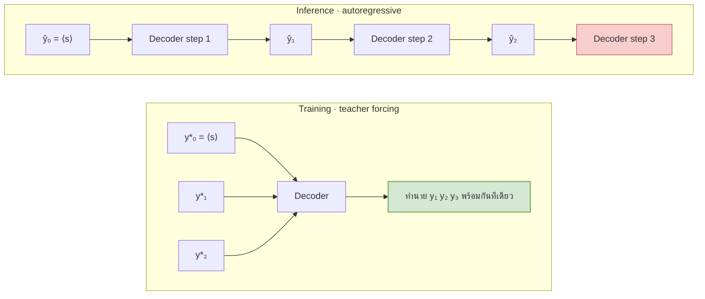
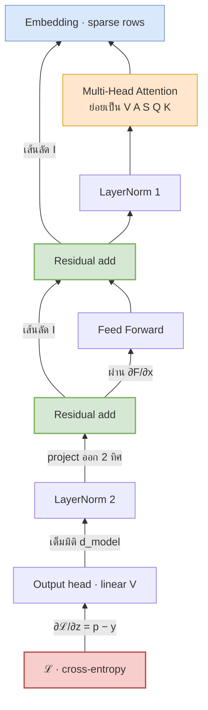
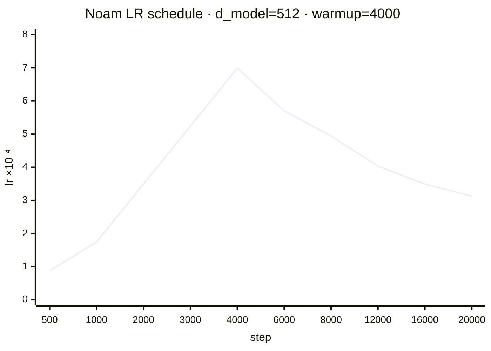
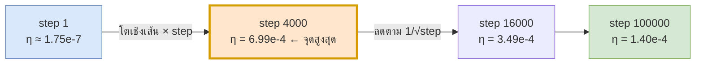

# 12 — การเทรนและ Backpropagation

> **ก่อนหน้า:** [11 — Decoder และ Masking](11-decoder-masked-attention.md)
> **ถัดไป:** [13 — สรุปและตารางอ้างอิง](13-summary-notation-reference.md)

---

ไฟล์ก่อนหน้าทั้งหมดตอบคำถามว่า "โมเดลคำนวณอะไร" ไฟล์นี้ตอบคำถามที่เหลือ: **โมเดลเรียนรู้ได้อย่างไร**
เราจะไล่ตั้งแต่ loss function → teacher forcing → เส้นทางที่ gradient ไหลย้อนผ่านทุกบล็อก → optimizer และตารางเรียนรู้ → ต้นทุนการเทรนเป็น FLOPs

---

## 1. ฟังก์ชันจุดประสงค์

### 1.1 Maximum Likelihood → Cross-Entropy

จากไฟล์ [01-1.2](01-seq2seq-rnn-basics.md) เรารู้ว่าโมเดลประมาณค่า

$$
p(\mathbf{y} \mid \mathbf{x}) = \prod\_{t=1}^{m} p(y\_t \mid y\_{{<}t}, \mathbf{x})
$$

การเทรนคือการหาพารามิเตอร์ $\theta$ ที่ทำให้ประโยคเฉลย $\mathbf{y}^\*$ **มีโอกาสเกิดสูงที่สุด** (maximum likelihood)

$$
\theta^\star = \arg\max\_\theta \prod\_{t=1}^{m} p\_\theta(y\_t^\* \mid y^\*\_{{<}t}, \mathbf{x})
$$

ผลคูณของเลข $\in (0,1)$ หลายร้อยตัวจะ underflow ทันที จึงใส่ $\log$ (ฟังก์ชันเพิ่มแบบเข้ม → argmax ไม่เปลี่ยน) แล้วกลับเครื่องหมายให้กลายเป็นปัญหา **minimize**

$$
\boxed{\ \mathcal{L} = -\frac{1}{m}\sum\_{t=1}^{m} \log p\_\theta\\!\left(y\_t^\* \mid y^\*\_{{<}t},\ \mathbf{x}\right)\ }
$$

| สัญลักษณ์ | มิติ | ความหมาย |
|---|---|---|
| $\mathbf{z}\_t$ | $\mathbb{R}^{1 \times V}$ | logits ที่ตำแหน่ง $t$ (ก่อน softmax) |
| $\mathbf{p}\_t = \text{softmax}(\mathbf{z}\_t)$ | $\mathbb{R}^{1 \times V}$ | การแจกแจงที่โมเดลทำนาย |
| $y\_t^\*$ | scalar $\in \\{1..V\\}$ | ดัชนีโทเคนเฉลย |
| $\mathbf{y}\_t^{\text{onehot}}$ | $\mathbb{R}^{1 \times V}$ | one-hot ของ $y\_t^\*$ |
| $m$ | scalar | ความยาว target |
| $V$ | scalar | ขนาด vocabulary |

> **สัญชาตญาณ:** *maximize likelihood* กับ *minimize negative log-likelihood* คือเรื่องเดียวกันมองคนละมุม — $\log$ ไม่เปลี่ยนลำดับ ส่วนเครื่องหมายลบแค่พลิกยอดเขาให้เป็นก้นหุบเขา เพื่อให้ใช้ gradient **descent** ได้

และเพราะ $\mathbf{y}\_t^{\text{onehot}}$ มีค่า 1 ที่ตำแหน่งเดียว สมการข้างบนจึงเท่ากับ **cross-entropy** ระหว่างการแจกแจงจริงกับที่ทำนาย

$$
\mathcal{L}\_t = H(\mathbf{y}\_t^{\text{onehot}},\ \mathbf{p}\_t) = -\sum\_{v=1}^{V} y^{\text{onehot}}\_{t,v}\log p\_{t,v} = -\log p\_{t,\\,y\_t^\*}
$$

**สัญชาตญาณ:** loss สนใจแค่ "โมเดลให้ความน่าจะเป็นกับคำที่ถูกเท่าไร" — ส่วนที่เหลือใน $V-1$ ตัวจะกระจายอย่างไรก็ได้ (ข้อนี้จะเปลี่ยนไปเมื่อใส่ label smoothing ใน §1.3)

### 1.2 Perplexity

$$
\boxed{\ \text{PPL} = \exp(\mathcal{L}) = \exp\\!\left(-\frac{1}{m}\sum\_t \log p(y^\*\_t \mid \cdot)\right)\ }
$$

PPL คือ **geometric mean ส่วนกลับ** ของความน่าจะเป็นที่โมเดลให้กับคำถูก อ่านได้ว่า

> "โดยเฉลี่ยแล้วโมเดลลังเลอยู่ระหว่าง PPL ตัวเลือกที่มีน้ำหนักเท่ากัน"

| $\mathcal{L}$ | PPL | ตีความ |
|---|---|---|
| 0.0000 | 1.0000 | มั่นใจ 100% ถูกทุกคำ |
| 0.6931 | 2.0000 | เหมือนโยนเหรียญ |
| 1.3863 | 4.0000 | สุ่มจาก 4 ตัวเลือกเท่า ๆ กัน |
| 2.3026 | 10.0001 | ลังเลระหว่าง 10 คำ |
| 10.5187 | 37000.9919 | สุ่มมั่วจาก vocabulary ทั้ง 37,000 คำ |

> **จุดสำคัญ:** PPL ของโมเดลที่ยังไม่เทรนเลย $\approx V$ เสมอ เพราะ softmax ของ logits สุ่มจะใกล้ uniform → $\mathcal{L} \approx \log V$
> Transformer-base ในเปเปอร์ได้ PPL $\approx 4.9$ บน WMT14 EN-DE — แปลว่า "เฉลี่ยแล้วลังเลระหว่าง 5 คำ" จาก 37,000 คำ

### 1.3 Label Smoothing

ปัญหาของ one-hot: gradient จะดัน $p\_{y^\*} \to 1$ ไม่มีที่สิ้นสุด ซึ่งทำได้ก็ต่อเมื่อ logit ของคำถูก $\to +\infty$ → โมเดล **overconfident** และน้ำหนักโตไม่หยุด

Label smoothing แทน one-hot ด้วยการแจกแจงที่ "นิ่มลง"

$$
\boxed{\ \mathbf{q} = (1-\varepsilon)\cdot \mathbf{y}^{\text{onehot}} + \frac{\varepsilon}{V}\mathbf{1}\ }
\qquad \varepsilon = 0.1 \ \text{(ค่าในเปเปอร์)}
$$

$$
\mathcal{L}^{\text{LS}} = -\sum\_{v=1}^{V} q\_v \log p\_v
= \underbrace{(1-\varepsilon)\big(-\log p\_{y^\*}\big)}\_{\text{พจน์เดิม}} \\;+\\; \underbrace{\frac{\varepsilon}{V}\sum\_{v=1}^{V}\big(-\log p\_v\big)}\_{\text{ดึงทุกคำขึ้นนิดหน่อย}}
$$

| $\varepsilon$ | ผลต่อ $\mathbf{q}$ (ที่ $V=4$) | ผล |
|---|---|---|
| 0.0 | $[0, 1, 0, 0]$ | one-hot เดิม |
| 0.1 | $[0.025,\ 0.925,\ 0.025,\ 0.025]$ | เป้าหมายที่ไปถึงได้จริง |
| 1.0 | $[0.25, 0.25, 0.25, 0.25]$ | uniform — ไม่เรียนอะไรเลย |

**ผลที่รายงานในเปเปอร์:**

| ตัวชี้วัด | ไม่มี label smoothing | มี ($\varepsilon=0.1$) |
|---|---|---|
| Perplexity | **ดีกว่า** | แย่ลง |
| BLEU | ต่ำกว่า | **ดีกว่า** |

> **สัญชาตญาณ:** perplexity แย่ลงเพราะเราตั้งใจห้ามโมเดลมั่นใจเต็มร้อย ($p\_{y^\*}$ ที่ optimal คือ $\approx 0.925$ ไม่ใช่ $1.0$) แต่ BLEU ดีขึ้นเพราะการแจกแจงที่ไม่คมเกินไปทำให้ **beam search** มีตัวเลือกสำรองที่สมเหตุสมผล และโมเดล calibrate ดีกว่า
> อีกมุมหนึ่ง: $\mathcal{L}^{\text{LS}} = H(\mathbf{q}) + \text{KL}(\mathbf{q}\\,\\|\\,\mathbf{p})$ โดย $H(\mathbf{q})$ เป็นค่าคงที่ → ค่า loss ต่ำสุดที่เป็นไปได้ไม่ใช่ 0 อีกต่อไป แต่เป็น $H(\mathbf{q})$

---

## 2. Teacher Forcing

### 2.1 สมการตอนเทรน vs ตอน Inference

| โหมด | input ของ decoder ที่ขั้น $t$ | สมการ |
|---|---|---|
| **Training** (teacher forcing) | โทเคน**เฉลย**ก่อนหน้า | $p\_t = f\_\theta(y^\*\_{{<}t},\ \mathbf{x})$ |
| **Inference** (autoregressive) | โทเคนที่**โมเดลสร้างเอง** | $p\_t = f\_\theta(\hat{y}\_{{<}t},\ \mathbf{x})$, $\ \hat{y}\_t \sim p\_t$ |



### 2.2 ทำไมมันทำให้เทรนขนานได้

เพราะทั้งลำดับ $y^\*\_1 \dots y^\*\_m$ **รู้ล่วงหน้าตั้งแต่ต้น** เราจึงป้อนทั้งแถวเข้า decoder ได้พร้อมกัน แล้วให้ **causal mask** (ไฟล์ [11-2.4](11-decoder-masked-attention.md)) เป็นตัวรับประกันว่าตำแหน่ง $t$ มองไม่เห็นตำแหน่ง ${>}t$

$$
\text{softmax}\\!\left(\frac{QK^\top}{\sqrt{d\_k}} + M\right)V, \qquad
M\_{ij} = \begin{cases} 0 & j \le i \\\ -\infty & j {>} i\end{cases}
$$

| สถาปัตยกรรม | เทรนขนานตามแกนเวลาได้ไหม | เหตุผล |
|---|---|---|
| RNN decoder | ไม่ได้ | $\mathbf{s}\_t$ ต้องรอ $\mathbf{s}\_{t-1}$ — เป็นการพึ่งพาเชิง**คำนวณ** |
| Transformer decoder | **ได้** | การพึ่งพาเป็นแค่การ**มองเห็น** ซึ่ง mask จัดการได้ในครั้งเดียว |

> **จุดสำคัญ:** teacher forcing + causal mask คือเหตุผลที่ Transformer เทรนเร็วกว่า RNN มหาศาล — เปลี่ยน $m$ ขั้นตามลำดับ ให้เหลือ matmul ก้อนเดียว

### 2.3 Exposure Bias

ผลข้างเคียง: ตอนเทรนโมเดลเห็นแต่ prefix ที่**ถูกต้องเสมอ** ตอน inference มันต้องเดินบน prefix ที่**ตัวเองสร้าง** ซึ่งอาจมีคำผิดปน — เป็นการแจกแจงที่โมเดลไม่เคยเจอมาก่อน → ผิดคำเดียวแล้วหลุดยาว (error accumulation)

| วิธีบรรเทา | ไอเดียสั้น ๆ |
|---|---|
| **Scheduled sampling** | ตอนเทรน สุ่มสลับป้อน $\hat{y}\_{t-1}$ แทน $y^\*\_{t-1}$ ด้วยความน่าจะเป็นที่เพิ่มขึ้นตามเวลา |
| **Label smoothing** (§1.3) | ทำให้โมเดลไม่มั่นใจเกิน → ทนคำผิดได้ดีขึ้น |
| **Beam search** | เก็บหลายเส้นทาง ลดโอกาสหลุดจากพลาดครั้งเดียว |
| **Minimum Risk Training / RL** | ปรับด้วยตัวชี้วัดระดับประโยค เช่น BLEU โดยตรง |

> ในทางปฏิบัติ Transformer มาตรฐาน **ไม่ใช้** scheduled sampling — ใช้แค่ label smoothing + beam search ก็เพียงพอ และ scheduled sampling ทำลายการเทรนขนานใน §2.2

---

## 3. การไหลย้อนของ Gradient ผ่านบล็อก Transformer



### 3.1 ผ่าน Output Head: Softmax + Cross-Entropy

ผลลัพธ์ที่สวยที่สุดในไฟล์นี้:

$$
\boxed{\ \frac{\partial \mathcal{L}}{\partial \mathbf{z}} = \mathbf{p} - \mathbf{y}^{\text{onehot}}\ }
$$

> **สัญชาตญาณ:** gradient **คือความผิดพลาดตรง ๆ** — "เธอทายว่าเท่าไร ลบด้วย ความจริงคือเท่าไร" ไม่มีพจน์ประหลาดหลงเหลือ เพราะอนุพันธ์ของ softmax (ซึ่งยุ่ง) หักล้างกับอนุพันธ์ของ $\log$ (ซึ่งเป็น $1/p$) พอดี — นี่คือเหตุผลที่ softmax กับ cross-entropy ถูกจับคู่กันเสมอ และเหตุผลที่ library รวมสองอันเป็นฟังก์ชันเดียว (`cross_entropy`)

**เดินตัวเลข** — ให้ $V = 4$, $\mathbf{z} = [2.0,\ 1.0,\ 0.1,\ -0.5]$, เฉลยคือดัชนีที่ 2 (นับจาก 1)

| $v$ | $z\_v$ | $p\_v$ | $y^{\text{onehot}}\_v$ | $\partial\mathcal{L}/\partial z\_v = p\_v - y\_v$ |
|---|---|---|---|---|
| 1 | 2.0 | 0.6252 | 0 | **+0.6252** ← ทายเกิน กดลง |
| 2 | 1.0 | 0.2300 | 1 | **−0.7700** ← คำถูก ดันขึ้น |
| 3 | 0.1 | 0.0935 | 0 | +0.0935 |
| 4 | −0.5 | 0.0513 | 0 | +0.0513 |

$\mathcal{L} = -\log(0.2300) = 1.4697$, $\ \text{PPL} = e^{1.4697} = 4.3479$
ผลรวมของ gradient $= 0$ เสมอ (เพราะ $\sum p\_v = \sum y\_v = 1$) → แปลว่า "ความน่าจะเป็นถูกย้ายจากที่หนึ่งไปอีกที่หนึ่ง" ไม่ใช่สร้างขึ้นใหม่

**ยืนยันด้วย autograd และ finite difference:**

```python
import numpy as np, torch

z = np.array([2.0, 1.0, 0.1, -0.5]); target = 1
p = np.exp(z - z.max()); p /= p.sum()          # [0.6252 0.23 0.0935 0.0513]
onehot = np.zeros(4); onehot[target] = 1.0
g_analytic = p - onehot                        # ← สมการ ∂ℒ/∂z = p − y

zt = torch.tensor(z, requires_grad=True)
L = torch.nn.functional.cross_entropy(zt.unsqueeze(0), torch.tensor([target]))
L.backward()
print(L.item())                    # 1.4697
print(zt.grad.numpy())             # [ 0.6252 -0.77  0.0935  0.0513]
print(np.max(np.abs(zt.grad.numpy() - g_analytic)))   # 1.39e-17

def loss_of(zz):                                       # finite difference
    e = np.exp(zz - zz.max()); return -np.log((e/e.sum())[target])
h = 1e-6
fd = np.array([(loss_of(z + h*np.eye(4)[k]) - loss_of(z - h*np.eye(4)[k]))/(2*h)
               for k in range(4)])
print(np.max(np.abs(fd - g_analytic)))                 # 7.33e-11  ← ตรงกัน
```

**เทียบกับ label smoothing** ($\varepsilon = 0.1$) — สมการกลายเป็น $\partial\mathcal{L}^{\text{LS}}/\partial\mathbf{z} = \mathbf{p} - \mathbf{q}$

| | $\mathcal{L}$ | PPL | gradient | $\\|\text{grad}\\|\_2$ |
|---|---|---|---|---|
| ธรรมดา | **1.4697** | 4.3479 | $[0.6252,\ -0.7700,\ 0.0935,\ 0.0513]$ | 0.9976 |
| label smoothing | 1.5047 | 4.5028 | $[0.6002,\ -0.6950,\ 0.0685,\ 0.0263]$ | 0.9212 |

เห็นชัดว่า loss สูงขึ้น (1.4697 → 1.5047) และ gradient เบาลงทุกช่อง — โดยเฉพาะช่องที่ผิด ซึ่งไม่ถูกกดลงจนสุดอีกต่อไป
(ค่าคงที่ $H(\mathbf{q}) = 0.3488$ → ส่วนที่เป็น KL จริง ๆ คือ $1.5047 - 0.3488 = 1.1559$)

```python
q = 0.9*onehot + 0.1/4                      # [0.025 0.925 0.025 0.025]
L_ls = -(q*np.log(p)).sum()                 # 1.5047
zt2 = torch.tensor(z, requires_grad=True)
torch.nn.functional.cross_entropy(zt2.unsqueeze(0), torch.tensor([target]),
                                  label_smoothing=0.1).backward()
print(zt2.grad.numpy())                     # [ 0.6002 -0.695  0.0685  0.0263] = p − q
```

### 3.2 ผ่าน LayerNorm

สำหรับ $\hat{\mathbf{x}} = (\mathbf{x}-\mu)/\sigma$ (ดูไฟล์ [09](09-layernorm-math.md)) gradient ย้อนกลับคือ

$$
\frac{\partial \mathcal{L}}{\partial \mathbf{x}}
= \frac{1}{\sigma}\left[\ \mathbf{g} \\;-\\; \overline{\mathbf{g}}\\,\mathbf{1} \\;-\\; \hat{\mathbf{x}}\odot \overline{(\mathbf{g}\odot\hat{\mathbf{x}})}\ \right],
\qquad \mathbf{g} = \frac{\partial\mathcal{L}}{\partial\hat{\mathbf{x}}}
$$

โดย $\overline{(\cdot)}$ คือค่าเฉลี่ยตามแกน feature ผลลัพธ์สำคัญคือ **สองเงื่อนไขตั้งฉาก**

$$
\sum\_k \frac{\partial \mathcal{L}}{\partial x\_k} = 0
\qquad\text{และ}\qquad
\left\langle \frac{\partial \mathcal{L}}{\partial \mathbf{x}},\ \hat{\mathbf{x}} \right\rangle = 0
$$

> **สัญชาตญาณ:** LN ทำให้ output **ไม่สนใจ offset และ scale** ของ input เลย — $\text{LN}(a\mathbf{x}+b) = \text{LN}(\mathbf{x})$ ถ้าเราขยับ $\mathbf{x}$ ไปในทิศ $\mathbf{1}$ (เปลี่ยน mean) หรือทิศ $\hat{\mathbf{x}}$ เอง (เปลี่ยน scale) loss ไม่เปลี่ยนเลย → gradient ในสองทิศนั้นต้องเป็นศูนย์พอดี LN จึง **project gradient ให้ตั้งฉาก** กับทั้งสองทิศเสมอ ส่วน $1/\sigma$ ข้างหน้าคือตัวคุมสเกล: ถ้า activation ระเบิด gradient จะถูกหารด้วยเลขใหญ่ตามอัตโนมัติ

**เดินตัวเลข** — $d = 4$, $\mathbf{x} = [1, 2, 3, 6]$ → $\mu = 3.0$, $\sigma = 1.8708$

| | ค่า |
|---|---|
| $\hat{\mathbf{x}}$ | $[-1.0690,\ -0.5345,\ 0.0000,\ 1.6036]$ |
| $\partial\mathcal{L}/\partial\mathbf{y}$ (กำหนดเอง) | $[0.3000,\ -1.2000,\ 0.7000,\ 0.5000]$ |
| $\partial\mathcal{L}/\partial\mathbf{x}$ | $[0.2806,\ -0.6013,\ 0.3341,\ -0.0134]$ |
| ผลรวม | $0.000\text{e}{+}00$ ✓ |
| $\langle \partial\mathcal{L}/\partial\mathbf{x},\ \hat{\mathbf{x}}\rangle$ | $6.147\text{e}{-}08$ ✓ |

```python
import torch, numpy as np
x  = torch.tensor([1.0, 2.0, 3.0, 6.0], requires_grad=True)
ln = torch.nn.LayerNorm(4, elementwise_affine=False, eps=0.0)
y  = ln(x); gy = torch.tensor([0.3, -1.2, 0.7, 0.5])
y.backward(gy)
print(x.grad.numpy())              # [ 0.2806 -0.6013  0.3341 -0.0134]
print(x.grad.sum().item())         # 0.0                 ← ตั้งฉากกับทิศ mean
print((x.grad*y.detach()).sum())   # 6.15e-08 ≈ 0        ← ตั้งฉากกับทิศ x̂
print(torch.allclose(ln(x.detach()*5 + 3), y.detach(), atol=1e-5))  # True
```

### 3.3 ผ่าน Residual

สำหรับ $\mathbf{y} = \mathbf{x} + F(\mathbf{x})$

$$
\boxed{\ \frac{\partial \mathbf{y}}{\partial \mathbf{x}} = I + \frac{\partial F}{\partial \mathbf{x}}\ }
$$

ซ้อน $N$ ชั้นจะได้ $\prod\_{l} \left(I + \partial F\_l/\partial \mathbf{x}\right)$ ซึ่งกางออกมามีพจน์ $I \cdot I \cdots I = I$ อยู่เสมอ — นี่คือ **เส้นทางลัด (identity path)** ที่ gradient ไหลจาก loss ถึงชั้นล่างสุดโดยไม่ถูกคูณอะไรเลย (โยงไฟล์ [08-2.2](08-feedforward-and-residual.md))

**เดินตัวเลข** — $d = 3$, $F(\mathbf{x}) = \tanh(\mathbf{x}W)$ ที่ $W$ สเกลเล็ก

| เมทริกซ์ | spectral norm | ค่า singular |
|---|---|---|
| $\partial F/\partial \mathbf{x}$ | 0.2011 | — |
| $I + \partial F/\partial \mathbf{x}$ | 1.1053 | $[1.1053,\ 0.9534,\ 0.8665]$ |

> **สัญชาตญาณ:** ถ้าไม่มี residual การซ้อน 6 ชั้นจะได้ตัวคูณ $\approx 0.20^6 = 6.61\times10^{-5}$ → gradient หายเกลี้ยง
> มี residual แล้ว singular value ทุกตัวเกาะอยู่รอบ ๆ 1 → ซ้อนกี่ชั้นก็ยังไหลได้

### 3.4 ผ่าน Attention

ต่อจากไฟล์ [05-5](05-self-attention-math.md) ให้ $S = \frac{QK^\top}{\sqrt{d\_k}}$, $A = \text{softmax}(S)$ (ตามแถว), $O = AV$

| อนุพันธ์ | สูตร | มิติ |
|---|---|---|
| $\partial\mathcal{L}/\partial V$ | $A^\top\\, G\_O$ | $\mathbb{R}^{n \times d\_v}$ |
| $\partial\mathcal{L}/\partial A$ | $G\_O\\, V^\top$ | $\mathbb{R}^{n \times n}$ |
| $\partial\mathcal{L}/\partial S$ | $A \odot \left(G\_A - \text{rowsum}(G\_A \odot A)\\,\mathbf{1}^\top\right)$ | $\mathbb{R}^{n \times n}$ |
| $\partial\mathcal{L}/\partial Q$ | $\dfrac{1}{\sqrt{d\_k}}\\, G\_S\\, K$ | $\mathbb{R}^{n \times d\_k}$ |
| $\partial\mathcal{L}/\partial K$ | $\dfrac{1}{\sqrt{d\_k}}\\, G\_S^\top\\, Q$ | $\mathbb{R}^{n \times d\_k}$ |

โดย $G\_X \equiv \partial\mathcal{L}/\partial X$ และ $\text{rowsum}$ ทำแล้ว broadcast กลับทุกคอลัมน์

> **สัญชาตญาณ 3 ข้อ:**
> 1. **$V$ ได้ gradient แบบ "แจกตามน้ำหนัก"** — $A^\top G\_O$ คือการกระจาย error ของ output กลับไปยังแต่ละ value ตามสัดส่วน attention ที่มันได้รับ ตำแหน่งที่ไม่มีใครสนใจ ($\alpha \approx 0$) แทบไม่ได้ gradient
> 2. **แถวของ $\partial\mathcal{L}/\partial S$ รวมกันได้ 0 เสมอ** — เหตุผลเดียวกับ §3.1: softmax เป็นการแจกแจง เพิ่มที่หนึ่งต้องลดอีกที่หนึ่ง
> 3. **$Q$ กับ $K$ สลับบทบาทกัน** — สูตรทั้งคู่หน้าตาเหมือนกันแค่ transpose เพราะ $S$ สมมาตรเชิงโครงสร้างใน $Q \leftrightarrow K$ และ $1/\sqrt{d\_k}$ ติดมากับ gradient ด้วย → **scaling ช่วยทั้งขาไปและขากลับ**

**เดินตัวเลข** — $n = 2$, $d\_k = d\_v = 2$

$$
Q = \begin{bmatrix} 1 & 0 \\\ 0 & 1\end{bmatrix},\quad
K = \begin{bmatrix} 1 & 1 \\\ 0 & 1\end{bmatrix},\quad
V = \begin{bmatrix} 1 & 2 \\\ 3 & 4\end{bmatrix},\quad
G\_O = \begin{bmatrix} 1 & 0 \\\ 0 & 1\end{bmatrix}
$$

$$
S = \begin{bmatrix} 0.7071 & 0 \\\ 0.7071 & 0.7071\end{bmatrix},\quad
A = \begin{bmatrix} 0.6698 & 0.3302 \\\ 0.5000 & 0.5000\end{bmatrix},\quad
O = \begin{bmatrix} 1.6605 & 2.6605 \\\ 2.0000 & 3.0000\end{bmatrix}
$$

| gradient | ค่า |
|---|---|
| $\partial\mathcal{L}/\partial V$ | $\begin{bmatrix} 0.6698 & 0.5000 \\\ 0.3302 & 0.5000\end{bmatrix}$ |
| $\partial\mathcal{L}/\partial A$ | $\begin{bmatrix} 1 & 3 \\\ 2 & 4 \end{bmatrix}$ |
| $\partial\mathcal{L}/\partial S$ | $\begin{bmatrix} -0.4424 & 0.4424 \\\ -0.5000 & 0.5000\end{bmatrix}$ ← แต่ละแถวรวมได้ 0 |
| $\partial\mathcal{L}/\partial Q$ | $\begin{bmatrix} -0.3128 & 0 \\\ -0.3536 & 0\end{bmatrix}$ |
| $\partial\mathcal{L}/\partial K$ | $\begin{bmatrix} -0.3128 & -0.3536 \\\ 0.3128 & 0.3536\end{bmatrix}$ |

```python
import torch, numpy as np
Q = torch.tensor([[1.,0.],[0.,1.]], requires_grad=True)
K = torch.tensor([[1.,1.],[0.,1.]], requires_grad=True)
V = torch.tensor([[1.,2.],[3.,4.]], requires_grad=True)
dk = 2
S = Q @ K.T / dk**0.5           # ← S = QKᵀ/√dₖ
A = torch.softmax(S, dim=-1)    # ← A = softmax(S)
O = A @ V                       # ← O = AV
O.backward(torch.eye(2))

An, Vn, Gn = A.detach().numpy(), V.detach().numpy(), np.eye(2)
dV = An.T @ Gn                                             # A^T G_O
dA = Gn @ Vn.T                                             # G_O V^T
dS = An * (dA - (dA*An).sum(-1, keepdims=True))            # softmax backward
dQ = dS @ K.detach().numpy() / dk**0.5
dK = dS.T @ Q.detach().numpy() / dk**0.5
print(np.allclose(dQ, Q.grad.numpy()), np.allclose(dK, K.grad.numpy()),
      np.allclose(dV, V.grad.numpy()))                     # True True True
```

### 3.5 ย้อนถึง Embedding

ชั้นล่างสุด embedding lookup คือ $\mathbf{e}\_i = \mathbf{o}\_i E$ โดย $\mathbf{o}\_i$ เป็น one-hot ดังนั้น

$$
\frac{\partial \mathcal{L}}{\partial E\_{[v,:]}} = \sum\_{i\\,:\\,x\_i = v} \frac{\partial \mathcal{L}}{\partial \mathbf{e}\_i}
$$

> **สัญชาตญาณ:** gradient เป็น **sparse** — เฉพาะแถวของโทเคนที่ปรากฏจริงใน batch เท่านั้นที่ไม่เป็นศูนย์ และถ้าโทเคนหนึ่งปรากฏหลายครั้ง gradient ของทุกครั้งจะ **บวกสะสม** ลงแถวเดียวกัน
> ผลตามมา: คำหายากได้รับ update น้อยครั้งมาก → เป็นเหตุผลหนึ่งที่ต้องใช้ subword/BPE แทนคำเต็ม

**เดินตัวเลข** — vocab 6 คำ, $d = 3$, input ids $= [1, 4, 1]$, loss $= \sum$ ของทุก element

```python
import torch
emb = torch.nn.Embedding(6, 3); torch.nn.init.constant_(emb.weight, 0.5)
emb(torch.tensor([1, 4, 1])).sum().backward()
print(emb.weight.grad)
# [[0 0 0] [2 2 2] [0 0 0] [0 0 0] [1 1 1] [0 0 0]]
#            ↑ id=1 ปรากฏ 2 ครั้ง → สะสม 2      ↑ id=4 ปรากฏครั้งเดียว
```

> **จุดสำคัญ:** เมื่อใช้ **weight tying** (embedding = output projection ตามเปเปอร์) แถวหนึ่ง ๆ ของ $E$ จะได้ gradient จาก **สองทาง**: ทาง input (sparse) และทาง output head (dense ทุกแถว เพราะ softmax แตะทุกคำใน vocabulary)

---

## 4. การเพิ่มประสิทธิภาพ (Optimization)

### 4.1 Adam

$$
\begin{aligned}
\mathbf{m}\_t &= \beta\_1 \mathbf{m}\_{t-1} + (1-\beta\_1)\\,\mathbf{g}\_t && \text{โมเมนต์ที่ 1 — ทิศเฉลี่ย} \\\
\mathbf{v}\_t &= \beta\_2 \mathbf{v}\_{t-1} + (1-\beta\_2)\\,\mathbf{g}\_t^{\odot 2} && \text{โมเมนต์ที่ 2 — ขนาดเฉลี่ย} \\\\[4pt]
\hat{\mathbf{m}}\_t &= \frac{\mathbf{m}\_t}{1-\beta\_1^{\\,t}}, \qquad
\hat{\mathbf{v}}\_t = \frac{\mathbf{v}\_t}{1-\beta\_2^{\\,t}} && \text{bias correction} \\\\[4pt]
\theta\_t &= \theta\_{t-1} - \eta\_t \cdot \frac{\hat{\mathbf{m}}\_t}{\sqrt{\hat{\mathbf{v}}\_t} + \epsilon}
\end{aligned}
$$

| ไฮเปอร์พารามิเตอร์ | ค่าในเปเปอร์ | บทบาท |
|---|---|---|
| $\beta\_1$ | **0.9** | ค่าเฉลี่ยเคลื่อนที่ของทิศ (~10 ก้าวล่าสุด) |
| $\beta\_2$ | **0.98** | ค่าเฉลี่ยเคลื่อนที่ของขนาด (~50 ก้าวล่าสุด) — ต่ำกว่า 0.999 มาตรฐาน เพื่อให้ปรับตัวไวขึ้น |
| $\epsilon$ | **$10^{-9}$** | กันหารศูนย์ |
| $\eta\_t$ | ตาม §4.2 | learning rate ที่แปรตาม step |

> **สัญชาตญาณของ bias correction:** เริ่มจาก $\mathbf{m}\_0 = \mathbf{v}\_0 = 0$ ทำให้ประมาณการช่วงแรก **เอนไปทางศูนย์อย่างรุนแรง** — ที่ $t=1$ ได้ $\mathbf{m}\_1 = 0.1\mathbf{g}\_1$ ทั้งที่ควรเป็น $\mathbf{g}\_1$ การหารด้วย $1-\beta\_1^t$ แก้ให้พอดี

| $t$ | $1-\beta\_1^t$ | $1-\beta\_2^t$ | ผลถ้าไม่แก้ |
|---|---|---|---|
| 1 | 0.100000 | 0.020000 | ประมาณต่ำไป 10× และ 50× |
| 2 | 0.190000 | 0.039600 | ยังต่ำไปมาก |
| 10 | 0.651322 | 0.182927 | $\mathbf{v}$ ยังต่ำไป 5× |
| 100 | 0.999973 | 0.867380 | เกือบหายแล้ว |
| 1000 | 1.000000 | 1.000000 | ไม่มีผล |

ตรวจว่า bias correction ทำงานจริง: ถ้า gradient คงที่ $g = 0.1$ ตลอด update ต้องเท่ากับ $\eta$ พอดีทุกก้าว

```python
import numpy as np
b1, b2, eps, lr = 0.9, 0.98, 1e-9, 0.001
m = v = 0.0
for t in range(1, 4):
    g = 0.1
    m = b1*m + (1-b1)*g          # ← m_t
    v = b2*v + (1-b2)*g**2       # ← v_t
    mh, vh = m/(1-b1**t), v/(1-b2**t)          # ← bias correction
    print(t, f"m={m:.6f} mhat={mh:.6f} update={lr*mh/(np.sqrt(vh)+eps):.6e}")
# 1 m=0.010000 mhat=0.100000 update=1.000000e-03
# 2 m=0.019000 mhat=0.100000 update=1.000000e-03
# 3 m=0.027100 mhat=0.100000 update=1.000000e-03   ← คงที่ = lr ✓
```

```python
import torch
opt = torch.optim.Adam(model.parameters(), lr=1.0, betas=(0.9, 0.98), eps=1e-9)
# lr=1.0 แล้วปล่อยให้ LambdaLR ใน §4.2 เป็นตัวคูณจริง
```

### 4.2 ตารางเรียนรู้ของเปเปอร์ (Noam Schedule)

$$
\boxed{\ \eta\_t = d\_{\text{model}}^{-0.5}\cdot \min\\!\left(t^{-0.5},\ \ t\cdot \text{warmup}^{-1.5}\right)\ }
$$

| สัญลักษณ์ | ค่าในเปเปอร์ | บทบาท |
|---|---|---|
| $t$ | 1, 2, 3, … | หมายเลข step (ไม่ใช่ epoch) |
| $\text{warmup}$ | 4000 | จุดสลับระหว่างสองระบอบ |
| $d\_{\text{model}}$ | 512 | โมเดลใหญ่ → lr เล็กลงอัตโนมัติ |

สองพจน์ใน $\min$ คือสองระบอบ:

| ระบอบ | เงื่อนไข | สูตรที่ชนะ | พฤติกรรม |
|---|---|---|---|
| Warmup | $t {<} 4000$ | $t \cdot \text{warmup}^{-1.5}$ | **โตเชิงเส้น** จาก ~0 |
| Decay | $t {>} 4000$ | $t^{-0.5}$ | **ลดแบบ inverse square-root** |

จุดสลับอยู่ที่ $t = \text{warmup}$ พอดี (แก้สมการ $t^{-0.5} = t\cdot w^{-1.5}$ ได้ $t = w$) ดังนั้น

$$
\eta\_{\max} = (d\_{\text{model}}\cdot \text{warmup})^{-0.5} = (512 \times 4000)^{-0.5} = 6.987712\times10^{-4}
$$

**ตารางค่าจริง** ($d\_{\text{model}}=512$, warmup $=4000$):

| step $t$ | $\eta\_t$ | ระบอบ | เทียบกับจุดสูงสุด |
|---|---|---|---|
| 1 | $1.746928\times10^{-7}$ | warmup | 1/4000 |
| 100 | $1.746928\times10^{-5}$ | warmup | 1/40 |
| 1,000 | $1.746928\times10^{-4}$ | warmup | 1/4 |
| **4,000** | $\mathbf{6.987712\times10^{-4}}$ | **จุดสูงสุด** | 1 |
| 8,000 | $4.941059\times10^{-4}$ | decay | $1/\sqrt{2}$ |
| 16,000 | $3.493856\times10^{-4}$ | decay | 1/2 |
| 100,000 | $1.397542\times10^{-4}$ | decay | 1/5 |





```python
def noam_lr(step, d_model=512, warmup=4000):
    return d_model**-0.5 * min(step**-0.5, step * warmup**-1.5)   # ← สมการตรง ๆ

for s in [1, 100, 1000, 4000, 8000, 16000, 100000]:
    print(f"{s:7d}  {noam_lr(s):.6e}")
# 4000 → 6.987712e-04 คือค่าสูงสุด
```

```python
import torch
sched = torch.optim.lr_scheduler.LambdaLR(opt, lambda s: noam_lr(max(s, 1)))
```

### 4.3 ทำไมต้อง Warmup

สองเหตุผลที่เสริมกัน:

| เหตุผล | กลไก |
|---|---|
| **Adam ยังไม่รู้จักภูมิประเทศ** | $\hat{\mathbf{v}}\_t$ คำนวณจาก gradient แค่ไม่กี่ตัวอย่าง → variance ของตัวประมาณสูงมาก ถ้า $\hat{\mathbf{v}}$ บังเอิญเล็ก ตัวหาร $\sqrt{\hat{\mathbf{v}}}$ จะเล็ก → ก้าวยักษ์ไปในทิศที่อาจผิด |
| **Post-LN ขยาย gradient ที่ชั้นบน** | Transformer ดั้งเดิมวาง LayerNorm **หลัง** residual (ไฟล์ [09-4.2](09-layernorm-math.md)) ทำให้ gradient ที่ชั้นบน ๆ ใหญ่กว่าชั้นล่างมากตอนเริ่มต้น — lr ใหญ่ตั้งแต่ step แรกจะทำให้ loss ระเบิด |

> **สัญชาตญาณ:** warmup คือ "ค่อย ๆ เหยียบคันเร่ง" ให้ Adam เก็บสถิติจนนิ่ง และให้ LayerNorm ปรับ $\gamma, \beta$ เข้าที่ก่อน แล้วจึงเร่งเต็ม
> **ข้อสังเกตสำคัญ:** ถ้าเปลี่ยนไปใช้ **Pre-LN** (วาง LN ก่อน sublayer) ปัญหาข้อที่สองหายไปเกือบหมด → เทรนได้โดยแทบไม่ต้อง warmup เลย ซึ่งเป็นเหตุผลที่โมเดลสมัยใหม่เกือบทั้งหมดใช้ Pre-LN

### 4.4 Gradient Clipping

$$
\boxed{\ \mathbf{g} \leftarrow \mathbf{g}\cdot \min\\!\left(1,\ \frac{c}{\\|\mathbf{g}\\|\_2}\right)\ }
$$

| กรณี | ผล |
|---|---|
| $\\|\mathbf{g}\\| \le c$ | ตัวคูณ $=1$ → ไม่แตะต้องเลย |
| $\\|\mathbf{g}\\| {>} c$ | หดให้ norm เท่ากับ $c$ พอดี **โดยรักษาทิศเดิม** |

> **สัญชาตญาณ:** clipping ไม่ได้บอกว่า "อย่าไปทางนั้น" แต่บอกว่า "ไปทางนั้นได้ แต่อย่าก้าวไกลเกิน" — ต่างจากการ clip ทีละ element ซึ่งจะ**บิดทิศ**ของ gradient

**เดินตัวเลข** — $\mathbf{g} = [3, 4, 12]$, $c = 1.0$

$\\|\mathbf{g}\\|\_2 = 13.0000$ → ตัวคูณ $= 1/13 = 0.076923$ → $\mathbf{g}\_{\text{new}} = [0.2308,\ 0.3077,\ 0.9231]$, $\\|\mathbf{g}\_{\text{new}}\\| = 1.0000$ ✓

```python
import numpy as np, torch
g = np.array([3.0, 4.0, 12.0]); c = 1.0
g_clip = g * min(1.0, c/np.linalg.norm(g))     # [0.2308 0.3077 0.9231]

torch.nn.utils.clip_grad_norm_(model.parameters(), max_norm=1.0)   # เทียบเท่าใน PyTorch
```

---

## 5. ต้นทุนการเทรน: FLOPs ต่อ Token

> **หมายเหตุสัญลักษณ์:** ในไฟล์อื่น $N$ = จำนวนเลเยอร์ (=6) แต่ในหัวข้อนี้ต้องพูดถึงจำนวนพารามิเตอร์ด้วย จึงเขียนแยกชัดเจนว่า **$N\_{\text{params}}$** = จำนวนพารามิเตอร์ทั้งหมด ส่วน $N$ ยังคงหมายถึงจำนวนเลเยอร์เหมือนเดิม

$$
\boxed{\ \text{FLOPs} \approx 6\\,N\_{\text{params}}\\, \times\\, \\#\text{tokens}\ }
$$

**ที่มาของเลข 6** — พารามิเตอร์ส่วนใหญ่อยู่ในเมทริกซ์ และการคูณ $\mathbf{x}W$ ต่อ 1 token ใช้ 1 คูณ + 1 บวก ต่อ 1 พารามิเตอร์

| เฟส | สิ่งที่คำนวณ | FLOPs ต่อ token |
|---|---|---|
| **Forward** | $\mathbf{y} = \mathbf{x}W$ | $2N\_{\text{params}}$ (คูณ + บวก) |
| **Backward** ครั้งที่ 1 | $\partial\mathcal{L}/\partial \mathbf{x} = \mathbf{g}W^\top$ (ส่งต่อชั้นล่าง) | $2N\_{\text{params}}$ |
| **Backward** ครั้งที่ 2 | $\partial\mathcal{L}/\partial W = \mathbf{x}^\top\mathbf{g}$ (อัปเดตน้ำหนัก) | $2N\_{\text{params}}$ |
| **รวม** | | $\mathbf{6N\_{\text{params}}}$ |

> **สัญชาตญาณ:** backward แพงเป็น **2 เท่า** ของ forward เสมอ เพราะทุกเมทริกซ์ต้องทำ 2 งาน (ส่ง gradient ลงล่าง + คำนวณ gradient ของตัวเอง) ส่วน forward ทำงานเดียว → 2 : 4 = 1 : 2
> สูตรนี้ **ละเลย** ต้นทุนของ attention matrix ($O(n^2 d)$) ซึ่งสำคัญเมื่อ $n$ ยาวมาก ๆ แต่ที่ $n \approx 100$ ในงานแปล มันเป็นเศษเสี้ยว

**ตัวอย่างคำนวณจริง** — โมเดล $N\_{\text{params}} = 65\times10^6$ เทรนบน $10^9$ tokens

| ปริมาณ | ค่า |
|---|---|
| Forward ต่อ token | $2 \times 65\text{M} = 1.30\times10^{8}$ FLOPs |
| Backward ต่อ token | $4 \times 65\text{M} = 2.60\times10^{8}$ FLOPs |
| รวมต่อ token | $6 \times 65\text{M} = 3.90\times10^{8}$ FLOPs |
| **รวมทั้งการเทรน** | $6 \times 65\times10^6 \times 10^9 = \mathbf{3.9000\times10^{17}}$ FLOPs |

เทียบเป็นเวลาจริง (สมมติ utilization ตามจริง ไม่ใช่ peak):

| ฮาร์ดแวร์ | throughput สมมติ | เวลา |
|---|---|---|
| V100 fp32 (15.7 TFLOPS, ใช้จริง 30%) | $4.71\times10^{12}$ FLOP/s | $8.28\times10^{4}$ s ≈ **23.0 ชม.** |
| A100 bf16 (312 TFLOPS, ใช้จริง 40%) | $1.248\times10^{14}$ FLOP/s | 3,125 s ≈ **0.87 ชม.** |

**เทียบกับเปเปอร์จริง:** Transformer-base เทรน 100,000 steps ที่ ~25,000 tokens ต่อ batch $= 2.50\times10^{9}$ tokens
$\Rightarrow 6 \times 65\times10^6 \times 2.5\times10^9 = 9.750\times10^{17}$ FLOPs → บน 8× V100 ที่ 30% utilization ได้ **≈ 7.2 ชั่วโมง** ซึ่งสอดคล้องกับ "12 ชั่วโมง" ที่เปเปอร์รายงาน (ส่วนต่างคือ attention, softmax เหนือ vocabulary และ overhead อื่น ๆ)

```python
N_params, tokens = 65e6, 1e9
flops = 6 * N_params * tokens                # ← สมการหลัก
print(f"{flops:.4e}")                        # 3.9000e+17

for name, peak, util in [("V100 fp32", 15.7e12, 0.30), ("A100 bf16", 312e12, 0.40)]:
    t = flops / (peak*util)
    print(f"{name}: {t:.4g} s = {t/3600:.4g} h")
# V100 fp32: 8.28e+04 s = 23 h
# A100 bf16: 3125 s = 0.8681 h
```

> **กฎง่าย ๆ ที่ควรจำ:** อยากรู้ว่าเทรนโมเดลนานแค่ไหน → คูณ $6 \times$ พารามิเตอร์ $\times$ tokens แล้วหารด้วย throughput จริง (ประมาณ 30–50% ของ peak) ใช้ได้ตั้งแต่โมเดล 65M จนถึงระดับ 100B+

---

## 6. สรุปไฟล์นี้

| สิ่งที่ได้ | สมการหลัก |
|---|---|
| Objective | $\mathcal{L} = -\frac{1}{m}\sum\_t \log p(y^\*\_t \mid y^\*\_{{<}t}, \mathbf{x})$ |
| Perplexity | $\text{PPL} = \exp(\mathcal{L})$ |
| Label smoothing | $\mathbf{q} = (1-\varepsilon)\mathbf{y}^{\text{onehot}} + \varepsilon/V$, $\ \varepsilon = 0.1$ |
| Gradient ที่ output | $\partial\mathcal{L}/\partial\mathbf{z} = \mathbf{p} - \mathbf{y}^{\text{onehot}}$ |
| Gradient ผ่าน LayerNorm | ตั้งฉากกับทิศ $\mathbf{1}$ และทิศ $\hat{\mathbf{x}}$ |
| Gradient ผ่าน residual | $\partial\mathbf{y}/\partial\mathbf{x} = I + \partial F/\partial\mathbf{x}$ |
| Gradient ผ่าน attention | $G\_V = A^\top G\_O$, $\ G\_Q = G\_S K/\sqrt{d\_k}$, $\ G\_K = G\_S^\top Q/\sqrt{d\_k}$ |
| Adam | $\theta \leftarrow \theta - \eta\_t \hat{\mathbf{m}}\_t/(\sqrt{\hat{\mathbf{v}}\_t}+\epsilon)$, $\ \beta=(0.9, 0.98)$ |
| LR schedule | $\eta\_t = d\_{\text{model}}^{-0.5}\min(t^{-0.5},\ t\cdot w^{-1.5})$, สูงสุด $6.99\times10^{-4}$ ที่ $t=4000$ |
| Gradient clipping | $\mathbf{g} \leftarrow \mathbf{g}\min(1, c/\\|\mathbf{g}\\|)$ |
| ต้นทุน | $\text{FLOPs} \approx 6 N\_{\text{params}} \times \\#\text{tokens}$ |

**สามข้อที่ควรติดตัวไปจากไฟล์นี้:**

1. gradient ที่ปลายทางคือ **ความผิดพลาดตรง ๆ** ($\mathbf{p} - \mathbf{y}$) — ที่เหลือคือการส่งต่อมันลงไปให้ครบทุกชั้น
2. **residual คือเส้นเลือดใหญ่ของ gradient** ส่วน **LayerNorm คือวาล์วควบคุมสเกล** — ทั้งคู่มีไว้เพื่อการเทรนล้วน ๆ ไม่ได้เพิ่มความสามารถในการแทนค่า
3. ทุกตัวเลขในสูตรของเปเปอร์ ($\beta\_2 = 0.98$, warmup $= 4000$, $\varepsilon = 0.1$) เป็น **ยาแก้อาการ** ของปัญหาที่ระบุได้ชัดเจน ไม่ใช่เวทมนตร์

---

**ถัดไป:** [13 — สรุปและตารางอ้างอิง](13-summary-notation-reference.md)
