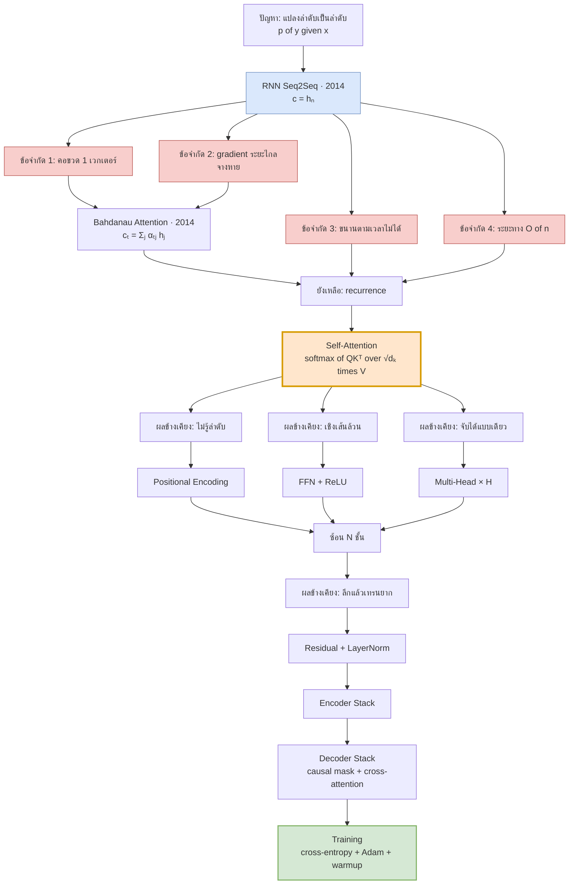
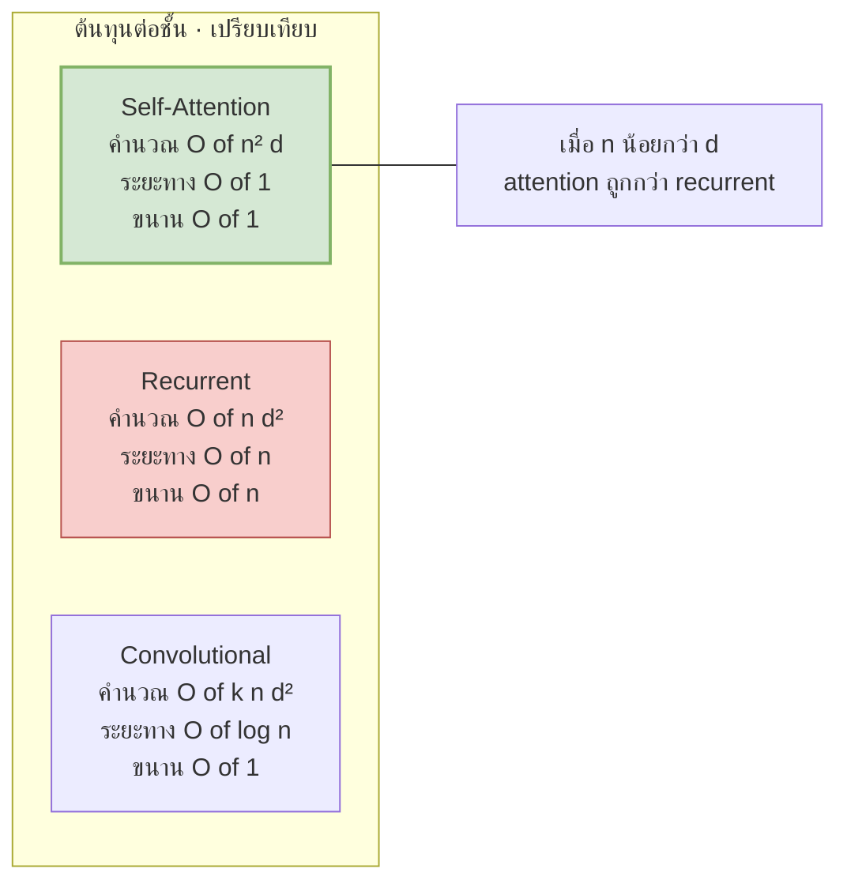

# 13 — สรุปและตารางอ้างอิง

> **ก่อนหน้า:** [12 — การเทรนและ Backpropagation](12-training-objective-backprop.md)
> **หน้านี้เป็นหน้าอ้างอิง** — ไม่ต้องอ่านเรียง เปิดหาเฉพาะที่ต้องการได้เลย

---

## 1. ตารางสัญลักษณ์ทั้งหมด

> ทุกไฟล์ในชุดนี้ใช้ **row-major**: $X \in \mathbb{R}^{n \times d}$ แถวคือโทเคน, projection เขียนเป็น $XW$ (ดู [00 §3](00-overview.md))

### 1.1 มิติและค่าคงที่

| สัญลักษณ์ | มิติ / ชนิด | ความหมาย | ไฟล์ |
|---|---|---|---|
| $n$ | scalar | ความยาว sequence ฝั่ง **source** | 00, 01 |
| $m$ | scalar | ความยาว sequence ฝั่ง **target** | 00, 01, 11, 12 |
| $d_{\text{model}}$ | scalar (512) | มิติของ residual stream | 00, 05–10 |
| $d_k$ | scalar (64) | มิติ query/key **ต่อหัว** | 05, 06 |
| $d_v$ | scalar (64) | มิติ value **ต่อหัว** | 05, 06 |
| $d_{\text{ff}}$ | scalar (2048) | มิติชั้นในของ FFN | 08 |
| $H$ | scalar (8) | จำนวน attention heads | 06 |
| $N$ | scalar (6) | จำนวนเลเยอร์ต่อฝั่ง | 10, 11 |
| $N_{\text{params}}$ | scalar | จำนวนพารามิเตอร์ทั้งหมด (แยกจาก $N$ ชัดเจน) | 12 §5, 13 §3 |
| $V$ | scalar (~37,000) | ขนาด vocabulary | 01, 11, 12 |
| $B$ | scalar | batch size / beam width | 01 §5.4, 12 |
| $d_h,\ d_x$ | scalar | มิติ hidden / input ของ RNN | 01 |

### 1.2 ดัชนี

| สัญลักษณ์ | ช่วง | ความหมาย | ไฟล์ |
|---|---|---|---|
| $i$ | $1\dots n$ | ตำแหน่ง **query** (แถวของ output) | 05 |
| $j$ | $1\dots n$ หรือ $1\dots m$ | ตำแหน่ง **key/value** (คอลัมน์ของ $A$) | 03, 05 |
| $t$ | $1\dots m$ | เวลา / ขั้นถอดรหัส / step ของ optimizer | 01, 11, 12 |
| $l$ | $1\dots N$ | เลเยอร์ | 10 |
| $h$ | $1\dots H$ | หัวของ attention | 06 |
| $v$ | $1\dots V$ | ดัชนีในคำศัพท์ | 12 |
| $pos$ | $0\dots n-1$ | ตำแหน่งใน positional encoding | 07 |

### 1.3 เมทริกซ์และเวกเตอร์หลัก

| สัญลักษณ์ | มิติ | ความหมาย | ไฟล์ |
|---|---|---|---|
| $X$ | $\mathbb{R}^{n \times d_{\text{model}}}$ | input ของบล็อก (แถว = โทเคน) | 05, 10 |
| $\mathbf{x}\_i$ | $\mathbb{R}^{1 \times d\_{\text{model}}}$ | row vector ของโทเคนที่ $i$ | 00 |
| $E$ | $\mathbb{R}^{V \times d_{\text{model}}}$ | embedding table (tied กับ output head) | 10, 12 |
| $PE$ | $\mathbb{R}^{n \times d_{\text{model}}}$ | positional encoding | 07 |
| $Q, K$ | $\mathbb{R}^{n \times d_k}$ | query / key | 05 |
| $V_{\text{mat}}$ | $\mathbb{R}^{n \times d_v}$ | value (เขียน $V$ ตัวเดียวเมื่อไม่กำกวมกับ vocab size) | 05 |
| $W^Q_h, W^K_h$ | $\mathbb{R}^{d_{\text{model}} \times d_k}$ | projection ของหัวที่ $h$ | 06 |
| $W^V_h$ | $\mathbb{R}^{d_{\text{model}} \times d_v}$ | projection ของ value | 06 |
| $W^O$ | $\mathbb{R}^{H d_v \times d_{\text{model}}}$ | projection รวมหลัง concat หัว | 06 |
| $S$ | $\mathbb{R}^{n \times n}$ | คะแนนดิบ $QK^\top/\sqrt{d_k}$ | 05 |
| $A$ | $\mathbb{R}^{n \times n}$ | attention weights (แต่ละแถวรวม = 1) | 05 |
| $\alpha_{ij},\ \alpha_{tj}$ | scalar | สมาชิกของ $A$ | 03, 05 |
| $M$ | $\mathbb{R}^{m \times m}$ | causal mask ($0$ / $-\infty$) | 11 |
| $O$ | $\mathbb{R}^{n \times d_v}$ | output ของ attention | 05 |
| $W_1, W_2$ | $\mathbb{R}^{d_{\text{model}}\times d_{\text{ff}}}$, $\mathbb{R}^{d_{\text{ff}}\times d_{\text{model}}}$ | น้ำหนัก FFN | 08 |
| $\boldsymbol{\gamma}, \boldsymbol{\beta}$ | $\mathbb{R}^{1\times d_{\text{model}}}$ | scale / shift ของ LayerNorm | 09 |
| $\mu,\ \sigma^2$ | scalar ต่อแถว | mean / variance ตามแกน feature | 09 |
| $\mathbf{h}_t$ | $\mathbb{R}^{1\times d_h}$ | hidden state ของ RNN | 01 |
| $\mathbf{c}_t$ | $\mathbb{R}^{1\times d_h}$ | cell state (LSTM) / context vector | 01, 03 |
| $\mathbf{s}_t$ | $\mathbb{R}^{1\times d_h}$ | decoder state ของ RNN | 01, 03 |
| $\mathbf{f}_t, \mathbf{i}_t, \mathbf{o}_t$ | $\mathbb{R}^{1\times d_h}$ | forget / input / output gate | 01 |
| $\mathbf{z}_t$ | $\mathbb{R}^{1\times V}$ | logits ก่อน softmax | 01, 11, 12 |
| $\mathbf{p}_t$ | $\mathbb{R}^{1\times V}$ | การแจกแจงที่ทำนาย | 12 |
| $\mathbf{q}$ | $\mathbb{R}^{1\times V}$ | เป้าหมายหลัง label smoothing | 12 |
| $\mathcal{L}$ | scalar | loss | 12 |
| $G_X \equiv \partial\mathcal{L}/\partial X$ | เท่ากับ $X$ | gradient ของ $X$ | 12 |
| $\mathbf{m}_t, \mathbf{v}_t$ | เท่ากับ $\theta$ | โมเมนต์ที่ 1 / 2 ของ Adam | 12 |
| $\eta_t$ | scalar | learning rate ที่ step $t$ | 12 |

### 1.4 ตัวดำเนินการ

| สัญลักษณ์ | ความหมาย | ไฟล์ |
|---|---|---|
| $\odot$ | element-wise product (Hadamard) | 01, 09 |
| $[X; Y]$ | concatenation ตามแกน feature | 06 |
| $X^\top$ | transpose | ทุกไฟล์ |
| $\langle \mathbf{a}, \mathbf{b}\rangle$ | inner product | 05, 12 |
| $\\|\mathbf{g}\\|_2$ | Euclidean norm | 12 |
| $\varepsilon$ | ค่า label smoothing (0.1) | 12 |
| $\epsilon$ | ค่ากันหารศูนย์ ($10^{-6}$ ใน LN, $10^{-9}$ ใน Adam) | 09, 12 |

> **จุดที่ต้องระวังเรื่องสัญลักษณ์ซ้ำ:** $V$ ใช้ทั้ง "vocabulary size" และ "value matrix" — ดูจากบริบท; $N$ ใช้เป็นจำนวนเลเยอร์เสมอ ส่วนจำนวนพารามิเตอร์เขียน $N_{\text{params}}$; $\varepsilon$ (label smoothing) กับ $\epsilon$ (numerical) เป็นคนละตัว

---

## 2. สมการหลักทุกบทรวมในหน้าเดียว

### RNN / Seq2Seq — [ไฟล์ 01](01-seq2seq-rnn-basics.md)

$$
p(\mathbf{y}\mid\mathbf{x}) = \prod_{t=1}^{m} p(y_t \mid y_{{<}t}, \mathbf{x})
$$

*[01 §1.2]*

$$
\mathbf{h}_t = \tanh(\mathbf{h}_{t-1}W_{hh} + \mathbf{x}_t W_{xh} + \mathbf{b}), \qquad \mathbf{c} = \mathbf{h}_n
$$

*[01 §2.1, §5.1]*

$$
\mathbf{c}_t = \mathbf{f}_t \odot \mathbf{c}_{t-1} + \mathbf{i}_t\odot\tilde{\mathbf{c}}_t,\qquad
\mathbf{h}_t = \mathbf{o}_t\odot\tanh(\mathbf{c}_t)
$$

*[01 §3.1]*

$$
\mathbf{h}_t = (1-\mathbf{z}_t)\odot\mathbf{h}_{t-1} + \mathbf{z}_t\odot\tilde{\mathbf{h}}_t
$$

*[01 §4.1 — GRU]*

### ข้อจำกัด — [ไฟล์ 02](02-seq2seq-limitations.md)

$$
\frac{\partial \mathcal{L}_T}{\partial \mathbf{h}_1} = \frac{\partial\mathcal{L}_T}{\partial\mathbf{h}_T}\prod_{t=2}^{T}\frac{\partial \mathbf{h}_t}{\partial\mathbf{h}_{t-1}}
$$

*[02 — vanishing/exploding gradient]*

### Attention ยุคแรก — [ไฟล์ 03](03-attention-mechanism-origin.md)

$$
e_{tj} = \mathbf{v}^\top\tanh(\mathbf{s}_{t-1}W_s + \mathbf{h}_jW_h),\quad
\alpha_{tj} = \frac{e^{e_{tj}}}{\sum_{j'}e^{e_{tj'}}},\quad
\mathbf{c}_t = \sum_j \alpha_{tj}\mathbf{h}_j
$$

*[03 — Bahdanau]*

$$
e_{tj} = \mathbf{s}_t\cdot\mathbf{h}_j \quad\text{หรือ}\quad \mathbf{s}_tW_a\mathbf{h}_j^\top
$$

*[03 — Luong]*

### Self-Attention — [ไฟล์ 05](05-self-attention-math.md)

$$
\boxed{\ \text{Attention}(Q,K,V) = \text{softmax}\!\left(\frac{QK^\top}{\sqrt{d_k}}\right)V\ }
$$

*[05 §2]*

$$
\text{Var}(\mathbf{q}\cdot\mathbf{k}) = d_k \ \Rightarrow\ \text{หารด้วย}\ \sqrt{d_k}\ \text{เพื่อให้ variance กลับเป็น 1}
$$

*[05 §3]*

### Multi-Head — [ไฟล์ 06](06-multi-head-attention.md)

$$
\text{MultiHead}(X) = [\text{head}_1;\dots;\text{head}_H]W^O,\quad
\text{head}_h = \text{Attention}(XW_h^Q, XW_h^K, XW_h^V)
$$

*[06 §1]*

$$
d_k = d_v = d_{\text{model}}/H \ \Rightarrow\ \text{ต้นทุนรวมเท่าเดิมกับ single-head}
$$

*[06 §2]*

### Positional Encoding — [ไฟล์ 07](07-positional-encoding.md)

$$
PE_{(pos,2i)} = \sin\!\left(\frac{pos}{10000^{2i/d_{\text{model}}}}\right),\qquad
PE_{(pos,2i+1)} = \cos\!\left(\frac{pos}{10000^{2i/d_{\text{model}}}}\right)
$$

*[07 §2]*

### FFN + Residual — [ไฟล์ 08](08-feedforward-and-residual.md)

$$
\text{FFN}(\mathbf{x}) = \max(0,\ \mathbf{x}W_1+\mathbf{b}_1)W_2+\mathbf{b}_2,\qquad
\mathbf{y} = \mathbf{x} + \text{Sublayer}(\mathbf{x})
$$

*[08 §1, §2]*

$$
\frac{\partial\mathbf{y}}{\partial\mathbf{x}} = I + \frac{\partial F}{\partial\mathbf{x}}
$$

*[08 §2.2 — เส้นทางลัดของ gradient]*

### LayerNorm — [ไฟล์ 09](09-layernorm-math.md)

$$
\text{LN}(\mathbf{x}) = \boldsymbol{\gamma}\odot\frac{\mathbf{x}-\mu}{\sqrt{\sigma^2+\epsilon}}+\boldsymbol{\beta},
\qquad \mu = \frac1d\sum_k x_k,\quad \sigma^2 = \frac1d\sum_k (x_k-\mu)^2
$$

*[09 §1]*

### Encoder — [ไฟล์ 10](10-encoder-full-pipeline.md)

$$
Z^{(l)} = \text{LN}\!\left(X^{(l-1)} + \text{MultiHead}(X^{(l-1)})\right),\qquad
X^{(l)} = \text{LN}\!\left(Z^{(l)} + \text{FFN}(Z^{(l)})\right)
$$

*[10 §2 — Post-LN]*

### Decoder + Masking — [ไฟล์ 11](11-decoder-masked-attention.md)

$$
M_{ij} = \begin{cases}0 & j\le i\\ -\infty & j{>}i\end{cases},\qquad
\text{softmax}\!\left(\frac{QK^\top}{\sqrt{d_k}}+M\right)V
$$

*[11 §2]*

$$
\text{CrossAttn} = \text{Attention}(X_{\text{dec}}W^Q,\ X_{\text{enc}}W^K,\ X_{\text{enc}}W^V)
$$

*[11 §3]*

### Training — [ไฟล์ 12](12-training-objective-backprop.md)

$$
\boxed{\ \mathcal{L} = -\frac1m\sum_{t=1}^{m}\log p(y_t^*\mid y^*_{{<}t},\mathbf{x})\ },\qquad
\text{PPL} = \exp(\mathcal{L})
$$

*[12 §1]*

$$
\frac{\partial\mathcal{L}}{\partial\mathbf{z}} = \mathbf{p}-\mathbf{y}^{\text{onehot}}
$$

*[12 §3.1]*

$$
\eta_t = d_{\text{model}}^{-0.5}\cdot\min\!\left(t^{-0.5},\ t\cdot\text{warmup}^{-1.5}\right)
$$

*[12 §4.2]*

$$
\text{FLOPs} \approx 6\,N_{\text{params}}\times\#\text{tokens}
$$

*[12 §5]*

---

## 3. ตารางไล่มิติของ Transformer มาตรฐาน

**สมมติฐานที่ใช้คำนวณ** (ตรงกับ `torch.nn.Transformer` + embedding แบบ tied):

| ข้อสมมติ | ค่า |
|---|---|
| Vocabulary | shared source/target BPE, $V = 37{,}000$ |
| Weight tying | embedding ฝั่ง source = ฝั่ง target = output projection → นับ $VD$ **ครั้งเดียว** |
| Bias | projection ของ attention ($W^Q,W^K,W^V,W^O$) **ไม่มี** bias ตาม implementation มาตรฐาน; FFN มี bias 2 ชุด |
| LayerNorm | encoder layer มี 2, decoder layer มี 3 (แบบ Post-LN ตามเปเปอร์ต้นฉบับ จึงไม่มี final LN แยก) |
| Positional encoding | sinusoidal แบบตายตัว → **0 พารามิเตอร์** |

### 3.1 มิติของเทนเซอร์ระหว่างทาง

| ขั้น | base | big |
|---|---|---|
| Input ids | $(B, n)$ | $(B, n)$ |
| หลัง embedding + PE | $(B, n, 512)$ | $(B, n, 1024)$ |
| $Q, K, V$ ต่อหัว | $(B, H{=}8, n, 64)$ | $(B, H{=}16, n, 64)$ |
| $S = QK^\top/\sqrt{d_k}$ | $(B, 8, n, n)$ | $(B, 16, n, n)$ |
| หลัง concat หัว | $(B, n, 512)$ | $(B, n, 1024)$ |
| ชั้นในของ FFN | $(B, n, 2048)$ | $(B, n, 4096)$ |
| Logits | $(B, m, 37000)$ | $(B, m, 37000)$ |

> $d_k = 64$ **เท่ากันทั้งสองรุ่น** — big ไม่ได้ทำให้หัวใหญ่ขึ้น แต่เพิ่ม*จำนวน*หัวจาก 8 เป็น 16

### 3.2 จำนวนพารามิเตอร์ (คำนวณจริงด้วย Python)

| ส่วนประกอบ | สูตร | **base** (512/8/6/2048) | **big** (1024/16/6/4096) |
|---|---|---|---|
| Embedding (shared + tied) | $V\\!\cdot\\! d$ | 18,944,000 | 37,888,000 |
| Attention 1 บล็อก | $4d^2$ | 1,048,576 | 4,194,304 |
| FFN 1 บล็อก | $2d\\,d_{\text{ff}} + d_{\text{ff}} + d$ | 2,099,712 | 8,393,728 |
| LayerNorm ต่อ encoder layer | $2\times 2d$ | 2,048 | 4,096 |
| LayerNorm ต่อ decoder layer | $3\times 2d$ | 3,072 | 6,144 |
| **1 encoder layer** | attn + ffn + 2 LN | **3,150,336** | **12,592,128** |
| **1 decoder layer** | 2 attn + ffn + 3 LN | **4,199,936** | **16,788,480** |
| Encoder stack ($N=6$) | | 18,902,016 | 75,552,768 |
| Decoder stack ($N=6$) | | 25,199,616 | 100,730,880 |
| **รวมทั้งหมด** | | **63,045,632** (63.05M) | **214,171,648** (214.17M) |
| *เปเปอร์รายงาน* | | *65M* | *213M* |

**สัดส่วนของแต่ละส่วน:**

| ส่วน | base | big |
|---|---|---|
| Embedding | 30.05% | 17.69% |
| Encoder stack | 29.98% | 35.28% |
| Decoder stack | 39.97% | 47.03% |
| — เฉพาะ attention ทุกบล็อก | 29.94% | 35.25% |
| — เฉพาะ FFN ทุกบล็อก | 39.97% | 47.03% |
| LayerNorm ทั้งหมด | 0.05% | 0.03% |

> **จุดสำคัญ 3 ข้อ:**
> 1. **FFN กินพารามิเตอร์มากกว่า attention เสมอ** (~40% vs ~30%) เพราะ $2d\cdot d_{\text{ff}} = 4d^2$ ขณะที่ attention คือ $4d^2$ ต่อบล็อก แต่ FFN มีทุกบล็อกทั้ง 12 layer ส่วน attention กระจายไม่เท่ากัน — decoder มี 2 บล็อกต่อ layer
> 2. **LayerNorm แทบไม่กินพารามิเตอร์เลย** (30,720 จาก 63 ล้าน = 0.05%) แต่ขาดไม่ได้ในการเทรน
> 3. **โมเดลใหญ่ขึ้น 2× ในมิติ → พารามิเตอร์ของบล็อกโต 4×** เพราะทุกอย่างเป็น $O(d^2)$ ส่วน embedding โตแค่ 2× → สัดส่วน embedding จึงลดจาก 30% เหลือ 18%

**ตัวเลขในตารางไม่ตรง 65M/213M เป๊ะ ๆ** — ส่วนต่างมาจากวิธีนับ (มี/ไม่มี bias, final LN, ขนาด vocabulary จริงหลัง BPE ซึ่งเปเปอร์ระบุแค่ "ประมาณ 37,000") รุ่น big ต่างประมาณ 0.5% ส่วนรุ่น base ต่างประมาณ 3% — ตัวเลขชุดนี้ใช้เหมือนกันทุกไฟล์ในเอกสาร (ไฟล์ [08 §4](08-feedforward-and-residual.md), [10 §7](10-encoder-full-pipeline.md), [11 §5](11-decoder-masked-attention.md))

```python
def count(d, ff, H, N, V=37000):
    emb  = V*d                              # shared + tied
    attn = 4*d*d                            # W^Q W^K W^V W^O (ไม่มี bias)
    ffn  = 2*d*ff + ff + d                  # W1 W2 + bias
    ln   = 2*d                              # gamma + beta
    enc_layer = attn + ffn + 2*ln
    dec_layer = 2*attn + ffn + 3*ln         # self-attn + cross-attn
    total = emb + N*enc_layer + N*dec_layer
    return dict(emb=emb, attn=attn, ffn=ffn, enc_layer=enc_layer,
                dec_layer=dec_layer, total=total)

print(count(512, 2048, 8, 6)['total'])       # 63045632
print(count(1024, 4096, 16, 6)['total'])     # 214171648
```

**ตรวจสอบกับ PyTorch** — `torch.nn.Transformer` ตั้ง `bias=True` ให้ attention projection เป็นค่าเริ่มต้น และมี final LayerNorm ฝั่งละอัน จึงได้เลขสูงกว่าสูตรข้างบนเล็กน้อย ส่วนต่างอธิบายได้ครบทุกตัว:

```python
import torch

for d, ff, H in [(512, 2048, 8), (1024, 4096, 16)]:
    core = sum(p.numel() for p in torch.nn.Transformer(
        d_model=d, nhead=H, num_encoder_layers=6,
        num_decoder_layers=6, dim_feedforward=ff).parameters())
    torch_total = core + 37000*d                  # + embedding แบบ tied
    ours        = count(d, ff, H, 6)['total']     # สูตรแบบไม่มี bias ข้างบน
    attn_bias   = 6*(4*d) + 6*(2*4*d)             # bias ของ attention ทุกบล็อก
    final_ln    = 2*(2*d)                         # final LN ฝั่ง encoder + decoder
    print(torch_total, ours, torch_total - ours, attn_bias + final_ln)

# 63084544  63045632  38912  38912     ← ส่วนต่างตรงกันพอดี
# 214249472 214171648 77824  77824
```

> **จุดสำคัญ:** ตัวเลข "จำนวนพารามิเตอร์ของ Transformer-base" ที่เห็นตามแหล่งต่าง ๆ ต่างกันได้ในระดับ 1–3% ทั้งหมดมาจากข้อตกลงการนับ ไม่ใช่ความผิดพลาด — เวลาอ้างอิงจึงควรระบุสมมติฐานเสมอ

---

## 4. เส้นทางวิวัฒนาการโดยสรุป

| ข้อจำกัดของ seq2seq | สาเหตุเชิงคณิตศาสตร์ | สิ่งที่ Transformer ทำ | ไฟล์ที่อธิบาย |
|---|---|---|---|
| คอขวด context vector เดียว | $\mathbf{c} = \mathbf{h}_n \in \mathbb{R}^{d_h}$ ขนาดคงที่ไม่ว่า $n$ เท่าไร | ให้ทุกตำแหน่งเข้าถึง representation ของทุกตำแหน่ง | [02](02-seq2seq-limitations.md) → [03](03-attention-mechanism-origin.md), [05](05-self-attention-math.md) |
| ข้อมูลระยะไกลจางหาย | เส้นทาง gradient ยาว $O(n)$ ก้าว คูณกันจนหด | ระยะทางระหว่างสองตำแหน่งเหลือ $O(1)$ | [02](02-seq2seq-limitations.md) → [04](04-transformer-motivation.md), [05](05-self-attention-math.md) |
| ขนานไม่ได้ตามแกนเวลา | $\mathbf{h}\_t$ ต้องรอ $\mathbf{h}\_{t-1}$ | ทิ้ง recurrence ทั้งหมด → เหลือ matmul ก้อนเดียว | [04](04-transformer-motivation.md), [12 §2.2](12-training-objective-backprop.md) |
| จับความสัมพันธ์ได้แบบเดียวต่อชั้น | attention เดี่ยวให้ subspace เดียว | แยกเป็น $H$ หัวใน subspace ต่าง ๆ | [06](06-multi-head-attention.md) |
| (ผลข้างเคียงใหม่) attention ไม่รู้ลำดับ | $\text{softmax}(QK^\top)$ ไม่แปรตามการสลับแถว (permutation-equivariant) | บวก positional encoding เข้าไปที่ input | [07](07-positional-encoding.md) |
| (ผลข้างเคียงใหม่) attention เป็นเชิงเส้นล้วน | $AV$ คือ convex combination → ไม่มี nonlinearity ต่อตำแหน่ง | ใส่ FFN 2 ชั้นหลัง attention ทุกบล็อก | [08](08-feedforward-and-residual.md) |
| (ผลข้างเคียงใหม่) โมเดลลึก 12+ ชั้น เทรนยาก | gradient หด/ระเบิดเมื่อซ้อนชั้น | residual ($I + \partial F$) + LayerNorm | [08 §2](08-feedforward-and-residual.md), [09](09-layernorm-math.md) |
| (ผลข้างเคียงใหม่) decoder แอบดูอนาคตได้ | self-attention เห็นทั้งลำดับ | causal mask $-\infty$ บนสามเหลี่ยมบน | [11 §2](11-decoder-masked-attention.md) |
| (ผลข้างเคียงใหม่) Post-LN ระเบิดตอนเริ่มเทรน | gradient ที่ชั้นบนใหญ่กว่าชั้นล่างมาก | warmup 4000 steps + Adam $\beta_2=0.98$ | [12 §4.3](12-training-objective-backprop.md) |
| (ต้นทุนที่ยอมจ่าย) $O(n^2)$ memory | attention matrix $A \in \mathbb{R}^{n\times n}$ | ยอมรับ — แลกกับ $O(1)$ path length | [04](04-transformer-motivation.md), [05](05-self-attention-math.md) |





---

## 5. คำถามทบทวนพร้อมเฉลยย่อ

**1.** ทำไม seq2seq ดั้งเดิมถึงมี "คอขวด" ทั้งที่ $\mathbf{h}_n$ มีตั้ง 512 มิติ

<details><summary>เฉลย</summary>

เพราะขนาดของมัน **คงที่** ไม่ว่า input จะยาว 5 หรือ 100 คำ ปริมาณข้อมูลที่ต้องเก็บโตตาม $n$ แต่ความจุไม่โตตาม → เมื่อ $n$ ใหญ่ ข้อมูลถูกบีบจนสูญเสีย หลักฐานเชิงประจักษ์: BLEU ตกฮวบเมื่อประโยคยาวขึ้น และเคล็ดกลับลำดับ input ของ Sutskever ช่วยได้จริง (ไฟล์ [01 §5.1](01-seq2seq-rnn-basics.md), [02](02-seq2seq-limitations.md))
</details>

**2.** ทำไมต้องหารด้วย $\sqrt{d_k}$ ไม่ใช่ $d_k$ หรือ $\sqrt[3]{d_k}$

<details><summary>เฉลย</summary>

ถ้า $q_i, k_i$ อิสระ mean 0 variance 1 แล้ว $\mathbf{q}\cdot\mathbf{k} = \sum_{i=1}^{d_k} q_ik_i$ เป็นผลรวมของ $d_k$ พจน์อิสระ → $\text{Var} = d_k$ → **ส่วนเบี่ยงเบนมาตรฐาน** $=\sqrt{d_k}$ เราต้องการหารด้วย std ไม่ใช่ variance เพื่อให้ variance กลับเป็น 1 พอดี ถ้าไม่หาร softmax จะอิ่มตัวและ gradient หายไป (ไฟล์ [05 §3](05-self-attention-math.md))
</details>

**3.** Multi-head ที่ $H=8$, $d_k=64$ ใช้พารามิเตอร์มากกว่า single-head ที่ $d_k=512$ เท่าไร

<details><summary>เฉลย</summary>

**เท่ากันพอดี** เพราะ $H \cdot d_{\text{model}} \cdot d_k = 8 \times 512 \times 64 = 512 \times 512$ นี่คือเหตุผลที่ตั้ง $d_k = d_{\text{model}}/H$ — เพื่อให้ multi-head "ฟรี" เมื่อเทียบกับ single-head (ไฟล์ [06 §2](06-multi-head-attention.md))
</details>

**4.** ทำไม positional encoding ใช้ $\sin/\cos$ หลายความถี่ แทนที่จะใส่เลขตำแหน่งตรง ๆ

<details><summary>เฉลย</summary>

(ก) เลขตำแหน่งดิบไม่มีขอบเขต — ตำแหน่งที่ 1000 จะกลบ embedding ทั้งหมด (ข) $\sin/\cos$ อยู่ใน $[-1,1]$ เสมอ (ค) คุณสมบัติสำคัญ: $PE_{pos+k}$ เขียนเป็น**การหมุนเชิงเส้น**ของ $PE_{pos}$ ได้ → โมเดลเรียน "ระยะห่างสัมพัทธ์" ได้ผ่าน linear projection (ง) generalize ไปยังความยาวที่ไม่เคยเห็นตอนเทรนได้ (ไฟล์ [07](07-positional-encoding.md))
</details>

**5.** ถ้าเอา FFN ออกจากทุกบล็อก เหลือแต่ attention + residual + LN โมเดลจะเสียอะไร

<details><summary>เฉลย</summary>

เสีย **nonlinearity ต่อตำแหน่ง** — $AV$ เป็นเพียง convex combination ของ value vectors (เชิงเส้นเมื่อ $A$ ถูกตรึง) การซ้อนหลายชั้นจึงยุบเป็นการแปลงเชิงเส้นเดียวโดยประมาณ FFN คือที่ที่ ReLU อยู่ และเป็นที่เก็บ "ความรู้" ส่วนใหญ่ (~40% ของพารามิเตอร์) (ไฟล์ [08 §1](08-feedforward-and-residual.md), [13 §3.2](13-summary-notation-reference.md))
</details>

**6.** LayerNorm ต่างจาก BatchNorm อย่างไร และทำไม NLP ถึงเลือก LayerNorm

<details><summary>เฉลย</summary>

BatchNorm normalize ตามแกน **batch** (ต้องมีสถิติข้าม sample) ส่วน LayerNorm normalize ตามแกน **feature** ของแต่ละ token เอง → (ก) ไม่ขึ้นกับ batch size (ข) ใช้ได้กับ sequence ยาวไม่เท่ากันและ padding (ค) ตอน inference ไม่ต้องเก็บ running statistics (ง) ทำงานเหมือนกันทั้งตอนเทรนและ inference (ไฟล์ [09](09-layernorm-math.md))
</details>

**7.** ทำไม gradient ที่ไหลย้อนผ่าน LayerNorm ต้องมีผลรวมเป็นศูนย์

<details><summary>เฉลย</summary>

เพราะ $\text{LN}(\mathbf{x}+c\mathbf{1}) = \text{LN}(\mathbf{x})$ — การเลื่อน $\mathbf{x}$ ไปในทิศ $\mathbf{1}$ ไม่เปลี่ยน output เลย ดังนั้นอนุพันธ์ทิศทางในทิศนั้นต้องเป็น 0 ซึ่งก็คือ $\sum_k \partial\mathcal{L}/\partial x_k = 0$ พอดี ทำนองเดียวกัน $\text{LN}(a\mathbf{x})=\text{LN}(\mathbf{x})$ ให้ $\langle \partial\mathcal{L}/\partial\mathbf{x}, \hat{\mathbf{x}}\rangle = 0$ (ไฟล์ [12 §3.2](12-training-objective-backprop.md))
</details>

**8.** causal mask ใช้ $-\infty$ ไม่ใช่ 0 — ถ้าใช้ 0 จะเกิดอะไร

<details><summary>เฉลย</summary>

mask ถูกบวกเข้ากับ **คะแนนก่อน softmax** ไม่ใช่คูณกับ attention weight ถ้าบวก 0 ก็คือไม่ทำอะไรเลย ต้องบวก $-\infty$ เพื่อให้ $e^{-\infty}=0$ → attention weight เป็นศูนย์ *และ* ตัวส่วนของ softmax ยัง normalize เฉพาะตำแหน่งที่มองเห็นได้ (ในโค้ดจริงใช้ `-1e9` หรือ `-inf` ตาม dtype) (ไฟล์ [11 §2](11-decoder-masked-attention.md))
</details>

**9.** teacher forcing ทำให้เทรนขนานได้อย่างไร ทั้งที่ decoder ยัง autoregressive

<details><summary>เฉลย</summary>

เพราะเฉลยทั้งลำดับรู้ล่วงหน้า จึงป้อนเข้าไปพร้อมกันได้ การพึ่งพาแบบ autoregressive ถูกลดจาก "การพึ่งพาเชิงคำนวณ" (ต้องรอผลก่อนหน้า) เหลือแค่ "การพึ่งพาเชิงการมองเห็น" ซึ่ง causal mask จัดการได้ในการคูณเมทริกซ์ครั้งเดียว — ต่างจาก RNN ที่ $\mathbf{s}_t$ ต้องรอ $\mathbf{s}_{t-1}$ จริง ๆ (ไฟล์ [12 §2.2](12-training-objective-backprop.md))
</details>

**10.** $\partial\mathcal{L}/\partial\mathbf{z} = \mathbf{p} - \mathbf{y}^{\text{onehot}}$ — ทำไมมันเรียบง่ายขนาดนี้

<details><summary>เฉลย</summary>

เพราะ Jacobian ของ softmax (ซึ่งยุ่งมาก) หักล้างกับอนุพันธ์ของ $\log$ (ซึ่งเป็น $1/p$) พอดี ผลลัพธ์ที่ได้คือ "ทำนายลบด้วยความจริง" ตรง ๆ นี่คือเหตุผลที่ทุก library รวม softmax กับ cross-entropy เป็นฟังก์ชันเดียว — ทั้งเสถียรกว่าและเร็วกว่า ตัวอย่างจริง: $\mathbf{z}=[2, 1, 0.1, -0.5]$ เฉลยตัวที่ 2 → $\mathbf{p}=[0.6252, 0.2300, 0.0935, 0.0513]$ → gradient $=[0.6252, -0.7700, 0.0935, 0.0513]$ (ไฟล์ [12 §3.1](12-training-objective-backprop.md))
</details>

**11.** ทำไม learning rate schedule ต้องมี warmup และจุดสูงสุดอยู่ที่ไหน

<details><summary>เฉลย</summary>

สองเหตุผล: (ก) ตัวประมาณ $\hat{\mathbf{v}}_t$ ของ Adam ยังผันผวนมากในช่วงต้น → ตัวหารเล็กผิดปกติทำให้ก้าวยักษ์ (ข) Post-LN ทำให้ gradient ที่ชั้นบนใหญ่กว่าชั้นล่างมาก
จุดสูงสุดอยู่ที่ $t = \text{warmup} = 4000$ พอดี (เป็นจุดที่สองพจน์ใน $\min$ เท่ากัน) มีค่า $(512\times4000)^{-0.5} = 6.987712\times10^{-4}$
ถ้าเปลี่ยนเป็น **Pre-LN** ปัญหา (ข) หายไป → เกือบไม่ต้อง warmup (ไฟล์ [12 §4.2–4.3](12-training-objective-backprop.md))
</details>

**12.** label smoothing ทำให้ perplexity **แย่ลง** แต่ยังใช้ — ทำไม

<details><summary>เฉลย</summary>

perplexity วัด $-\log p_{y^*}$ ตรง ๆ ซึ่งเราตั้งใจห้ามไม่ให้เข้าใกล้ 0 (เป้าหมาย optimal คือ $p_{y^*}=0.925$ ไม่ใช่ 1.0) → PPL แย่ลงโดยนิยาม แต่ **BLEU ดีขึ้น** เพราะโมเดล calibrate ดีกว่า ไม่ overconfident และ beam search ได้ตัวเลือกสำรองที่สมเหตุสมผล ตัวเลขจริงจากไฟล์ 12: $\mathcal{L}$ 1.4697 → 1.5047, PPL 4.3479 → 4.5028, แต่ $\|\text{grad}\|$ ลดจาก 0.9976 → 0.9212 (ไฟล์ [12 §1.3, §3.1](12-training-objective-backprop.md))
</details>

**13.** ในสูตร $\text{FLOPs}\approx 6N_{\text{params}}$ ต่อ token เลข 6 มาจากไหน

<details><summary>เฉลย</summary>

forward $= 2N_{\text{params}}$ (คูณ 1 + บวก 1 ต่อพารามิเตอร์) และ backward $= 4N_{\text{params}}$ เพราะทุกเมทริกซ์ต้องทำสองงาน: คำนวณ $\partial\mathcal{L}/\partial\mathbf{x}$ ส่งลงชั้นล่าง และคำนวณ $\partial\mathcal{L}/\partial W$ เพื่ออัปเดตตัวเอง → $2+4=6$ ตัวอย่าง: 65M params บน 1B tokens $= 3.9000\times10^{17}$ FLOPs (ไฟล์ [12 §5](12-training-objective-backprop.md))
</details>

**14.** ทำไมพารามิเตอร์ของ Transformer-big มากกว่า base ประมาณ 3.4 เท่า ทั้งที่ $d_{\text{model}}$ โตแค่ 2 เท่า

<details><summary>เฉลย</summary>

บล็อกทั้งหมดเป็น $O(d^2)$ — attention $4d^2$ และ FFN $2d\cdot d_{\text{ff}} = 4d^2$ (เพราะ $d_{\text{ff}}=4d$) → โตเป็น **4 เท่า** แต่ embedding เป็น $O(Vd)$ → โตแค่ 2 เท่า ค่าเฉลี่ยถ่วงน้ำหนักจึงได้ $214.17/63.05 = 3.40$ เท่า (ไฟล์ [13 §3.2](13-summary-notation-reference.md))
</details>

**15.** gradient ที่ไหลย้อนถึง embedding table มีลักษณะพิเศษอย่างไร

<details><summary>เฉลย</summary>

เป็น **sparse** — เฉพาะแถวของโทเคนที่ปรากฏใน batch เท่านั้นที่ไม่เป็นศูนย์ และถ้าโทเคนซ้ำ gradient จะบวกสะสมลงแถวเดียวกัน (id ปรากฏ 2 ครั้ง → gradient เป็น 2 เท่า) ผลตามมา: คำหายากได้ update น้อยมาก → เหตุผลหนึ่งที่ต้องใช้ subword/BPE
**ข้อยกเว้น:** เมื่อใช้ weight tying แถวเดียวกันยังได้ gradient แบบ dense จาก output head ด้วย เพราะ softmax แตะทุกคำใน vocabulary (ไฟล์ [12 §3.5](12-training-objective-backprop.md))
</details>

**16.** residual connection ช่วยเรื่อง gradient อย่างไรในเชิงตัวเลข

<details><summary>เฉลย</summary>

$\partial\mathbf{y}/\partial\mathbf{x} = I + \partial F/\partial\mathbf{x}$ — เมื่อซ้อน $N$ ชั้น การกางผลคูณจะมีพจน์ $I\cdot I\cdots I = I$ อยู่เสมอ → มี "ทางด่วน" ที่ gradient ผ่านโดยไม่ถูกคูณอะไรเลย
ตัวอย่างจริงจากไฟล์ 12: ถ้า $\|\partial F/\partial\mathbf{x}\|_2 = 0.2011$ การซ้อน 6 ชั้นแบบไม่มี residual ให้ตัวคูณ $\approx 6.61\times10^{-5}$ (หายเกลี้ยง) แต่มี residual แล้ว singular values ของ $I+\partial F/\partial\mathbf{x}$ อยู่ที่ $[1.1053, 0.9534, 0.8665]$ — เกาะรอบ 1 (ไฟล์ [08 §2.2](08-feedforward-and-residual.md), [12 §3.3](12-training-objective-backprop.md))
</details>

---

## 6. บรรณานุกรมและลิงก์อ่านต่อ

### 6.1 เปเปอร์ต้นฉบับ

| ปี | ชื่อ | arXiv / อ้างอิง | ทำไมต้องอ่าน |
|---|---|---|---|
| 1997 | Long Short-Term Memory — Hochreiter & Schmidhuber | *Neural Computation* 9(8) | ต้นกำเนิด gate และ cell state (ไฟล์ 01) |
| 2014 | Sequence to Sequence Learning with Neural Networks — Sutskever et al. | [arXiv:1409.3215](https://arxiv.org/abs/1409.3215) | encoder–decoder ตัวแรก + เคล็ดกลับลำดับ input |
| 2014 | Neural Machine Translation by Jointly Learning to Align and Translate — Bahdanau et al. | [arXiv:1409.0473](https://arxiv.org/abs/1409.0473) | attention ครั้งแรก (ไฟล์ 03) |
| 2014 | Learning Phrase Representations using RNN Encoder–Decoder — Cho et al. | [arXiv:1406.1078](https://arxiv.org/abs/1406.1078) | GRU |
| 2015 | Effective Approaches to Attention-based NMT — Luong et al. | [arXiv:1508.04025](https://arxiv.org/abs/1508.04025) | ลดรูปคะแนนเป็น dot product |
| 2016 | Layer Normalization — Ba, Kiros & Hinton | [arXiv:1607.06450](https://arxiv.org/abs/1607.06450) | ที่มาของ LN (ไฟล์ 09) |
| 2016 | Deep Residual Learning — He et al. | [arXiv:1512.03385](https://arxiv.org/abs/1512.03385) | residual connection (ไฟล์ 08) |
| **2017** | **Attention Is All You Need — Vaswani et al.** | **[arXiv:1706.03762](https://arxiv.org/abs/1706.03762)** | **เปเปอร์หลักของเอกสารชุดนี้** |
| 2018 | BERT — Devlin et al. | [arXiv:1810.04805](https://arxiv.org/abs/1810.04805) | encoder-only + pre-training |
| 2020 | On Layer Normalization in the Transformer Architecture — Xiong et al. | [arXiv:2002.04745](https://arxiv.org/abs/2002.04745) | Pre-LN vs Post-LN และเรื่อง warmup (ไฟล์ 12 §4.3) |
| 2020 | Scaling Laws for Neural Language Models — Kaplan et al. | [arXiv:2001.08361](https://arxiv.org/abs/2001.08361) | ที่มาของสูตร $C \approx 6N_{\text{params}}D$ (ไฟล์ 12 §5) |
| 2022 | Training Compute-Optimal LLMs (Chinchilla) — Hoffmann et al. | [arXiv:2203.15556](https://arxiv.org/abs/2203.15556) | อัตราส่วน params : tokens ที่เหมาะสม |

### 6.2 บล็อกและโค้ดคลาสสิก

| แหล่ง | เหมาะกับ |
|---|---|
| **The Illustrated Transformer** — Jay Alammar ([jalammar.github.io](https://jalammar.github.io/illustrated-transformer/)) | สร้างภาพในหัวก่อนอ่านสมการ — ภาพเมทริกซ์ทีละขั้น |
| **The Annotated Transformer** — Harvard NLP ([nlp.seas.harvard.edu](http://nlp.seas.harvard.edu/annotated-transformer/)) | อ่านเปเปอร์คู่กับโค้ด PyTorch บรรทัดต่อบรรทัด — รวม Noam schedule และ label smoothing ครบ |
| **The Illustrated GPT-2** — Jay Alammar | decoder-only และการ generate |
| **Understanding LSTM Networks** — Chris Olah ([colah.github.io](https://colah.github.io/posts/2015-08-Understanding-LSTMs/)) | ทบทวนไฟล์ 01 ด้วยภาพ |
| **`karpathy/nanoGPT`** (GitHub) | โค้ด Transformer ที่เล็กและอ่านง่ายที่สุด ~300 บรรทัด |
| **`torch.nn.Transformer`** ([pytorch.org](https://pytorch.org/docs/stable/generated/torch.nn.Transformer.html)) | reference implementation สำหรับตรวจมิติและจำนวนพารามิเตอร์ (§3.2) |

### 6.3 งานต่อยอดตามหัวข้อ

| หัวข้อ | งานที่ควรตามอ่าน |
|---|---|
| ลด $O(n^2)$ | Longformer ([arXiv:2004.05150](https://arxiv.org/abs/2004.05150)), FlashAttention ([arXiv:2205.14135](https://arxiv.org/abs/2205.14135)) |
| Positional encoding รุ่นใหม่ | RoPE ([arXiv:2104.09864](https://arxiv.org/abs/2104.09864)), ALiBi ([arXiv:2108.12409](https://arxiv.org/abs/2108.12409)) |
| Normalization รุ่นใหม่ | RMSNorm ([arXiv:1910.07467](https://arxiv.org/abs/1910.07467)) |
| Activation ใน FFN | GLU Variants / SwiGLU ([arXiv:2002.05202](https://arxiv.org/abs/2002.05202)) |
| ลด KV cache ตอน inference | Multi-Query / Grouped-Query Attention ([arXiv:2305.13245](https://arxiv.org/abs/2305.13245)) |
| นอกเหนือจากภาษา | Vision Transformer ([arXiv:2010.11929](https://arxiv.org/abs/2010.11929)) |

---

## 7. ปิดท้าย

เอกสารชุดนี้เริ่มจากคำถามเดียว — *"จะแปลงลำดับหนึ่งเป็นอีกลำดับหนึ่งได้อย่างไร"* — แล้วเดินตามข้อจำกัดทีละข้อจนมาถึงสมการเดียวที่เป็นแก่นของทุกอย่าง

$$
\text{Attention}(Q,K,V) = \text{softmax}\!\left(\frac{QK^\top}{\sqrt{d_k}}\right)V
$$

สิ่งที่หวังว่าจะติดตัวไปมากกว่าตัวสมการ คือ **วิธีอ่านสถาปัตยกรรม**:

| ถ้าเจอชิ้นส่วนแปลก ๆ ในโมเดลใหม่ | ให้ถามคำถามเดิม 3 ข้อ |
|---|---|
| 1 | มันแก้ข้อจำกัดอะไร |
| 2 | มันสร้างผลข้างเคียงอะไรตามมา และใครมาแก้ผลข้างเคียงนั้น |
| 3 | มิติของมันคืออะไร และต้นทุนเป็น $O(?)$ |

สามคำถามนี้คือโครงของทั้ง 14 ไฟล์ — ตั้งแต่ "context vector เดียวไม่พอ" (ไฟล์ 02) จนถึง "Post-LN ทำให้ต้อง warmup" (ไฟล์ 12) และมันใช้อ่านงานหลังปี 2017 ได้ทั้งหมด: RoPE แก้ข้อจำกัดของ sinusoidal PE, FlashAttention แก้ต้นทุน memory ของ $A$, SwiGLU แก้ข้อจำกัดของ ReLU ใน FFN — โครงเรื่องเดิม แค่เปลี่ยนตัวละคร

> **สิ่งที่ควรทำต่อ:** เปิด `karpathy/nanoGPT` แล้วไล่หาว่าแต่ละบรรทัดตรงกับสมการไหนในไฟล์ 05–12 — ถ้าจับคู่ได้ครบ แปลว่าอ่านจบจริง

---

**กลับไปที่จุดเริ่มต้น:** [00 — ภาพรวมและข้อตกลงสัญลักษณ์](00-overview.md)
