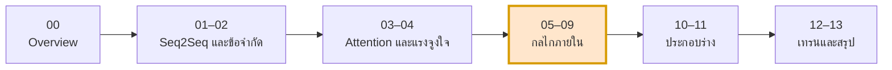

# Transformer 101 — คณิตศาสตร์เบื้องหลัง Transformer

เอกสารชุดนี้อธิบายการทำงานของ **Transformer ในเชิงคณิตศาสตร์** โดยเริ่มจากที่มาของ
**seq2seq แบบดั้งเดิม** ไล่ผ่าน **ข้อจำกัด** ของมัน แล้วแสดงว่าแต่ละส่วนของ Transformer
เกิดขึ้นมาเพื่อแก้ข้อจำกัดข้อไหน — พร้อมวิธีคำนวณทุกขั้นและที่มาที่ไป

## แนวทางของเอกสาร

| หลักการ | รายละเอียด |
|---|---|
| ระบุผลลัพธ์ + สัญชาตญาณ | ไม่กางพิสูจน์เต็มรูปแบบ แต่บอกผลลัพธ์และเหตุผลว่าทำไมมันสมเหตุสมผล |
| เดินตัวเลขจริงทุกไฟล์ | ทุกไฟล์มีตัวอย่างคำนวณด้วยเลขเล็ก ๆ แสดงเมทริกซ์ทุกขั้น |
| โค้ดคู่สมการ | ทุกสมการหลักมี NumPy / PyTorch snippet กำกับ |
| Diagram ประกอบ | ใช้ Mermaid แสดงโครงสร้างและการไหลของข้อมูล |
| ศัพท์เทคนิคคงภาษาอังกฤษ | เนื้อความไทย แต่ *attention*, *residual*, *softmax* ฯลฯ ไม่แปล |

## สารบัญ

### ส่วนที่ 1 — ที่มาและข้อจำกัด

| ไฟล์ | หัวข้อ | ใจความ |
|---|---|---|
| [00](00-overview.md) | ภาพรวมและข้อตกลงสัญลักษณ์ | notation ที่ใช้ตลอดชุด + สมการหลักทั้งหมดใน 1 หน้า |
| [01](01-seq2seq-rnn-basics.md) | Seq2Seq แบบดั้งเดิม | RNN / LSTM / GRU, encoder–decoder, context vector, beam search |
| [02](02-seq2seq-limitations.md) | ข้อจำกัดของ Seq2Seq | คอขวด, vanishing gradient, ขนานไม่ได้, path length |

### ส่วนที่ 2 — การมาถึงของ Attention

| ไฟล์ | หัวข้อ | ใจความ |
|---|---|---|
| [03](03-attention-mechanism-origin.md) | Attention ก่อนยุค Transformer | Bahdanau, Luong, soft dictionary lookup |
| [04](04-transformer-motivation.md) | ทำไมต้องทิ้ง recurrence | ตารางความซับซ้อน, ต้นทุน O(n²) ที่ต้องแลก |

### ส่วนที่ 3 — กลไกภายใน Transformer

| ไฟล์ | หัวข้อ | ใจความ |
|---|---|---|
| [05](05-self-attention-math.md) | Scaled Dot-Product Attention | Q/K/V, ทำไมหาร √dₖ, อนุพันธ์ของ softmax |
| [06](06-multi-head-attention.md) | Multi-Head Attention | ปริภูมิย่อยหลายอัน, dₖ = d_model/H, การนับพารามิเตอร์ |
| [07](07-positional-encoding.md) | Positional Encoding | permutation equivariance, sin/cos, relative position |
| [08](08-feedforward-and-residual.md) | FFN และ Residual | position-wise FFN, gradient highway |
| [09](09-layernorm-math.md) | Layer Normalization | LN vs BatchNorm, Pre-LN vs Post-LN, RMSNorm |

### ส่วนที่ 4 — ประกอบร่างและการเทรน

| ไฟล์ | หัวข้อ | ใจความ |
|---|---|---|
| [10](10-encoder-full-pipeline.md) | Encoder เต็มรูปแบบ | embedding → PE → N layers, padding mask, dimension tracking |
| [11](11-decoder-masked-attention.md) | Decoder และ Masking | causal mask, cross-attention, KV cache, decoding strategies |
| [12](12-training-objective-backprop.md) | การเทรนและ Backprop | cross-entropy, teacher forcing, Adam, warmup schedule |
| [13](13-summary-notation-reference.md) | สรุปและตารางอ้างอิง | สัญลักษณ์ทั้งหมด, สมการทั้งหมด, คำถามทบทวน |

## เส้นทางการอ่าน

**ถ้าเวลาน้อย:** อ่าน [02](02-seq2seq-limitations.md) → [05](05-self-attention-math.md) → [10](10-encoder-full-pipeline.md) ก็ได้แก่นแล้ว

## การแสดงผลสมการ

เอกสารใช้ LaTeX ใน `$...$` และ `$$...$$` ซึ่ง **GitHub render ได้โดยตรง**
ถ้าอ่านใน VS Code แนะนำ extension `Markdown Preview Enhanced` หรือ `Markdown+Math`

## อ้างอิงหลัก

- Sutskever et al. (2014) — *Sequence to Sequence Learning with Neural Networks* ([arXiv:1409.3215](https://arxiv.org/abs/1409.3215))
- Bahdanau et al. (2014) — *Neural Machine Translation by Jointly Learning to Align and Translate* ([arXiv:1409.0473](https://arxiv.org/abs/1409.0473))
- Luong et al. (2015) — *Effective Approaches to Attention-based NMT* ([arXiv:1508.04025](https://arxiv.org/abs/1508.04025))
- Vaswani et al. (2017) — *Attention Is All You Need* ([arXiv:1706.03762](https://arxiv.org/abs/1706.03762))
